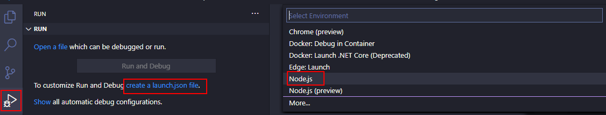

# 03 Debugging

In this example we are going to add setup needed to support debugging with VS Code.

We will start from `02-simple-routing`.

# Steps to build it

`npm install` to install previous sample packages:

```bash
npm install

```

Update babel config for sourceMaps:

_./.babelrc_

```diff
{
  "presets": [
    [
      "@babel/preset-env",
      {
        "targets": {
          "node": "16"
        }
      }
    ],
    "@babel/preset-typescript"
- ]
+ ],
+ "env": {
+   "development": {
+     "sourceMaps": "inline"
+   }
+ }
}

```

Using `JavaScript Debug Terminal`:


And run the command:

```bash
npm start

```

- Another option is adding debug `launch.json` in VS Code:



_./.vscode/launch.json_

```json
{
  "version": "0.2.0",
  "configurations": [
    {
      "type": "node",
      "request": "attach",
      "name": "Debug",
      "port": 9229,
      "address": "localhost",
      "restart": true,
      "sourceMaps": true,
      "localRoot": "${workspaceFolder}",
      "remoteRoot": "${workspaceFolder}",
      "skipFiles": ["node_modules/**", "<node_internals>/**"]
    }
  ]
}

```

> Maybe you have to disable `usePreview` flag on VSCode settings.
> `"debug.javascript.usePreview": false`

Add debug command:

_./package.json_

```diff
...
  "scripts": {
    "start": "run-p -l type-check:watch start:dev",
    "start:dev": "nodemon --exec babel-node --extensions \".ts\" src/index.ts",
+   "start:debug": "run-p -l type-check:watch \"start:dev -- --inspect-brk\"",
    "type-check": "tsc --noEmit",
    "type-check:watch": "npm run type-check -- --watch"
  },
...
```

- And run app in debug mode (`bash` terminal or default one) and run Debug mode:

```bash
npm run start:debug
```

# ¿Con ganas de aprender Backend?

En Lemoncode impartimos un Bootcamp Backend Online, centrado en stack node y stack .net, en él encontrarás todos los recursos necesarios: clases de los mejores profesionales del sector, tutorías en cuanto las necesites y ejercicios para desarrollar lo aprendido en los distintos módulos. Si quieres saber más puedes pinchar [aquí para más información sobre este Bootcamp Backend](https://lemoncode.net/bootcamp-backend#bootcamp-backend/banner).
