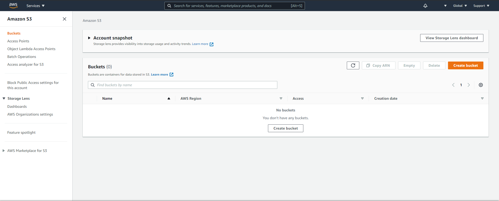
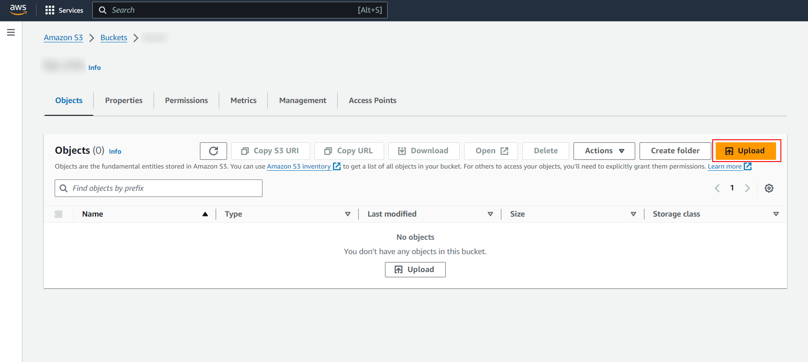
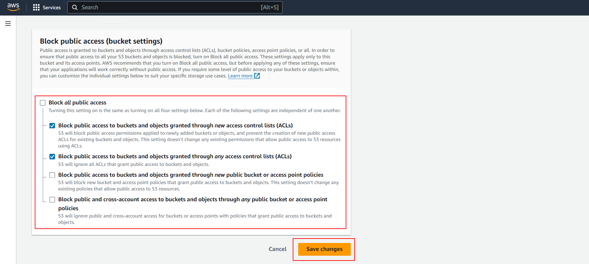

# 02 S3 Portal

In this example we are going to learn how to work with store files in S3.

We will start from `01-local-files`.

# Steps to build it

`npm install` to install previous sample packages:

```bash
cd front
npm install

```

In a second terminal:

```bash
cd back
npm install

```

This time, we will upload images to [Amazon S3 service](https://aws.amazon.com/es/s3/):



Let's create a new bucket, we could give a name and we keep default settings:


> This bucket name should be unique for all amazon s3 accounts (not only ours) and it should follow some rules.
>
> [Bucket name rules](https://docs.aws.amazon.com/AmazonS3/latest/userguide/bucketnamingrules.html)
>
> The region is important too.


Let's upload some file:



Upload `admin-avatar-in-s3.png` from `99-resources` folder:


If we try to access to `Object URL`, Amazon server will answer with some XML like:

```xml
<Error>
  <Code>AccessDenied</Code>
  <Message>Access Denied</Message>
  <RequestId>some-request-id</RequestId>
  <HostId>some-host-id</HostId>
</Error>
```

By default the bucket and objects do not have any public access but we have some approaches to give access like:

- Make bucket and object publics: we will need to add some permissions, for example, allow only read access.

- Create custom user with [IAM service](https://aws.amazon.com/iam/) with credentials. It will be valid for backend apps where we can provide credentials in a secure way.

- Along with the above approach, we can create signed urls with expiration time and send it to `web-clients`.

Let's start with the first one:


**Block public access (bucket settings)**

First, disable `Block all public access`:



**Bucket policy**

Then, give read-only permission:

```json
{
  "Version":"2012-10-17",
  "Statement":[
    {
      "Sid":"PublicRead",
      "Effect":"Allow",
      "Principal": "*",
      "Action":["s3:GetObject","s3:GetObjectVersion"],
      "Resource":["arn:aws:s3:::DOC-EXAMPLE-BUCKET/*"]
    }
  ]
}
```

> [Granting read-only S3 permission](https://docs.aws.amazon.com/AmazonS3/latest/userguide/example-bucket-policies.html#example-bucket-policies-use-case-2)

Now, the `Object URL` is available. Even, we could use it in the `client-side`:

_./back/src/dals/mock-data.ts_

```diff
...
    {
      _id: new ObjectId(),
      email: 'admin@email.com',
      password: 'test',
      salt: '',
      role: 'admin',
-     avatar: '/admin-avatar.png',
+     avatar: 'https://<bucket-name>.s3.<region>.amazonaws.com/admin-avatar-in-s3.png',
    },
...
```

Run `front` and `back` projects to check current implementation:

_front terminal_

```bash
npm start

```

_back terminal_

```bash
npm start

```

Open browser in `http://localhost:8080`

Restore it:

_./back/src/dals/mock-data.ts_

```diff
...
    {
      _id: new ObjectId(),
      email: 'admin@email.com',
      password: 'test',
      salt: '',
      role: 'admin',
-     avatar: 'https://<bucket-name>.s3.<region>.amazonaws.com/admin-avatar-in-s3.png',
+     avatar: '/admin-avatar.png',
    },
...
```

# ¿Con ganas de aprender Backend?

En Lemoncode impartimos un Bootcamp Backend Online, centrado en stack node y stack .net, en él encontrarás todos los recursos necesarios: clases de los mejores profesionales del sector, tutorías en cuanto las necesites y ejercicios para desarrollar lo aprendido en los distintos módulos. Si quieres saber más puedes pinchar [aquí para más información sobre este Bootcamp Backend](https://lemoncode.net/bootcamp-backend#bootcamp-backend/banner).
