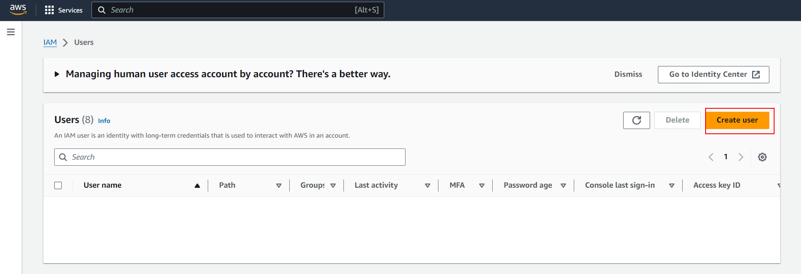

# 03 S3 SDK

En este ejemplo vamos a aprender a trabajar con `aws-sdk`.

Tomaremos como punto de partida el ejemplo `02-s3-portal`.

# Pasos

Si no lo tienes ya arrancado, instálate dependencias tanto de back como de front:

En Front

```bash
cd front
npm install

```

Abrimos un segundo terminal:

```bash
cd back
npm install

```

Antes de arrancar el proyecto de back, vamos a instalarnos el _aws-sdk_, en concreto la versión 3: [aws-sdk v3](https://github.com/aws/aws-sdk-js-v3) library. La versión 3 tiene como ventaja sobre las 2 anteriores que se han publicado diferentes paquetes en npm, por ejemplo para [s3-client](https://www.npmjs.com/package/@aws-sdk/client-s3):

```bash
npm install @aws-sdk/client-s3 --save
```

> NOTA: Si prefieres trabajar con la versión 2, la puedes encontrar en este [repositorio de version 2 aws](https://github.com/aws/aws-sdk-js)

Vamos a probar a interactuar con el servicio S3 desde un `console-runner`:

Fijate que lo arrancamos y le indicamos que se conecte a Paris (Europe West)

_./back/src/console-runners/s3.runner.ts_

```diff
+ import { S3Client } from '@aws-sdk/client-s3';

export const run = async () => {
+ const client = new S3Client({ region: 'eu-west-3' });
}
```

Ya que estamos con acceso desde código, es hora de hacer privado nuestro bucket y vamos a proveerle de unas credenciales para que se pueda leer desde servidor (imagínate que estás implementando un gestor documental para la flota de vehículos y conductores de una empresa, mejor que se quede en privado ;)).

Así pues vamos a por la aproximación 2 que comentamos en `02-s3-portal`

En la consola de administración del bucket, nos vamos al tab de permisos y hacemos una vuelta atrás :).

Vamos a eliminar la policy que hacía el bucket público y desactivar el check de público, y después crearemos unas credenciales custom para que pueda acceder un usuario.

**Bucket policy**

Eliminamos la bucket policy


```diff
- {
-   "Version":"2012-10-17",
-   "Statement":[
-     {
-       "Sid":"PublicRead",
-       "Effect":"Allow",
-       "Principal": "*",
-       "Action":["s3:GetObject","s3:GetObjectVersion"],
-       "Resource":["arn:aws:s3:::DOC-EXAMPLE-BUCKET/*"]
-     }
-   ]
- }

```

**Bloqueamos el acceso publico (bucket settings)**

Toca habilitar el setting:


Y ahora vamos a crear un usuarios con permisos en ese bucket, usaremos el [IAM service](https://aws.amazon.com/iam/):



Le indicamos el nombre de usuario y el tipo de acceso (en este caso no marcamos para que tenga acceso a la consola de AWS, ya que lo usaremos para acceder desde código):


Vamos a elegir _adjuntar políticas directamente_, y le damos a ese usuario S3 Full Access.

Podríamos darle a ese usuario permisos de `S3 Full Access`, PEEROO, no lo vamos a hacer:

- Por un lado en una app real podríasmo tener un usuario para lectura y otro para escritura (menor superficie de ataque).
- Y por otro si damos ese permiso es sobre todos los buckets que tengamos en nuestro S3, y no queremos eso, queremos que sólo tenga acceso a nuestro bucket.


Antes de seguir, esto de darle permiso a todos los buckets te puede abrir una brecha de seguridad, mejor creamos una política y le decimos que sólo tenga ese acceso al bucket que acabamos de crear:

Para ello vamos a crear una regla custom, hay un botón a la izquierda arriba que pone _agregar permisos_, en inglés "create policy", y lo que haremo será crear una politica custom (esto nos abrirá un nuevo tab, trabajaremos en él hasta que tengamos la regla creada y entonces volveremos al tab de usuario para asignarselo)


Para definirla, vamos a hacerlo en formato JSON:


Vamos a definirla (contenido del JSON):

> OJO PON AQUI EL NOMBRE DE TU BUCKET
> REEMPLAZA `nombre-del-bucket` por el nombre de tu bucket.

```json
{
  "Version": "2012-10-17",
  "Statement": [
    {
      "Effect": "Allow",
      "Action": "s3:*",
      "Resource": [
        "arn:aws:s3:::nombre-del-bucket",
        "arn:aws:s3:::nombre-del-bucket/*"
      ]
    }
  ]
}
```

Le damos a siguiente.

Y vamos a dar un nombre:


Y ya podemos crear la política.

Una vez creada, volvemos a la configuración del usuario y marcamos la política que acabamos de crear (Ojo, de primeras no aparece tenemos que darle al boton de refresh):

Botón refresh:


Filtramos por _Customer managed_ y seleccionamos la política que acabamos de crear:


Ya lo tenemos casí listo, en el paso 3 `step 3` lo revisamos y creamos, ahora tenemos que crear unas credenciales para poder usarlo en nuestra aplicación (y va a ser un access key, para usarlo desde código).

Seleccionamos el usuario y clicamos en `Security credentials`


Hacemos scroll para abajo y clicamos en `Create access key`:


Seleccionamos el caso de uso (aplicación corriendo fuera de AWS):


Nos saltamos el paso opcional (description tag).

En el paso final (`final step`), Amazon nos proporciona el `Access key ID` y el `Secret access key`. guardamos las credenciales para usarlas en la aplicación:


En nodejs tenemos varias formas de [configurar credenciales](https://docs.aws.amazon.com/sdk-for-javascript/v2/developer-guide/setting-credentials-node.html), por ejemplo usando [shared credentials file](https://docs.aws.amazon.com/sdk-for-javascript/v2/developer-guide/loading-node-credentials-shared.html) o [env variables](https://docs.aws.amazon.com/sdk-for-javascript/v2/developer-guide/loading-node-credentials-environment.html), vamos a implementar esta última:

_./back/.env.example_

```diff
NODE_ENV=development
PORT=3000
STATIC_FILES_PATH=../public
CORS_ORIGIN=*
CORS_METHODS=GET,POST,PUT,DELETE
API_MOCK=true
MONGODB_URI=mongodb://localhost:27017/book-store
AUTH_SECRET=MY_AUTH_SECRET
+ AWS_ACCESS_KEY_ID=value
+ AWS_SECRET_ACCESS_KEY=value
```

_./back/.env_

```diff
NODE_ENV=development
PORT=3000
STATIC_FILES_PATH=../public
CORS_ORIGIN=*
CORS_METHODS=GET,POST,PUT,DELETE
API_MOCK=true
MONGODB_URI=mongodb://localhost:27017/book-store
AUTH_SECRET=MY_AUTH_SECRET
+ AWS_ACCESS_KEY_ID=<use-real-values>
+ AWS_SECRET_ACCESS_KEY=<use-real-values>

```

> NOTA: Reemplaza <use-real-values> con los valores proporcionados por Amazon.
>
> Al ponerle estos nombres, el SDK de AWS automáticamente los detecta y los usa para las peticiones (no tenemos que ir poniéndolos en código), aunque si tenemos más de un access key también se puede informar cuando levantamos los objetos del SDK.
>
> El token de sesion hace falta solo si especificamos manualmente credenciales temporales.

Ahora vamos a probar a listar los objetos del bucket:

_./back/src/console-runners/s3.runner.ts_

```diff
- import { S3Client } from '@aws-sdk/client-s3';
+ import { S3Client, ListObjectsCommand } from '@aws-sdk/client-s3';

export const run = async () => {
+ try {
    const client = new S3Client({ region: 'eu-west-3' });
+   const bucket = 'bucket-name';
+   const command = new ListObjectsCommand({
+     Bucket: bucket,
+   });
+   const data = await client.send(command);
+   console.log({ data });
+   // Poner Breakpoint aquí y ver lo que vale data.Contents
+   // Sale el fichero que subimos
+   console.log('**** contenido del bucket ****');
+   console.log(data.Contents);
+ } catch (error) {
+   console.error(error);
+ }
};
```

> [V3 docs page](https://docs.aws.amazon.com/AWSJavaScriptSDK/v3/latest/index.html)
>
> [S3 v3 docs page](https://docs.aws.amazon.com/AWSJavaScriptSDK/v3/latest/clients/client-s3/index.html)

Vamos a ejecutar el console runner desde el terminal de depuración `debug terminal` (así podemos poner break points).

```bash
npm run start:console-runners

```

Ahora probamos a bajarnos una imagen:

_./back/src/console-runners/s3.runner.ts_

```diff
import {
  S3Client,
  ListObjectsCommand,
+ GetObjectCommand,
} from '@aws-sdk/client-s3';
+ import fs from 'node:fs';
+ import { Readable } from 'node:stream';

export const run = async () => {
  try {
    const client = new S3Client({ region: 'eu-west-3' });
    const bucket = 'bucket-name';
-   const command = new ListObjectsCommand({
+   const command = new GetObjectCommand({
      Bucket: bucket,
+     Key: 'admin-avatar-in-s3.png',
    });
    const data = await client.send(command);
    console.log({ data });

+   const image = data.Body as Readable;
+   const destination = fs.createWriteStream('./test.png');
+   image.pipe(destination);
  } catch (error) {
    console.error(error);
  }
};

```

> [fs createWriteStream](https://nodejs.org/dist/latest-v14.x/docs/api/fs.html#fs_fs_createwritestream_path_options)
>
> Mirae el `back/test.png` la imagen.

Y vamos a subir una imagen, por ejemplo vamos a copiar dentro de `root path` (justo debajo de la carpeta _back_) la imagen `99-resources/user-avatar-in-s3.png`:

_./back/src/console-runners/s3.runner.ts_

```diff
import {
  S3Client,
  ListObjectsCommand,
  GetObjectCommand,
+ PutObjectCommand,
} from '@aws-sdk/client-s3';
import fs from 'fs';
- import { Readable } from 'stream';
+ import path from 'path';

export const run = async () => {
  try {
    const client = new S3Client({ region: 'eu-west-3' });
    const bucket = 'bucket-name';
+   const fileName = 'user-avatar-in-s3.png';
+   const imageStream = fs.createReadStream(path.resolve('./', fileName));
-   const command = new GetObjectCommand({
+   const command = new PutObjectCommand({
      Bucket: bucket,
-     Key: 'admin-avatar-in-s3.png',
+     Key: fileName,
+     Body: imageStream,
    });
    const data = await client.send(command);
    console.log({ data });

-   const image = data.Body as Readable;
-   const destination = fs.createWriteStream('./test.png');
-   image.pipe(destination);
  } catch (error) {
    console.error(error);
  }
};
```

# ¿Con ganas de aprender Backend?

En Lemoncode impartimos un Bootcamp Backend Online, centrado en stack node y stack .net, en él encontrarás todos los recursos necesarios: clases de los mejores profesionales del sector, tutorías en cuanto las necesites y ejercicios para desarrollar lo aprendido en los distintos módulos. Si quieres saber más puedes pinchar [aquí para más información sobre este Bootcamp Backend](https://lemoncode.net/bootcamp-backend#bootcamp-backend/banner).
