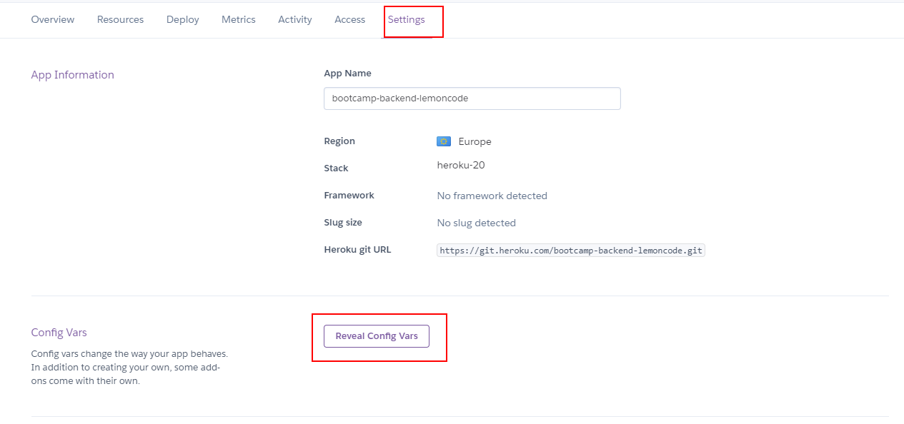

# 02 Manual heroku deploy

In this example we are going to learn how to deploy app to heroku manually.

We will start from `01-production-bundle`.

# Steps to build it

`npm install` to install previous sample packages:

```bash
cd front
npm install

```

In a second terminal:

```bash
cd back
npm install

```

Since we executed the `npm run build` command to generate the `production build` and we have the `public` folder with the `front` app bundle, we could upload to an Heroku server.

First, we will create a new heroku app:


We need to use an [Heroku buildpack](https://elements.heroku.com/buildpacks). It's a tool to build processes for your preferred language or framework. Right now, we will use [nodejs buildpack](https://elements.heroku.com/buildpacks/heroku/heroku-buildpack-nodejs):


We need `git` to clone the Heroku app repository and works on it:


But first, we will need access to this repository, we need to install [heroku cli](https://devcenter.heroku.com/articles/heroku-cli#download-and-install) and run `heroku login`:

```bash
heroku login
```

> Another methods to download heroku is using `npm install -g heroku` or [npx](https://github.com/npm/npx)

Now, we can clone the repo in _another folder outside backend app_:

```bash
git clone https://git.heroku.com/<heroku-app-name>.git .
```

> Check `Deploy` tab for other deploy methods.

Let's copy all necessary files:

- `dist` folder content.
- `public` folder.
- `package.json`: Heroku will install `production` dependencies before start the server.

We can do previous actions from terminal by running (from parent directory):

```bash
cp -R ./back/dist/ <heroku-repo-directory>/
cp -R ./back/public <heroku-repo-directory>/
cp ./back/package.json <heroku-repo-directory>/
```

Create new `.gitignore` file, ignoring the `node_modules` folder:

_./.gitignore_

```
node_modules

```

Result:

```
|- common/
|- common-app/
|- core/
|- dals/
|- pods/
|- public/
|- .gitignore
|- app.js
|- index.js
|- package.json

```

Deploy it:

```bash
git add .
git commit -m "deploy app"
git push

```

It fails because [since March 2019](https://devcenter.heroku.com/changelog-items/1557) heroku run the build automatically, we don't need it, so we should clean it:

_./package.json_

```diff
{
  "name": "01-config",
  "version": "1.0.0",
  "description": "",
  "main": "index.js",
  "scripts": {
-   "prestart": "sh ./create-dev-env.sh",
-   "start": "run-p -l type-check:watch start:dev start:local-db",
+   "start": "node index"
-   "start:dev": "nodemon --exec babel-node --extensions \".ts\" src/index.ts",
-   "prestart:console-runners": "npm run prestart",
-   "start:console-runners": "run-p type-check:watch console-runners start:local-db",
-   "console-runners": "npm run type-check && nodemon --no-stdin --exec babel-node -r dotenv/config --extensions \".ts\" src/console-runners/index.ts",
-   "start:local-db": "docker-compose up || echo \"Fail running docker-compose up, do it manually!\"",
-   "remove:local-db": "docker-compose down || echo \"Fail running docker-compose down, do it manually!\"",
-   "type-check": "tsc --noEmit",
-   "type-check:watch": "npm run type-check -- --watch",
-   "test": "jest -c ./config/test/jest.js --verbose",
-   "test:watch": "npm run test -- --watchAll -i",
-   "clean": "rimraf dist",
-   "build": "npm run type-check && npm run clean && npm run build:prod",
-   "build:prod": "cross-env NODE_ENV=production babel src -d dist --extensions \".ts\""
  },
  "keywords": [],
  "author": "",
  "license": "ISC",
  "dependencies": {
    "@aws-sdk/client-s3": "^3.18.0",
    "@aws-sdk/s3-request-presigner": "^3.18.0",
    "cookie-parser": "^1.4.5",
    "cors": "^2.8.5",
    "dotenv": "^10.0.0",
    "express": "^4.17.1",
    "jsonwebtoken": "^8.5.1",
    "mongodb": "^3.6.9",
    "mongoose": "^5.12.12"
  },
- "devDependencies": {
-   "@babel/cli": "^7.13.16",
-   "@babel/core": "^7.14.0",
-   "@babel/node": "^7.13.13",
-   "@babel/plugin-proposal-optional-chaining": "^7.13.12",
-   "@babel/preset-env": "^7.14.1",
-   "@babel/preset-typescript": "^7.13.0",
-   "@shelf/jest-mongodb": "^1.2.5",
-   "@types/cookie-parser": "^1.4.2",
-   "@types/cors": "^2.8.10",
-   "@types/express": "^4.17.11",
-   "@types/inquirer": "^7.3.1",
-   "@types/jest": "^26.0.23",
-   "@types/jsonwebtoken": "^8.5.1",
-   "@types/mongodb": "^3.6.17",
-   "@types/mongoose": "^5.10.5",
-   "@types/supertest": "^2.0.11",
-   "babel-plugin-module-resolver": "^4.1.0",
-   "cross-env": "^7.0.3",
-   "inquirer": "^8.1.0",
-   "jest": "^27.0.4",
-   "nodemon": "^2.0.7",
-   "npm-run-all": "^4.1.5",
-   "rimraf": "^3.0.2",
-   "supertest": "^6.1.3",
-   "ts-jest": "^27.0.3",
-   "typescript": "^4.2.4"
- }
}

```

Deploy it again:

```bash
git add .
git commit -m "update package.json"
git push

```

We have deployed our server in `https://<app-name>.herokuapp.com/` but we will need provide right env variables:




> First we will try in API Mock mode

Open `https://<app-name>.herokuapp.com/` again.

# ¿Con ganas de aprender Backend?

En Lemoncode impartimos un Bootcamp Backend Online, centrado en stack node y stack .net, en él encontrarás todos los recursos necesarios: clases de los mejores profesionales del sector, tutorías en cuanto las necesites y ejercicios para desarrollar lo aprendido en los distintos módulos. Si quieres saber más puedes pinchar [aquí para más información sobre este Bootcamp Backend](https://lemoncode.net/bootcamp-backend#bootcamp-backend/banner).
