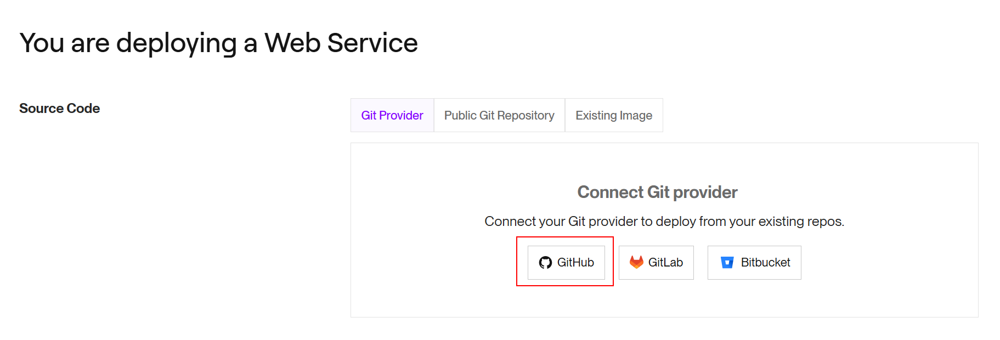

# 02 Manual render deploy

[Render](https://render.com/) es un servicio que nos permite desplegar nuestras aplicaciones en la nube de forma sencilla, además tiene un plan gratuito que nos permita practicar y probar.

En este ejemplo vamos a aprender a desplegar una aplicación en render de forma manual.

Arrancamos desde `01-production-bundle`.

# Pasos

Si no lo tienes ya listo para arrancar, acuérdate de hacer los `npm install` pertinentes:

```bash
cd front
npm install

```

In a second terminal:

```bash
cd back
npm install

```

[Render](https://render.com/) es un proveedor de cloud que nos permite desplegar diferentes tipos de aplicaciones en función de los cambios que se produzcan en un repositorio git, esta aproximación te la puedes encontrar en otros proveedores de cloud como Heroku, Vercel, Netlify, etc.

Primero, tenemos que preparar el paquete que queremos desplegar, si no has hecho el build de Front vamos a por ello:

_front terminal_

```bash
npm run build
```

Copiamos manualmente el contenido de la carpeta `front/dist` en la carpeta `back/public`.

Y hacemos build del proyecto back:

_back terminal_

```bash
npm run build
```

Se nos habrá generado una carpeta `back/dist` con el código que queremos desplegar.

_./back_

```
|-- config/
|-- dist/
|-- node_module/
|-- public/
|-- src/
|-- ...
|-- package-lock.json
|-- package.json

```

Vamos a crear un nuevo repositorio (vació) donde pondremos los fichero de build (OJO EL RESULTADO DEL BUILD)


- Clonamos el repo:

```bash
git clone git@github.com<url> .
```

> NOTA: Añadir un punto final para clonar el repositorio en la carpeta actual.

Vamos a copiar todos los ficheros que nos hacen falta para desplegar:

- `back/dist` copiamos lo que hay en dist.
- `back/public`, copiamos el contenido de public (la carpeta también).
- `back/package.json` copiamos este fichero, y tendremos que actuaizar el contenido de dicha copia para no traernos las dependencias de desarrollo y ajusar el tema de los alias.

_./package.json_

```diff
{
  "name": "bootcamp-backend",
  "version": "1.0.0",
  "description": "",
  "main": "index.js",
  "type": "module",
  "scripts": {
-   "prestart": "sh ./create-dev-env.sh",
-   "start": "run-p -l type-check:watch start:dev start:local-db",
-   "start:dev": "nodemon --transpileOnly --esm src/index.ts",
-   "start:console-runners": "run-p -l type-check:watch console-runners start:local-db",
-   "console-runners": "nodemon --no-stdin --transpileOnly --esm src/console-runners/index.ts",
-   "start:local-db": "docker-compose up -d",
-   "clean": "rimraf dist",
-   "build": "npm run clean && tsc --project tsconfig.prod.json",
-   "type-check": "tsc --noEmit --preserveWatchOutput",
-   "type-check:watch": "npm run type-check -- --watch",
-   "test": "jest -c ./config/test/jest.js",
-   "test:watch": "npm run test -- --watchAll -i"
+   "start": "node index.js"
  },
  "imports": {
-   "#common/*.js": "./src/common/*.js",
+   "#common/*.js": "./common/*.js",
-   "#common-app/*.js": "./src/common-app/*.js",
+   "#common-app/*.js": "./common-app/*.js",
-   "#core/*.js": "./src/core/*.js",
+   "#core/*.js": "./core/*.js",
-   "#dals/*.js": "./src/dals/*.js",
+   "#dals/*.js": "./dals/*.js",
-   "#pods/*.js": "./src/pods/*.js"
+   "#pods/*.js": "./pods/*.js"
  },
  "keywords": [],
  "author": "",
  "license": "ISC",
  "dependencies": {
    "@aws-sdk/client-s3": "^3.360.0",
    "@aws-sdk/s3-request-presigner": "^3.360.0",
    "cookie-parser": "^1.4.6",
    "cors": "^2.8.5",
    "dotenv": "^16.3.1",
    "express": "^4.18.2",
    "jsonwebtoken": "^9.0.0",
    "mongodb": "^5.6.0"
- },
+ }
- "devDependencies": {
-   "@types/cookie-parser": "^1.4.3",
-   "@types/cors": "^2.8.13",
-   "@types/express": "^4.17.17",
-   "@types/inquirer": "^9.0.3",
-   "@types/jest": "^29.5.2",
-   "@types/jsonwebtoken": "^9.0.2",
-   "@types/supertest": "^2.0.12",
-   "inquirer": "^9.2.7",
-   "jest": "^29.5.0",
-   "nodemon": "^2.0.22",
-   "npm-run-all": "^4.1.5",
-   "rimraf": "^5.0.1",
-   "supertest": "^6.3.3",
-   "ts-jest": "^29.1.0",
-   "ts-node": "^10.9.1",
-   "typescript": "^5.1.3"
- }
}

```

El resultado que tendremos es el siguiente:

```
|- common/
|- common-app/
|- core/
|- dals/
|- pods/
|- public/
|- index.js
|- package.json

```

Lo comiteamos a nuestra rama main y hacemos un push:

```bash
git add .
git commit -m "deploy app"
git push -u origin main
```

Ahora vamos a render y creamos una nueva aplicación:




Configuramos un web service:


Añadimos variables de entorno (advanced settings):


> [Specificando la versión de Node con la que va a correr esta aplicación](https://render.com/docs/node-version)

Clicamos en el botón `Create Web Service`.

Una vez que se ha creado el servicio, podemos abrir en el navegador web `https://<app-name>.onrender.com`

# ¿Con ganas de aprender Backend?

En Lemoncode impartimos un Bootcamp Backend Online, centrado en stack node y stack .net, en él encontrarás todos los recursos necesarios: clases de los mejores profesionales del sector, tutorías en cuanto las necesites y ejercicios para desarrollar lo aprendido en los distintos módulos. Si quieres saber más puedes pinchar [aquí para más información sobre este Bootcamp Backend](https://lemoncode.net/bootcamp-backend#bootcamp-backend/banner).
