# 03 Mongo deploy

In this example we are going to learn how to deploy MongoDB.

We will start from `02-manual-render-deploy`.

# Steps to build it

`npm install` to install previous sample packages:

```bash
cd front
npm install

```

In a second terminal:

```bash
cd back
npm install

```

Once we have the app deployed in Heroku in API mock mode and it's working, we will deploy the MongoDB in this case in [MongoDB Atlas](https://www.mongodb.com/cloud/atlas) the official cloud site.

We could start at free cluster:

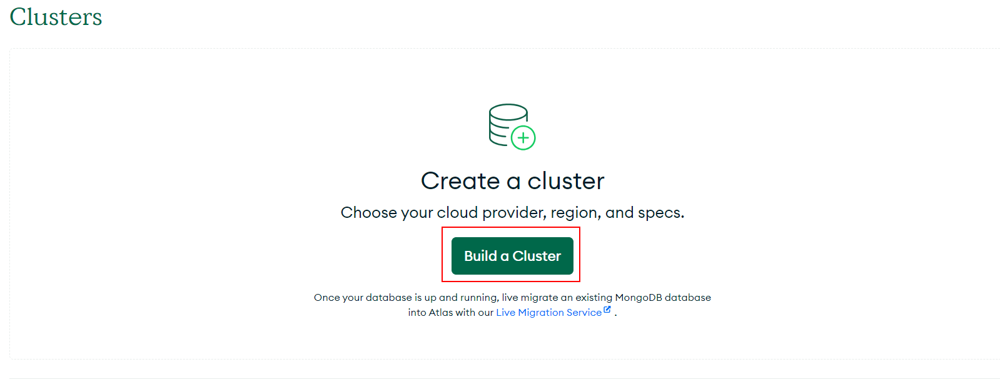

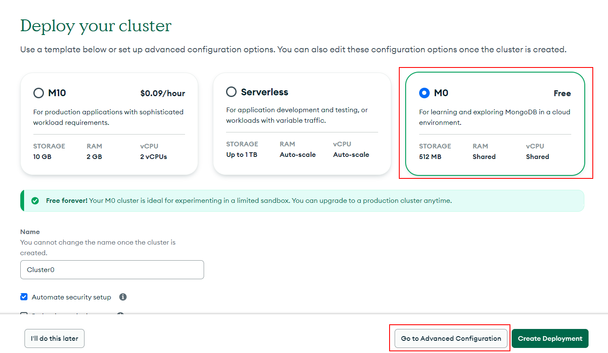

We could select between three providers and different regions:

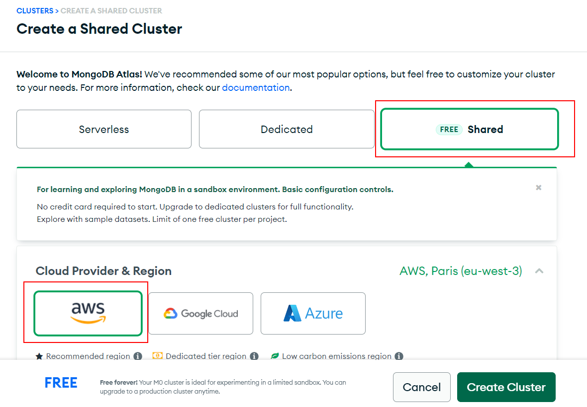

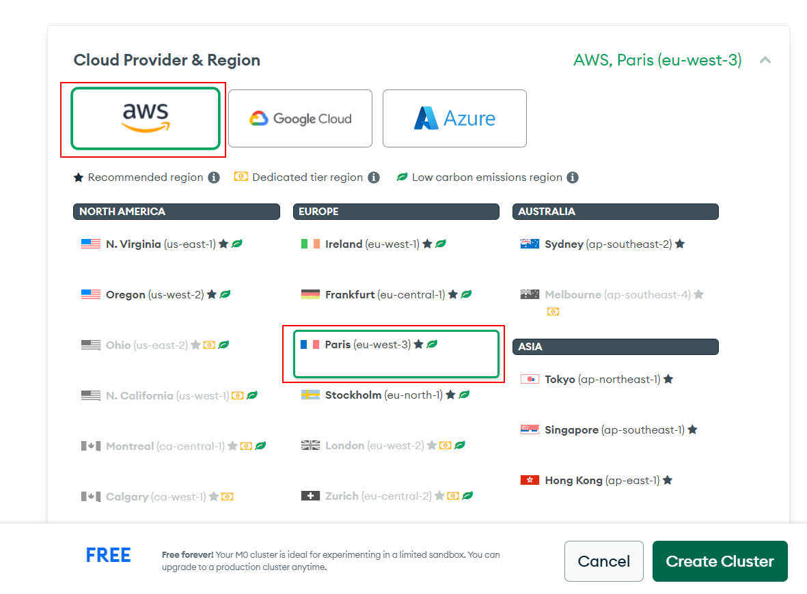

Select the cluster tier, in this case `M0 Sandbox` which it's a free tier with No backup:

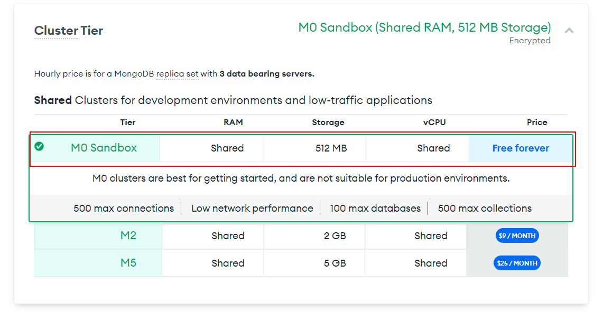

Finally, give a name (if you want) and create the cluster:

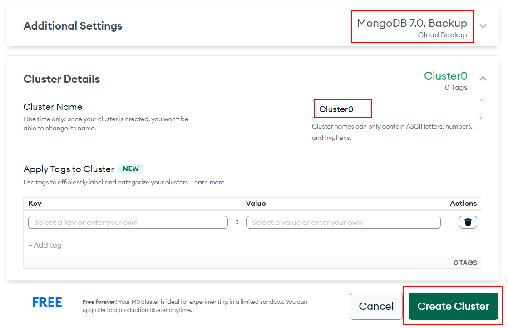

After create the cluster, we will see the quick start guide but we will navigate to clusters pages:

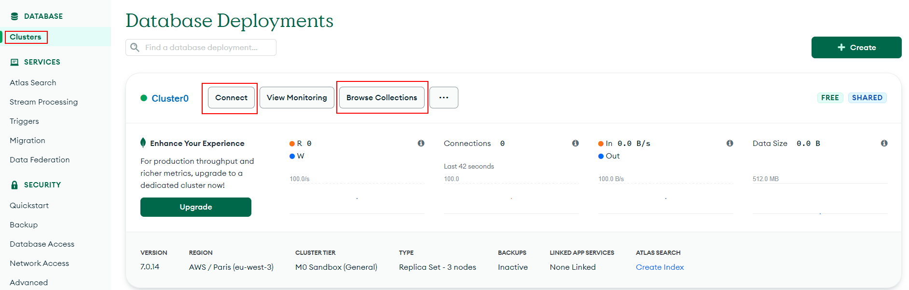

By default, MongoDB Atlas only allows access to configured IPs, let's add a new rule to allow all IPs:

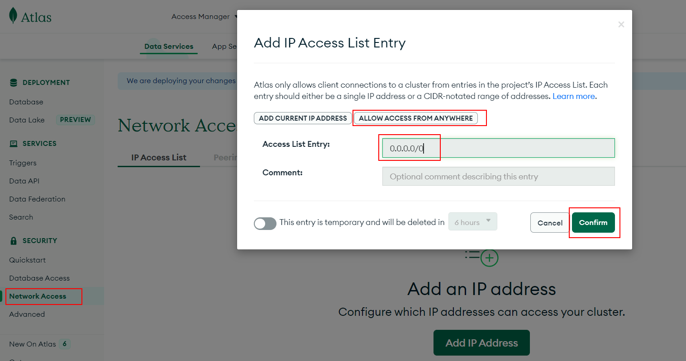

Let's configure database access, adding new user:

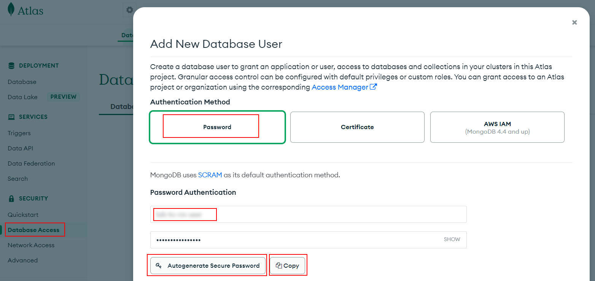

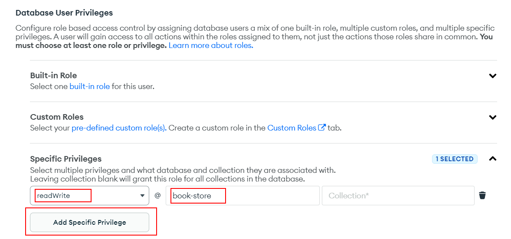

> Let's copy the autogenerated password. We will use in the MongoDB Connection URI
>
> Add DB user privileges using specific privileges.

Let's copy the `MongoDB Connection URI`:

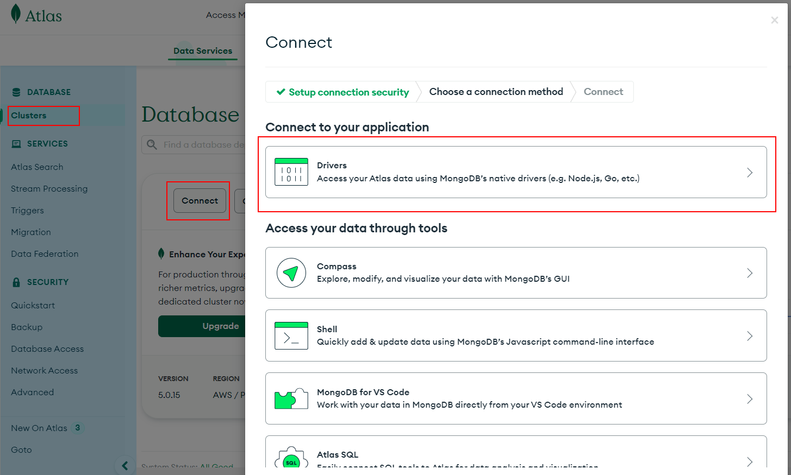

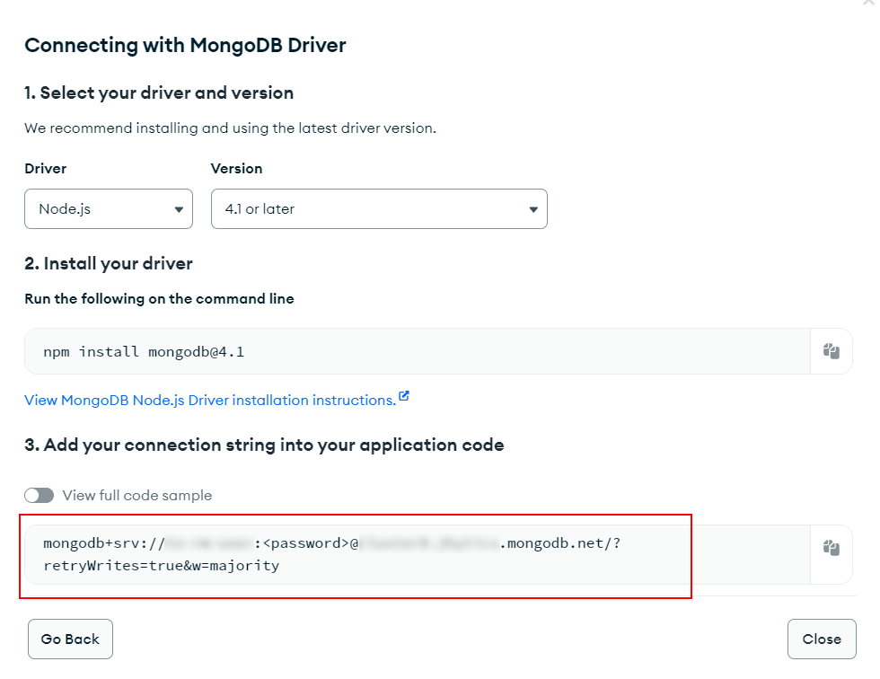

Update env variable:

_./back/.env_

```diff
...
IS_API_MOCK=true
- MONGODB_URL=mongodb://localhost:27017/book-store
+ MONGODB_URL=mongodb+srv://<user>:<password>@<cluster>.mongodb.net/book-store?retryWrites=true&w=majority
AUTH_SECRET=MY_AUTH_SECRET
...

```

> Replace <user>, <password> and <cluster> with MongoDB Atlas provided values.
>
> Use `book-store` database name.

Now, we will insert users's documents in `production` database:

_./back/src/console-runners/seed-data.runner.ts_

```diff
import { hash } from '#common/helpers/index.js';
import { getUserContext } from '#dals/user/user.context.js';
- import { getBookContext } from '#dals/book/book.context.js';
import { db } from '#dals/mock-data.js';

export const run = async () => {
  for (const user of db.users) {
    const hashedPassword = await hash(user.password);

    await getUserContext().insertOne({
      ...user,
      password: hashedPassword,
    });
  }
- await getBookContext().insertMany(db.books);
};

```

Run `console-runner`:

_back terminal_

```bash
npm run start:console-runners
```

Check result in MongoDB Atlas:

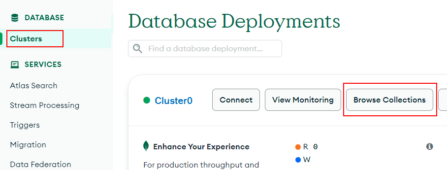

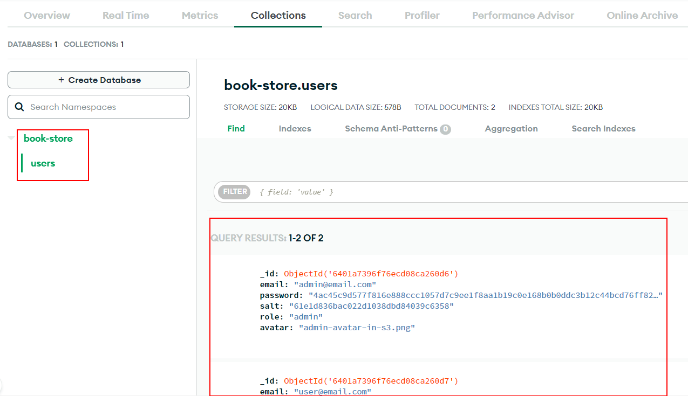

Restore local env variable:

_./back/.env_

```diff
...
IS_API_MOCK=true
- MONGODB_URL=mongodb+srv://<user>:<password>@<cluster>.mongodb.net/book-store?retryWrites=true&w=majority
+ MONGODB_URL=mongodb://localhost:27017/book-store
AUTH_SECRET=MY_AUTH_SECRET
...

```

Finally, we will update _Render_ env variables using `production MONGODB_URL` value:

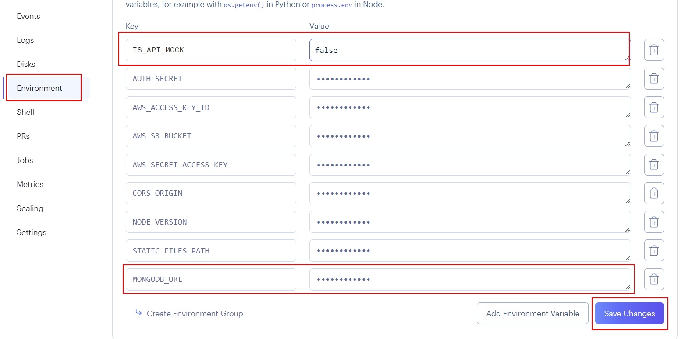

Since we didn't insert any book, we could use deployed app, to insert one and see the result in MongoDB Atlas:

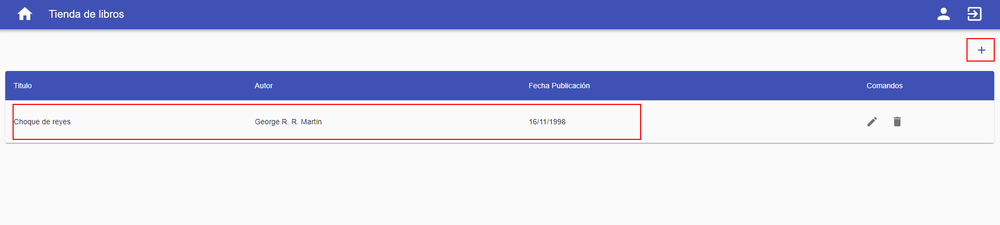

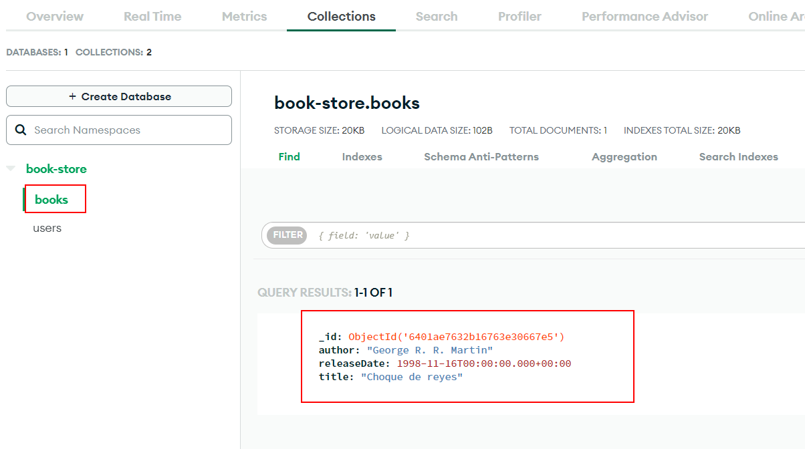

# ¿Con ganas de aprender Backend?

En Lemoncode impartimos un Bootcamp Backend Online, centrado en stack node y stack .net, en él encontrarás todos los recursos necesarios: clases de los mejores profesionales del sector, tutorías en cuanto las necesites y ejercicios para desarrollar lo aprendido en los distintos módulos. Si quieres saber más puedes pinchar [aquí para más información sobre este Bootcamp Backend](https://lemoncode.net/bootcamp-backend#bootcamp-backend/banner).
