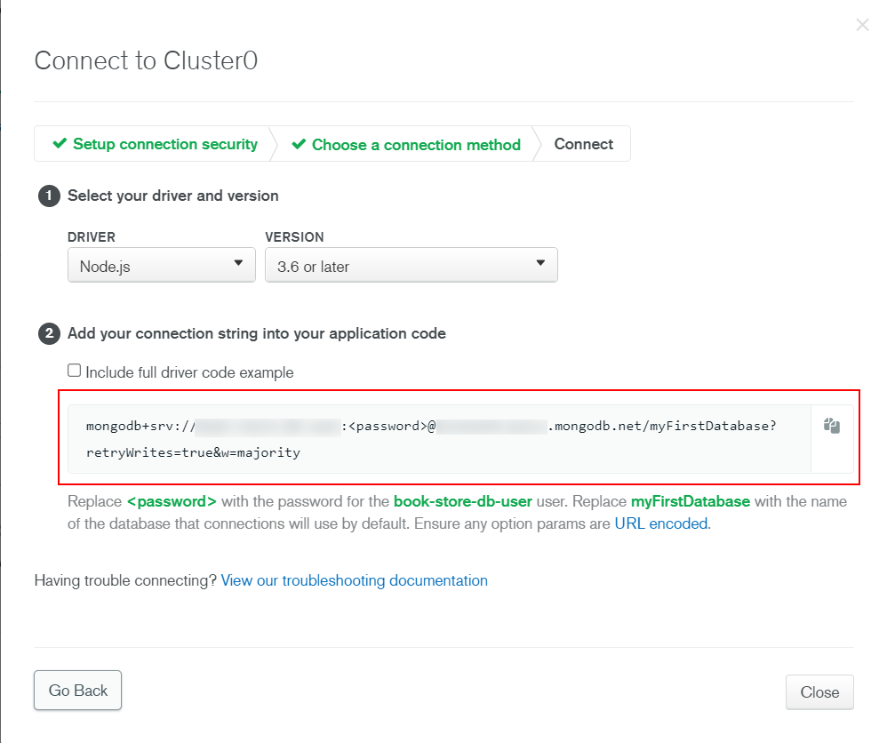
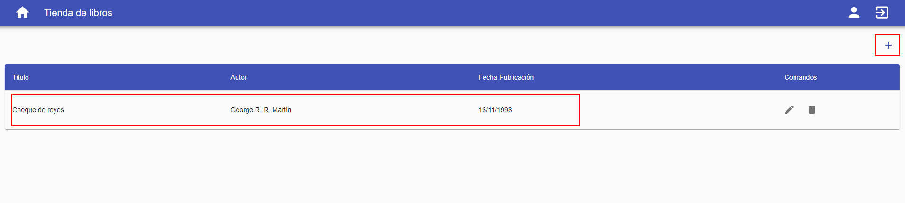

# 03 Mongo deploy

En este ejemplo vamos a aprender a desplegar MongoDB.

Tomamos como punto de partida el ejemplo `02-manual-render-deploy`.

# Pasos

`npm install` para instalar las librerías necesarias:

```bash
cd front
npm install
```

En un segundo terminal:

```bash
cd back
npm install

```

Ahora que hemos desplegado la aplicación en Render en modo API mock y está funcionando, vamos a hacer un despliegue de la base de datos en la nube, en este caso en [MongoDB Atlas](https://www.mongodb.com/cloud/atlas) el proveedor oficial de cloud de MongoDB.

Arrancamos por usar un cluster gratuito:


Podemos seleccionar entre varios proveedores y regiones, nos quedamos con _AWS (Amazon)_ y _Europa_:


Vamos a elegir la `M0 Sandbox` que es la opción gratuita sin backup:


Le damos un nombre (esto es opcional) y creamos el cluster:


Esta es la página principal del cluster, donde podemos:

- Configurar el acceso a la red.
- Configurar el acceso a la base de datos.
- Ver la cadena de conexión a MongoDB.
- Ver las colecciones y documentos.


Por defecto, MongoDB Atlas solo permite el acceso a las IPs configuradas, vamos a añadir una nueva regla para permitir todas las IPs:


Vamos a configurar el acceso a la base de datos, añadiendo un nuevo usuario:


> Copiamos la contraseña autogenerada. La usaremos en la cadena de conexión a MongoDB.
>
> Añadimos los privilegios del usuario de la base de datos.

Copiamos la cadena de conexión a MongoDB (`MongoDB Connection URI`):




Actualizamos las variable de entorno (_.env_) en nuestro proyecto local de back.
Update env variable:

_./back/.env_

```diff
...
API_MOCK=true
- MONGODB_URI=mongodb://localhost:27017/book-store
+ MONGODB_URI=mongodb+srv://<user>:<password>@<cluster>.mongodb.net/book-store?retryWrites=true&w=majority
AUTH_SECRET=MY_AUTH_SECRET
...

```

> Reemplaza `<user>`, `<password>` y `<cluster>` con los valores proporcionados por MongoDB Atlas.
>
> Usa el nombre de base de datos `book-store`.

¿Qué necesitamos? Datos de semilla, en concreto los usuarios inciales para que se puedan logar en la aplicación:

En el seed runner no metemos libros (lo comentamos), pero si lo usuarios para que al menos puedan logarse en la aplicación.

_./back/src/console-runners/seed-data.runner.ts_

```diff
import { generateSalt, hashPassword } from '#common/helpers/index.js';
import {
  connectToDBServer,
  disconnectFromDBServer,
} from '#core/servers/index.js';
import { envConstants } from '#core/constants/index.js';
- import { getBookContext } from '#dals/book/book.context.js';
import { getUserContext } from '#dals/user/user.context.js';
import { db } from '#dals/mock-data.js';

export const run = async () => {
  await connectToDBServer(envConstants.MONGODB_URI);

  for (const user of db.users) {
    const salt = await generateSalt();
    const hashedPassword = await hashPassword(user.password, salt);

    await getUserContext().insertOne({
      ...user,
      password: hashedPassword,
      salt,
    });
  }

- await getBookContext().insertMany(db.books);
  await disconnectFromDBServer();
};


```

Ejecutamos el `console-runner`:

_back terminal_

```bash
npm run start:console-runners
```

Comprobamos que los usuarios se han insertado en la base de datos que está en MongoDB Atlas:


En local volvemos a la configuración inicial (no queremos por equivocación actualizar la base de datos de producción).

_./back/.env_

```diff
...
API_MOCK=true
- MONGODB_URI=mongodb+srv://<user>:<password>@<cluster>.mongodb.net/book-store?retryWrites=true&w=majority
+ MONGODB_URI=mongodb://localhost:27017/book-store
AUTH_SECRET=MY_AUTH_SECRET
...

```

Ahora vamos a configurar la app que tenemos en _Render_ para que apunte a la base de datos de producción (`production MONGODB_URI`):


Si ahora nos logamos en la aplicación, y que no hay libros (es normal no los hemos insertado), podemos añadir uno y ver como se inserta en MongoDB Atlas:




# ¿Con ganas de aprender Backend?

En Lemoncode impartimos un Bootcamp Backend Online, centrado en stack node y stack .net, en él encontrarás todos los recursos necesarios: clases de los mejores profesionales del sector, tutorías en cuanto las necesites y ejercicios para desarrollar lo aprendido en los distintos módulos. Si quieres saber más puedes pinchar [aquí para más información sobre este Bootcamp Backend](https://lemoncode.net/bootcamp-backend#bootcamp-backend/banner).
