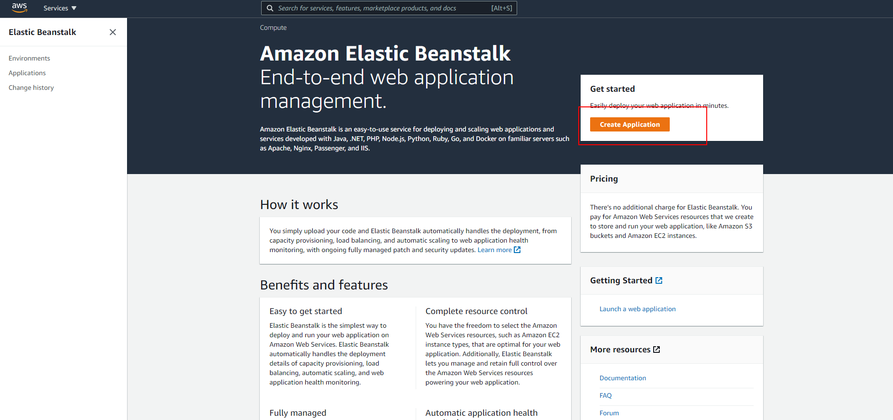
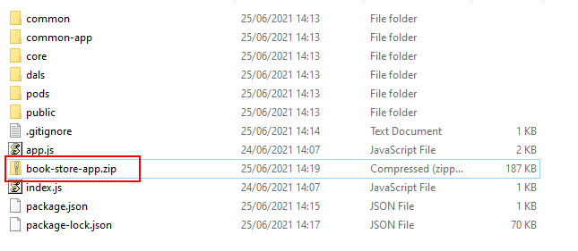
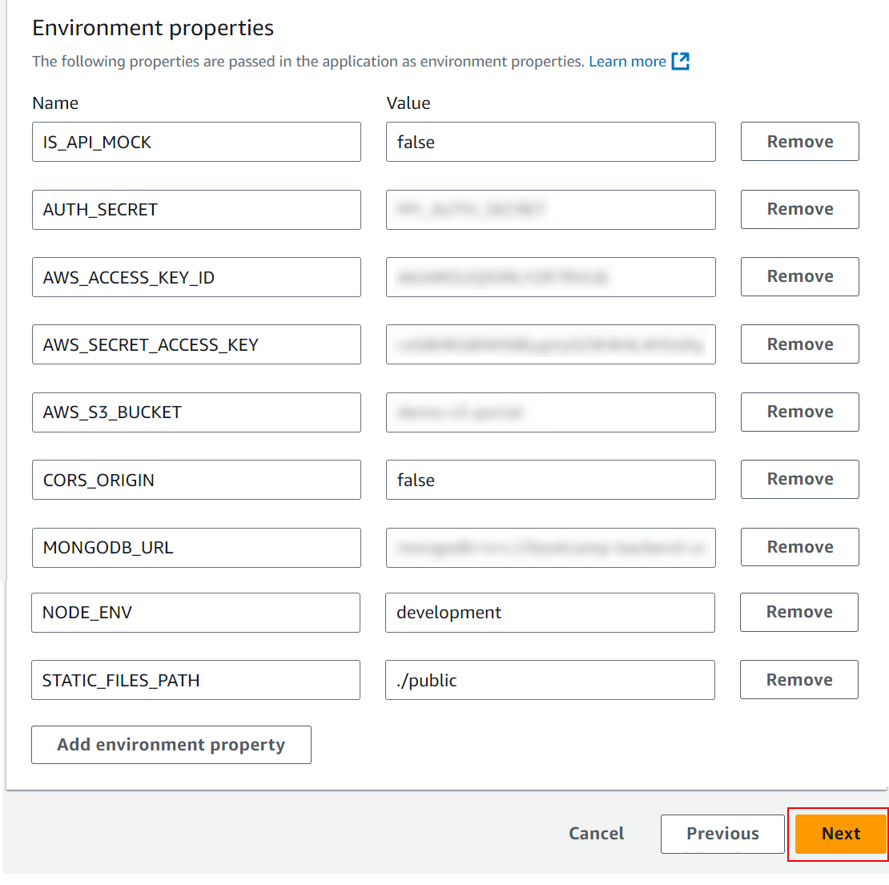

# 04 Manual AWS deploy

In this example we are going to learn how to manual deploy in AWS.

We will start from `03-mongo-deploy`.

# Steps to build it

`npm install` to install previous sample packages:

```bash
cd front
npm install

```

In a second terminal:

```bash
cd back
npm install

```

This time, we will deploy our web app in AWS using the [Beanstalk Service](https://aws.amazon.com/elasticbeanstalk/).

Let's create a beanstalk app:



Give a name:


Choose NodeJS platform:


Before upload the code, we will create a `zip` file with same files that we previously deploy on the `Render` example.

_front terminal_

```bash
npm run build

```

Let's copy the `front/dist` folder in the `back/public` folder.

Build the back project:

_back terminal_

```bash
npm run build

```

Now we have something like:

_./back_

```
|-- config/
|-- dist/
|-- node_module/
|-- public/
|-- src/
|-- ...
|-- package-lock.json
|-- package.json

```

Copy the necessary files to deploy:

- `dist` folder content.
- `public` folder.

Copy backend `package.json` and update it:

_./package.json_

```diff
{
  "name": "bootcamp-backend-lemoncode",
  "type": "module",
  "scripts": {
-   "prestart": "node ./create-dev-env.js && docker compose down --remove-orphans",
-   "start": "run-p -l type-check:watch start:dev start:local-db",
-   "start:dev": "tsx --require dotenv/config --watch src/index.ts",
-   "prestart:console-runners": "npm run prestart",
-   "start:console-runners": "run-p type-check:watch console-runners start:local-db",
-   "console-runners": "tsx --require dotenv/config --watch src/console-runners/index.ts",
-   "start:local-db": "docker compose up -d",
-   "clean": "rimraf dist",
-   "build": "npm run clean && tsc --project tsconfig.prod.json",
-   "type-check": "tsc --noEmit --preserveWatchOutput",
-   "type-check:watch": "npm run type-check -- --watch",
-   "test": "vitest run -c ./config/test/config.ts",
-   "test:watch": "vitest watch -c ./config/test/config.ts"
+   "start": "node index.js"
  },
  "imports": {
-   "#*": "./src/*"
+   "#*": "./*"
  },
  "dependencies": {
    "@aws-sdk/client-s3": "^3.658.1",
    "@aws-sdk/s3-request-presigner": "^3.658.1",
    "cookie-parser": "^1.4.6",
    "cors": "^2.8.5",
    "express": "^4.21.0",
    "jsonwebtoken": "^9.0.2",
    "mongodb": "^6.9.0"
- },
+ }
- "devDependencies": {
-   "@types/cookie-parser": "^1.4.7",
-   "@types/cors": "^2.8.17",
-   "@types/express": "^5.0.0",
-   "@types/jsonwebtoken": "^9.0.7",
-   "@types/node": "^22.7.4",
-   "@types/prompts": "^2.4.9",
-   "@types/supertest": "^6.0.2",
-   "dotenv": "^16.4.5",
-   "mongodb-memory-server": "^10.0.1",
-   "npm-run-all": "^4.1.5",
-   "prompts": "^2.4.2",
-   "rimraf": "^6.0.1",
-   "supertest": "^7.0.0",
-   "tsx": "^4.19.1",
-   "typescript": "^5.6.2",
-   "vitest": "^2.1.1"
- }
}

```

Result:

```
|- common/
|- common-app/
|- core/
|- dals/
|- pods/
|- public/
|- index.js
|- package.json

```

Create `zip` file:



Update code:


Continue to next steps:


Let's continue with default values and let's add `env variables` in step 5:



> NOTE: Since aws security group was configured only with HTTP inbound rule, we have to set `NODE_ENV` equals `development` to avoid create Cookie with secure flag.

# ¿Con ganas de aprender Backend?

En Lemoncode impartimos un Bootcamp Backend Online, centrado en stack node y stack .net, en él encontrarás todos los recursos necesarios: clases de los mejores profesionales del sector, tutorías en cuanto las necesites y ejercicios para desarrollar lo aprendido en los distintos módulos. Si quieres saber más puedes pinchar [aquí para más información sobre este Bootcamp Backend](https://lemoncode.net/bootcamp-backend#bootcamp-backend/banner).
