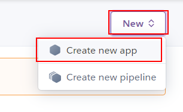
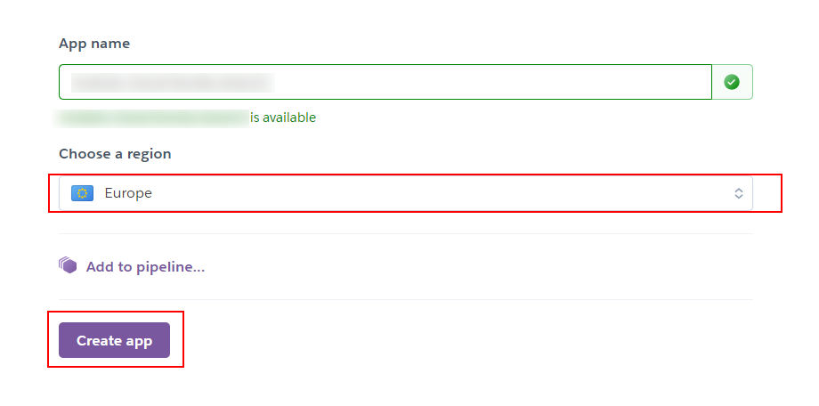
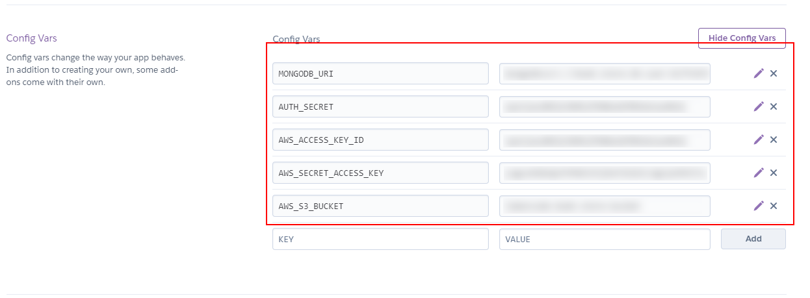

# 08 Automatic Heroku deploy

In this example we are going to deploy app to Heroku using Docker

We will start from `07-upload-docker-image`.

# Steps to build it

`npm install` to install previous sample packages:

```bash
cd front
npm install

```

In a second terminal:

```bash
cd back
npm install

```

First, we will create a new heroku app:





Then we will use `Github Actions` as pipeline to deploy the app to Heroku and we will need:

- Download Heroku cli
- Credentials to login in Heroku
- Build Docker image
- Push image to internal Heroku registry.

Create new repository and upload files:

```bash
git init
git remote add origin https://github.com/...
git add .
git commit -m "initial commit"
git push -u origin main

```

We need an [auth token](https://devcenter.heroku.com/articles/heroku-cli-commands#heroku-authorizations-create) to login inside Github Action job:

```bash
heroku login
heroku authorizations:create -d <description>
```

> -d: Set a custom authorization description
> -e: Set expiration in seconds (default no expiration)
> `heroku authorizations`: Get auth token list.

Add `Auth token` to git repository secrets:


> [Heroku API KEY storage](https://devcenter.heroku.com/articles/heroku-cli-commands#heroku-authorizations-create)

We will add `HEROKU_APP_NAME` as secret too:


> We need Heroku app name as identifier Heroku deployment.

Let's create the `Github Actions`:

_./.github/workflows/cd.yml_

```yml
name: Continuos Deployment Workflow

on:
  push:
    branches:
      - main

env:
  HEROKU_API_KEY: ${{ secrets.HEROKU_API_KEY }}
  IMAGE_NAME: registry.heroku.com/${{ secrets.HEROKU_APP_NAME }}/web

jobs:
  cd:
    runs-on: ubuntu-latest
    steps:
      - name: Checkout repository
        uses: actions/checkout@v3
      - name: Login heroku app Docker registry
        run: heroku container:login
      - name: Build docker image
        run: docker build -t ${{ env.IMAGE_NAME }} .
      - name: Deploy docker image
        run: docker push ${{ env.IMAGE_NAME }}
      - name: Release
        run: heroku container:release web -a ${{ secrets.HEROKU_APP_NAME }}

```

> NOTE: You don't need to run `heroku login` using `HEROKU_API_KEY env variable`.
> References:
> In this case, we don't install heroku cli due to [Github Actions Virtual Machine](https://github.com/actions/virtual-environments/blob/ubuntu20/20210216.1/images/linux/Ubuntu2004-README.md) has it.
>
> If not:

```yml
      
      - name: Login heroku app Docker registry
        run: |
          curl https://cli-assets.heroku.com/install-ubuntu.sh | sh
          heroku container:login
```

> [Heroku install](https://devcenter.heroku.com/articles/heroku-cli#standalone-installation)
>
> [Heroku Docker Deploy](https://devcenter.heroku.com/articles/container-registry-and-runtime)
>
> [Github context](https://docs.github.com/en/free-pro-team@latest/actions/reference/context-and-expression-syntax-for-github-actions#github-context)

Upload changes:

```bash
git add .
git commit -m "add github action"
git push

```

```bash
heroku logs -a <name> --tail
```

The app deployed is working! But it's in `API MOCK mode`, let's configure the env variables that we could keep on Dockerfile and the other ones in Heroku:

_./Dockerfile_

```diff
...

- EXPOSE 3001
- ENV PORT=3001
+ ENV NODE_ENV=production
ENV STATIC_FILES_PATH=./public
- ENV API_MOCK=true
+ ENV API_MOCK=false
- ENV AUTH_SECRET=MY_AUTH_SECRET
+ ENV CORS_ORIGIN=false
...

```

Upload changes:

```bash
git add .
git commit -m "update env variables"
git push

```

Add heroku env variables:



# ¿Con ganas de aprender Backend?

En Lemoncode impartimos un Bootcamp Backend Online, centrado en stack node y stack .net, en él encontrarás todos los recursos necesarios: clases de los mejores profesionales del sector, tutorías en cuanto las necesites y ejercicios para desarrollar lo aprendido en los distintos módulos. Si quieres saber más puedes pinchar [aquí para más información sobre este Bootcamp Backend](https://lemoncode.net/bootcamp-backend#bootcamp-backend/banner).
