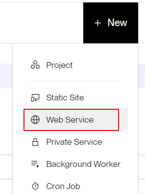
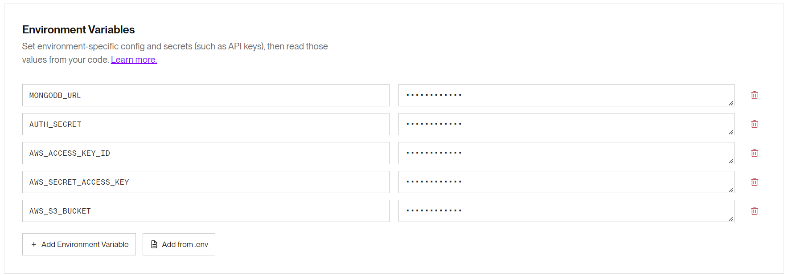

# 08 Despliegue automático con Render

En este ejemplo vamos a desplegar la aplicación en Render usando Docker

Tomamos como punto de partida el ejemplo `07-upload-docker-image`.

# Pasos

Vamos a crear un nuevo repositorio y subir los ficheros:


```bash
git init
git remote add origin git@github.com...
git add .
git commit -m "initial commit"
git push -u origin main

```

Creamos una aplicación _Render_ desde su portal:



Configuramos la cuenta para que tenga acceso al repositorio que acabamos de crear:


Elegimos la opcíon de render _Web Service_:


Añadimos las variables de entorno (Advanced settings):



> Mirar STATIC_FILES_PATH=./public

Acualizamos los docker settings:


Clickamos en el botón `Create Web Service`.

LA applicacíon ya está desplegada! Pero está en modo `API MOCK` y el _PORT_ es incorrecto, vamos a configurar las variables de entorno:

_./Dockerfile_

```diff
...

- EXPOSE 3001
- ENV PORT=3001
ENV STATIC_FILES_PATH=./public
- ENV API_MOCK=true
+ ENV API_MOCK=false
- ENV AUTH_SECRET=MY_AUTH_SECRET
+ ENV CORS_ORIGIN=false
...
```

Subimos los cambios:

```bash
git add .
git commit -m "update env variables"
git push
```

Y ahora sí, la aplicación está desplegada y funcionando: `https://<app-name>.onrender.com`.

# ¿Con ganas de aprender Backend?

En Lemoncode impartimos un Bootcamp Backend Online, centrado en stack node y stack .net, en él encontrarás todos los recursos necesarios: clases de los mejores profesionales del sector, tutorías en cuanto las necesites y ejercicios para desarrollar lo aprendido en los distintos módulos. Si quieres saber más puedes pinchar [aquí para más información sobre este Bootcamp Backend](https://lemoncode.net/bootcamp-backend#bootcamp-backend/banner).
