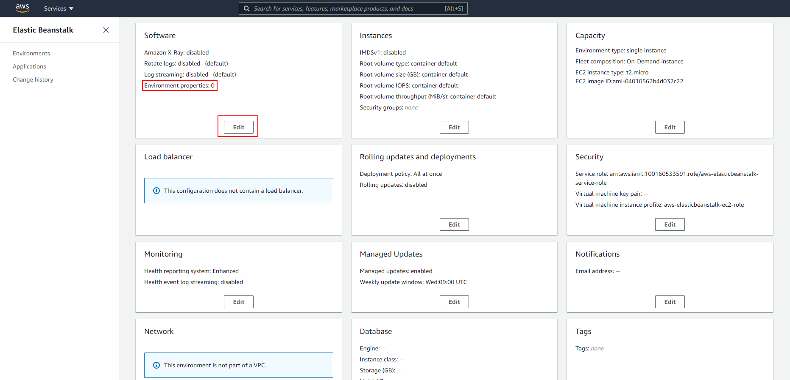

# 09 Automatic AWS deploy

In this example we are going to deploy app to AWS.

We will start from `08-auto-heroku-deploy`.

# Steps to build it

`npm install` to install previous sample packages:

```bash
cd front
npm install

```

In a second terminal:

```bash
cd back
npm install

```

First, we will create a new `Elastic Beanstalk` app:


Give a name:


Choose Docker platform


Create `zip` file:


Update code:


Let's add `env variables`:




> NOTE: Since aws security group was configured only with HTTP inbound rule, we have to set `NODE_ENV` equals `development` to avoid create Cookie with secure flag.

Create app:


// TODO: 

[Using docker-compose](https://docs.aws.amazon.com/elasticbeanstalk/latest/dg/single-container-docker-configuration.html)

[Read env variables from .env](https://docs.aws.amazon.com/elasticbeanstalk/latest/dg/create_deploy_docker.container.console.html#docker-env-cfg.env-variables)

[Not supported Multi-Stage](https://github.com/aws/elastic-beanstalk-roadmap/issues/60)

Then we will use `Github Actions` as pipeline to deploy the app to AWS and we will need:

- Credentials to login in AWS with `Elastic Beanstalk` permissions
- AWS login
- Upload zipped code with Dockerfile to auto-generated S3 bucket for `Elastic Beanstalk`
- Push image to internal Heroku registry.

Remove `./.github/workflows/cd.yml` content:

```diff
name: Continuos Deployment Workflow

on:
  push:
    branches:
      - master

- env:
-   HEROKU_API_KEY: ${{ secrets.HEROKU_API_KEY }}
-   IMAGE_NAME: registry.heroku.com/${{ secrets.HEROKU_APP_NAME }}/web

jobs:
- cd:
-   runs-on: ubuntu-latest
-   steps:
-     - name: Checkout repository
-       uses: actions/checkout@v2
-     - name: Login heroku app Docker registry
-       run: heroku container:login
-     - name: Build docker image
-       run: docker build -t ${{ env.IMAGE_NAME }} .
-     - name: Deploy docker image
-       run: docker push ${{ env.IMAGE_NAME }}
-     - name: Release
-       run: heroku container:release web -a ${{ secrets.HEROKU_APP_NAME }}

```

Create new repository and upload files:

```bash
git init
git remote add origin https://github.com/...
git add .
git commit -m "initial commit"
git push -u origin master

```

We need create user with `Elastic Beanstalk` persmissions in [IAM service](https://aws.amazon.com/iam/):


Set `Admin Elastic Beanstalk` permissions:


We will skip steps 3 and 4 (Add tags and Review).

In the `final step`, Amazon provides us the `Access key ID` and `Secret access key`. We will store this credentials to use it:


Add credentials as Github secrets:


Also we need to set as secrets:

- AWS_EB_APP_NAME: same name as we set to `Elastic Beanstalk` app.
- AWS_EB_ENV_NAME: environment name that `Elastic Beanstalk` provides for our app.
- AWS_REGION: for example `eu-west-3`.
- AWS_DEPLOY_S3_BUCKET: auto-generated bucket by `Elastic Beanstalk`.


Let's upate the `Github Actions`:

_./.github/workflows/cd.yml_

```diff
name: Continuos Deployment Workflow

on:
  push:
    branches:
      - master

+ env:
+   RELEASE_DATE: $(date +'%Y-%m-%dT%H:%M:%S')
+   APP_VERSION_LABEL: ${{ secrets.AWS_EB_APP_NAME}}-${{ env.RELEASE_DATE }}-$GITHUB_SHA
+   ZIP_FILE_NAME: ${{ env.APP_VERSION_LABEL }}.zip
+   S3_FILE_UPLOAD_URL: s3://${{ secrets.AWS_DEPLOY_S3_BUCKET }}/${{ env.ZIP_FILE_NAME }}

jobs:
+ cd:
+   runs-on: ubuntu-latest
+   steps:
+     - name: Checkout repository
+       uses: actions/checkout@v2
+     - name: AWS login
+       uses: aws-actions/configure-aws-credentials@v1
+       with:
+         aws-access-key-id: ${{ secrets.AWS_DEPLOY_ACCESS_KEY_ID }}
+         aws-secret-access-key: ${{ secrets.AWS_DEPLOY_SECRET_ACCESS_KEY }}
+         aws-region: ${{ secrets.AWS_REGION }}
+     - name: Upload files to S3
+       run: |
+         zip -r ${{ env.ZIP_FILE_NAME }} .
+         aws s3 cp ${{ env.ZIP_FILE_NAME }} ${{ env.S3_FILE_UPLOAD_URL }}

```

> [Default Github Env](https://docs.github.com/en/actions/reference/environment-variables#default-environment-variables)
>
> [aws-actions/configure-aws-credentials@v1](https://github.com/aws-actions/configure-aws-credentials)
>
> [Github Actions Virtual Machine tools](https://github.com/actions/virtual-environments/blob/ubuntu20/20210216.1/images/linux/Ubuntu2004-README.md)
>
> [AWS cli s3](https://awscli.amazonaws.com/v2/documentation/api/latest/reference/s3/index.html)
>
> [AWS cli elasticbeanstalk](https://awscli.amazonaws.com/v2/documentation/api/latest/reference/elasticbeanstalk/index.html)

Add `deploy` steps:

_./.github/workflows/cd.yml_

```diff
...
      - name: Upload files to S3
        run: |
          zip -r ${{ env.ZIP_FILE_NAME }} .
          aws s3 cp ${{ env.ZIP_FILE_NAME }} ${{ env.S3_FILE_UPLOAD_URL }}
+     - name: Create EB App version
+       run: aws elasticbeanstalk create-application-version --application-name ${{ secrets.AWS_APP_NAME}} --version-label ${{ env.APP_VERSION_LABEL }} --source-bundle S3Bucket=${{ secrets.AWS_DEPLOY_S3_BUCKET }},S3Key=${{ env.ZIP_FILE_NAME }} --no-auto-create-application
+     - name: Release
+       run: aws elasticbeanstalk update-environment --environment-name ${{ secrets.AWS_EB_ENV_NAME }} --version-label ${{ env.APP_VERSION_LABEL }}

```

Upload changes:

```bash
git add . && git commit -m "update github action" && git push
git add .
git commit -m "update github action"
git push

```

# ¿Con ganas de aprender Backend?

En Lemoncode impartimos un Bootcamp Backend Online, centrado en stack node y stack .net, en él encontrarás todos los recursos necesarios: clases de los mejores profesionales del sector, tutorías en cuanto las necesites y ejercicios para desarrollar lo aprendido en los distintos módulos. Si quieres saber más puedes pinchar [aquí para más información sobre este Bootcamp Backend](https://lemoncode.net/bootcamp-backend#bootcamp-backend/banner).
