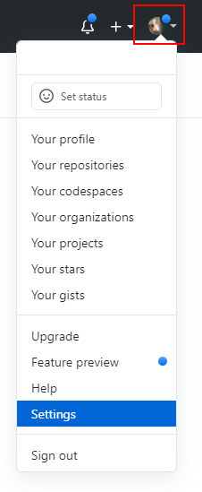
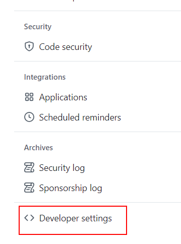
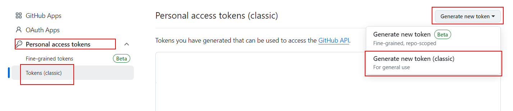
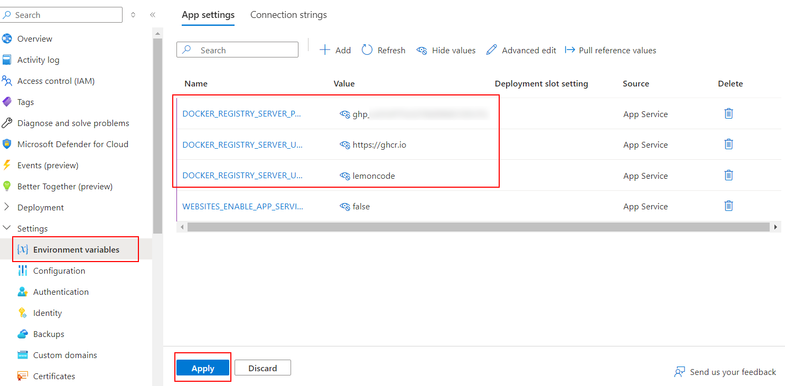
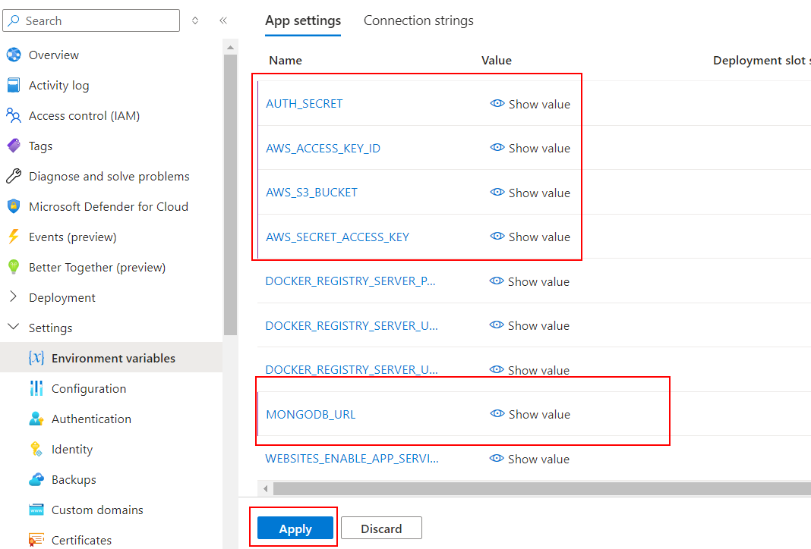

# 09 Automatic Azure deploy

En este ejemplo vamos a desplegar una aplicación en Azure usando Docker

Tomamos como punto de partida el ejemplo `08-auto-render-deploy`.

# Steps to build it

Vamos a crear un nuevo repositorio en Github y subir los ficheros del ejemplo anterior:


```bash
git init
git remote add origin git@github.com...
git add .
git commit -m "initial commit"
git push -u origin main
```

> Si te da este fallo `error: failed to push some refs to` puede que tengas tu rama por defecto en local a _master_ puedes cambiar (git config --global init.defaultBranch main)

## Crear el Azure Service Plan

Creamos un nuevo Azure Service Plan:


> Aquí utilizaremos el free tier, tenemos hasta 10 aplicaciones en el mismo plan
>
> Hay una free tier por region.

Configuramos los detalles del nuevo plan:


Configuramos los planes (importante seleccionar el free tier)


## Creamos el Azure App Service

Creamos una nueva Azure App:


Configuramos los detalles de la nueva app:


Configuramos los planes (importante seleccionar el free tier)


Como puedes ver, esta app desplegará un ejemplo de una imagen de Docker de Microsoft. Podemos proporcionar nuestra propia imagen de Docker en la sección de configuración usando variables de entorno:


> [Offical Docs deploy to azure app](https://docs.github.com/en/actions/deployment/deploying-to-your-cloud-provider/deploying-to-azure/deploying-docker-to-azure-app-service)

Si queremos usar una imagen pública podemos usar la que hemos subido a Docker Hub en el ejemplo anterior o podemos subir una imagen privada usando [Github Packages](https://github.com/features/packages).

> [Official Github Container Registry Docs](https://docs.github.com/en/packages/working-with-a-github-packages-registry/working-with-the-container-registry)

Para ello creamos un Github Personal Access Token:








Clicamos en el butón generar token y actualizamos los valores en la sección de configuración de Azure:



> DOCKER_REGISTRY_SERVER_URL: `https://ghcr.io`
>
> DOCKER_REGISTRY_SERVER_USERNAME: utiliza aquí tu nombre de usuario de Github o el de tu organizacion en lugar de `lemoncode`.

Para probar que esto funciona podemos desde la consola

```bash
docker login ghcr.io -u TU_USUARIO_GITHUB -p TU_TOKEN_ACCESO_PERSONAL
```

```bash
docker logout ghcr.io
```

Añadimos las variables de entorno a nuestra app:



Y ahora creamos un nuevo Github Action workflow para desplegar nuestra app en Azure:

_./.github/workflows/cd.yml_

```yml
name: CD Workflow

on:
  push:
    branches:
      - main

env:
  IMAGE_NAME: ghcr.io/${{github.repository}}:${{github.run_number}}-${{github.run_attempt}}

permissions:
  contents: "read"
  packages: "write"
```

> `github.repository`: El nombre del repositorio incluyendo el propietario, por ejempo: `octocat/hello-world`. Solo puedes usar esta variable si está en minúsculas debido a una restricción de Docker: `--tag" flag: invalid reference format: repository name must be lowercase`
>
> Para crear un tag único, puedes utilizar `github.run_number` y `github.run_attempt`. Pero puedes usar cualquier otro tag.
>
> [Github context API](https://docs.github.com/en/actions/learn-github-actions/contexts#github-context)

Definimos el job para construir y subir la imagen a Github Container Registry:

_./.github/workflows/cd.yml_

```diff
...
permissions:
  contents: 'read'
  packages: 'write'

+ jobs:
+   cd:
+     runs-on: ubuntu-latest
+     steps:
+       - name: Checkout repository
+         uses: actions/checkout@v3

+       - name: Log in to GitHub container registry
+         uses: docker/login-action@v2
+         with:
+           registry: ghcr.io
+           username: ${{ github.actor }}
+           password: ${{ secrets.GITHUB_TOKEN }}

+       - name: Build and push docker image
+         run: |
+           docker build -t ${{env.IMAGE_NAME}} .
+           docker push ${{env.IMAGE_NAME}}

+       - name: Deploy to Azure
+         uses: azure/webapps-deploy@v2
+         with:
+           app-name: ${{ secrets.AZURE_APP_NAME }}
+           publish-profile: ${{ secrets.AZURE_PUBLISH_PROFILE }}
+           images: ${{env.IMAGE_NAME}}

```

> [GITHUB_TOKEN automatic token authentication](https://docs.github.com/en/actions/security-guides/automatic-token-authentication)

Creamos los `secretos` en nuestro repositorio de Github:


Indicamos dos secretos el AZURE_APP_NAME y el AZURE_PUBLISH_PROFILE:

- `AZURE_APP_NAME` (mismo valor que el nombre de tu App en Azure):


- `AZURE_PUBLISH_PROFILE` (lo puedes descargar desde Azure portal y pegar el valor en el secreto)


Subimos los cambios:

```bash
git add .
git commit -m "create github workflow"
git push
```

Una vez que el despliegue se ha completado, podemos ver la app de Azure desde el navegador:
`https://<app-name>.azurewebsites.net`.

# ¿Con ganas de aprender Backend?

En Lemoncode impartimos un Bootcamp Backend Online, centrado en stack node y stack .net, en él encontrarás todos los recursos necesarios: clases de los mejores profesionales del sector, tutorías en cuanto las necesites y ejercicios para desarrollar lo aprendido en los distintos módulos. Si quieres saber más puedes pinchar [aquí para más información sobre este Bootcamp Backend](https://lemoncode.net/bootcamp-backend#bootcamp-backend/banner).
