# 10 Automatic AWS deploy

En este ejemplo vamos a desplegar la app en AWS de forma automática.

Tomamos como punto de partida el ejemplo `09-auto-azure-deploy`.

# Steps to build it

Primero, creamos un nuevo `Elastic Beanstalk` app:

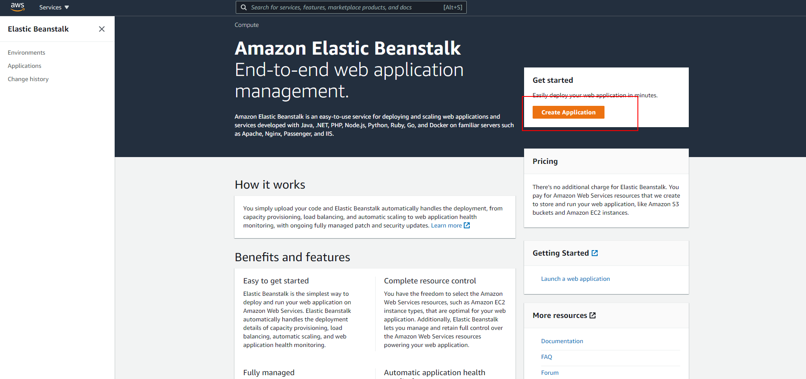

Le damos un nombre:

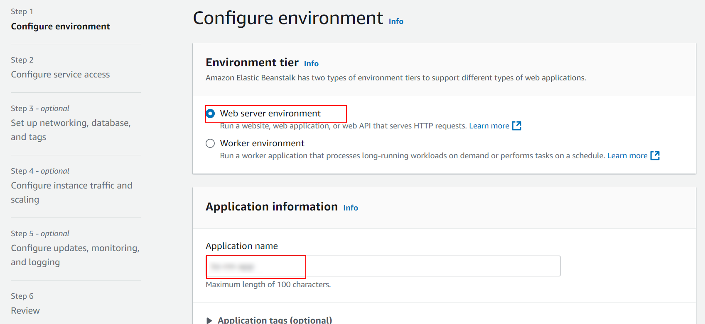

Elegimos la plataforma Docker:

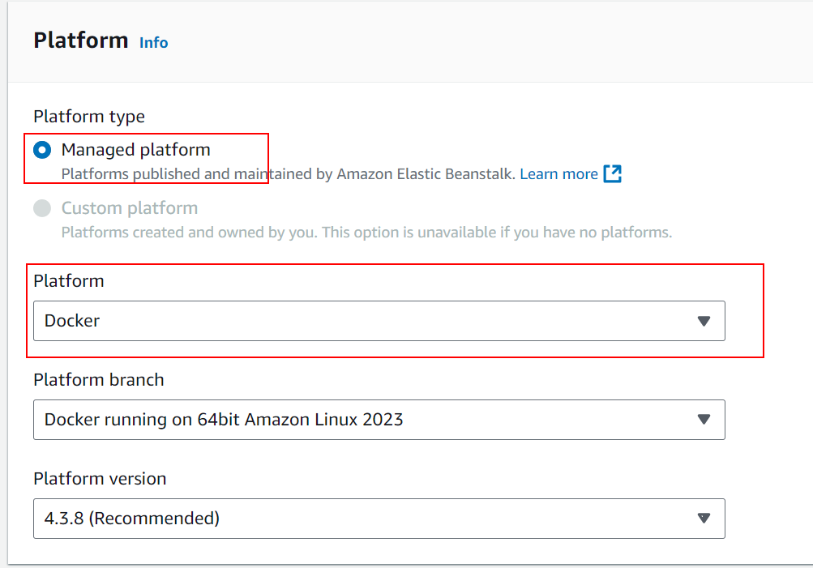

> IMPORTANTE: Asegurate esta vez que no tengas `node_modules` lo instalaremos en el proceso de build

Create `zip` file:

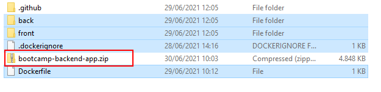

Subimos el código

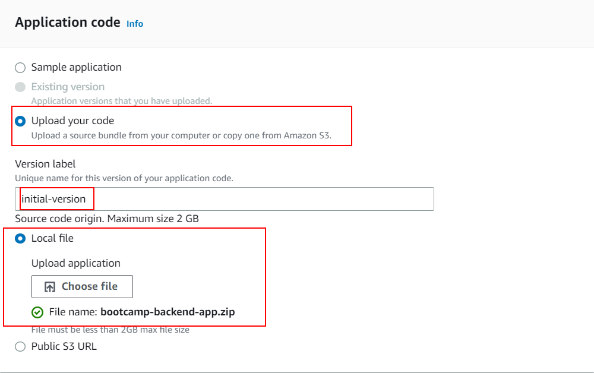

Vamos a por los siguientes pasos:


Dejamos los valores por defecto y IMPORTANTE añadimos las variables de entorno (`env variables`) en el paso 5


> NOTA: Como el grupo de seguridad de AWS solo tiene configurada la regla de entrada HTTP, tenemos que establecer `NODE_ENV` igual a `development` para evitar crear Cookie con el flag `secure` que fuerza a HTTPS.
>
> Ahora AWS soporta Docker multi-stage builds [desde Feb 2022](https://docs.aws.amazon.com/elasticbeanstalk/latest/relnotes/release-2022-02-03-linux.html)
>
> Por curiosidad, además de la aproximación que hemos visto, podemos usar una segunda [`docker-compose` para ser ejecutado por Amazon](https://docs.aws.amazon.com/elasticbeanstalk/latest/dg/single-container-docker-configuration.html)
> Esto no lo vamos a cubrir.

Podría ser (no lo ponemos):

_./docker-compose.yml_

```yml
version: "3.8"
services:
  app:
    container_name: app
    build: .
    ports:
      - "80:80"
    env_file:
      - .env
```

>

Why did we get an error when deploy it? We could take more info in logs:

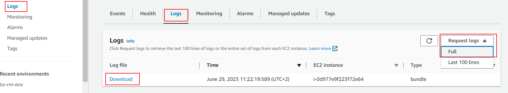

> Check file `./var/log/eb-engine.log`
>
> [ERROR] An error occurred during execution of command [app-deploy] - [Run Docker Container]. Stop running the command. Error: no EXPOSE directive found in Dockerfile, abort deployment

Actualizamos el `Dockerfile` para usar `PORT=80` como se declara en `EC2 > Security Groups > Inbound rules`:

_./Dockerfile_

```diff
...
+ EXPOSE 80
+ ENV PORT=80
ENV STATIC_FILES_PATH=./public
ENV API_MOCK=false
ENV CORS_ORIGIN=false
...

```

Y ahora vamos a usar `Github Actions` como pipeline para desplegar la app en AWS y necesitaremos:

- Credenciales para logarnos en AWS con permisos de `Elastic Beanstalk`
- AWS login
- Subir el código zipeado con el Dockerfile al bucket auto-generado por `Elastic Beanstalk`
- Crear una nueva versión de la app en `Elastic Beanstalk`.

Vamos a hacer limpia en el contenido de
`./.github/workflows/cd.yml` (eliminamos lo específico de azure):

```diff
name: CD Workflow

on:
  push:
    branches:
      - main

- env:
-   IMAGE_NAME: ghcr.io/${{github.repository}}:${{github.run_number}}-${{github.run_attempt}}

- permissions:
-   contents: 'read'
-   packages: 'write'

jobs:
  cd:
    runs-on: ubuntu-latest
    steps:
      - name: Checkout repository
        uses: actions/checkout@v3

-     - name: Log in to GitHub container registry
-       uses: docker/login-action@v2
-       with:
-         registry: ghcr.io
-         username: ${{ github.actor }}
-         password: ${{ secrets.GITHUB_TOKEN }}

-     - name: Build and push docker image
-       run: |
-         docker build -t ${{env.IMAGE_NAME}} .
-         docker push ${{env.IMAGE_NAME}}

-     - name: Deploy to Azure
-       uses: azure/webapps-deploy@v2
-       with:
-         app-name: ${{ secrets.AZURE_APP_NAME }}
-         publish-profile: ${{ secrets.AZURE_PUBLISH_PROFILE }}
-         images: ${{env.IMAGE_NAME}}

```

Create new repository and upload files:

```bash
git init
git remote add origin https://github.com/...
git add .
git commit -m "initial commit"
git push -u origin main

```

Vamos a la parte específica de AWS:

Tenemos que crear un usuario con permisos de `Elastic Beanstalk` en [IAM service](https://aws.amazon.com/iam/):

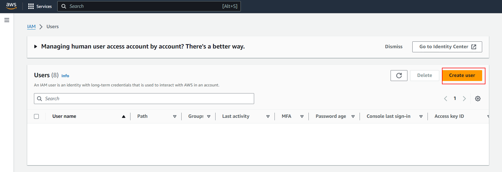


Podríajos darle permisos de `Admin Elastic Beanstalk`:


PEEEROOOO... mejor aquí le estamos dando permisos a este usuario a que pueda administrar cualquier sitio EBS en nuestra subscripción, mejor crear una política restringida a justo el sitio que hemos creado y así reducimos el area de ataque [Mineros y robo de cuentas](https://news.ycombinator.com/item?id=29550809).

Así que le damos a `crear politica`:

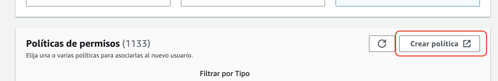

- Nos lleva a la ventana de políticas, buscamos y elegimos el servicio "Elastic Beanstalk":

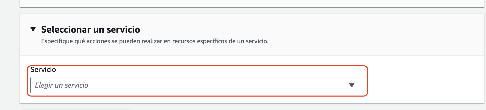

Y vamos a definir la política en JSON:

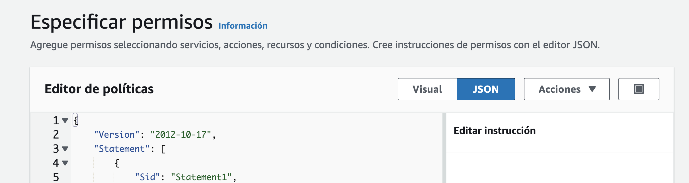

Y definimos la politica:

**IMPORTANTE** Aquí tenemos que definir:

`"arn:aws:elasticbeanstalk:REGION:ACCOUNT-ID:environment/``

- La REGION en que se encuentra `eu-west-3` Esto lo podemos sacar en el listado del nombre el dominio
- El ACCOUNT-ID lo podemos encontrar en la menú de arriba a la izquierda de [IAM service](https://aws.amazon.com/iam/).

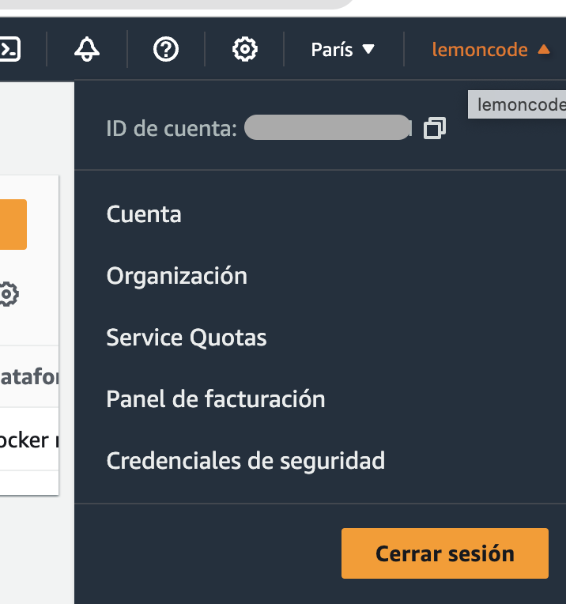

`Your-Environment-ID/\*"``

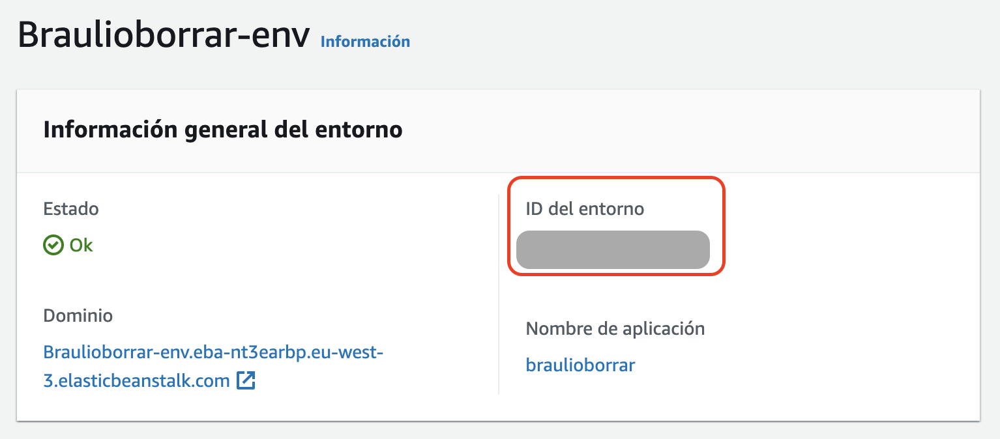

Por otro lado tenemos que darle permiso al bucket de S3 que EBS crea para almacenar el código zipeado de la app ¿Cómo sabemos cual es?

- En los eventos podemos ver que se ha creado un bucket.
- Nos podemos ir a S3 y buscar el bucket también.

Acuerdate de poner el nombre completo del bucket

```json
{
  "Version": "2012-10-17",
  "Statement": [
    {
      "Effect": "Allow",
      "Action": [
        "elasticbeanstalk:CreateApplicationVersion",
        "elasticbeanstalk:UpdateEnvironment",
        "elasticbeanstalk:DescribeEnvironmentResources",
        "elasticbeanstalk:DescribeEnvironments"
      ],
      "Resource": [
        "arn:aws:elasticbeanstalk:REGION:ACCOUNT-ID:environment/Your-Environment-ID",
        "arn:aws:elasticbeanstalk:REGION:ACCOUNT-ID:environment/Your-Environment-ID/*"
      ]
    },
    {
      "Effect": "Allow",
      "Action": ["s3:GetObject", "s3:PutObject", "s3:ListBucket"],
      "Resource": [
        "arn:aws:s3:::nombre-de-tu-bucket",
        "arn:aws:s3:::nombre-de-tu-bucket/*"
      ]
    }
  ]
}
```

Le damos un nombre a la política (por ejemplo: _borrarpolitica_)

Volvamos al usuario, refrescamos las políticas, vaciamos la busqueda y elegimos por ejemplo filtrar por tipo: _administrada por el cliente_ y elegimos _borrarpermiso_:

Creamos el usuario en el `paso 3` (Review and create). Casi lo tenemos, solo nos falta crear unas credenciales para usar en nuestra app.

Seleccionamos el usuario que acabamos de crear y clicamos en `Security credentials`


Hacemos scroll y pinchamos en `Create access key`:


Seleccionamos e caso de uso (aplicación que se ejecuta fuera de AWS)


Nos saltamos el paso opcional (tag de descripción).

En el `paso final`, Amazon nos proporciona el `Access key ID` y `Secret access key`. Vamos a almacenar estas credenciales para usarlas:


Añadimos esas credenciales como Github secrets:

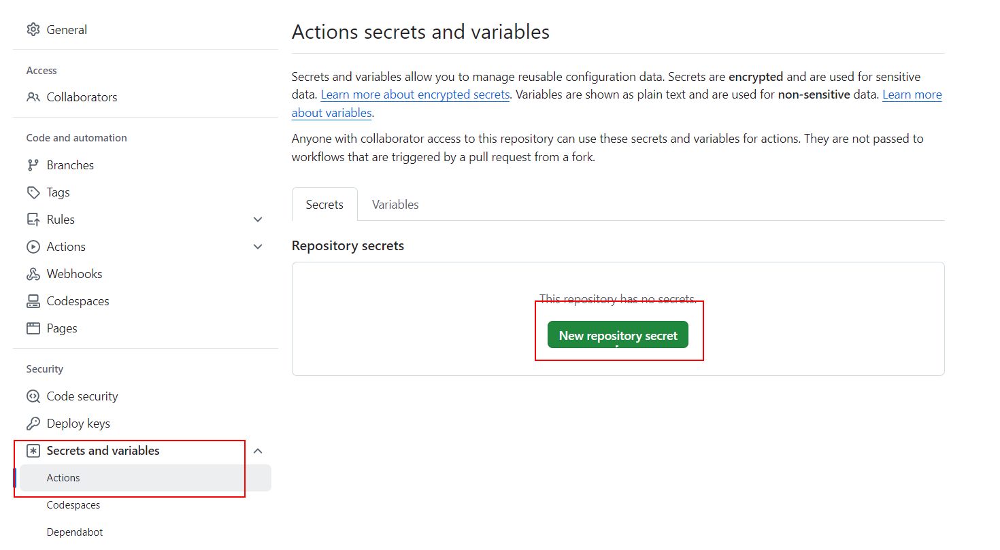


Y ahora nos toca almacenar unos cuantos datos de AWS como secretos de Github:

- AWS_EB_APP_NAME: el mismo que pusimos en la `Elastic Beanstalk`.
- AWS_EB_ENV_NAME: el environment name que `Elastic Beanstalk` le da a nuestra app.
- AWS_REGION: la region en que se encuentra `eu-west-3`.
- AWS_DEPLOY_S3_BUCKET: el bucket autogenerado por `Elastic Beanstalk`.


Vamos a actualizar `Github Actions`:

_./.github/workflows/cd.yml_

```diff
name: CD Workflow

on:
  push:
    branches:
      - main

+ env:
+   APP_VERSION_LABEL: ${{ secrets.AWS_EB_APP_NAME }}-${{github.run_number}}-${{github.run_attempt}}

jobs:
  cd:
    runs-on: ubuntu-latest
    steps:
      - name: Checkout repository
        uses: actions/checkout@v3

+     - name: AWS login
+       uses: aws-actions/configure-aws-credentials@v2
+       with:
+         aws-access-key-id: ${{ secrets.AWS_DEPLOY_ACCESS_KEY_ID }}
+         aws-secret-access-key: ${{ secrets.AWS_DEPLOY_SECRET_ACCESS_KEY }}
+         aws-region: ${{ secrets.AWS_REGION }}

+     - name: Upload files to S3
+       run: |
+         zip -r ${{ env.APP_VERSION_LABEL }}.zip * .dockerignore
+         aws s3 cp ${{ env.APP_VERSION_LABEL }}.zip s3://${{ secrets.AWS_DEPLOY_S3_BUCKET }}/${{ env.APP_VERSION_LABEL }}.zip

```

> Henos puesto `*` para incluir todos los ficheros
> Necesitamos `.dockerignore` para incluir los ficheros ocultos como `.dockerignore`
>
> O `.*` para incluir todos los ficheros ocultos
>
> [Default Github Env](https://docs.github.com/en/actions/reference/environment-variables#default-environment-variables)
>
> [aws-actions/configure-aws-credentials@v1](https://github.com/aws-actions/configure-aws-credentials)
>
> [Github Actions Virtual Machine tools](https://github.com/actions/virtual-environments/blob/ubuntu20/20210216.1/images/linux/Ubuntu2004-README.md)
>
> [AWS cli s3](https://awscli.amazonaws.com/v2/documentation/api/latest/reference/s3/index.html)

Añadimos los pasos para hacer `deploy`

_./.github/workflows/cd.yml_

```diff
...
      - name: Upload files to S3
        run: |
          zip -r ${{ env.APP_VERSION_LABEL }}.zip * .dockerignore
          aws s3 cp ${{ env.APP_VERSION_LABEL }}.zip s3://${{ secrets.AWS_DEPLOY_S3_BUCKET }}/${{ env.APP_VERSION_LABEL }}.zip

+     - name: Create EB App version
+       run: aws elasticbeanstalk create-application-version --application-name ${{ secrets.AWS_EB_APP_NAME }} --version-label ${{ env.APP_VERSION_LABEL }} --source-bundle S3Bucket=${{ secrets.AWS_DEPLOY_S3_BUCKET }},S3Key=${{ env.APP_VERSION_LABEL }}.zip --no-auto-create-application

+     - name: Update environment
+       run: aws elasticbeanstalk update-environment --environment-name ${{ secrets.AWS_EB_ENV_NAME }} --version-label ${{ env.APP_VERSION_LABEL }}

```

> [AWS cli elasticbeanstalk](https://awscli.amazonaws.com/v2/documentation/api/latest/reference/elasticbeanstalk/index.html)

Hacemos commit y push en github:

```bash
git add .
git commit -m "update github action"
git push
```

Y eso debería de lanzar el workflow de github y desplegar.

# ¿Con ganas de aprender Backend?

En Lemoncode impartimos un Bootcamp Backend Online, centrado en stack node y stack .net, en él encontrarás todos los recursos necesarios: clases de los mejores profesionales del sector, tutorías en cuanto las necesites y ejercicios para desarrollar lo aprendido en los distintos módulos. Si quieres saber más puedes pinchar [aquí para más información sobre este Bootcamp Backend](https://lemoncode.net/bootcamp-backend#bootcamp-backend/banner).
