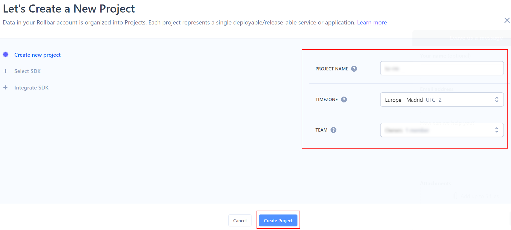
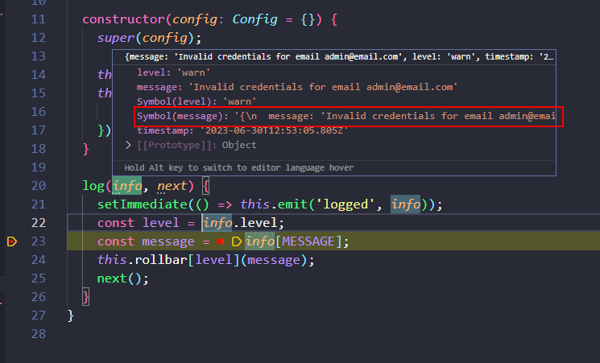

# 02 Custom transport

En este ejemplo vamos a crear un transport personalizado para nuestro logger.

Tomamos como punto de partida el ejemplo `01-logging`.

# Pasos

Si no lo has hecho ya,ejecutamos el `npm install` en ambas carpetas para instalar los paquetes necesarios:

```bash
cd front
npm install

```

In a second terminal:

```bash
cd back
npm install

```

En este ejemplo, crearemos un transport personalizado, en este caso, enviaremos los logs a [rollbar](https://rollbar.com/).

Primero creamos una cuenta en rollbar y un nuevo proyecto:



Selecciónamos el lenguaje del SDK (nodejs);


Y rollbar se queda a la espera de datos:


Vamos a código, instalamos el paquete `rollbar`:

```bash
npm install rollbar --save
```

Ahora podemos buscar si hay alguna librería que tenga el transporte de rollbar para winston instalado, pero... resulta que es muy sencillo crear un propio, vamos a ellos. Vamos a instalar las dependencias internas de `winston` para crear un nuevo transporte:

```bash
npm install winston-transport triple-beam --save
```

> [Adding custom transports](https://github.com/winstonjs/winston#adding-custom-transports)

Y definir nuestro propio `rollbar transport`.

_./back/src/common/logger-transports/rollbar.transport.ts_

```javascript
import Transport from 'winston-transport';
import Rollbar, { Configuration } from 'rollbar';
import { MESSAGE } from 'triple-beam';

type Config = Transport.TransportStreamOptions & Configuration;

export class RollbarTransport extends Transport {
  private config: Config;
  private rollbar: Rollbar;

  constructor(config: Config = {}) {
    super(config);

    this.config = config;
    this.rollbar = new Rollbar({
      ...this.config,
    });
  }

  log(info, next) {
    setImmediate(() => this.emit('logged', info));
    const level = info.level;
    const message = info[MESSAGE];
    this.rollbar[level](message);
    next();
  }
}
```

> A futuro, podríamos crear una librería para ello.

Nos hace falta acceder a `info[MESSAGE]` si queremos loguear el mensaje formateado en lugar del mensaje en bruto:



Creamos

_./back/src/common/logger-transports/index.ts_

```javascript
export * from "./rollbar.transport.js";
```

Añadimos el nuevo transport a nuestro logger (ojo esto ya no es desde common, es la implementación para nuestra aplicación), ojo que tenemos que añadir las variables de entorno (`envConstants`), en seguida lo hacemos.

_./back/src/core/logger/transports/rollbar.transport.ts_

```javascript
import { format } from "winston";
import { RollbarTransport } from "#common/logger-transports/index.js";
import { envConstants } from "#core/constants/index.js";

const { combine, timestamp, prettyPrint } = format;

export const rollbar = new RollbarTransport({
  accessToken: envConstants.ROLLBAR_ACCESS_TOKEN,
  environment: envConstants.ROLLBAR_ENV,
  captureUncaught: envConstants.isProduction,
  captureUnhandledRejections: envConstants.isProduction,
  format: combine(timestamp(), prettyPrint()),
  level: "warn",
});
```

> [Rollbar docs](https://docs.rollbar.com/docs/nodejs)

Acualizamos el barrel:

_./back/src/core/logger/transports/index.ts_

```diff
export * from './console.transport.js';
export * from './file.transport.js';
+ export * from './rollbar.transport.js';
```

Añadimos las variables de entorno (`env variables`)
Add `env variables`:

_./back/.env.example_

```diff
...
+ ROLLBAR_ACCESS_TOKEN=value
+ ROLLBAR_ENV=development
```

_./back/.env_

```diff
+ ROLLBAR_ACCESS_TOKEN=<value-provided-by-rollbar>
+ ROLLBAR_ENV=development
```

_./back/src/core/constants/env.constants.ts_

```diff
export const envConstants = {
  ...
+ ROLLBAR_ACCESS_TOKEN: process.env.ROLLBAR_ACCESS_TOKEN,
+ ROLLBAR_ENV: process.env.ROLLBAR_ENV,
};

```

Vamos a usar el transporte en nuestra aplicación.

_./back/src/core/logger/logger.ts_

```diff
import { createLogger } from 'winston';
- import { console, file } from './transports/index.js';
+ import { console, file, rollbar } from './transports/index.js';

export const logger = createLogger({
- transports: [console, file],
+ transports: [console, file, rollbar],
});

```

Ahora puedes abrir el navegador en `http://localhost:8080/` y ejecutar los logs `info`, `warn` y `error`. Comprueba los resultados en rollbar.


Más cosas que puedes hacer con rollbar:

- [Deploys and Versions](https://docs.rollbar.com/docs/deploy-tracking): puedes correlacionar los despliegues y versiones con los errores de los clientes.

- [RQL](https://docs.rollbar.com/docs/rql): Rollbar Query Language te da una interfaz tipo SQL para acceder a los datos de Rollbar.

- [Notifications](https://docs.rollbar.com/docs/notifications): puedes enviar notificaciones por email, slack o otras apps.

# ¿Con ganas de aprender Backend?

En Lemoncode impartimos un Bootcamp Backend Online, centrado en stack node y stack .net, en él encontrarás todos los recursos necesarios: clases de los mejores profesionales del sector, tutorías en cuanto las necesites y ejercicios para desarrollar lo aprendido en los distintos módulos. Si quieres saber más puedes pinchar [aquí para más información sobre este Bootcamp Backend](https://lemoncode.net/bootcamp-backend#bootcamp-backend/banner).
