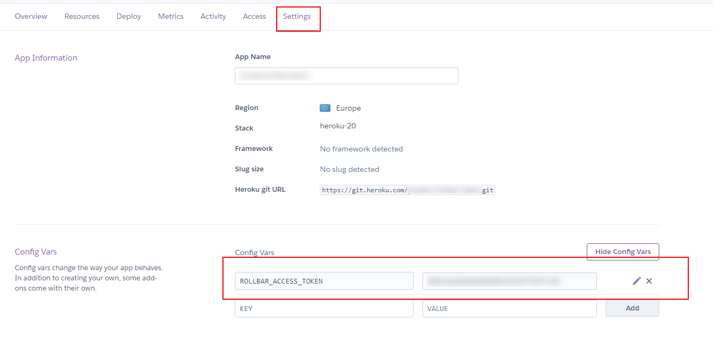
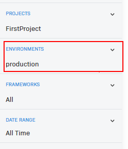

# 03 Deploy heroku

In this example we are going to deploy app to Heroku.

We will start from `02-custom-transport`.

# Steps to build it

`npm install` to install previous sample packages:

```bash
cd front
npm install

```

In a second terminal:

```bash
cd back
npm install

```

Let's update the code for production:

_./back/src/core/logger/logger.ts_

```diff
import { createLogger } from 'winston';
+ import Transport from 'winston-transport';
+ import { envConstants } from 'core/constants';
import { console, file, rollbar } from './transports';

+ let transports: Transport[] = [console, file];
+ if (envConstants.isProduction) {
+   transports = [...transports, rollbar];
+ }

export const logger = createLogger({
- transports: [console, file, rollbar],
+ transports,
});

```

Update Dockerfile to works with api mock, only for demo purpose:

_./Dockerfile_

```diff
...

ENV NODE_ENV=production
ENV STATIC_FILES_PATH=./public
- ENV API_MOCK=false
+ ENV API_MOCK=true
ENV CORS_ORIGIN=false

...
```

We will create a new heroku app:


Create new repository and upload files:

```bash
git init
git remote add origin git@github.com...
git add .
git commit -m "initial commit"
git push -u origin main

```

We need an [auth token](https://devcenter.heroku.com/articles/heroku-cli-commands#heroku-authorizations-create) to login inside Github Action job:

```bash
heroku login
heroku authorizations:create -d <description>
```

> -d: Set a custom authorization description
> -e: Set expiration in seconds (default no expiration)
> `heroku authorizations`: Get auth token list.

Add `Auth token` to git repository secrets:


> [Heroku API KEY storage](https://devcenter.heroku.com/articles/heroku-cli-commands#heroku-authorizations-create)

We will add `HEROKU_APP_NAME` as secret too:


> We need Heroku app name as identifier Heroku deployment.

Run again github actions:


Add heroku env variables:



> Include the `AUTH_SECRET` to get valid JWT token-

Open browser at `https://<app-name>.herokuapp.com/` and run `info`, `warn` and `error` logs.

Check results in rollbar, remember filter by environment:



Checks logs in heroku:

```bash
heroku logs --tail -a <app-name>
```

# ¿Con ganas de aprender Backend?

En Lemoncode impartimos un Bootcamp Backend Online, centrado en stack node y stack .net, en él encontrarás todos los recursos necesarios: clases de los mejores profesionales del sector, tutorías en cuanto las necesites y ejercicios para desarrollar lo aprendido en los distintos módulos. Si quieres saber más puedes pinchar [aquí para más información sobre este Bootcamp Backend](https://lemoncode.net/bootcamp-backend#bootcamp-backend/banner).
