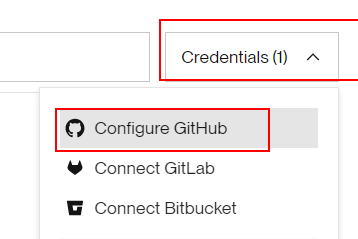
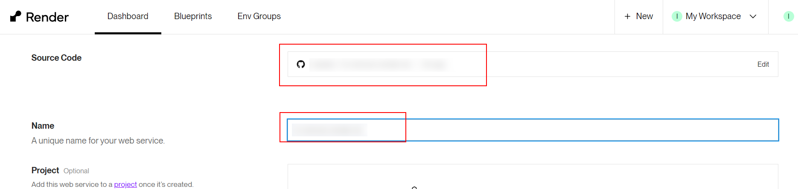
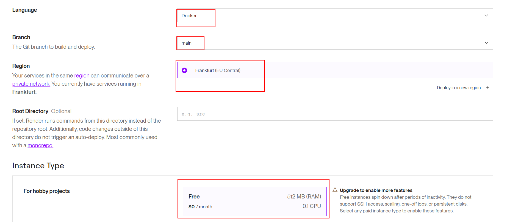
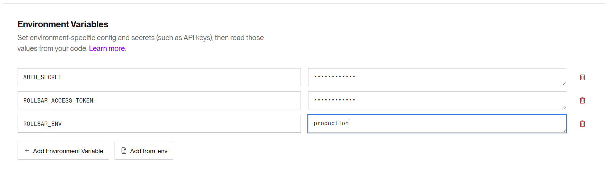
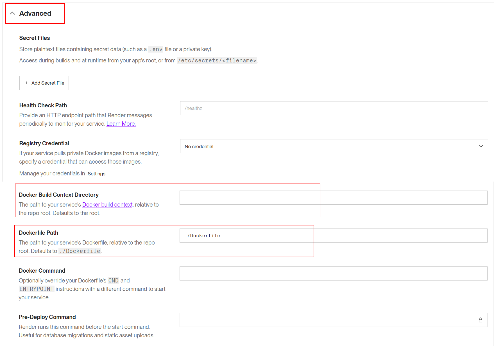
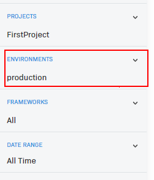
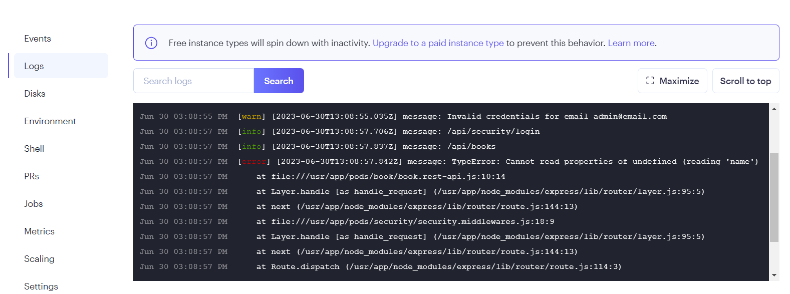

# 03 Deploy Render

In this example we are going to deploy app to `Render`.

We will start from `02-custom-transport`.

# Steps to build it

`npm install` to install previous sample packages:

```bash
cd front
npm install

```

In a second terminal:

```bash
cd back
npm install

```

This `Rollbar` thing is very good, but it is meant to send and store logs from production or pre-production environments. However, in our local environment, it is a bit of a hassle to keep sending logs from localhost. So, we are going to configure it so that logs are only sent to `Rollbar` when we are in production.

_./back/src/core/logger/logger.ts_

```diff
import { createLogger } from 'winston';
+ import Transport from 'winston-transport';
+ import { ENV } from '#core/constants/index.js';
import { console, file, rollbar } from './transports/index.js';

+ let transports: Transport[] = [console, file];
+ if (ENV.IS_PRODUCTION) {
+   transports = [...transports, rollbar];
+ }

export const logger = createLogger({
- transports: [console, file, rollbar],
+ transports,
});

```

Update Dockerfile to works with api mock, only for demo purpose:

_./Dockerfile_

```diff
...

+ ENV NODE_ENV=production
ENV STATIC_FILES_PATH=./public
- ENV IS_API_MOCK=false
+ ENV IS_API_MOCK=true
ENV CORS_ORIGIN=false

...
```

Create new repository and upload files in the `root` path:


```bash
git init
git remote add origin git@github.com...
git add .
git commit -m "initial commit"
git push -u origin main

```

Create a new `Render` app:


Configure account to get access to the new repository:



Configure web service:





Add environment variables (Advanced settings):



Update docker settings:



Clicks on `Create Web Service` button.

Open browser at `https://<app-name>.onrender.com` and run `info`, `warn` and `error` logs.

Check results in rollbar, remember filter by environment:



Checks logs in `Render`:



# ¿Con ganas de aprender Backend?

En Lemoncode impartimos un Bootcamp Backend Online, centrado en stack node y stack .net, en él encontrarás todos los recursos necesarios: clases de los mejores profesionales del sector, tutorías en cuanto las necesites y ejercicios para desarrollar lo aprendido en los distintos módulos. Si quieres saber más puedes pinchar [aquí para más información sobre este Bootcamp Backend](https://lemoncode.net/bootcamp-backend#bootcamp-backend/banner).
