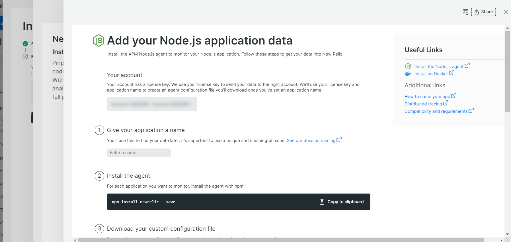
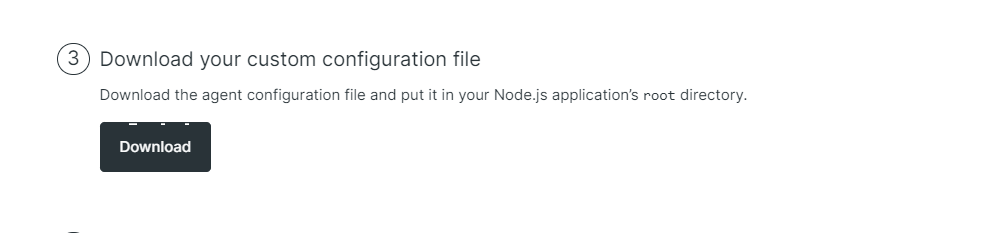
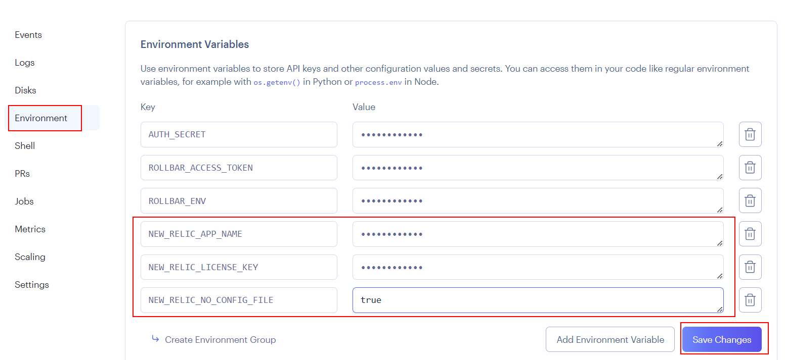
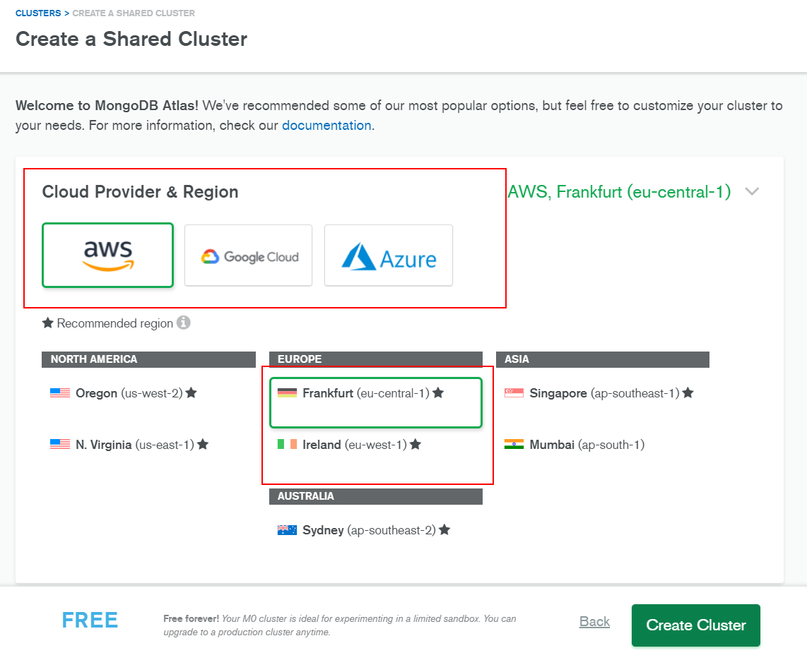
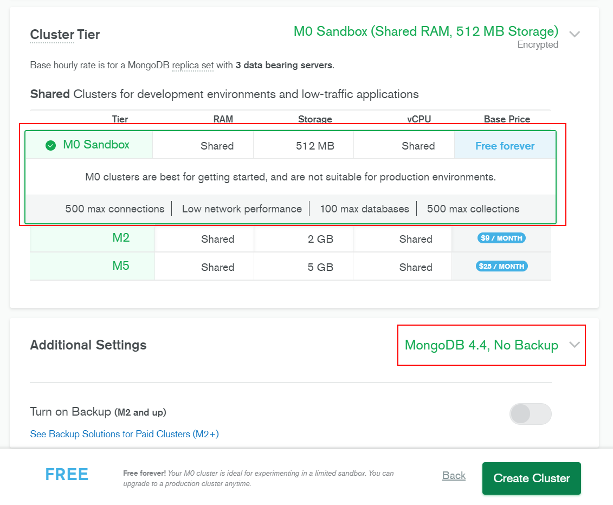
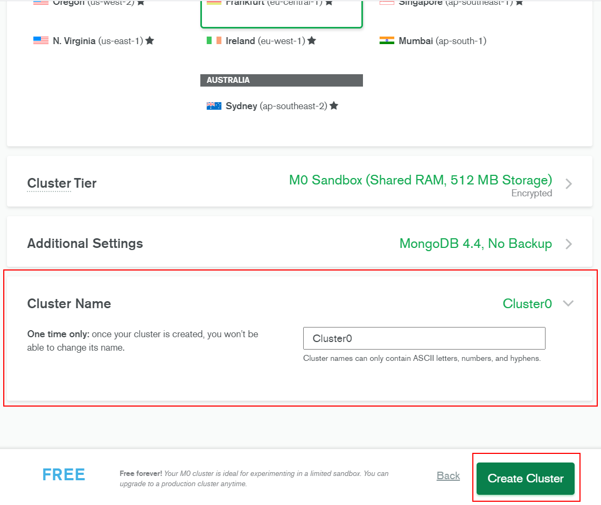
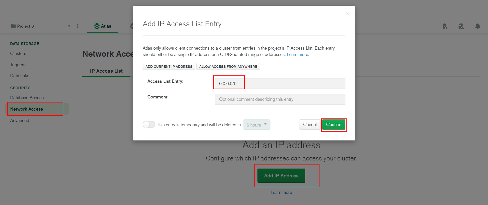
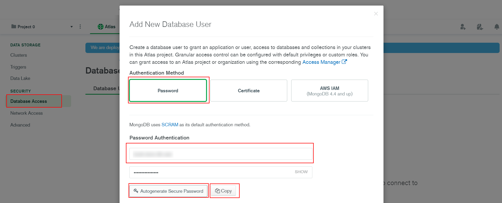
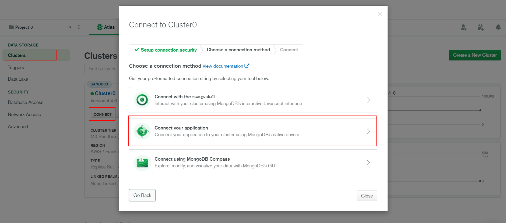
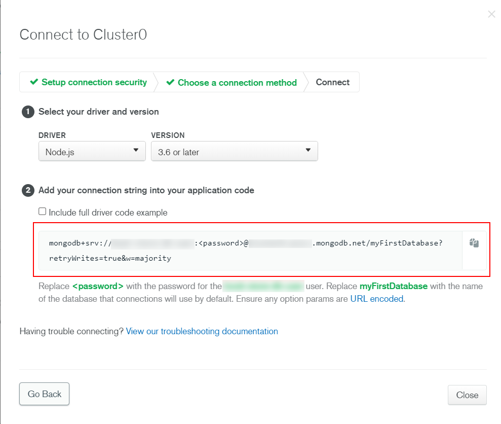

# 04 Monitoring

In this example we are going to monitoring Nodejs app with New Relic.

We will start from `03-deploy-heroku`.

# Steps to build it

`npm install` to install previous sample packages:

```bash
cd front
npm install

```

In a second terminal:

```bash
cd back
npm install

```

In this example, we will monitoring the Nodejs app using [New Relic](https://newrelic.com/), we could create new account in the official web:

Let's create new account:


Click on `APM options` and select NodeJS:


> Copy Account ID and License Key too.

Select `Package manager`:


Select `Node standard installation`:



Give app name:


Install `new relic` in back app:

_back terminal_

```bash
npm install newrelic --save

```

Use it:

_./back/src/index.ts_

```diff
import { config } from 'dotenv';
config();

+ const { envConstants } = require('./core/constants');
+ if (envConstants.isProduction) {
+   require('newrelic');
+ }

require('./app');

```

Let's remove the `unexpected error`:

_./back/src/pods/book/book.rest-api.ts_

```diff
...

booksApi
  .get('/', authorizationMiddleware(), async (req, res, next) => {
    try {
-     const book = undefined;
-     book.name;
      const page = Number(req.query.page);
      const pageSize = Number(req.query.pageSize);
      const bookList = await bookRepository.getBookList(page, pageSize);
      res.send(mapBookListFromModelToApi(bookList));
    } catch (error) {
      next(error);
    }
  })
...
```

`Download your custom configuration file` provided by New Relic to see app token, but instead of added it to the project, we will [configure it using env variables](https://docs.newrelic.com/docs/agents/nodejs-agent/installation-configuration/nodejs-agent-configuration/#exports_config).



We will create these env variables in Heroku:



Deploy new version:

```bash
git add .
git commit -m "configure new relic"
git push

```

Check data in New Relic portal:


If we play with the app, we could check all queries in `Distributed tracing` tab:


If we check `Service map` and `Dependencies` tabs, we could see which external services we are using:


We could check which query consume more clock time in `Transactions` tab:


And server statistics in `Node VMs` tab:


Let's deploy a [MongoDB Atlas](https://www.mongodb.com/cloud/atlas) as we did in `05-cloud > 02-deploy > 03-mongo-deploy` to see MongoDB statistics:


We could select between three providers and different regions:



Select the cluster tier, in this case `M0 Sandbox` which it's a free tier with No backup:



Finally, give a name (if you want) and create the cluster:



This is the main cluster page, where we will see:

- Configure Network Access.
- Configure Database Access.
- See mongo connection URI.
- See collections and documents.


By default, MongoDB Atlas only allows access to configured IPs, let's add a new rule to allow all IPs:



Let's configure database access, adding new user:



> Let's copy the autogenerated password. We will use in the MongoDB Connection URI

Let's copy the `MongoDB Connection URI`:





Update env variable:

_./back/.env_

```diff
...
API_MOCK=true
- MONGODB_URI=mongodb://localhost:27017/book-store
+ MONGODB_URI=mongodb+srv://<user>:<password>@<cluster>.mongodb.net/book-store?retryWrites=true&w=majority
AUTH_SECRET=MY_AUTH_SECRET
...

```

> Replace <user>, <password> and <cluster> with MongoDB Atlas provided values.

And run backend `seed-data` runner:

```bash
npm run start:console-runners

> seed-data

```

Update env variables in Heroku:


Now, if we play with the app, we could see MongoDB statistics:


# ¿Con ganas de aprender Backend?

En Lemoncode impartimos un Bootcamp Backend Online, centrado en stack node y stack .net, en él encontrarás todos los recursos necesarios: clases de los mejores profesionales del sector, tutorías en cuanto las necesites y ejercicios para desarrollar lo aprendido en los distintos módulos. Si quieres saber más puedes pinchar [aquí para más información sobre este Bootcamp Backend](https://lemoncode.net/bootcamp-backend#bootcamp-backend/banner).
