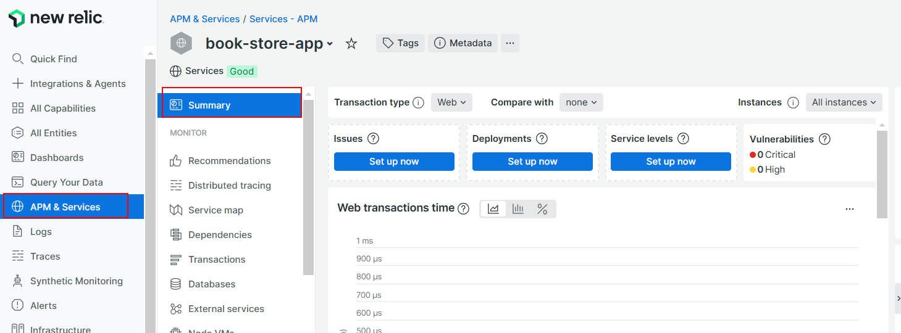
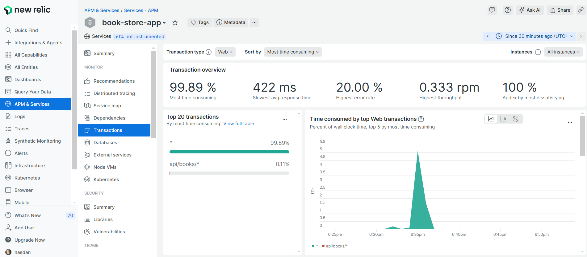

# 04 Monitoring

In this example we are going to monitoring Nodejs app with New Relic.

We will start from `03-deploy-render`.

# Steps to build it

`npm install` to install previous sample packages:

```bash
cd front
npm install

```

In a second terminal:

```bash
cd back
npm install

```

In this example, we will monitoring the Nodejs app using [New Relic](https://newrelic.com/), we could create new account in the official web:

Let's create new account:


Click on `Integrations & Agents` in the left side app bar and select NodeJS:


Select manual installation using a `Package manager`:


Create `new key` (copy the key value in a safe place):


Give app name:


> Click on Continue button.

Install `new relic` in back app:

_back terminal_

```bash
npm install newrelic --save

```

Use it:

_./back/src/core/monitoring.ts_

```javascript
import { ENV } from "#core/constants/index.js";

if (ENV.IS_PRODUCTION) {
  import("newrelic");
}
```

_./back/src/index.ts_

```diff
+ import '#core/monitoring.js';
import express from 'express';
import path from 'node:path';
...

```

Let's remove the `unexpected error`:

_./back/src/pods/book/book.api.ts_

```diff
...

booksApi
  .get('/', async (req, res, next) => {
    try {
-     const book = undefined;
-     book.name;
      const page = Number(req.query.page);
      const pageSize = Number(req.query.pageSize);
      const bookList = await bookRepository.getBookList(page, pageSize);
      res.send(mapBookListFromModelToApi(bookList));
    } catch (error) {
      next(error);
    }
  })
...
```

We will create these env variables in `Render`:


> [New Relic ENV variables](https://docs.newrelic.com/docs/apm/agents/nodejs-agent/installation-configuration/nodejs-agent-configuration/#exports_config)

Deploy new version:

```bash
git add .
git commit -m "configure new relic"
git push

```

Check data in New Relic portal:




If we play with the app, we could check all queries in `Distributed tracing` tab:


If we check `Service map` and `Dependencies` tabs, we could see which external services we are using (in this case the Rollbar service):


We could check which query consume more clock time in `Transactions` tab:



> If you have a database connected to the app, you also can see the queries to the database.

And server statistics in `Node VMs` tab:


# ¿Con ganas de aprender Backend?

En Lemoncode impartimos un Bootcamp Backend Online, centrado en stack node y stack .net, en él encontrarás todos los recursos necesarios: clases de los mejores profesionales del sector, tutorías en cuanto las necesites y ejercicios para desarrollar lo aprendido en los distintos módulos. Si quieres saber más puedes pinchar [aquí para más información sobre este Bootcamp Backend](https://lemoncode.net/bootcamp-backend#bootcamp-backend/banner).
