# 04 Monitorizacion

En este ejemplo vamos a monitorizar una aplicación Nodejs con New Relic.

Tomaremos como punto de partida la muestra `03-deploy-render`.

# Pasos

Si no lo hemos hecho ya, hacemos `npm install` para instalar las dependencias de la muestra:

```bash
cd front
npm install
```

In a second terminal:

```bash
cd back
npm install
```

En este ejemplo, vamos a monitorizar la aplicación Nodejs usando [New Relic](https://newrelic.com/), crearemos una nueva cuenta en la web oficial:


Click en `APM options` y seleccionamos NodeJS:


Seleccionamos `Package manager`:


Seleccionamos `Node standard installation`:


Le damos un nombre a la aplicación:


Instalamos la librería `new relic` en el backend:

_back terminal_

```bash
npm install newrelic --save

```

Y lo usamos..., es super fácil :):

_./back/src/core/monitoring.ts_

```javascript
import { envConstants } from "#core/constants/index.js";

if (envConstants.isProduction) {
  import("newrelic");
}
```

_./back/src/index.ts_

```diff
import '#core/load-env.js';
+ import '#core/monitoring.js';
import express from 'express';
...

```

Eliminamos el castañazo que metimos a proposito en ejemplos anteriores:

_./back/src/pods/book/book.rest-api.ts_

```diff
...

booksApi
  .get('/', authorizationMiddleware(), async (req, res, next) => {
    try {
-     const book = undefined;
-     book.name;
      const page = Number(req.query.page);
      const pageSize = Number(req.query.pageSize);
      const bookList = await bookRepository.getBookList(page, pageSize);
      res.send(mapBookListFromModelToApi(bookList));
    } catch (error) {
      next(error);
    }
  })
...
```

En el portal de newRelic, nos podemos descargar un fichero de configuración personalizado, en el que podemos ver el token de la aplicación, pero en lugar de añadirlo al proyecto, lo configuraremos usando variables de entorno (https://docs.newrelic.com/docs/agents/nodejs-agent/installation-configuration/nodejs-agent-configuration/#exports_config), así evitamos meter datos sensibles en el código.


Creamos estas variables de entorno en `Render`:


Desplegamos nueva versión

```bash
git add .
git commit -m "configure new relic"
git push

```

> Nos salamos el paso `Connect your logs and infrastructure`, porque para una métricas básica no es necesario, pero podéis configurarlo usando una de las dos opciones.

Vamos a ver que sale en New Relic:


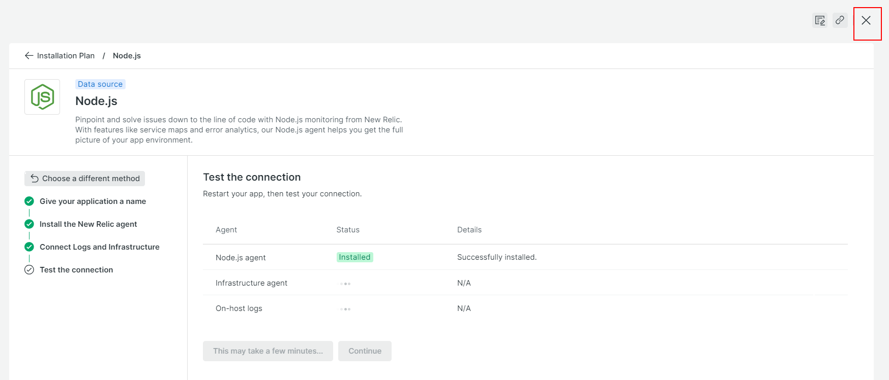

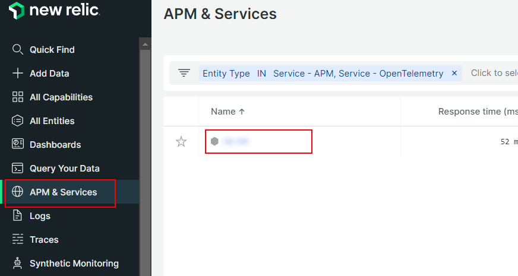

Si jugamos con la aplicación, podemos ver todas las consultas en la pestaña `Distributed tracing`:


Si vamos a la pestaña `Service map` y `Dependencies` podemos ver que servicios externos estamos usando:

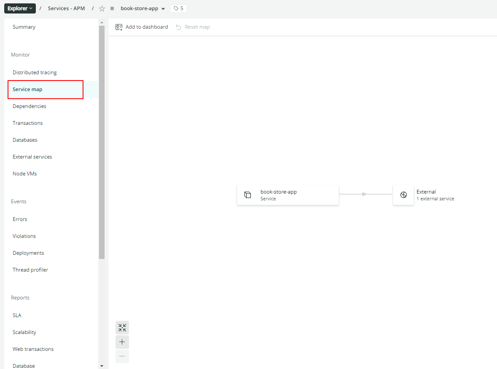


Y podemos ver que consultas consumen más tiempo en la pestaña `Transactions`:


Y las estadísticas del servidor en la pestaña `Node VMs`:


En clase vamos a partir de que ya tenemos una BBDD en mongo.

Si quieres hacerlo tu mismo, aquí tienes los pasos:

Vamos a desplegar una BBDD en la nube, como hicimos en `05-cloud > 02-deploy > 03-mongo-deploy` para ver las estadísticas de mongo:


Seleccionamos el proveedor de nube:


Seleccionamos el tipo de cluster, en este caso `M0 Sandbox` que es gratuito y sin backup:

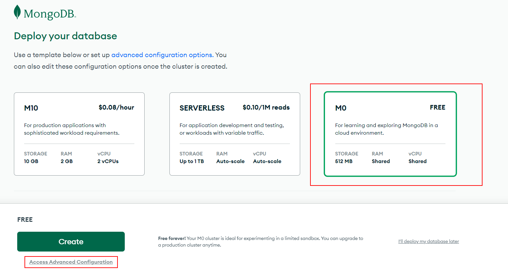

Le damos un nombre (opcional) y creamos el cluster:


Este es el panel principal del cluster, donde podemos ver:

- Configure Network Access.
- Configure Database Access.
- See mongo connection URI.
- See collections and documents.


Por defecto, MongoDB Atlas solo permite el acceso a las IPs configuradas, vamos a añadir una nueva regla para permitir todas las IPs:

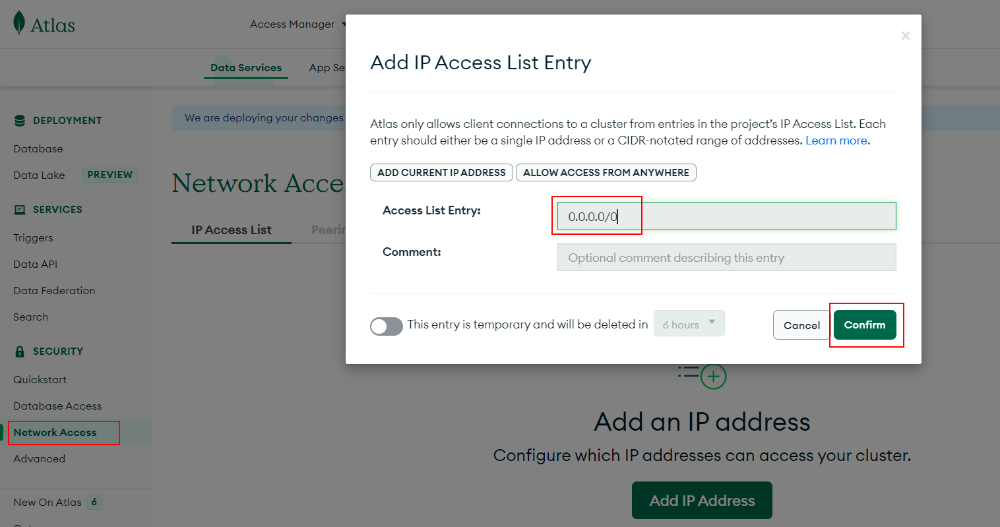

Configuramos el acceso a base de datos, añadiendo un nuevo usuario:


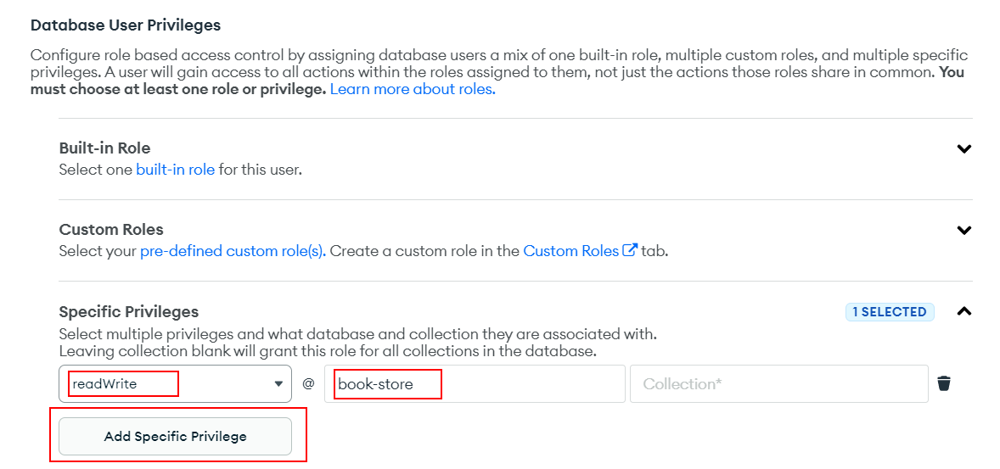

> Copiamos la contraseña autogenerada. La usaremos en la URI de conexión a MongoDB

Copiamos la URI de conexión a MongoDB:

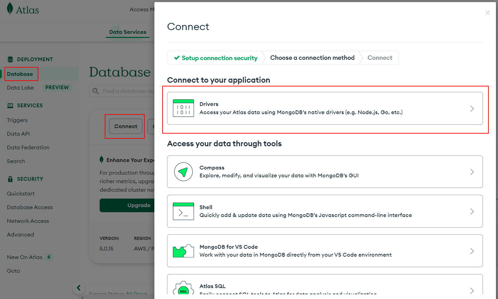

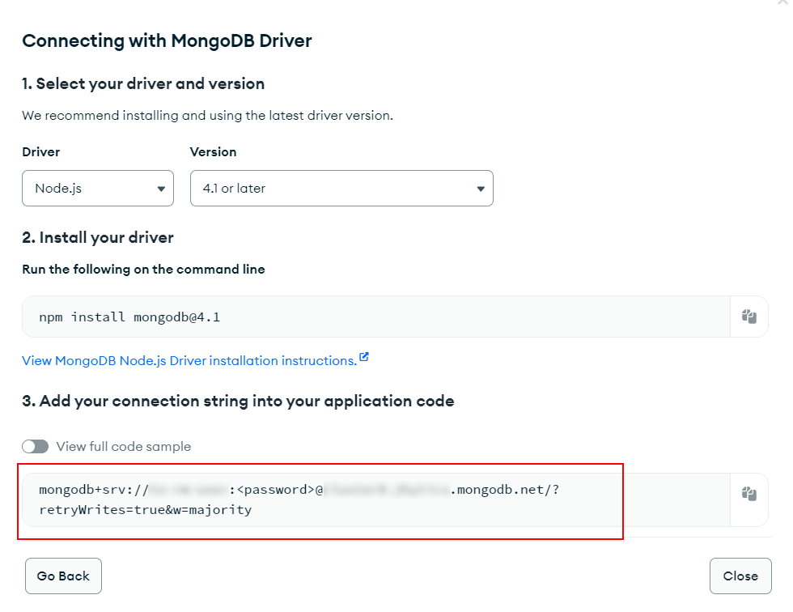

Acualizamos la variable de entorno en local (vamos a ejecutar el runner):

_./back/.env_

```diff
...
API_MOCK=true
- MONGODB_URI=mongodb://localhost:27017/book-store
+ MONGODB_URI=mongodb+srv://<user>:<password>@<cluster>.mongodb.net/book-store?retryWrites=true&w=majority
AUTH_SECRET=MY_AUTH_SECRET
...

```

> Reemplaza `<user>`, `<password>` y `<cluster>` con los valores que te ha proporcionado MongoDB Atlas.

Y ejecuta seed date runner:

```bash
npm run start:console-runners

> seed-data

```

Acualizamos la env variable en `Dockerfile`:

_./Dockerfile_

```diff
...
ENV NODE_ENV=production
ENV STATIC_FILES_PATH=./public
- ENV API_MOCK=true
+ ENV API_MOCK=false
ENV CORS_ORIGIN=false
...
```

Desplegamos nueva versión:

```bash
git add .
git commit -m "update env variables"
git push

```

Actualizamos las variables de entorno en `Render`:

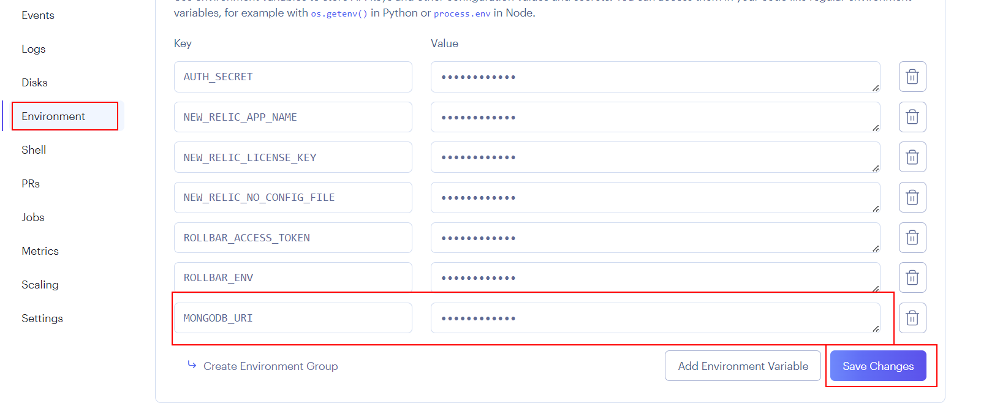

Ahora si jugamos con la aplicación, podemos ver las estadísticas de MongoDB:


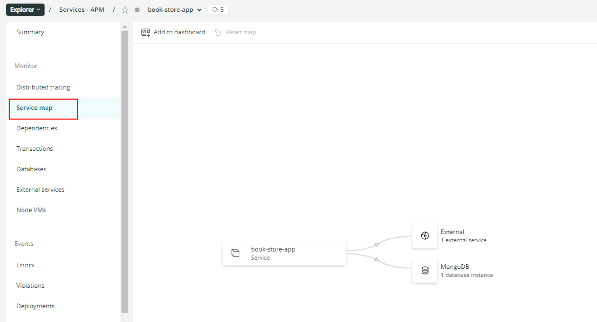

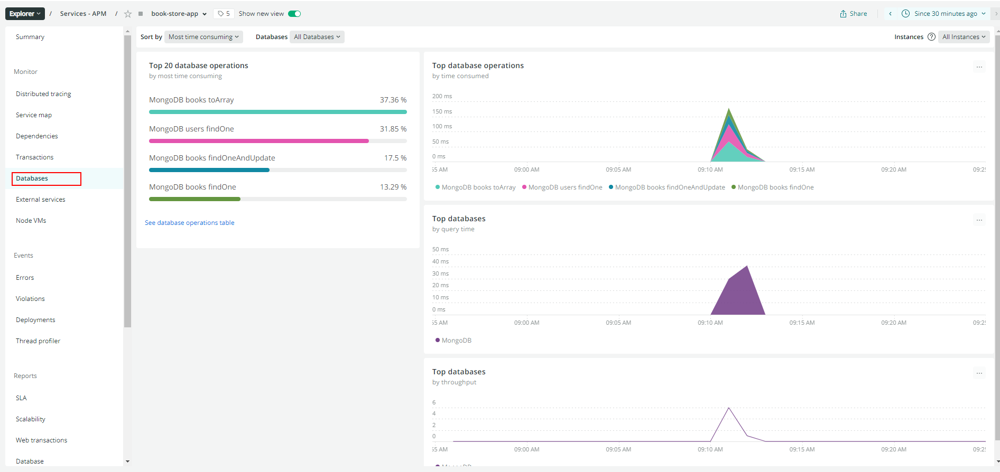

# ¿Con ganas de aprender Backend?

En Lemoncode impartimos un Bootcamp Backend Online, centrado en stack node y stack .net, en él encontrarás todos los recursos necesarios: clases de los mejores profesionales del sector, tutorías en cuanto las necesites y ejercicios para desarrollar lo aprendido en los distintos módulos. Si quieres saber más puedes pinchar [aquí para más información sobre este Bootcamp Backend](https://lemoncode.net/bootcamp-backend#bootcamp-backend/banner).
