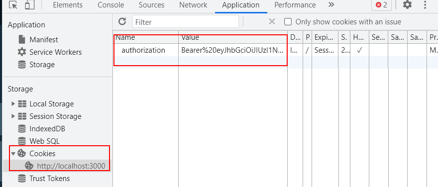

# 05 Auth

In this example we are going to add authentication / authorization with GraphQL.

We will start from `04-migrate-book-api`.

# Steps to build it

`npm install` to install previous sample packages:

```bash
npm install

```

Let's migrate `security` rest api:

_./src/pods/security/graphql/security.type-defs.ts_

```javascript
import { gql } from 'apollo-server-express';

// TODO: Implement Void Custom Scalar Type

export const securityTypeDefs = gql`
  type Mutation {
    login(email: String!, password: String!): Boolean
    logout: Boolean
  }
`;

```

> [Custom Scalar Types](https://www.apollographql.com/docs/apollo-server/schema/custom-scalars/)

Add resolvers:

_./src/pods/security/graphql/security.resolvers.ts_

```javascript
import { IResolvers } from '@graphql-tools/utils';
import { GraphQLResolver } from 'common/models';

interface SecurityResolvers extends IResolvers {
  Mutation: {
    login: GraphQLResolver<void, { email: string; password: string }>;
    logout: GraphQLResolver<void>;
  };
}

export const securityResolvers: SecurityResolvers = {
  Mutation: {
    login: async (_, { email, password }) => {
      console.log({ email, password });
    },
    logout: async () => {},
  },
};

```

Add barrel file:

_./src/pods/security/graphql/index.ts_

```javascript
export * from './security.type-defs';
export * from './security.resolvers';

```

Update barrel file:

_./src/pods/security/index.ts_

```diff
export * from './security.rest-api';
export * from './security.middlewares';
+ export * from './graphql';

```

Move GraphQLResolver to `common-app/models`:

_./src/common-app/models/graphql.ts_

```javascript
import { GraphQLResolveInfo } from 'graphql';

export type GraphQLResolver<ReturnedType, Args = any> = (
  rootObject: any,
  args: Args,
  context: any,
  info: GraphQLResolveInfo
) => Promise<ReturnedType>;

```

Update barrel file:

_./src/common-app/models/index.ts_

```diff
export * from './user-session';
export * from './role';
+ export * from './graphql';

```

Update `book resolvers`:

_./src/pods/book/graphql/book.resolvers.ts_

```diff
import { UserInputError } from 'apollo-server-express';
- import { GraphQLResolveInfo } from 'graphql';
import { IResolvers } from '@graphql-tools/utils';
+ import { GraphQLResolver } from 'common-app/models';
import { logger } from 'core/logger';
import { bookRepository } from 'dals';
import { Book } from '../book.api-model';
import {
  mapBookListFromModelToApi,
  mapBookFromModelToApi,
  mapBookFromApiToModel,
} from '../book.mappers';
import { paginateBookList } from '../book.helpers';

- // TODO: Move to common/models/graphql.model.ts
- // Add more types when needed
- type GraphQLResolver<ReturnedType, Args = any> = (
-   rootObject: any,
-   args: Args,
-   context: any,
-   info: GraphQLResolveInfo
- ) => Promise<ReturnedType>;

...

```

Update app:

```diff
...
import { booksApi, bookTypeDefs, bookResolvers } from 'pods/book';
import {
  securityApi,
  authenticationMiddleware,
+ securityTypeDefs,
+ securityResolvers,
} from 'pods/security';
import { userApi } from 'pods/user';

(async function () {
  const restApiServer = createRestApiServer();
  const graphqlServer = await createGraphQLServer(restApiServer, {
-   typeDefs: bookTypeDefs,
+   typeDefs: [bookTypeDefs, securityTypeDefs],
-   resolvers: bookResolvers,
+   resolvers: [bookResolvers, securityResolvers],
  });
```

Why throw the error `Error: There can be only one type named "Mutation"`? Because we are defining twice the `Mutation` type. We should define only once and `extend` it:

_./src/core/servers/graphql.server.ts_

```diff
import {
  ApolloServer,
  ApolloServerExpressConfig,
+ gql,
} from 'apollo-server-express';
+ import { DocumentNode } from 'graphql';

+ // NOTE: We cannot defined empty type.
+ const coreTypeDefs = gql`
+   type Query {
+     _empty: String
+   }
+
+   type Mutation {
+     _empty: String
+   }
+ `;

export const createGraphQLServer = async (
  expressApp,
  config: ApolloServerExpressConfig
) => {
+ const typeDefs = Array.isArray(config.typeDefs)
+   ? (config.typeDefs as DocumentNode[])
+   : ([config.typeDefs] as DocumentNode[]);

- const graphqlServer = new ApolloServer(config);
+ const graphqlServer = new ApolloServer({
+   ...config,
+   typeDefs: [coreTypeDefs, ...typeDefs],
+ });
  await graphqlS
  await graphqlServer.start();

  graphqlServer.applyMiddleware({ app: expressApp });
  return graphqlServer;
};

```

Update `type-defs`:

_./src/pods/book/graphql/book.type-defs.ts_

```diff
...

- type Query {
+ extend type Query {
    books(page: Int, pageSize: Int): [Book!]!
    book(id: ID!): Book!
  }
...

- type Mutation {
+ extend type Mutation {
    saveBook(book: BookInput!): Book!
    deleteBook(id: ID!): Boolean!
  }
`;

```

_./src/pods/security/graphql/security.type-defs.ts_

```diff
import { gql } from 'apollo-server-express';

// TODO: Implement Void Custom Scalar Type

export const securityTypeDefs = gql`
- type Mutation {
+ extend type Mutation {
    login(email: String!, password: String!): Boolean
    logout: Boolean
  }
`;

```

Let's implement the `login` method:

_./src/pods/security/graphql/security.resolvers.ts_

```diff
import { IResolvers } from '@graphql-tools/utils';
+ import jwt from 'jsonwebtoken';
- import { GraphQLResolver } from 'common-app/models';
+ import { GraphQLResolver, UserSession } from 'common-app/models';
+ import { envConstants } from 'core/constants';
+ import { userRepository } from 'dals';

interface SecurityResolvers extends IResolvers {
  Mutation: {
    login: GraphQLResolver<void, { email: string; password: string }>;
    logout: GraphQLResolver<void>;
  };
}

export const securityResolvers: SecurityResolvers = {
  Mutation: {
    login: async (_, { email, password }) => {
-     console.log({ email, password });
+     const user = await userRepository.getUserByEmailAndPassword(
+       email,
+       password
+     );
+     if (user) {
+       const userSession: UserSession = {
+         id: user._id.toHexString(),
+         role: user.role,
+       };
+       const token = jwt.sign(userSession, envConstants.AUTH_SECRET, {
+         expiresIn: '1d',
+         algorithm: 'HS256',
+       });
+     }
    },
    logout: async () => {},
  },
};

```

How could I get `res` object to set a cookie? We could use [GraphQL Context](https://www.apollographql.com/docs/apollo-server/data/resolvers/#the-context-argument) for that:

_./src/common-app/models/graphql.ts_

```diff
import { GraphQLResolveInfo } from 'graphql';
+ import { Request, Response } from 'express';

+ export interface GraphQLContext {
+   req: Request;
+   res: Response;
+ }

export type GraphQLResolver<ReturnedType, Args = any> = (
  rootObject: any,
  args: Args,
- context: any,
+ context: GraphQLContext,
  info: GraphQLResolveInfo
) => Promise<ReturnedType>;

```

_./src/app.ts_

```diff
import express from 'express';
import path from 'path';
+ import { GraphQLContext } from 'common-app/models';
import {
  createRestApiServer,
  connectToDBServer,
  createGraphQLServer,
} from 'core/servers';

...

(async function () {
  const restApiServer = createRestApiServer();
  const graphqlServer = await createGraphQLServer(restApiServer, {
    typeDefs: [bookTypeDefs, securityTypeDefs],
    resolvers: [bookResolvers, securityResolvers],
+   context: async ({ req, res }): Promise<GraphQLContext> => ({
+     req,
+     res,
+   }),
  });

...
```

Update security resolver:

_./src/pods/security/graphql/security.resolvers.ts_

```diff
import { IResolvers } from '@graphql-tools/utils';
import jwt from 'jsonwebtoken';
+ import { UserInputError } from 'apollo-server-express';
 import { GraphQLResolver, UserSession } from 'common-app/models';
import { envConstants } from 'core/constants';
+ import { logger } from 'core/logger';
import { userRepository } from 'dals'

...

export const securityResolvers: SecurityResolvers = {
  Mutation: {
-   login: async (_, { email, password }) => {
+   login: async (_, { email, password }, context) => {
      const user = await userRepository.getUserByEmailAndPassword(
        email,
        password
      );
      if (user) {
        const userSession: UserSession = {
          id: user._id.toHexString(),
          role: user.role,
        };
        const token = jwt.sign(userSession, envConstants.AUTH_SECRET, {
          expiresIn: '1d',
          algorithm: 'HS256',
        });
+       context.res.cookie('authorization', `Bearer ${token}`, {
+         httpOnly: true,
+         secure: envConstants.isProduction,
+       });
      }
    },
...
```

Configure previous playground to works with cookies:

```bash
npm install apollo-server-core --save
```

_./src/core/servers/graphql.server.ts_

```diff
import {
  ApolloServer,
  ApolloServerExpressConfig,
  gql,
} from 'apollo-server-express';
import { DocumentNode } from 'graphql';
+ import {
+   ApolloServerPluginLandingPageGraphQLPlayground,
+   ApolloServerPluginLandingPageDisabled,
+ } from 'apollo-server-core';
+ import { envConstants } from 'core/constants';

// NOTE: We cannot defined empty type.
const coreTypeDefs = gql`
  type Query {
    _empty: String
  }

  type Mutation {
    _empty: String
  }
`;

export const createGraphQLServer = async (
  expressApp,
  config: ApolloServerExpressConfig
) => {
  const typeDefs = Array.isArray(config.typeDefs)
    ? (config.typeDefs as DocumentNode[])
    : ([config.typeDefs] as DocumentNode[]);

  const graphqlServer = new ApolloServer({
    ...config,
    typeDefs: [coreTypeDefs, ...typeDefs],
+   plugins: [
+     envConstants.isProduction
+       ? ApolloServerPluginLandingPageDisabled()
+       : ApolloServerPluginLandingPageGraphQLPlayground(),
+   ],
  });
  await graphqlServer.start();

  graphqlServer.applyMiddleware({ app: expressApp });
  return graphqlServer;
};


```

Configure playground to `include` credentials:


Example invalid credentials query:

```graphql
mutation {
  login(email: "test@email.com", password: "test")
}
```

Example valid credentials query:

```graphql
mutation {
  login(email: "admin@email.com", password: "test")
}
```



Implement `logout`:

_./src/pods/security/graphql/security.resolvers.ts_

```diff
...

-   logout: async () => {
+   logout: async (_, __, context) => {
+     // NOTE: We cannot invalidate token using jwt libraries.
+     // Different approaches:
+     // - Short expiration times in token
+     // - Black list tokens on DB
+     context.res.clearCookie('authorization');
    },
```

How could we securize routes? We could use [GraphQL custom directives](https://www.apollographql.com/docs/apollo-server/schema/directives/):

_./src/pods/security/graphql/security.type-defs.ts_

```diff
import { gql } from 'apollo-server-express';

// TODO: Implement Void Custom Scalar Type

export const securityTypeDefs = gql`
+ directive @isAuthenticated on FIELD_DEFINITION

  extend type Mutation {
    login(email: String!, password: String!): Boolean
-   logout: Boolean
+   logout: Boolean @isAuthenticated
  }
`;

```

> [GraphQL Directives](http://spec.graphql.org/June2018/#sec-Type-System.Directives)

Implement directive:

_./src/pods/security/graphql/security.directives.ts_

```javascript
import { AuthenticationError } from 'apollo-server-express';
import { DirectiveResolverFn, IDirectiveResolvers } from '@graphql-tools/utils';
import { GraphQLContext, UserSession } from 'common-app/models';
import { verifyJWT } from 'common/helpers';
import { envConstants } from 'core/constants';

interface SecurityDirectives extends IDirectiveResolvers {
  isAuthenticated: DirectiveResolverFn<any, GraphQLContext>;
}

export const securityDirectives: SecurityDirectives = {
  isAuthenticated: async (next, source, args, context) => {
    try {
      const [, token] = context.req.cookies.authorization?.split(' ') || [];
      const userSession = await verifyJWT<UserSession>(
        token,
        envConstants.AUTH_SECRET
      );
      context.userSession = userSession;
      return next();
    } catch (error) {
      throw new AuthenticationError(error);
    }
  },
};

```

Update barrel file:

_./src/pods/security/graphql/index.ts_

```diff
export * from './security.type-defs';
export * from './security.resolvers';
+ export * from './security.directives';

```

Update `context`:

_./src/common-app/models/graphql.ts_

```diff
import { GraphQLResolveInfo } from 'graphql';
import { Request, Response } from 'express';
+ import { UserSession } from './user-session';

export interface GraphQLContext {
  req: Request;
  res: Response;
+ userSession: UserSession;
}

export type GraphQLResolver<ReturnedType, Args = any> = (
  rootObject: any,
  args: Args,
  context: GraphQLContext,
  info: GraphQLResolveInfo
) => Promise<ReturnedType>;

```

How could we provide custom directives? Checking [official docs](https://www.apollographql.com/docs/apollo-server/migration/#schemadirectives):

_./src/core/servers/graphql.server.ts_

```diff
import {
  ApolloServer,
  ApolloServerExpressConfig,
  gql,
} from 'apollo-server-express';
import { DocumentNode } from 'graphql';
+ import {
+   makeExecutableSchema,
+   IExecutableSchemaDefinition,
+ } from '@graphql-tools/schema';
...

export const createGraphQLServer = async (
  expressApp,
+ schemaOptions: IExecutableSchemaDefinition,
  config: ApolloServerExpressConfig,
) => {
- const typeDefs = Array.isArray(config.typeDefs)
-   ? (config.typeDefs as DocumentNode[])
-   : ([config.typeDefs] as DocumentNode[]);
+ const typeDefs = Array.isArray(schemaOptions.typeDefs)
+   ? (schemaOptions.typeDefs as DocumentNode[])
+   : ([schemaOptions.typeDefs] as DocumentNode[]);

  const graphqlServer = new ApolloServer({
    ...config,
-   typeDefs: [coreTypeDefs, ...typeDefs],
+   schema: makeExecutableSchema({
+     ...schemaOptions,
+     typeDefs: [coreTypeDefs, ...typeDefs],
+   }),
    plugins: [
      envConstants.isProduction
        ? ApolloServerPluginLandingPageDisabled()
        : ApolloServerPluginLandingPageGraphQLPlayground(),
    ],
  });
  await graphqlServer.start();

  graphqlServer.applyMiddleware({ app: expressApp });
  return graphqlServer;
};

```

Update app:

_./src/app.ts_

```diff
...
import {
  securityApi,
  authenticationMiddleware,
  securityTypeDefs,
  securityResolvers,
+ securityDirectives,
} from 'pods/security';
import { userApi } from 'pods/user';

(async function () {
  const restApiServer = createRestApiServer();
- const graphqlServer = await createGraphQLServer(restApiServer, {
-   typeDefs: [bookTypeDefs, securityTypeDefs],
-   resolvers: [bookResolvers, securityResolvers],
-   context: async ({ req, res }): Promise<GraphQLContext> => ({
-     req,
-     res,
-   }),
- });
+ const graphqlServer = await createGraphQLServer(
+   restApiServer,
+   {
+     typeDefs: [bookTypeDefs, securityTypeDefs],
+     resolvers: [bookResolvers, securityResolvers],
+     directiveResolvers: securityDirectives,
+   },
+   {
+     context: async ({ req, res }): Promise<GraphQLContext> => ({
+       req,
+       res,
+     }),
+   }
+ );

...
```

Check `logout` method with / without cookie.

Now we could authenticate books queries:

_./src/pods/book/graphql/book.type-defs.ts_

```diff
import { gql } from 'apollo-server-express';

export const bookTypeDefs = gql`
  type Book {
    id: String!
    title: String!
    releaseDate: String!
    author: String!
  }

  extend type Query {
-   books(page: Int, pageSize: Int): [Book!]!
+   books(page: Int, pageSize: Int): [Book!]! @isAuthenticated
-   book(id: ID!): Book!
+   book(id: ID!): Book! @isAuthenticated
  }

  input BookInput {
    id: String
    title: String!
    releaseDate: String!
    author: String!
  }

  extend type Mutation {
-   saveBook(book: BookInput!): Book!
+   saveBook(book: BookInput!): Book! @isAuthenticated
-   deleteBook(id: ID!): Boolean!
+   deleteBook(id: ID!): Boolean! @isAuthenticated
  }
`;

```

As exercise you could create the `authorize` directive to provide `allowedRoles`.

# ¿Con ganas de aprender Backend?

En Lemoncode impartimos un Bootcamp Backend Online, centrado en stack node y stack .net, en él encontrarás todos los recursos necesarios: clases de los mejores profesionales del sector, tutorías en cuanto las necesites y ejercicios para desarrollar lo aprendido en los distintos módulos. Si quieres saber más puedes pinchar [aquí para más información sobre este Bootcamp Backend](https://lemoncode.net/bootcamp-backend#bootcamp-backend/banner).
