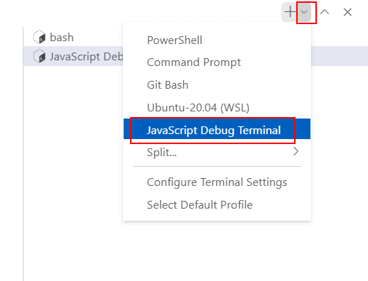

# 03 Debugging

In this example we are going to add setup needed to support debugging with VS Code.

We will start from `02-simple-routing`.

# Steps to build it

`npm install` to install previous sample packages:

```bash
npm install

```

Using `JavaScript Debug Terminal`:



And run the command:

```bash
npm start

```

- The old-fashioned way option is adding debug `launch.json` in VS Code:


_./.vscode/launch.json_

```json
{
  "version": "0.2.0",
  "configurations": [
    {
      "type": "node",
      "request": "launch",
      "name": "Launch Program",
      "skipFiles": ["<node_internals>/**"],
      "program": "${workspaceFolder}\\src\\index.ts",
      "outFiles": ["${workspaceFolder}/**/*.js"]
    }
  ]
}
```

> Maybe you have to disable `usePreview` flag on VSCode settings.
> `"debug.javascript.usePreview": false`

Now it appears `Launch Program` option to run it.

# ¿Con ganas de aprender Backend?

En Lemoncode impartimos un Bootcamp Backend Online, centrado en stack node y stack .net, en él encontrarás todos los recursos necesarios: clases de los mejores profesionales del sector, tutorías en cuanto las necesites y ejercicios para desarrollar lo aprendido en los distintos módulos. Si quieres saber más puedes pinchar [aquí para más información sobre este Bootcamp Backend](https://lemoncode.net/bootcamp-backend#bootcamp-backend/banner).
