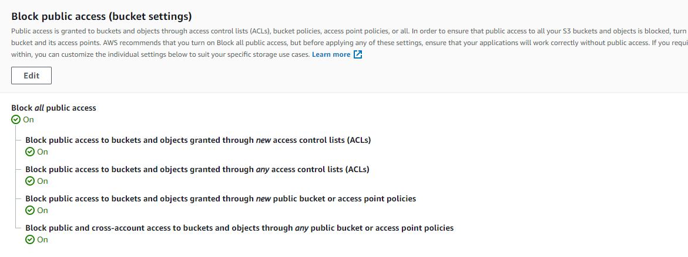
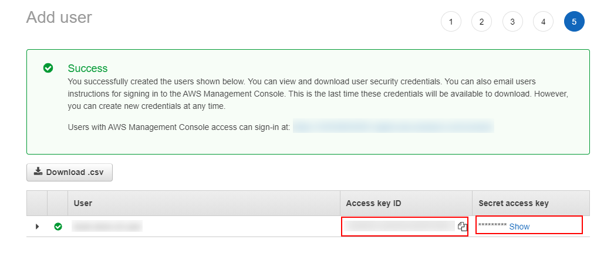

# 03 S3 SDK

In this example we are going to learn how to work with `aws-sdk`.

We will start from `02-s3-portal`.

# Steps to build it

`npm install` to install previous sample packages:

```bash
cd front
npm install

```

In a second terminal:

```bash
cd back
npm install

```

We are going to install the official [aws-sdk v3](https://github.com/aws/aws-sdk-js-v3) library. In the v3, it was published different packages to npm for example for [s3-client](https://www.npmjs.com/package/@aws-sdk/client-s3):

```bash
npm install @aws-sdk/client-s3 --save

```

> NOTE: You could have the previous v2 version in [this repository](https://github.com/aws/aws-sdk-js)

Let's try this library in `console-runner`:

_./back/src/console-runners/s3.runner.ts_

```diff
+ import { S3Client } from '@aws-sdk/client-s3';

export const run = async () => {
+ const client = new S3Client({ region: 'eu-west-3' });
}

```

But how could we provide credentials for our S3 bucket? We will follow the second approach previously commented in `02-s3-portal` example and we will make bucket and objects as private and create custom user with credentials:

**Bucket policy**

Remove bucket policy

```diff
- {
-   "Version":"2012-10-17",
-   "Statement":[
-     {
-       "Sid":"PublicRead",
-       "Effect":"Allow",
-       "Principal": "*",
-       "Action":["s3:GetObject","s3:GetObjectVersion"],
-       "Resource":["arn:aws:s3:::DOC-EXAMPLE-BUCKET/*"]
-     }
-   ]
- }

```

**Block public access (bucket settings)**

Enable it:



Create user with bucket persmissions in [IAM service](https://aws.amazon.com/iam/):


Add user name and access type:


Set `S3 Full Access` permissions:


We will skip `step 3` (Add tags). It could be usefull for user information, like email or some info to indentify this user.

In the `final step`, Amazon provides us the `Access key ID` and `Secret access key`. We will store this credentials to use in the app:



We have several ways to [setting credentials in node.js](https://docs.aws.amazon.com/sdk-for-javascript/v2/developer-guide/setting-credentials-node.html) like using [shared credentials file](https://docs.aws.amazon.com/sdk-for-javascript/v2/developer-guide/loading-node-credentials-shared.html) or [env variables](https://docs.aws.amazon.com/sdk-for-javascript/v2/developer-guide/loading-node-credentials-environment.html), we will implement the last one:

_./back/.env.example_

```diff
NODE_ENV=development
PORT=3000
STATIC_FILES_PATH=../public
CORS_ORIGIN=*
CORS_METHODS=GET,POST,PUT,DELETE
API_MOCK=true
MONGODB_URI=mongodb://localhost:27017/book-store
AUTH_SECRET=MY_AUTH_SECRET
+ AWS_ACCESS_KEY_ID=value
+ AWS_SECRET_ACCESS_KEY=value

```

_./back/.env_

```diff
NODE_ENV=development
PORT=3000
STATIC_FILES_PATH=../public
CORS_ORIGIN=*
CORS_METHODS=GET,POST,PUT,DELETE
API_MOCK=true
MONGODB_URI=mongodb://localhost:27017/book-store
AUTH_SECRET=MY_AUTH_SECRET
+ AWS_ACCESS_KEY_ID=<use-real-values>
+ AWS_SECRET_ACCESS_KEY=<use-real-values>

```

> NOTE: Replace <use-real-values> with values provided by Amazon.
>
> We don't need to use this env variables in constants file because the SDK automatically detects AWS credentials set as variables in your environment and uses them for SDK requests
>
> A session token is required only if you manually specify temporary security credentials.

List objects from s3 bucket:

_./back/src/console-runners/s3.runner.ts_

```diff
- import { S3Client } from '@aws-sdk/client-s3';
+ import { S3Client, ListObjectsCommand } from '@aws-sdk/client-s3';

export const run = async () => {
+ try {
    const client = new S3Client({ region: 'eu-west-3' });
+   const bucket = 'bucket-name';
+   const command = new ListObjectsCommand({
+     Bucket: bucket,
+   });
+   const data = await client.send(command);
+   console.log({ data });
+ } catch (error) {
+   console.error(error);
+ }
};

```

> [V3 docs page](https://docs.aws.amazon.com/AWSJavaScriptSDK/v3/latest/index.html)
>
> [S3 v3 docs page](https://docs.aws.amazon.com/AWSJavaScriptSDK/v3/latest/clients/client-s3/index.html)

Run with `debug terminal` in back project:

```bash
npm run start:console-runners

```

Get image:

_./back/src/console-runners/s3.runner.ts_

```diff
import {
  S3Client,
  ListObjectsCommand,
+ GetObjectCommand,
} from '@aws-sdk/client-s3';
+ import fs from 'fs';
+ import { Readable } from 'stream';
+ import path from 'path';

export const run = async () => {
  try {
    const client = new S3Client({ region: 'eu-west-3' });
    const bucket = 'bucket-name';
-   const command = new ListObjectsCommand({
+   const command = new GetObjectCommand({
      Bucket: bucket,
+     Key: 'admin-avatar-in-s3.png',
    });
    const data = await client.send(command);
    console.log({ data });

+   const image = data.Body as Readable;
+   const destination = fs.createWriteStream(
+     path.resolve(__dirname, './test.png')
+   );
+   image.pipe(destination);
  } catch (error) {
    console.error(error);
  }
};

```

> [fs createWriteStream](https://nodejs.org/dist/latest-v14.x/docs/api/fs.html#fs_fs_createwritestream_path_options)


Upload image, for example, copy inside `console-runners` the `99-resources/user-avatar-in-s3.png` image:

_./back/src/console-runners/s3.runner.ts_

```diff
import {
  S3Client,
  ListObjectsCommand,
  GetObjectCommand,
+ PutObjectCommand,
} from '@aws-sdk/client-s3';
import fs from 'fs';
import { Readable } from 'stream';
import path from 'path';

export const run = async () => {
  try {
    const client = new S3Client({ region: 'eu-west-3' });
    const bucket = 'bucket-name';
+   const fileName = 'user-avatar-in-s3.png';
+   const imageStream = fs.createReadStream(path.resolve(__dirname, fileName));
-   const command = new GetObjectCommand({
+   const command = new PutObjectCommand({
      Bucket: bucket,
-     Key: 'admin-avatar-in-s3.png',
+     Key: fileName,
+     Body: imageStream,
    });
    const data = await client.send(command);
    console.log({ data });

-   const image = data.Body as Readable;
-   const destination = fs.createWriteStream(
-     path.resolve(__dirname, './test.png')
-   );
-   image.pipe(destination);
  } catch (error) {
    console.error(error);
  }
};

```

# ¿Con ganas de aprender Backend?

En Lemoncode impartimos un Bootcamp Backend Online, centrado en stack node y stack .net, en él encontrarás todos los recursos necesarios: clases de los mejores profesionales del sector, tutorías en cuanto las necesites y ejercicios para desarrollar lo aprendido en los distintos módulos. Si quieres saber más puedes pinchar [aquí para más información sobre este Bootcamp Backend](https://lemoncode.net/bootcamp-backend#bootcamp-backend/banner).
