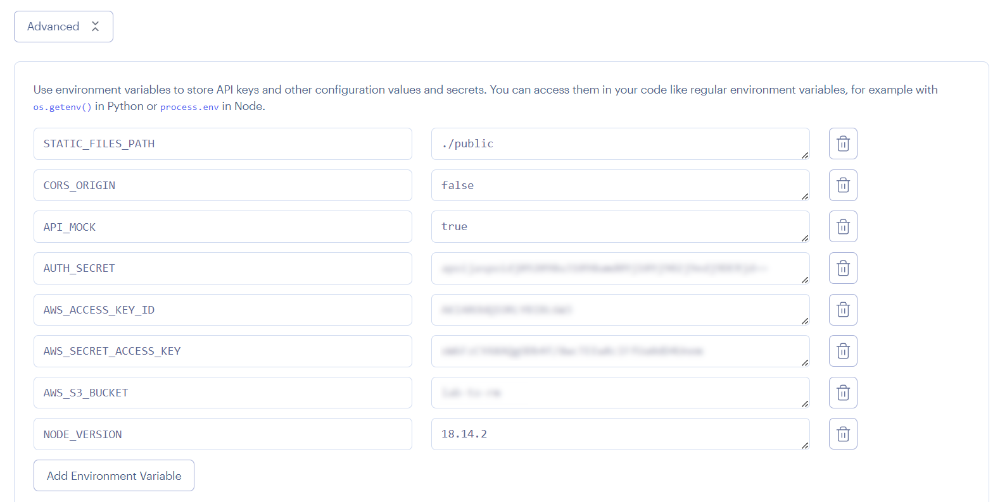

# 02 Manual render deploy

In this example we are going to learn how to deploy app to render manually.

We will start from `01-production-bundle`.

# Steps to build it

`npm install` to install previous sample packages:

```bash
cd front
npm install

```

In a second terminal:

```bash
cd back
npm install

```

[Render](https://render.com/) is a cloud provider that allows you to deploy different types of apps based on git repository changes.

First, we need to prepare the final files that we want to deploy, let's build the front project:

_front terminal_

```bash
npm run build

```

Let's copy the `front/dist` folder in the `back/public` folder.

Build the back project:

_back terminal_

```bash
npm run build

```

Now we have something like:

_./back_

```
|-- config/
|-- dist/
|-- node_module/
|-- public/
|-- src/
|-- ...
|-- package-lock.json
|-- package.json

```

Let's create a new empty repository to deploy our app placing the builded files:


- Clone repository:

```bash
git clone git@github.com...

```

Let's copy all necessary files:

- `back/dist` folder content.
- `back/public` folder.
- `back/package.json` file. Let's copy and update with necessary dependencies.

_./package.json_

```diff
{
  "name": "bootcamp-backend",
  "version": "1.0.0",
  "description": "",
  "main": "index.js",
  "type": "module",
  "scripts": {
-   "prestart": "sh ./create-dev-env.sh && npm run clean && npm run build:dev",
-   "start": "run-p -l build:watch start:dev start:local-db",
-   "start:dev": "nodemon dist/index",
-   "prestart:console-runners": "npm run prestart",
-   "start:console-runners": "run-p -l build:watch start:local-db console-runners",
-   "console-runners": "nodemon --no-stdin dist/console-runners/index",
-   "start:local-db": "docker-compose up -d",
-   "clean": "rimraf dist",
-   "build": "npm run clean && tsc --project tsconfig.prod.json",
-   "build:dev": "tsc --outDir dist",
-   "build:watch": "npm run build:dev -- --watch --preserveWatchOutput",
-   "test": "cross-env MONGO_MEMORY_SERVER_FILE=jest-mongodb-config.cjs jest -c ./config/test/jest.js",
-   "test:watch": "npm run test -- --watchAll -i"
+   "start": "node index.js"
  },
  "imports": {
-   "#common/*.js": "./dist/common/*.js",
+   "#common/*.js": "./common/*.js",
-   "#common-app/*.js": "./dist/common-app/*.js",
+   "#common-app/*.js": "./common-app/*.js",
-   "#core/*.js": "./dist/core/*.js",
+   "#core/*.js": "./core/*.js",
-   "#dals/*.js": "./dist/dals/*.js",
+   "#dals/*.js": "./dals/*.js",
-   "#pods/*.js": "./dist/pods/*.js"
+   "#pods/*.js": "./pods/*.js"
  },
  "keywords": [],
  "author": "",
  "license": "ISC",
  "dependencies": {
    "@aws-sdk/client-s3": "^3.281.0",
    "@aws-sdk/s3-request-presigner": "^3.282.0",
    "cookie-parser": "^1.4.6",
    "cors": "^2.8.5",
    "dotenv": "^16.0.3",
    "express": "^4.18.2",
    "jsonwebtoken": "^8.5.1",
    "mongodb": "^4.12.1"
- },
+ }
- "devDependencies": {
-   "@shelf/jest-mongodb": "^4.1.4",
-   "@types/cookie-parser": "^1.4.3",
-   "@types/cors": "^2.8.13",
-   "@types/express": "^4.17.14",
-   "@types/inquirer": "^9.0.3",
-   "@types/jest": "^29.2.4",
-   "@types/jsonwebtoken": "^8.5.9",
-   "@types/supertest": "^2.0.12",
-   "cross-env": "^7.0.3",
-   "inquirer": "^9.1.4",
-   "jest": "^29.3.1",
-   "npm-run-all": "^4.1.5",
-   "rimraf": "^3.0.2",
-   "supertest": "^6.3.3",
-   "ts-jest": "^29.0.3",
-   "typescript": "^4.9.3"
- }
}

```

Result:

```
|- common/
|- common-app/
|- core/
|- dals/
|- pods/
|- public/
|- index.js
|- package.json

```

Deploy it:

```bash
git add .
git commit -m "deploy app"
git push -u origin main

```

Create a new render app:


Configure web service:


Add environment variables (Advanced settings):



> [Specifying a Node Version in Render](https://render.com/docs/node-version)

Clicks on `Create Web Service` button.

After the successful deploy, open `https://<app-name>.onrender.com`.

# ¿Con ganas de aprender Backend?

En Lemoncode impartimos un Bootcamp Backend Online, centrado en stack node y stack .net, en él encontrarás todos los recursos necesarios: clases de los mejores profesionales del sector, tutorías en cuanto las necesites y ejercicios para desarrollar lo aprendido en los distintos módulos. Si quieres saber más puedes pinchar [aquí para más información sobre este Bootcamp Backend](https://lemoncode.net/bootcamp-backend#bootcamp-backend/banner).
