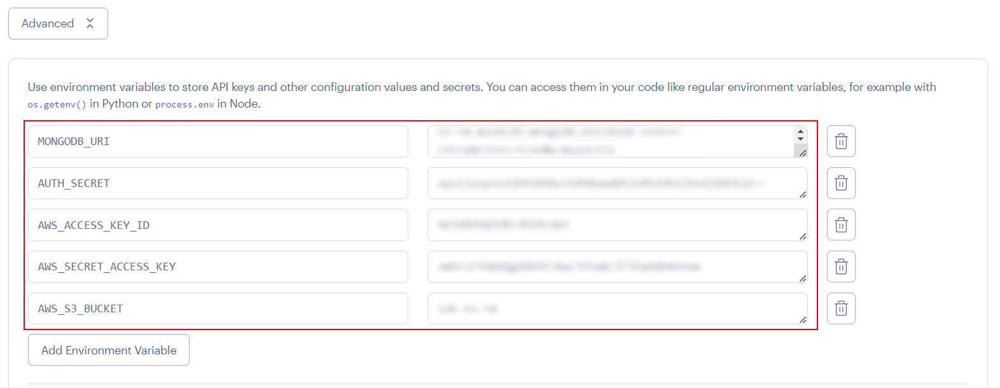

# 08 Automatic Heroku deploy

In this example we are going to deploy app to Heroku using Docker

We will start from `07-upload-docker-image`.

# Steps to build it

`npm install` to install previous sample packages:

```bash
cd front
npm install

```

In a second terminal:

```bash
cd back
npm install

```

<!-- First, we will create a new heroku app:


Then we will use `Github Actions` as pipeline to deploy the app to Heroku and we will need:

- Download Heroku cli
- Credentials to login in Heroku
- Build Docker image
- Push image to internal Heroku registry. -->

Create new repository and upload files:


```bash
git init
git remote add origin git@github.com...
git add .
git commit -m "initial commit"
git push -u origin main

```

Create a new render app:


Configure account to get access to the new repository:


Configure web service:


Add environment variables (Advanced settings):



Update docker settings:


Clicks on `Create Web Service` button.

The deployed app is working! But it's in `API MOCK mode` and the _PORT_ is wrong, let's configure the env variables:

_./Dockerfile_

```diff
...

- EXPOSE 3001
- ENV PORT=3001
ENV STATIC_FILES_PATH=./public
- ENV API_MOCK=true
+ ENV API_MOCK=false
- ENV AUTH_SECRET=MY_AUTH_SECRET
+ ENV CORS_ORIGIN=false
...

```

Upload changes:

```bash
git add .
git commit -m "update env variables"
git push

```

After the successful deploy, open `https://<app-name>.onrender.com`.

# ¿Con ganas de aprender Backend?

En Lemoncode impartimos un Bootcamp Backend Online, centrado en stack node y stack .net, en él encontrarás todos los recursos necesarios: clases de los mejores profesionales del sector, tutorías en cuanto las necesites y ejercicios para desarrollar lo aprendido en los distintos módulos. Si quieres saber más puedes pinchar [aquí para más información sobre este Bootcamp Backend](https://lemoncode.net/bootcamp-backend#bootcamp-backend/banner).
