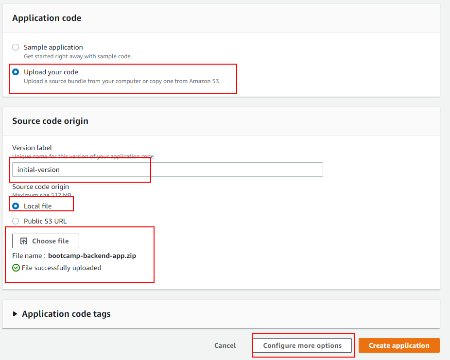
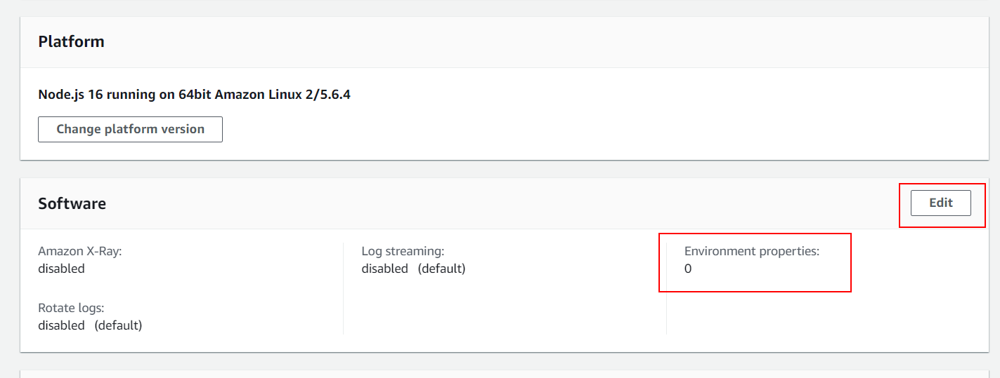
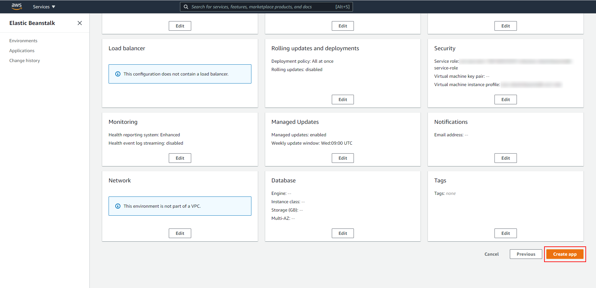
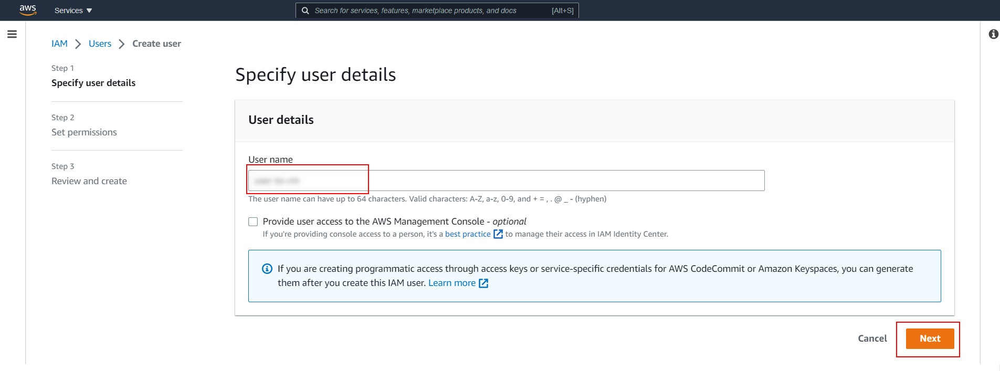
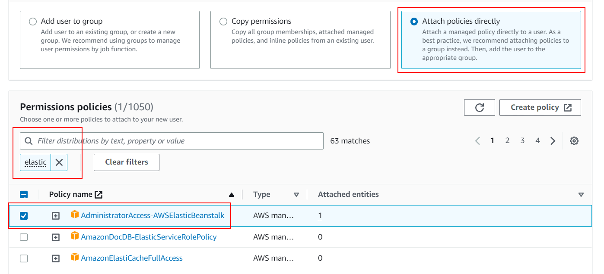
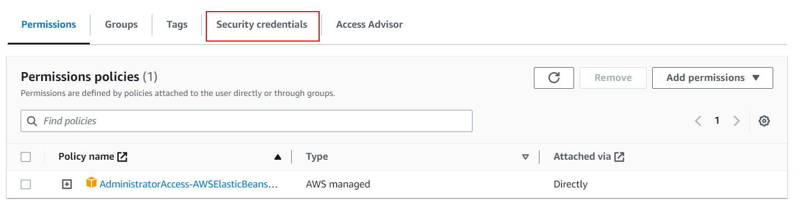
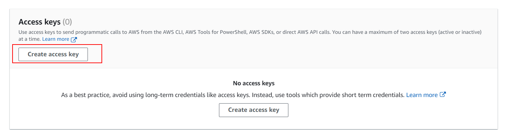
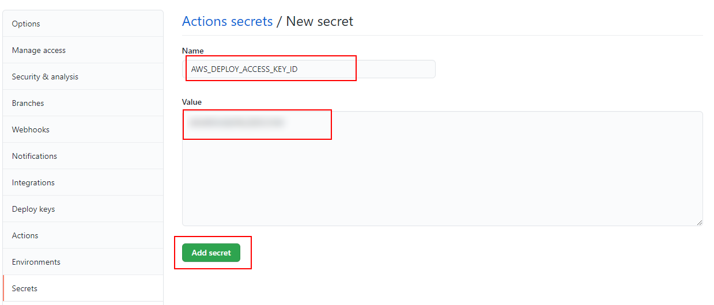

# 10 Automatic AWS deploy

In this example we are going to deploy app to AWS.

We will start from `08-auto-heroku-deploy`.

# Steps to build it

`npm install` to install previous sample packages:

```bash
cd front
npm install

```

In a second terminal:

```bash
cd back
npm install

```

First, we will create a new `Elastic Beanstalk` app:


Give a name:


Choose Docker platform


Create `zip` file:


Update code:



Let's add `env variables`:




> NOTE: Since aws security group was configured only with HTTP inbound rule, we have to set `NODE_ENV` equals `development` to avoid create Cookie with secure flag.

Create app:



> Now AWS supports Docker multi-stage builds [since Feb 2022](https://docs.aws.amazon.com/elasticbeanstalk/latest/relnotes/release-2022-02-03-linux.html)
> As second approach using [`docker-compose` to be executed by Amazon](https://docs.aws.amazon.com/elasticbeanstalk/latest/dg/single-container-docker-configuration.html)

> `Not include docker-compose`, only for info purpose

_./docker-compose.yml_

```yml
version: "3.8"
services:
  app:
    container_name: app
    build: .
    ports:
      - "80:80"
    env_file:
      - .env
```
>

Why did we get an error when deploy it? We could take more info in logs:


> Check file `./var/log/eb-engine.log`
>
> [ERROR] An error occurred during execution of command [app-deploy] - [Run Docker Container]. Stop running the command. Error: no EXPOSE directive found in Dockerfile, abort deployment 

Update `Dockerfile` to use `PORT=80` like it's declared in `EC2 > Security Groups > Inbound rules`:

_./Dockerfile_

```diff
...
+ EXPOSE 80
+ ENV PORT=80
ENV STATIC_FILES_PATH=./public
ENV API_MOCK=false
ENV CORS_ORIGIN=false
...

```

Then we will use `Github Actions` as pipeline to deploy the app to AWS and we will need:

- Credentials to login in AWS with `Elastic Beanstalk` permissions
- AWS login
- Upload zipped code with Dockerfile to auto-generated S3 bucket for `Elastic Beanstalk`
- Push image to internal Heroku registry.

Remove `./.github/workflows/cd.yml` content:

```diff
name: CD Workflow

on:
  push:
    branches:
      - main

- env:
-   IMAGE_NAME: ghcr.io/${{github.repository}}:${{github.run_number}}-${{github.run_attempt}}

- permissions:
-   contents: 'read'
-   packages: 'write'

jobs:
  cd:
    runs-on: ubuntu-latest
    steps:
      - name: Checkout repository
        uses: actions/checkout@v3

-     - name: Log in to GitHub container registry
-       uses: docker/login-action@v2
-       with:
-         registry: ghcr.io
-         username: ${{ github.actor }}
-         password: ${{ secrets.GITHUB_TOKEN }}

-     - name: Build and push docker image
-       run: |
-         docker build -t ${{env.IMAGE_NAME}} .
-         docker push ${{env.IMAGE_NAME}}

-     - name: Deploy to Azure
-       uses: azure/webapps-deploy@v2
-       with:
-         app-name: ${{ secrets.AZURE_APP_NAME }}
-         publish-profile: ${{ secrets.AZURE_PUBLISH_PROFILE }}
-         images: ${{env.IMAGE_NAME}}

```

Create new repository and upload files:

```bash
git init
git remote add origin https://github.com/...
git add .
git commit -m "initial commit"
git push -u origin main

```

We need create user with `Elastic Beanstalk` persmissions in [IAM service](https://aws.amazon.com/iam/):





Set `Admin Elastic Beanstalk` permissions:



We create the user in `step 3` (Review and create). It almost done, we need to create some credentials to use in our app.

Let's select the new user and click on `Security credentials`



Scroll down and click on `Create access key`:



Select the use case:


Skips the optional step (description tag).

In the `final step`, Amazon provides us the `Access key ID` and `Secret access key`. We will store this credentials to use it:


Add credentials as Github secrets:





Also we need to set as secrets:

- AWS_EB_APP_NAME: same name as we set to `Elastic Beanstalk` app.
- AWS_EB_ENV_NAME: environment name that `Elastic Beanstalk` provides for our app.
- AWS_REGION: for example `eu-west-3`.
- AWS_DEPLOY_S3_BUCKET: auto-generated bucket by `Elastic Beanstalk`.


Let's upate the `Github Actions`:

_./.github/workflows/cd.yml_

```diff
name: CD Workflow

on:
  push:
    branches:
      - main

+ env:
+   APP_VERSION_LABEL: ${{ secrets.AWS_EB_APP_NAME }}-${{github.run_number}}-${{github.run_attempt}}

jobs:
  cd:
    runs-on: ubuntu-latest
    steps:
      - name: Checkout repository
        uses: actions/checkout@v3

+     - name: AWS login
+       uses: aws-actions/configure-aws-credentials@v1
+       with:
+         aws-access-key-id: ${{ secrets.AWS_DEPLOY_ACCESS_KEY_ID }}
+         aws-secret-access-key: ${{ secrets.AWS_DEPLOY_SECRET_ACCESS_KEY }}
+         aws-region: ${{ secrets.AWS_REGION }}

+     - name: Upload files to S3
+       run: |
+         zip -r ${{ env.APP_VERSION_LABEL }}.zip * .dockerignore
+         aws s3 cp ${{ env.APP_VERSION_LABEL }}.zip s3://${{ secrets.AWS_DEPLOY_S3_BUCKET }}/${{ env.APP_VERSION_LABEL }}.zip

```
> Needs `*` to include all files
>
> Needs `.dockerignore` to include hidden files like `.dockerignore`
>
> Or `.*` to include all hidden files
>
> [Default Github Env](https://docs.github.com/en/actions/reference/environment-variables#default-environment-variables)
>
> [aws-actions/configure-aws-credentials@v1](https://github.com/aws-actions/configure-aws-credentials)
>
> [Github Actions Virtual Machine tools](https://github.com/actions/virtual-environments/blob/ubuntu20/20210216.1/images/linux/Ubuntu2004-README.md)
>
> [AWS cli s3](https://awscli.amazonaws.com/v2/documentation/api/latest/reference/s3/index.html)

Add `deploy` steps:

_./.github/workflows/cd.yml_

```diff
...
      - name: Upload files to S3
        run: |
          zip -r ${{ env.APP_VERSION_LABEL }}.zip * .dockerignore
          aws s3 cp ${{ env.APP_VERSION_LABEL }}.zip s3://${{ secrets.AWS_DEPLOY_S3_BUCKET }}/${{ env.APP_VERSION_LABEL }}.zip

+     - name: Create EB App version
+       run: aws elasticbeanstalk create-application-version --application-name ${{ secrets.AWS_EB_APP_NAME }} --version-label ${{ env.APP_VERSION_LABEL }} --source-bundle S3Bucket=${{ secrets.AWS_DEPLOY_S3_BUCKET }},S3Key=${{ env.APP_VERSION_LABEL }}.zip --no-auto-create-application

+     - name: Update environment
+       run: aws elasticbeanstalk update-environment --environment-name ${{ secrets.AWS_EB_ENV_NAME }} --version-label ${{ env.APP_VERSION_LABEL }}

```

> [AWS cli elasticbeanstalk](https://awscli.amazonaws.com/v2/documentation/api/latest/reference/elasticbeanstalk/index.html)

Upload changes:

```bash
git add .
git commit -m "update github action"
git push

```

# ¿Con ganas de aprender Backend?

En Lemoncode impartimos un Bootcamp Backend Online, centrado en stack node y stack .net, en él encontrarás todos los recursos necesarios: clases de los mejores profesionales del sector, tutorías en cuanto las necesites y ejercicios para desarrollar lo aprendido en los distintos módulos. Si quieres saber más puedes pinchar [aquí para más información sobre este Bootcamp Backend](https://lemoncode.net/bootcamp-backend#bootcamp-backend/banner).
