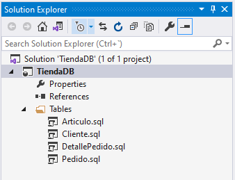

# Proyectos de Bases de Datos

Necesitamos alguna herramienta o forma de trabajar que nos permita gestionar los cambios sobre la estructura de nuestras bases de datos, sobre todo si trabajamos sobre **diferentes entornos (desarrollo, test, producción...)** que es lo habitual. **¿Cómo promocionamos los cambios en nuestra estructura de datos por los diferentes entornos?**

Imaginemos que estamos haciendo cambio sobre nuestro producto para incluir nuevas funcionalidades o modificar las ya existentes, y se va a ver afectado con 2 tablas nuevas, y cambios en 20 tablas con nuevas columnas... ¿Cómo nos aseguramos que, una vez finalizado el desarrollo, hacemos los mismos cambios en los entornos superiores y en el entorno real de producción?

Una forma eficaz de controlar qué cambios debemos realizar sobre los distintos entornos es crear nuestra estructura sobre un proyecto de base de datos. Para esto utilizaremos Visual Studio.

## Crear proyecto

1. Abrimos Visual Studio (en nuestro caso 2019 Community, pero podríamos utilizar otras versiones).
2. Seleccionamos _Create new project > SQL Server Database Project_
3. Asignamos un nombre (para el ejemplo, **TiendaDB**) y una ruta:
   

## Añadir tablas

Vamos a añadir a nuestro proyecto, dentro de una nueva carpeta _Tables_, las tablas que componen nuestra base de datos, con el mismo diagrama que el utilizado en el [ejemplo anterior](../03-create-tables):


1. Desde el _Solution Explorer_ añadimos una nueva carpeta _Tables_ haciendo click derecho sobre el nombre del proyecto y seleccionando _Add > New folder_.
2. Dentro de esta nueva carpeta, con el click derecho del ratón, seleccionaremos _Add > Table_.
3. Asignamos el nombre de nuestra primera tabla _Cliente_:
   

4. Añadimos la definición de los nuevos campos (utilizando el diseñador o el editor de T-SQL):

   ```sql
   CREATE TABLE [dbo].[Cliente]
   (
   	[Id] INT NOT NULL IDENTITY(1, 1) PRIMARY KEY,
   	[Nombre] VARCHAR(50) NOT NULL,
   	[Apellidos] VARCHAR(75) NOT NULL,
   	[Movil] VARCHAR(12) NOT NULL,
   	[Email] VARCHAR(100) NOT NULL,
   )
   ```

   

5. Siguiendo el mismo proceso, creamos la definición del resto de tablas:

   ```sql
   CREATE TABLE [dbo].[Articulo]
   (
   	[Id] INT NOT NULL IDENTITY(1, 1) PRIMARY KEY,
   	[Nombre] VARCHAR(150) NOT NULL,
   	[Descripcion] VARCHAR(MAX) NOT NULL
   )
   ```

   ```sql
   CREATE TABLE [dbo].[Pedido]
   (
   	[Id] INT NOT NULL IDENTITY(1, 1) PRIMARY KEY,
   	[ClienteId] INT NOT NULL,
       [Creado] DATETIME NOT NULL ,
       CONSTRAINT [FK_Pedido_Cliente] FOREIGN KEY ([ClienteId]) REFERENCES [Cliente]([Id]),
   )
   ```

   ```sql
   CREATE TABLE [dbo].[DetallePedido]
   (
   	[Id] INT NOT NULL IDENTITY(1, 1) PRIMARY KEY,
   	[PedidoId] INT NOT NULL,
   	[ArticuloId] INT NOT NULL,
   	[Precio] DECIMAL(12, 2) NOT NULL,
       CONSTRAINT [FK_DetallePedido_Pedido] FOREIGN KEY ([PedidoId]) REFERENCES [Pedido]([Id]),
       CONSTRAINT [FK_DetallePedido_Articulo] FOREIGN KEY ([ArticuloId]) REFERENCES [Articulo]([Id]),
   )
   ```

   Una vez creadas, nuestro proyecto tendrá la siguiente estructura:

   
