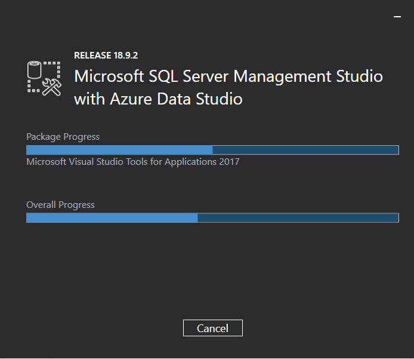

# Herramientas

Necesitamos instalar las siguientes herramientas:

- **SQL Server Management Studio (SSMS) y Azure Data Studio** (ambas incluidas en el mismo instalador disponible en [este enlace](https://docs.microsoft.com/es-es/sql/ssms/download-sql-server-management-studio-ssms?view=sql-server-ver15)).
- **Visual Studio**, para los ejemplos de proyectos de bases de datos. Podemos descargar una versión _Community_ de _Visual Studio 2019_ desde [este enlace](https://visualstudio.microsoft.com/es/vs/community/)

Una vez instaladas las herramientas, podemos continuar con los siguientes ejemplos del repositorio.
