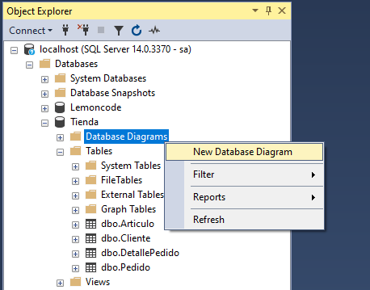
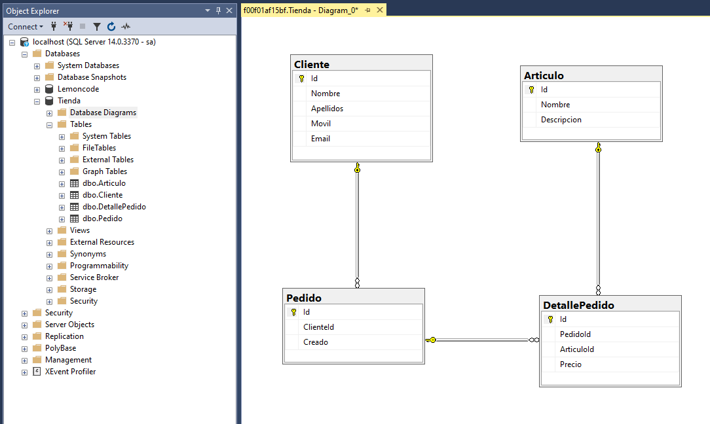
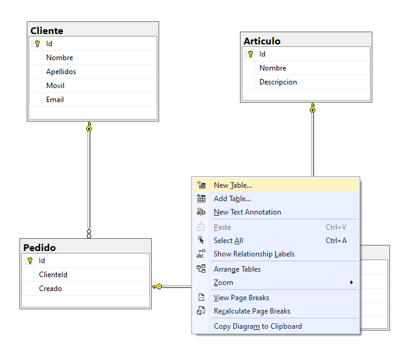
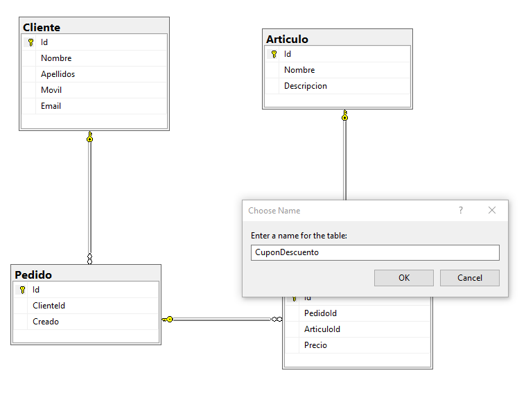
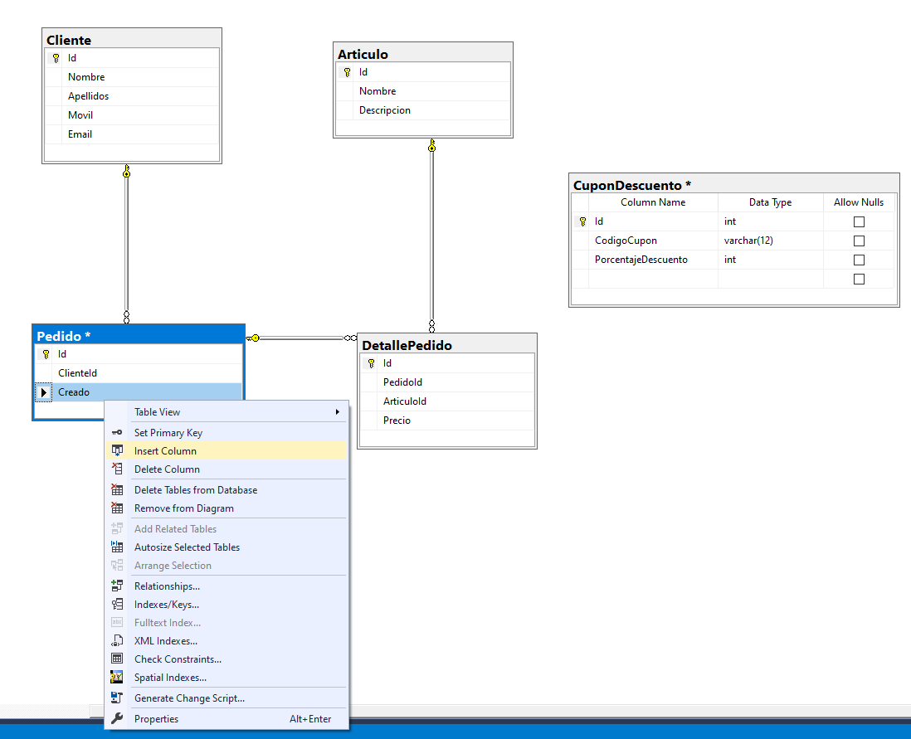
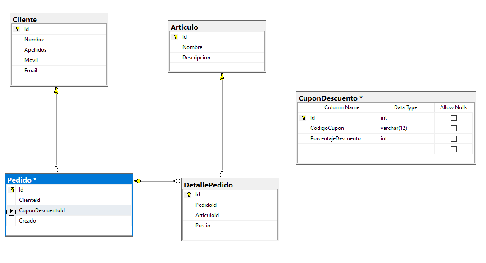
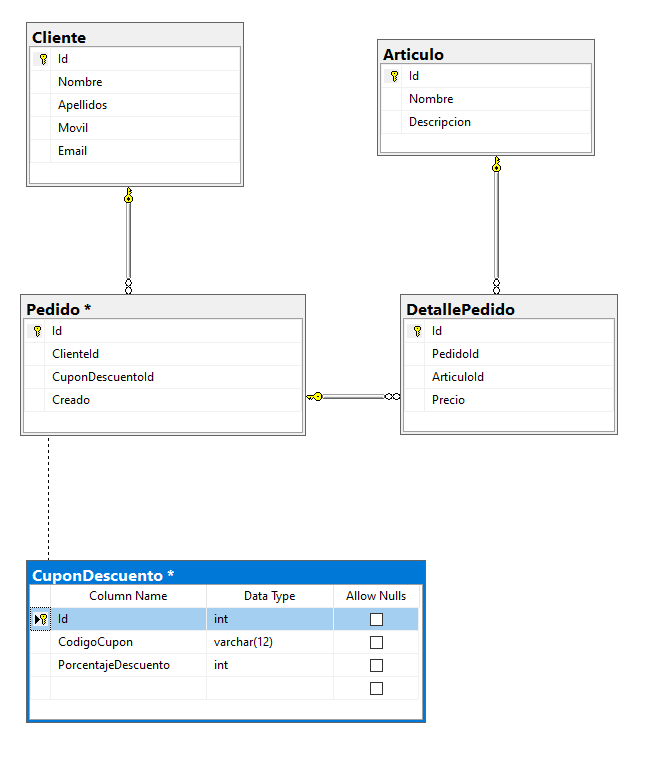
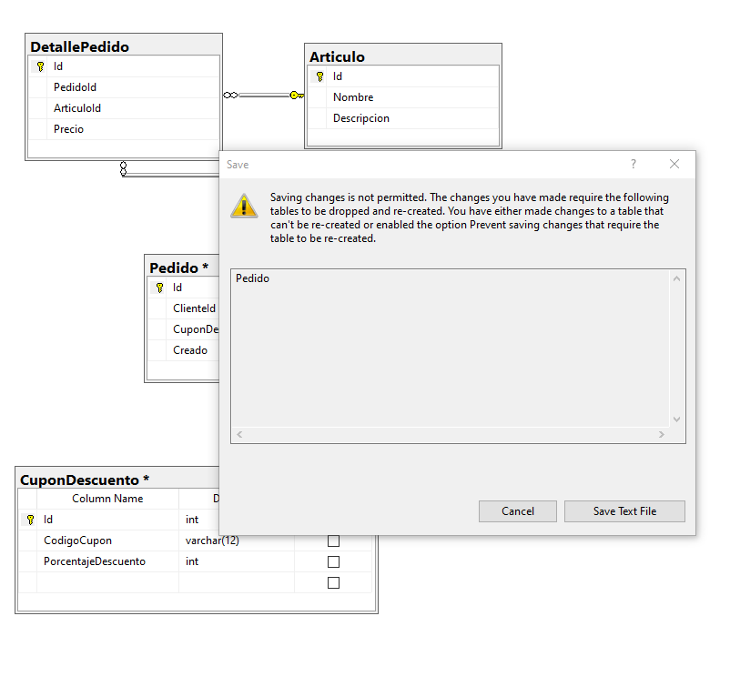

# Tienda Online: Base de Datos

Vamos a crear una estructura básica de tablas para una base de datos de una tienda online, donde tendremos persistencia de datos como los clientes, artículos, y pedidos.

El diagrama que crearemos se corresponde con el siguiente:


Para ello crearemos una nueva base de datos (la llamaremos _Tienda_). A continuación crearemos las tablas con el siguiente _script_ (utilizaremos el _scheme_ por defecto _dbo_):

```sql
CREATE TABLE dbo.Cliente
(
	Id INT NOT NULL IDENTITY(1, 1) PRIMARY KEY,
	Nombre VARCHAR(50) NOT NULL,
	Apellidos VARCHAR(75) NOT NULL,
	Movil VARCHAR(12) NOT NULL,
	Email VARCHAR(100) NOT NULL,
);
GO

CREATE TABLE dbo.Articulo
(
	Id INT NOT NULL IDENTITY(1, 1) PRIMARY KEY,
	Nombre VARCHAR(150) NOT NULL,
	Descripcion VARCHAR(MAX) NOT NULL
);
GO

CREATE TABLE dbo.Pedido
(
	Id INT NOT NULL IDENTITY(1, 1) PRIMARY KEY,
	ClienteId INT NOT NULL,
    Creado DATETIME NOT NULL ,
    CONSTRAINT FK_Pedido_Cliente FOREIGN KEY (ClienteId) REFERENCES Cliente(Id),
);
GO

CREATE TABLE dbo.DetallePedido
(
	Id INT NOT NULL IDENTITY(1, 1) PRIMARY KEY,
	PedidoId INT NOT NULL,
	ArticuloId INT NOT NULL,
	Precio DECIMAL(12, 2) NOT NULL,
    CONSTRAINT FK_DetallePedido_Pedido FOREIGN KEY (PedidoId) REFERENCES Pedido(Id),
    CONSTRAINT FK_DetallePedido_Articulo FOREIGN KEY (ArticuloId) REFERENCES Articulo(Id),
);
GO
```

## Diagrama de base de datos

Para poder ver el diagrama correspondiente a las tablas de nuestra base de datos y las relaciones entre ellas, podemos utilizar la herramienta **Database Diagram** de _SSMS_:






Incluso podríamos crear nuevas tablas desde el editor:



Indicaremos el nombre de la nueva tabla:



Y añadimos los campos de la nueva tabla:


Al guardar el diagrama se crearán las nuevas tablas. Desde el editor podemos incluso crear las _primary keys_:


Modificar tablas (por ejemplo, añadiendo nuevas columnas):






Y las relaciones entre tablas (_foreign keys_), arrastrando con el cursor de una tabla a otra:




Pero, podemos encontrarnos con errores como el siguiente cuando intentemos guardar nuestro diagrama:



Ésto se debe a que hemos movido la posicion de la columna _Creado_ en lugar de crear la nueva columna al final. Si cambiamos la vista a _"Table View > Standard"_ y añadimos la nueva columna al final, nos permitirá guardar los cambios sin problemas.

También podríamos añadir la columna de la tabla _Pedido_, con el siguiente _script_ de _sql_:

```sql
ALTER TABLE dbo.Pedido
ADD CuponDescuentoId INT NULL
```

Como vemos, aunque visualmente es muy potente, lo cierto es que a la hora de trabajar con estructuras de bases de datos, y teniendo en cuenta que en un entorno de trabajo normal las tablas ya contienen datos, no se realizan estos cambios directamente sobre el diagrama.
