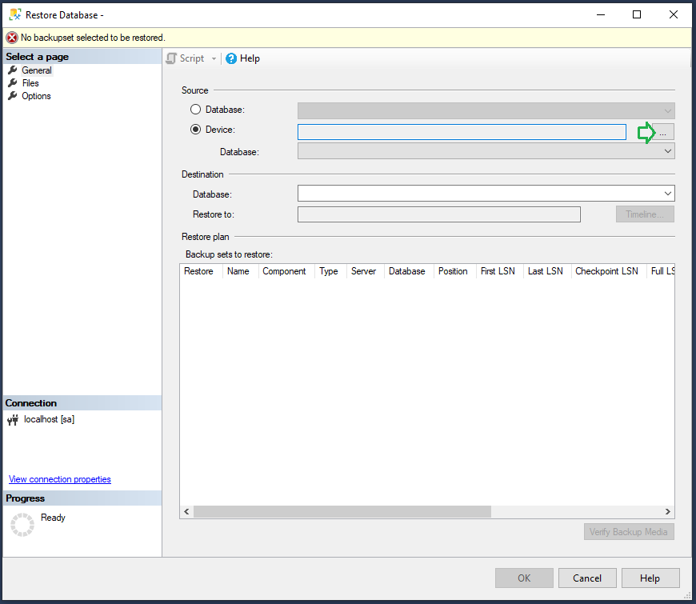
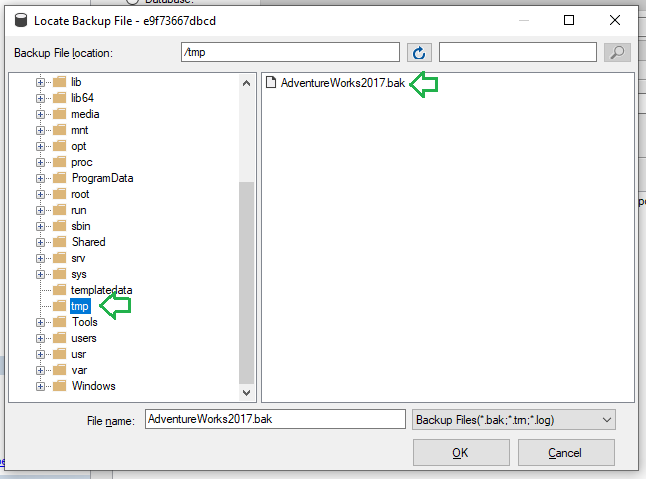
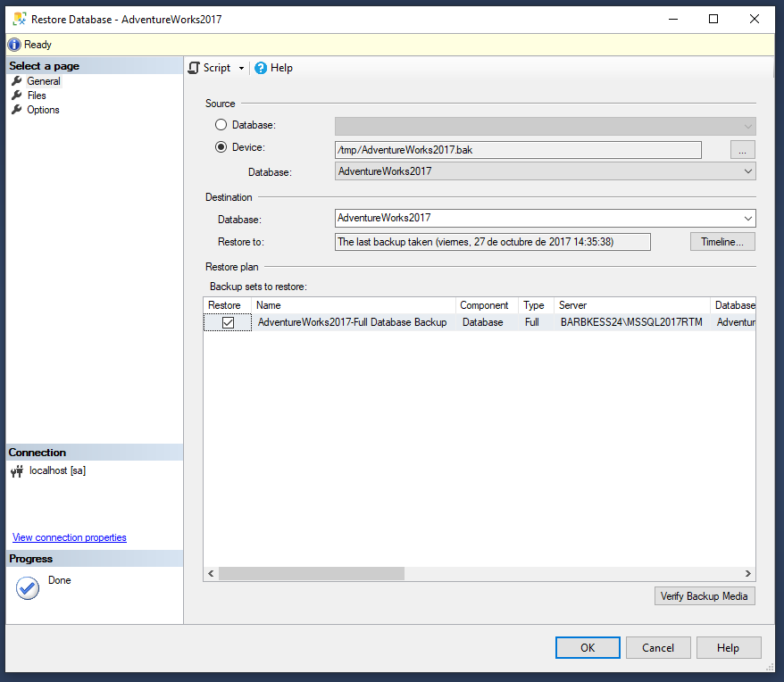
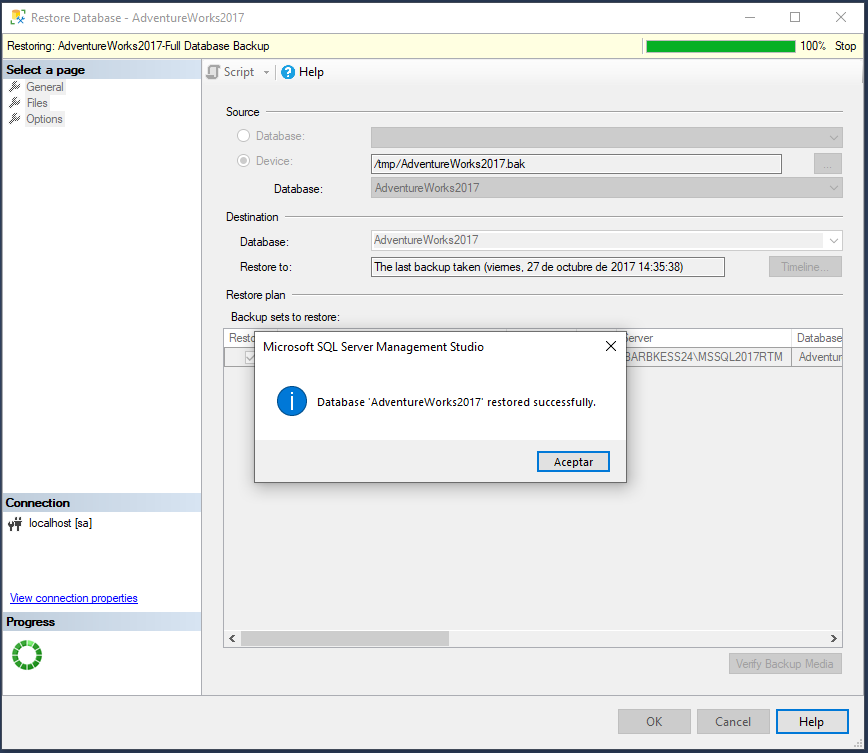

# Restaurar base de datos de ejemplo

Para realizar los siguientes ejemplos y practicar con **DML** (manipular y recuperar datos), necesitamos una base de datos de ejemplo con suficientes datos en sus tablas. Vamos a descargar y restaurar una base de datos que nos ofrece Microsoft desde su [página web](https://docs.microsoft.com/es-es/sql/samples/adventureworks-install-configure?view=sql-server-ver15&tabs=ssms). Nos bajaremos la versión correspondiente con la versión que tenemos ejecutando de SQL Server (en nuestro caso 2017). Podemos descargar la versión ligera (LT), que utilizaremos en el siguiente ejemplo _07-manipulating-data_.

Una vez descargada, tenemos que copiarla a la máquina de Docker que está corriendo SQL Server:

```bash
docker cp ./AdventureWorks2017.bak sqlserver:/tmp
```

Para restaurarla, desde SQL Server Management Studio:











Una vez terminado el proceso, tendremos disponible una nueva base de datos en nuestro servidor local con todas las tablas y datos que necesitamos para practicar en los siguientes ejemplos.


