# Hello world

## Objetivo

En este apartado vamos a ver los conceptos básicos de cómo crear nuestra primera aplicación .net usando la herramienta Visual Studio.

## Primeros pasos

Vamos a descargar la última versión _Visual Studio Community_ del siguiente [enlace](https://visualstudio.microsoft.com/es/vs/community/).

Podemos usar la licencia de la versión community si cumplimos las siguientes restricciones:

- Desarrolladores individuales, es decir, los que trabajan por su cuenta y no para una empresa, y los que programan por afición o gusto, pero no por trabajo.
- Los investigadores y aquellos que lo usan para ciencia de datos, crear aplicaciones que les ayuden con sus investigaciones, etc... que lo utilizan desde un entorno académico.
- Proyectos Open Source. Si el proyecto que desarrollas es de código abierto, entonces lo puedes utilizar sin problema, aunque seáis muchos colaborando en él.
- Organizaciones no empresariales. Si tu empresa tiene menos de 250 usuarios de PC (sean o no programadores) y factura menos de 1 millón de dólares, según Microsoft no sois "empresa" y podréis usar Visual Studio Community sin problemas hasta un máximo de 5 usuarios al mismo tiempo.

## Tipos de proyectos de Visual Studio

Una vez instalado, vamos a iniciar la herramienta y nos aparecen diferentes instalaciones que podemos realizar.

Vamos a seleccionar _Desarrollo de ASP.NET y web_ en _Cargas de Trabajo_:

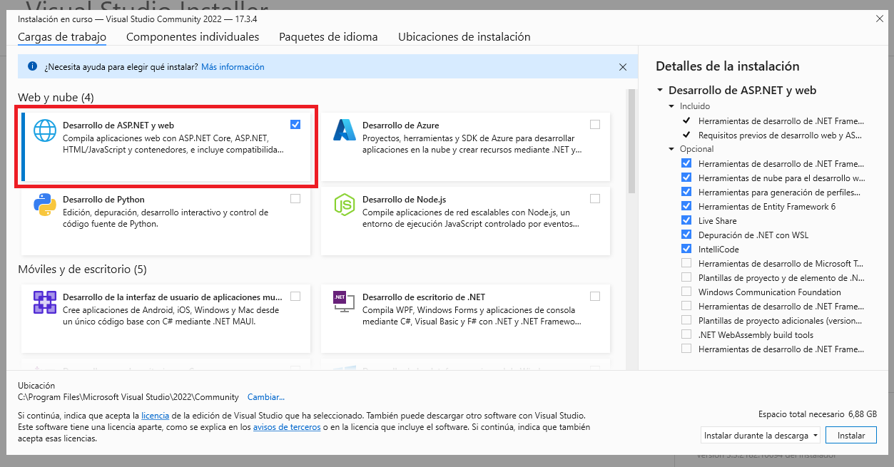

En _Componentes individuales_, en _Buscar componentes_, comprobamos que _.NET 8.0 Runtime_ está seleccionado:

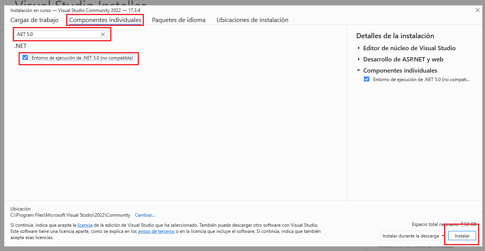

Una vez que tenemos todo instalado, vamos a arrancar Visual Studio y nos aparece la siguiente pantalla, si queremos registrarnos podemos hacerlo, o _omitirlo por el momento_, y por último seleccionamos el tema que queremos elegir e iniciamos la aplicación.

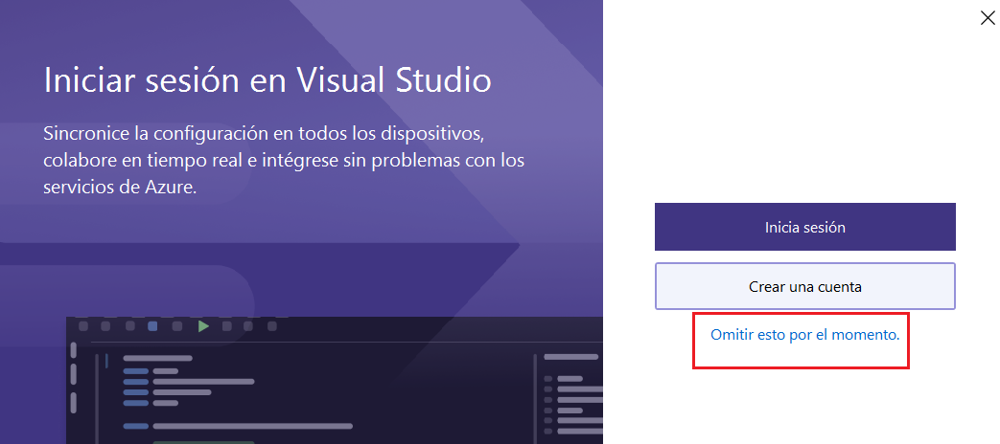

Vamos ya a empezar a trabajar con _Visual Studio_ y seleccionamos crear un nuevo proyecto.

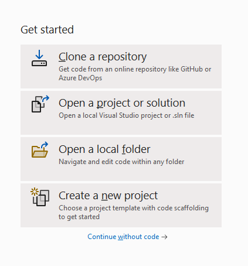

El siguiente paso que nos encontramos es el de elegir qué tipo de proyecto vamos a crear. Tenemos un amplio abanico de posibilidades (dependiendo de los complementos que hayamos elegido a la hora de hacer la instalación) pero los más básicos son:

- Aplicaciones de consola.
- Aplicaciones Windows/WPF.
- Aplicaciones Web: ASP.NET, Web api...

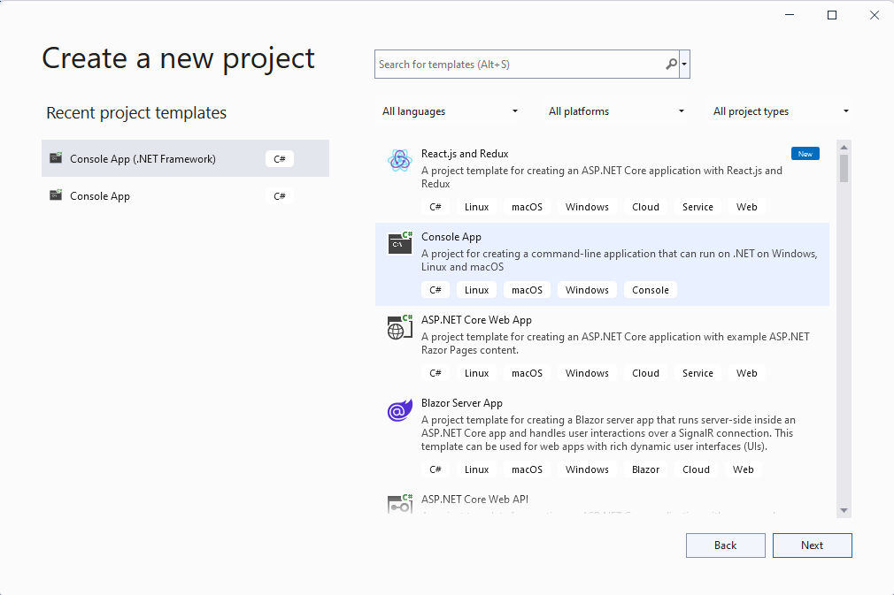

## Crear el proyecto

Vamos a seleccionar como tipo de proyecto "Aplicación de consola" (versión net Framework) para nuestro _hello-word_. Ahora rellenar los datos básicos de nuestra aplicación:

- Nombre del proyecto.
- Ubicación.
- Nombre de la solución.

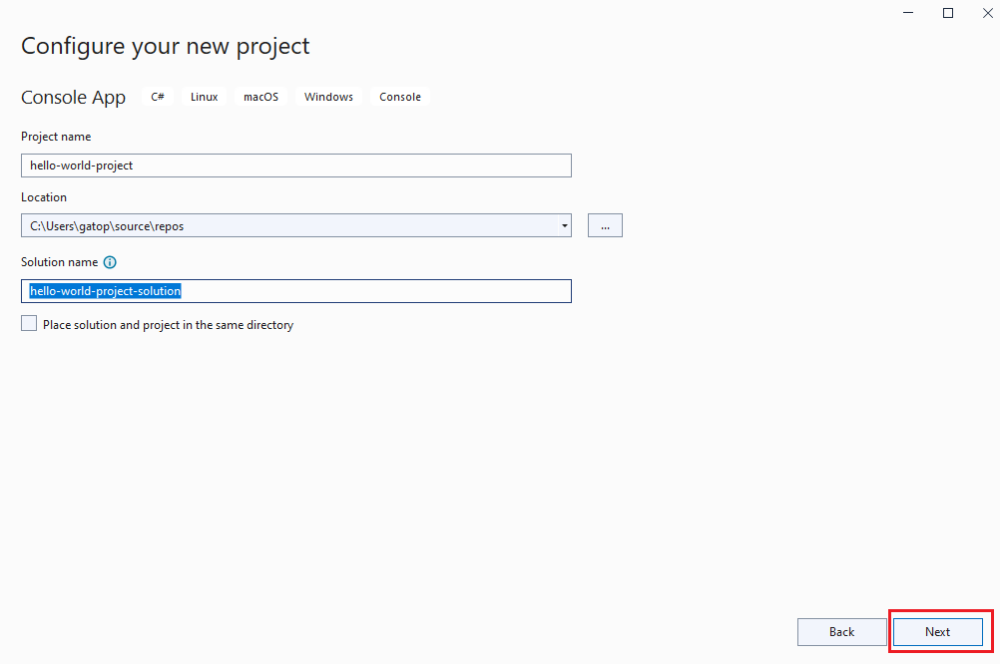

Ahora seleccionamos _*.NET 8.0*_. Y ya podemos crear nuestro primer proyecto:

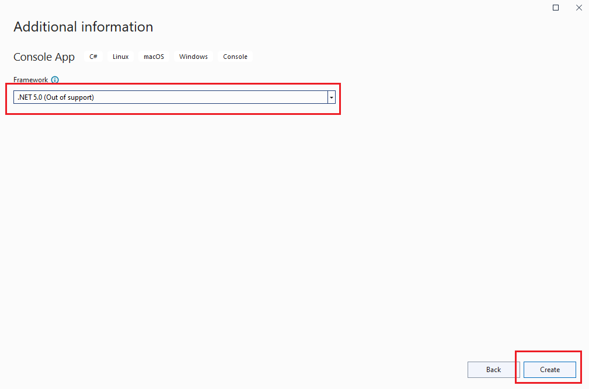

> **Pregunta a los estudiantes** ¿Qué diferencia hay entre _solución_ y _proyecto_?

Una solución es un conjunto de proyectos. Cada proyecto de una solución dará como resultado un ensamblado.

Sería conveniente dar un nombre diferente a la solución y al proyecto.

El último paso es seleccionar el _framework_ con el que vamos a crear nuestro proyecto.

## Analizando la creación base de nuestra aplicación

Vamos a ver cuál es el resultado que obtenemos:

### A nivel de carpeta

Vemos que se ha creado una carpeta con el nombre de la solución donde dentro tenemos los siguientes elementos:


- .vs: Carpeta oculta para la gestión del visual studio code.
- carpeta del proyecto.
- fichero de la solución (extensión \*.sln)

Dentro de la carpeta del proyecto vemos los ficheros que se han creado de forma automática. Vamos a destacar varios ficheros/carpetas:

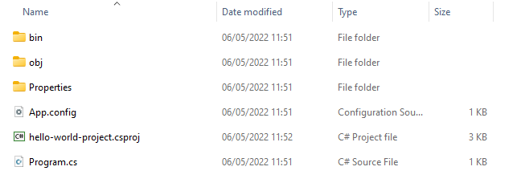

- bin: Donde se generará el ensamblado de nuestro proyecto.
- obj: Donde se generará los ficheros compilados. (Dos fases: Compile y Link)
- Properties: Propiedades de nuestro proyecto (definiciones de ejecución, información del ensamblado, etc...)
- fichero de definición del proyecto (extensión \*.csproj).

### A nivel de código

Vamos a ver el código generado:

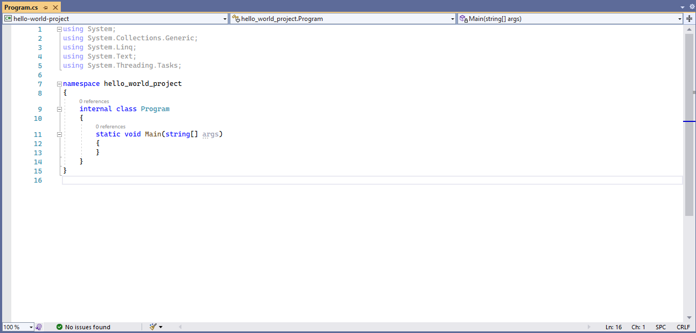

Antes de meternos a explicar conceptos como clases, métodos, vamos a ver conceptos básicos que se pueden observar en este código inicial:

- El lenguaje _C#_ es _case-sensitive_. Cuando creamos una variable, clase, método... el identificador que asignamos diferencia entre las mayúsculas y minúsculas.
- Para limitar bloques de código utilizamos _{ y }_.
- Las instrucciones terminan con ;
- Si necesitamos incluir comentarios en nuestro código podemos utilizar // o /_ y _/.
- Con _namespace_ podemos organizar las clases que vamos a ir creando.
- Si necesitamos una clase que no está en nuestro _namespace_ podemos acceder a ella si hacemos un _using_ de su _namespace_.

## Compilar

Vamos a crear una aplicación simple para ver cómo podemos ejecutarla.

```diff

+            var a = 1;
+            a = a + 1;
+            Console.WriteLine(a);
+            Console.ReaLine();

```

Vale, ya podemos ejecutar nuestra aplicación. Lo podemos hacer de varias formas:

- Desde el menu _Debug > Start Debugging_

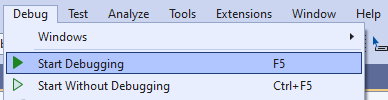

- Pulsando el botón _Start_


- Pulsando la tecla F5

Pero, ojo nuestro código ¡no funciona! En la ventana de _Output_ vemos como se ha detectado un problema en nuestro código. Hemos escrito mal el nombre del método _Readline_ por tanto la aplicación no se puede ejecutar.

Desde la ventana de _Error List_ podemos movernos de forma rápida a la línea donde se ha detectado el problema.


Vamos a solucionarlo:

```diff

    var a = 1;
    a = a + 1;
    Console.WriteLine(a);
-   Console.ReaLine();
+   Console.ReadLine();

```

Ahora si podemos ejecutar la aplicación y ver el resultado por consola.

## Depuración de código

Una herramienta muy importante que tendremos que ir usando a lo largo de todo el desarrollo de nuestra aplicación es la depuración. Visual Studio nos permite depurar (_debug_) de forma muy sencilla. Vamos a verlo en nuestro código.

Tal vez nos interese ver el valor de la variable a antes de hacer el commando _WriteLine_ para ello nos colocaremos en la linea anterior y pulsamos el botón derecho del ratón. En el menú contextual que nos aparece podemos añadir el breakpoint pulsando _Breakpoint > Insert Breakpoint_

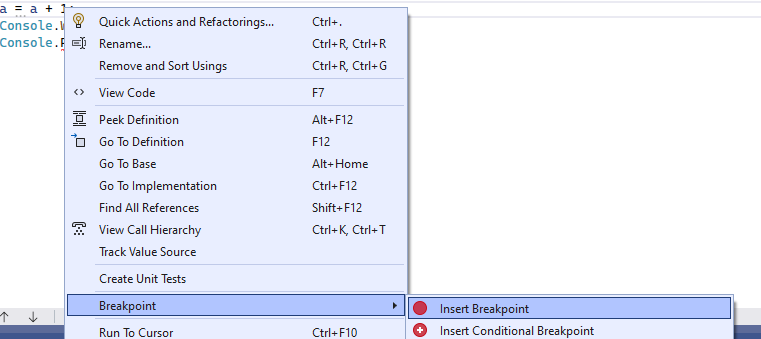

Otra forma más sencilla es simplemente haciendo clic en la línea que queramos insertar nuestro breakpoint a la izquierda del número (sobre la banda gris)


Ahora ya podemos arrancar otra vez nuestra aplicación pulsando F5.

¿Qué ha pasado? Nuestro código se ha parado en la línea donde teníamos nuestro breakpoint.

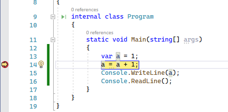

En el estado de depuración disponemos de muchas herramientas. Podemos destacar dos grupos:

- Herramienta de diagnóstico (Diagnostic Tool): Donde podemos ver datos de uso de memoria, procesador... etc.

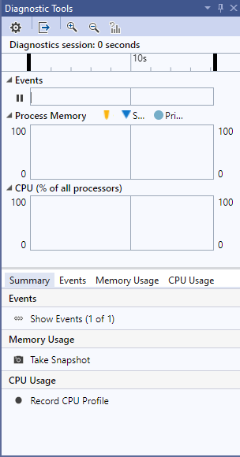

- Estado de variables (Auto, local, Watch): Donde podemos ver e incluso cambiar el valor de una variable.


Vamos a cambiar el valor de la variable i. Para ello hacemos un doble clic sobre la columna _value_ y ponemos 10 como nuevo valor y pulsamos enter.

En este punto podemos hacer las siguientes acciones:

- Ejecutar el siguiente paso dentro de la función (F11).
- Ejecutar el siguiente paso sin entrar en la función (F10).
- Saltar al siguiente breakpoint (F5).

Una vez finalizada la ejecución podemos ver como el resultado por pantalla es 11 porque se ha tenido en cuenta la modificación que hemos realizado en el valor de la variable.

Por otro lado, si no necesitamos el modo depuración podemos ejecutar la aplicación sin depuración, pulsando Ctrl + F5 o el icono 

## Otras herramientas

### Intellisense

Visual Studio dispone de una herramienta muy interesante que nos propone sugerencias a la hora de escribir nuestro código.


### Destornillador/bombilla

Otras herramientas muy útiles son las acciones rápidas o refactorización de código. Para realizar dichas acciones Visual Studio nos muestra 3 tipos de iconos:

- : indica que hay acciones disponibles para cambiar el código, pero no es necesario usarlas.
- : indica que hay acciones disponibles que debe llevar a cabo para mejorar el código.
- : indica que hay una acción disponible que corrige un error del código.

Vamos a modificar nuestro código para ver cómo se utilizan estas herramientas:

```diff
    var a = 1;
-   a = a + 1;
+   a = a * Math.PI;
    Console.WriteLine(a);
    Console.ReadLine();
```

Aparece un error porque no sabe cómo convertir un valor _double_ a _int_ (lo veremos más adelante). Si ponemos el ratón encima del error, y si esperamos unos segundos, aparecerá la bombilla indicando que hay un error y nos va a proponer las soluciones disponibles.

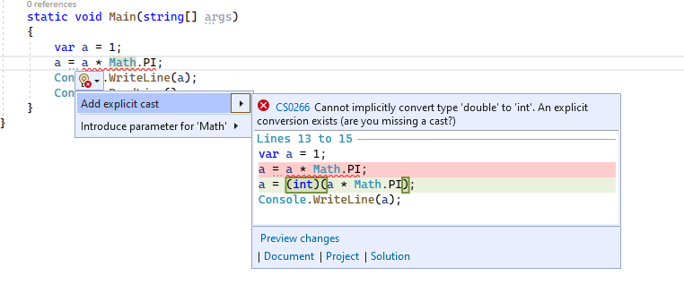

Seleccionamos la opción _Add explicit cast_ para hacer el casting de forma automática y el problema queda solventado.

Otra acción que podemos realizar es la refactorización de código. Vamos a verlo en el ejemplo.

Seleccionamos **(int)(a \* Math.PI)** y esperamos unos segundo a que aparezca el destornillador o la bombilla. Al hacer clic sobre le destornillador se nos presentan todas las posible acciones que podemos realizar para mejorar el código.

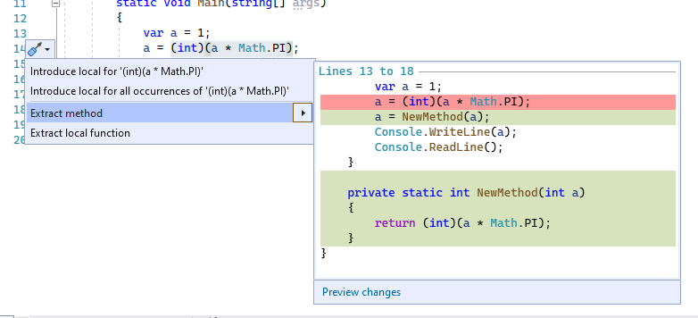

Vamos a seleccionar la opción _Extract method_ y vemos como se crea de forma automática un nuevo método al que podemos renombrar a _MultiploPI_. Y con esto tendremos refactorizado nuestro código.
