# Api Rest

## Introducción

### Pedir datos a servidor

Cuando realizamos peticiones a un servidor web las hacemos utilizando el protocolo HTTP.

Pasos:

- Se abre conexión y realiza la petición(request) al servidor.
- Se recupera los datos que están en la memoria del servidor, o el servidor tiene que consultar los datos de la base de datos.
- Se manda la respuesta al cliente, con datos o con un error que haya podido ocurrir en el servidor.
- Se cierra la conexión.
- Cada petición es independiente.

### Protocolo HTTP

Vamos a ver un ejemplo de Protocolo HTTP:


#### Request

Vamos a ver que tenemos cuando realizamos una petición:

- **_Método_**: en este caso es _GET_, pero podemos tener otros como _POST_, _PUT_, _DELETE_, _DISPATCH_.
- **Dirección del recurso**: hacia donde queremos mandar la petición. _HTTP_.
- **Versión del protocolo**: en este caso es la 1.1.
- **Cabeceras**: donde podemos incluir diferentes datos, desde dirección de la página que solicitamos, tipo de navegador que realiza la petición, el idioma que estamos utilizando, entre otros muchos datos.
- **Body**: se utiliza para enviar datos al servidor, hacer un _update_, borrar datos del servidor,...etc.

#### Response

El servidor me devuelve una respuesta, que tiene las siguientes partes:

- **Versión del protocolo**: en este caso sería la 1.1. como en la _request_.
- **Código del estado:** en este caso un _200_, ahora en el siguiente ejemplo veremos los diferentes códigos que tenemos y que significan cada uno de ellos.
- **Mensaje de estado:** que va asociado al código de estado, pero que podemos personalizarlo si lo vemos conveniente.
- **Headers**: donde irían incluidos diferentes datos, como el _content-type_ donde nos informa del formato de la respuesta, _XML_, _JSON_,... El servidor nos manda información a través de ellas y otras veces somos nosotros los que añadimos información a las cabeceras.
- **Payload**: Es opcional, nos devuelve el contenido de la respuesta.

### HTTP status codes

Necesitamos informar a cliente de que ha pasado con su petición.

- 1xx: Respuestas informativas.
- 2xx: Respuestas con éxito.

  - 200: Todo ha ido bien.
  - 201: La petición ha sido completada, creación de un nuevo recurso.
  - 204: La petición se ha completado con éxito, pero respuesta no tiene ningún contenido.

- 3xx: Redireccionamiento. Suele usarse cuando queremos redireccionar algo de la aplicación.

  - 301, 308: Redirección permanente. El recurso solicitado se encuentra en otro lugar y la redirección es permanente.
  - 307: Redirección temporal.
  - 304: Temas de Caché.

- 4xx: Error en la request del cliente.

  - 404: URL no encontrada.
  - 401: error de autenticación.
  - 403: usuario está logado pero no tiene permisos para ese recurso.

- 5xx: Error del servidor.
  - 500: internal server error.
  - 501: método no implementado.
  - 503: servicio caído y no responde.

## Soap Vs Rest

Ambas caen dentro del cajón de "_SOA_": _Service Oriented Architecture_, es un tipo de arquitectura de software, la cual se basa en la integración de aplicaciones mediante servicios.

Tanto la aproximación _SOAP_ como _REST_ cumplen ambas con _SOA_.

### SOAP

_Simple Object Access Protocol_: es un protocolo que nos permite realizar servicios web sin estado, a través de _TCP_ (se puede montar encima _HTTP_, _SMTP_), y con un formato _XML_.

- Este protocolo se publicó en 1998, fue muy popular en la década del 2000 y principios 2010.
- Es un protocolo pesado, basado en _XML_.
- Podías encontrarte con problemas al consumir sopa desde _C#_ y _Java_.
- Es un protocolo muy rico, útil para casos en los que se necesite seguridad avanzada, transacciones...
- Actualmente está en desuso, al menos para desarrollo web.

### REST API

El término REST (_Representational State Transfer_) lo acuñó Roy Fielding ( padre de la especificación HTTP) en el año 2000. Son un conjunto de restricciones que me permiten crear api's para consumir desde HTTP.

- Los datos normalmente viajan en formato JSON (fácil de consumir), nos da igual la tecnología de servidor y la de cliente.
- Define unos verbos básicos para realizar entre otras inserciones, actualizaciones y borrados (GET, PUT, POST, DELETE...).
- Establece una definición de URLs por recurso que hace fácil poder saltar de proyecto y entender como está organizada.
- No tiene estado, cada petición al servidor es independiente, al no tener sesión está preparado para escalar en horizontal.

#### Limitaciones REST API

El estándar de API tiene ya 20 años, fue una revolución en su día, pero ya va pidiendo un reemplazo.

- La estructura es rídgida y no siempre se adapta a lo que necesitas.
- Al final acabas creando métodos en lo que haces "trampas" para acceder a _queries_ específicas.
- Muchas veces te hace falta mezclar los resultados de varios _endpoints_, sin tener que hacer varios viajes a servidor o hacer un _cherry pick_ de los campos a mostrar.
- _GraphQL_ se está erigiendo como el nuevo estándar de facto para solucionar algunas limitaciones de _REST API_.

## .net Rest Api

### Estructura básica

Estructura básica de un proyecto:

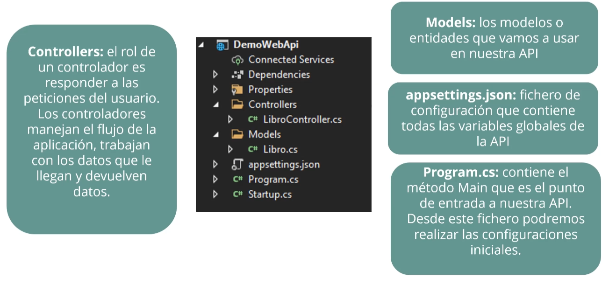

### Creación de un proyecto Real

Buscar la plantilla de ASP.NET Core Web API y creamos nuestro proyecto.

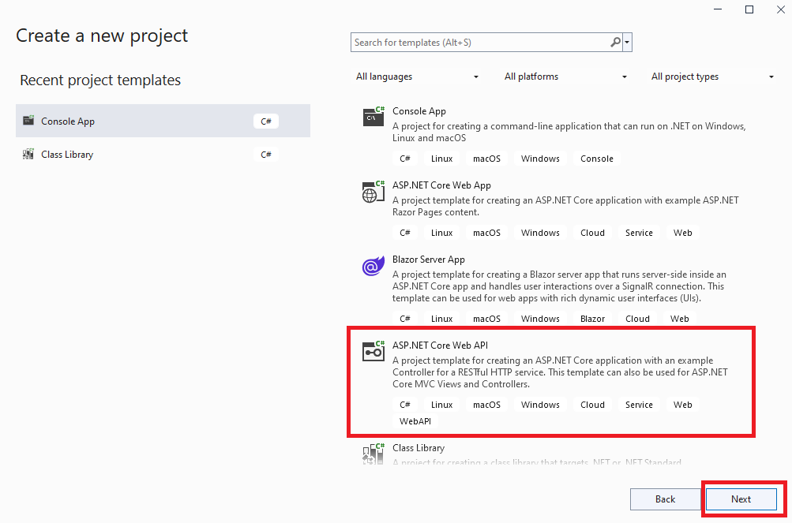

Introducimos el nombre del proyecto y le damos a siguiente:


En Información adicional elegimos _.NET 5.0_ y desactivamos _Configure for HTTPS_ para que el navegador no nos muestre que esta dirección no es segura y le damos a crear.

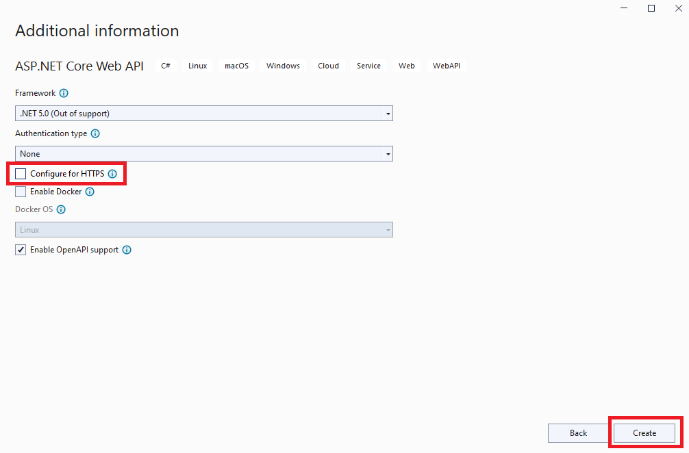

Vamos a la derecha de nuestra aplicación y vemos que tiene una carpeta _Controllers_ que contiene nuestro controlador que en este caso se llama _Weather ForecastController.cs_ si lo abrimos vemos que tiene:

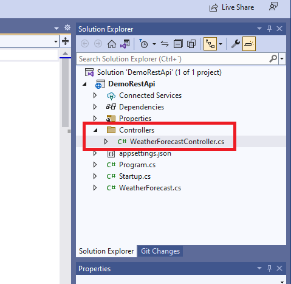

**ApiControler**: este atributo nos ayuda a habilitar algunas características por defecto.

- **Route:** ruta de nuestro controlador va a ser siempre requerido para que todas la acciones sean accesibles. Coge el nombre de la clase, por ejemplo _WeatherForecastControler_, y mi _endpoint_ sería tal como api/WeatherForecastControler.
- Si el modelo que manda no es válido automáticamente, gracias al _ApiController_, nos va a mandar un 400.
- También nos va a aplicar inferencias a los orígenes de datos, según los parámetros que tengamos en la entrada. Cuando hagamos _post_ o _put_ hay que pasar por parámetros el objeto que queremos recibir de la petición. Antes había que poner unos atributos, ya no es necesario especificarlo, excepto que sea _string_ o un _integer_, el cuál hay que indicarle que procede del body.

Si ahora abrimos a **_appsetttings.json_**:

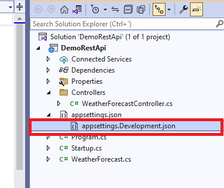

Podemos crear diferentes _settings_ para diferentes entornos. Existe una variable llamada ASPNETCORE_ENVIRONMENT que la podemos encontrar dando botón derecho del ratón en nuestro proyecto y properties.


Luego le damos a _Debug_, _Open debug launch profiles UI_, y utiliza las _settings_ que tengamos definidas, en este caso tenemos una variable de entorno definida como Development.


Aquí tendremos diferentes variables y ejecutaremos la que se precisa en cada situación, por ejemplo, para entornos de integración, producción,etc.. Tendremos variables globales que utilizaremos a la largo de nuestra aplicación.

Vamos a abrir ahora el archivo **_Program.cs_**

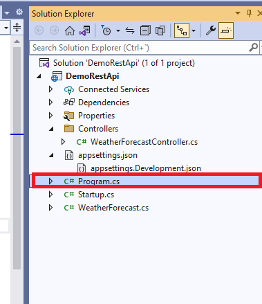

Program es nuestro punto de entrada donde tenemos al método _Main_, va a ser el primer método que se va a ejecutar en nuestra aplicación, el cuál llama al método _CreateHostBuilder_, donde estamos cargando la configuración del host con la variable de entorno que tengo el prefijo _dotnet_, lo realiza automáticamente, también carga la configuración de las _appsettings_, agrega los proveedores registro de consola, de depuración y me indica que cargue la configuración del **_Startup_**.

Este fichero **_Startup.cs_**:

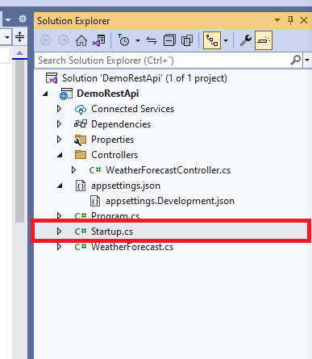

Podemos encontrar la configuración de todos los servicios, por defecto nos añade el servicio de los controladores, nos agrega Swagger y también podríamos incluir todas las inyecciones de dependencia.

Si ejecutamos nuestra aplicación:

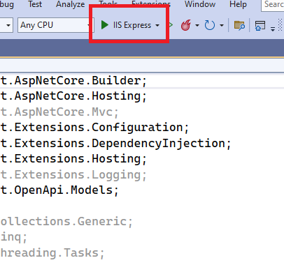

Vemos que se abre **_Swagger_**, qué es una serie de reglas, especificaciones y herramientas que nos ayudan a documentar nuestra Api de forma automática.

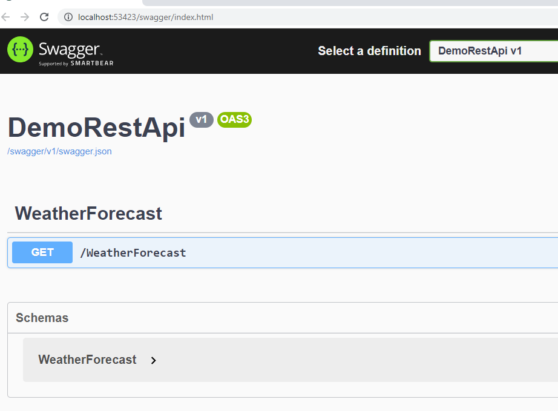

Vemos que aparece el nombre del controlador, los métodos que tenemos implementados, y el esquema del modelo que estamos utlizando en nuestro controlador. Si alguien quiere consumir nuestra Api aparecerá todo documentado.

#### Creación de la API

Vamos a hacer una Api Sencilla, vamos a empezar creándonos un JSON para nuestra base de datos.

Vamos a crear un CRUD y hacer la implementación de la Interfaz.

Vamos a empezar borrando el ejemplo de microsoft:

- Borramos WeatherForecast.cs
- Borramos WeatherForecastController.cs que está dentro de la carpeta _Controllers_.

##### Resources

Nos creamos una carpeta llamada _Resources_ y añadimos un nuevo _item_, vamos a general y creamos JSON File que lo llamamos Actores.json.


Añadimos contenido al JSON.

./Resources/Actores.json

```json
[
  {
    "Id": 1,
    "Nombre": "Jack",
    "Apellido": "Nicholson",
    "Peliculas": [
      {
        "Id": 1,
        "Titulo": "El resplandor",
        "FechaPublicacion": 1980
      },
      {
        "Id": 2,
        "Titulo": "Mejor... imposible",
        "FechaPublicacion": 1997
      }
    ]
  },
  {
    "Id": 2,
    "Nombre": "Tom",
    "Apellido": "Hanks",
    "Peliculas": [
      {
        "Id": 1,
        "Titulo": "Forrest Gump",
        "FechaPublicacion": 1994
      }
    ]
  },
  {
    "Id": 3,
    "Nombre": "Anthony",
    "Apellido": "Hopkins",
    "Peliculas": [
      {
        "Id": 1,
        "Titulo": "El silencio de los corderos",
        "FechaPublicacion": 1991
      }
    ]
  },
  {
    "Id": 4,
    "Nombre": "Meryl",
    "Apellido": "Streep",
    "Peliculas": [
      {
        "Id": 1,
        "Titulo": "Memorias de Africa",
        "FechaPublicacion": 1985
      },
      {
        "Id": 1,
        "Titulo": "Los puentes de Madison",
        "FechaPublicacion": 1995
      }
    ]
  },
  {
    "Id": 0,
    "Nombre": "string",
    "Apellido": "string",
    "Peliculas": [
      {
        "Id": 0,
        "Titulo": "string",
        "FechaPublicacion": 0
      }
    ]
  }
]
```

##### Modelos

Ahora vamos a crear nuestros **modelos** uno para Actor y otro para las películas.

Creamos una carpeta Models

Añadimos una nueva clase **_Pelicula.cs_**

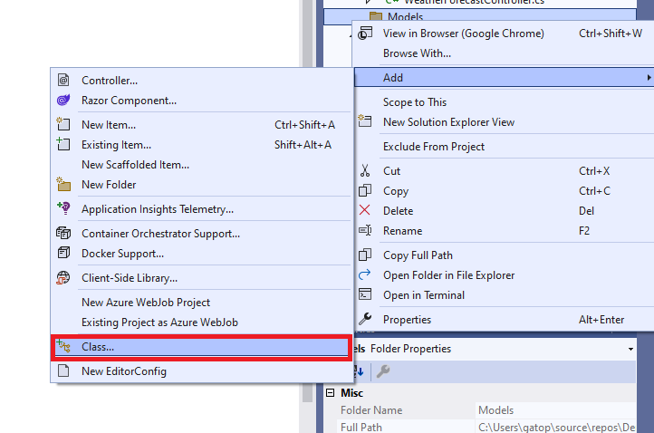

Agregamos el código para **_Pelicula.cs_**

```diff
namespace DemoRestApi.Models
{
    public class Pelicula
    {
+        public int Id { get; set; }
+        public string Titulo { get; set; }
+        public int FechaPublicacion { get; set; }
    }
}
```

Creamos otro modelo para el actor, el cuál llamaremos **_Actor.cs_**:

```diff
+ using System.Collections.Generic;

namespace DemoRestApi.Models
{
    public class Actor
    {
+        public int Id { get; set; }
+        public string Nombre { get; set; }
+        public string Apellido { get; set; }
+        public List<Pelicula> Peliculas { get; set; }
    }
}

```

##### Interfaz

Ahora creamos una carpeta para la interfaz que vamos a trabajar con este Crud, la vamos a llamar _Contracts_.

Creamos una **_interface_** que la vamos a llamar \_IActorRepository.cs, aquí vamos a introducir los métodos que vamos a querer implementar en nuestra Api.

./Contracts/IActorReposiroty.cs

```diff
+ using DemoRestApi.Models;
+ using System.Collections.Generic;

namespace DemoRestApi.Contracts
{
    public interface IActorRepository
    {
+        List<Actor> GetActors();
+        Actor GetActorById(int id);
+        void AddActor(Actor actor);
+        void UpdateActor(Actor actor);
+        void DeleteActor(int id);
    }
}
```

#### Implementacion del Contrato

##### Repositorios

Vamos a hacer ahora la implementación de esta _interface_ o contrato.

Creamos una carpeta que llamaremos **_Repositories_**, y dentro una una clase llamada _ActorRepository.cs_

```c#
namespace DemoRestApi.Repositories
{
    public class ActorRepository: IActorRepository
    {
    }
}
```

Al introducir ActorRepository : IActorRepository, vemos que nos aparece este error:

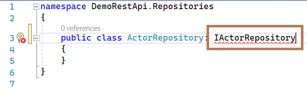

Dejamos el cursor encima y primero importamos el _using_.

```diff
+ using DemoRestApi.Contracts;

namespace DemoRestApi.Repositories
{
    public class ActorRepository: IActorRepository
    {
    }
}
```

Y al utilizar el CTRL + . encima vamos a implementar esa interfaz en mi nueva clase y me la trae a esta nueva clase.


Y este sería el resultado:

```diff
using DemoRestApi.Contracts;
+ using DemoRestApi.Models;
+ using System.Collections.Generic;

namespace DemoRestApi.Repositories
{
    public class ActorRepository : IActorRepository
    {
+        public void AddActor(Actor actor)
+        {
+            throw new System.NotImplementedException();
+        }

+        public void DeleteActor(int id)
+        {
+            throw new System.NotImplementedException();
+        }

+        public Actor GetActorById(int id)
+        {
+            throw new System.NotImplementedException();
+        }

+        public List<Actor> GetActors()
+        {
+            throw new System.NotImplementedException();
+        }

+        public void UpdateActor(Actor actor)
+        {
+            throw new System.NotImplementedException();
+        }
    }
}
```

#### Controlador

Vamos a ir de nuevo al controlador y vamos a añadir uno nuevo, para esto vamos a darle con el botón derecho en la carpeta _Controllers_ -> add Controller -> _API Controller - Empty_, le damos a _ADD_


Lo nombramos _ActorController.cs_, y este es el lugar donde vamos a introducir todas las rutas de la Api.

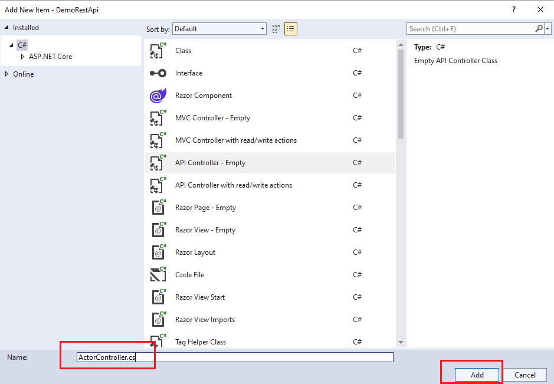

Y nos quedaría de la siguiente forma nuestro controlador:

./Controllers/ActorController.cs

```c#
using Microsoft.AspNetCore.Mvc;

namespace DemoRestApi.Controllers
{
    [Route("api/[controller]")]
    [ApiController]
    public class ActorController : ControllerBase
    {
    }
}
```

En nuestra clase vamos a querer utilizar la interfaz de _IActorRepository_, para eso nos lo traemos por el contructor, si escrimos _ctor_ y pulsamos _tab_ se nos creará automáticamente, le pasamos por parámetro la interfaz de _IActorRepository_ a _ActorController_.

Ahora vamos a crear una variable global para poder usarla en todo nuestro proyecto, con esto ya podremos utilizar los métodos de nuestra interfaz dentro del controlador.

./Controllers/ActorController.cs

```diff
using DemoRestApi.Contracts;
using Microsoft.AspNetCore.Mvc;

namespace DemoRestApi.Controllers
{
    [Route("api/[controller]")]
    [ApiController]
    public class ActorController : ControllerBase
    {
+        private readonly IActorRepository _actorRepository;
+        public ActorController(IActorRepository actorRepository)
+        {
+            _actorRepository = actorRepository;
+        }
    }
}
```

#### Agregando métodos al controlador

##### GetActors

Vamos a empezar a implementar el primer método para obtener el listado de los actores.

Cada vez que creamos un método dentro de nuestro controlador tenemos que poner el atributo del tipo de la acción que vamos a hacer. En esta ocasión es un _HttpGet_.

./Controllers/ActorController.cs

```diff
using DemoRestApi.Contracts;
+ using DemoRestApi.Models;
using Microsoft.AspNetCore.Mvc;
+ using System.Collections.Generic;

namespace DemoRestApi.Controllers
{
    [Route("api/[controller]")]
    [ApiController]
    public class ActorController : ControllerBase
    {
        private readonly IActorRepository _actorRepository;
        public ActorController(IActorRepository actorRepository)
        {
            _actorRepository = actorRepository;
        }

+        [HttpGet]
+        public ActionResult<List<Actor>> Get()
+        {
+            return _actorRepository.GetActors();
+        }
    }
}
```

Vamos ahora a implementar el método _GetActors_ en _ActorRespository_, pero primero vamos a crearnos un método para leer nuestro _JSON_ como si fuera un _string_. Nos hace falta saber el path donde se encuentra el archivo, para ello vamos a nuestra carpeta de _Resources_ y hacemos click en Actores.json y copiamos _Full Path_.

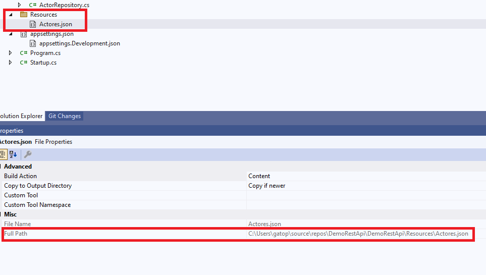

Una vez copiado vamos a crear una variable para guardar este _path_, y para que nos lea literalmente el _string_ le pasamos _@_:

./Repositories/ActorRepository.cs

```diff
namespace DemoRestApi.Repositories
{
    public class prueba : IActorRepository
    {
+        const string JSON_PATH = @"<Full Path de Actores.json>";
........
    }
}
```

A continuación, vamos a crear el método _GetActorsFromFile_ para leer _Actores.json_.

./Repositories/ActorRepository.cs

```diff
using DemoRestApi.Contracts;
using DemoRestApi.Models;
using System.Collections.Generic;
+ using System.IO;

namespace DemoRestApi.Repositories
{
    public class prueba : IActorRepository
    {
    const string JSON_PATH = @"<Full Path de Actores.json>";
........
+ 	private string GetActorsFromFile()
+        {
+            var json = File.ReadAllText(JSON_PATH);
+            return json;
+        }
    }
}

```

Ahora sí vamos a GetActors y creamos la implementación.

Primero vamos a instalar un _NuGet_ llamado _NewtonSoft_ para ello pulsamos botón derecho sobre nuestro proyecto y seleccionamos Manage Nuget Packages...


Buscamos el paquete Newtonsoft.Json y lo instalamos, con este paquete vamos a serializar o deserializar según nos haga falta.


```diff
using DemoRestApi.Contracts;
using DemoRestApi.Models;
+ using Newtonsoft.Json;
using System;
using System.Collections.Generic;
using System.IO;

namespace DemoRestApi.Repositories
{
    public class ActorRepository : IActorRepository
......
 public List<Actor> GetActors()
        {
-        throw new System.NotImplementedException();
+            try
+            {
+                var actoresFromFile = GetActorsFromFile();
+                List<Actor> actores = JsonConvert.DeserializeObject<List<Actor>>(actoresFromFile);
+                return actores;
+            }
+            catch (Exception)
+            {
+                throw;
+            }
+        }
........
```

Es hora de ejecutar la aplicación, vamos a lanzar _Swagger_.

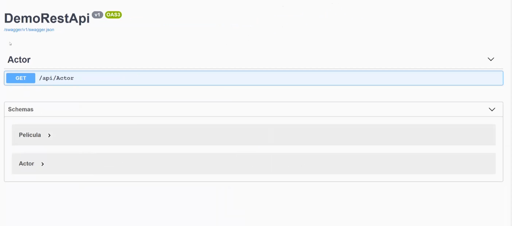

Y al ejecutar nos da un error.


Nos dice que no se puede resolver el servicio para el tipo _IActorRepository_, y no nos devuelve el listado de actores.

Para solucionarlo tenemos que registrar este servicio, y para ello nos vamos a Startup y vamos a añadir este servicio.

./Startup.cs

```diff
+ using DemoRestApi.Contracts;
+ using DemoRestApi.Repositories;
using Microsoft.AspNetCore.Builder;
using Microsoft.AspNetCore.Hosting;
using Microsoft.Extensions.Configuration;
using Microsoft.Extensions.DependencyInjection;
using Microsoft.Extensions.Hosting;
using Microsoft.OpenApi.Models;

namespace DemoRestApi
{
    public class Startup
    {
......
 public void ConfigureServices(IServiceCollection services)
        {

            services.AddControllers();
            services.AddSwaggerGen(c =>
            {
                c.SwaggerDoc("v1", new OpenApiInfo { Title = "demodia3", Version = "v1" });
            });
+            services.AddTransient<IActorRepository, ActorRepository>();
        }
....
	}
}
```

Ahora estamos añadiendo la resolución de la dependencia _ActorRepository_, le estamos diciendo que a la interfaz _IActorRepository_ la implementa la clase _ActorRepository_.

Si ejecutamos de nuevo _Swagger_, vemos que ya nos devuelve correctamente el listado de Actores.


#### GetActorById

Para continuar, vamos a seguir con el siguiente método, nos vamos primero al controlador. Utilizamos HttpGet pero dentro le ponemos el parámetro que va a llevar la ruta en este caso "{id}", le decimos que si encuentra al actor no los devuelva y sino que nos devuelva _NotFound_().

```diff
.....
        [HttpGet]
        public ActionResult<List<Actor>> Get()
        {
            return _actorRepository.GetActors();
        }
+        [HttpGet("{id}")]
+        public ActionResult<Actor> GetActor(int id)
+        {
+            var actor = _actorRepository.GetActorById(id);
+            if (actor == null)
+                return NotFound();
+            return actor;
+        }
    }
}

```

Vamos a configurar la implementación de _GetActorById_.

> Atajo teclado:
>
> - Si pulsamos F12 sobre el método GetActors vamos al método de la interfaz.
> - CTRL + F12 sobre el método GetActors vamos a la implementación.

./Repositories/ActorRepository.cs

```diff
using DemoRestApi.Contracts;
using DemoRestApi.Models;
using Newtonsoft.Json;
using System;
using System.Collections.Generic;
using System.IO;
+ using System.Linq;
namespace DemoRestApi.Repositories
{
    public class ActorRepository : IActorRepository
    {
.....

    public Actor GetActorById(int id)
    {
-   	throw new System.NotImplementedException();
+       try
+       {
+           var actores = GetActors();
+           var actor = actores.FirstOrDefault(a => a.Id == id);
+           return actor;
+       }
+       catch (Exception)
+       {
+          throw;
+       }
    }
.....
   }
}
```

Es hora de probarlo con swagger.


Si le pasamos una id que no existe nos devuelve un 404, _Not Found_.

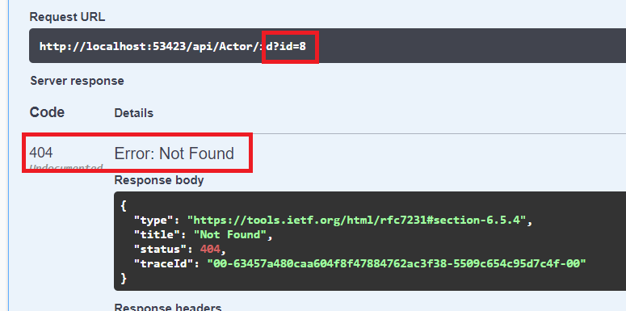

#### CreateActor

Volvemos a nuestro controlador, y en este caso vamos a añadir un _HttpPost_. Añadimos un try-catch para capturar la Exception y devolvemos el mensaje que devuelve la excepción. Añadimos un actor nuevo y si todo ha ido correctamente devolvemos un _Ok_.

./Controllers/ActorController.cs

```diff
using DemoRestApi.Contracts;
using DemoRestApi.Models;
using Microsoft.AspNetCore.Mvc;
+ using System;
using System.Collections.Generic;

namespace DemoRestApi.Controllers
{
    [Route("api/[controller]")]
    [ApiController]
    public class ActorController : ControllerBase
    {
+		 [HttpPost]
+        public ActionResult CreateActor(Actor actor)
+        {
+            try
+            {
+                _actorRepository.AddActor(actor);
+                return Ok();
+            }
+            catch (Exception ex)
+            {
+                return BadRequest(ex.Message);
+            }
+        }
	}
}
```

Ahora nos vamos al _ActorResository_ a implementar el método, pero primero vamos a crearnos un método privado de escritura llamado _UpdateActores_, en el cuál tenemos que pasar de una lista de Actores a un formato Json, es decir, tenemos ahora que serializar.

./Repositories/ActorRepository.cs

```diff
using DemoRestApi.Contracts;
using DemoRestApi.Models;
using Newtonsoft.Json;
using System;
using System.Collections.Generic;
using System.IO;
using System.Linq;

namespace DemoRestApi.Repositories
{
    public class ActorRepository : IActorRepository
    {
...
 		private string GetActorsFromFile()
        	{
            	var json = File.ReadAllText(JSON_PATH);
            	return json;
        	}
+       private void UpdateActores(List<Actor> actores)
+       {
+           var actoresJson = JsonConvert.SerializeObject(actores, Formatting.Indented);
+           File.WriteAllText(JSON_PATH, actoresJson);
+        }
	}
}
```

Para añadir nuestro autor, primero comprobamos que no haya ningún autor con la misma _id_, en el caso de que existiera mandaríamos una excepción informándonos de que sí existe dicho autor, y en caso contrario añadimos el nuevo actor a nuestra colección de autores, guardamos y "_machacamos_" el fichero.

./Repositories/ActorRepository.cs

```diff
using DemoRestApi.Contracts;
using DemoRestApi.Models;
using Newtonsoft.Json;
using System;
using System.Collections.Generic;
using System.IO;
using System.Linq;

namespace DemoRestApi.Repositories
{
    public class prueba : IActorRepository
    {
.....
        public void AddActor(Actor actor)
        {
-            throw new System.NotImplementedException();
+            var actores = GetActors();
+            var existeActor = actores.Exists(a => a.Id == actor.Id);
+            if (existeActor)
+            {
+                throw new Exception("Ya existe un autor con ese id");
+            }
+            actores.Add(actor);
+            UpdateActores(actores);
        }
.....
```

Ejecutamos Swagger y añadimos un Actor:


Y si por el contrario intentamos añadir un nuevo Actor con una Id ya creada, nos devolvería que ya existe un actor con esa id.

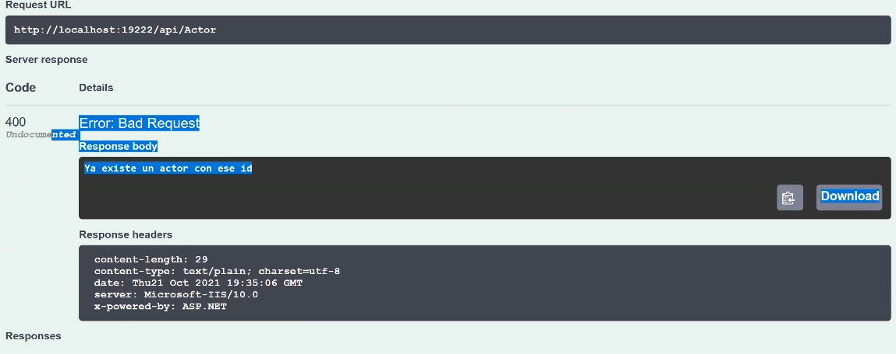

#### UpdateActor

Nos vamos de nuevo al _ActorController.cs_, utilizamos _HttpPut_ y creamos _UpdateActor_.

./Controllers/ActorController.cs

```diff
using DemoRestApi.Contracts;
using DemoRestApi.Models;
using Microsoft.AspNetCore.Mvc;
using System;
using System.Collections.Generic;

namespace DemoRestApi.Controllers
{
    [Route("api/[controller]")]
    [ApiController]
    public class ActorController : ControllerBase
    {
    .....
+        [HttpPut]
+        public ActionResult UpdateActor(Actor actor)
+        {
+            try
+            {
+                _actorRepository.UpdateActor(actor);
+                return Ok();
+            }
+            catch (Exception ex)
+            {
+                return BadRequest(ex.Message);
+            }
+        }
    }
}
```

Y ahora nos vamos a nuestro _ActorRepository.cs_

./Repositories/ActorRepository.cs

```diff
using DemoRestApi.Contracts;
using DemoRestApi.Models;
using Newtonsoft.Json;
using System;
using System.Collections.Generic;
using System.IO;
using System.Linq;

namespace DemoRestApi.Repositories
{
    public class ActorRepository : IActorRepository
    {
.....
        public void UpdateActor(Actor actor)
        {
-            throw new System.NotImplementedException();
+            var actores = GetActors();
+            var indiceActor = actores.FindIndex(a => a.Id == actor.Id);

+            if (indiceActor < 0)
+                throw new Exception("Actor no encontrado");

+            actores[indiceActor] = actor;
+            UpdateActores(actores);
        }
.....
	}
}
```

Vamos a probarlo ahora en swagger

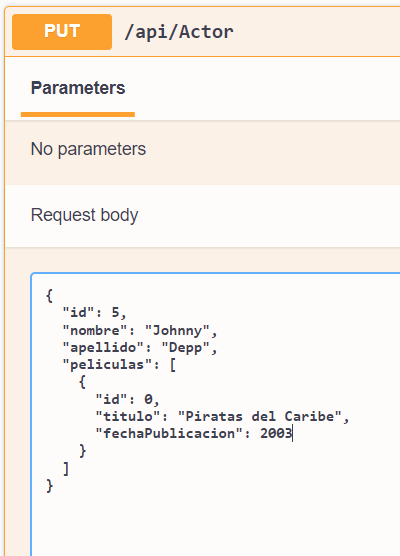

Si intento actualizar un autor que no existe me devolvería la excepción:


#### DeleteActor

Nos vamos otra vez al _ActorController.cs_

./Controllers/ActorController.cs

```diff
using DemoRestApi.Contracts;
using DemoRestApi.Models;
using Microsoft.AspNetCore.Mvc;
using System;
using System.Collections.Generic;

namespace DemoRestApi.Controllers
{
    [Route("api/[controller]")]
    [ApiController]
    public class ActorController : ControllerBase
    {
    .....
+        [HttpDelete("{id}")]
+        public ActionResult DeleteActor(int id)
+        {
+            try
+            {
+                _actorRepository.DeleteActor(id);
+                return Ok();
+            }
+            catch (Exception ex)
+            {
+                return NotFound(ex.Message);
+            }
+        }
    }
}

```

Ahora nos vamos a la implementación del método al _ActorRepository.cs_

./Repositories/ActorRepository.cs

```diff
.....
 public void AddActor(Actor actor)
        {
            var actores = GetActors();
            var existeActor = actores.Exists(a => a.Id == actor.Id);
            if (existeActor)
            {
                throw new Exception("Ya existe un autor con ese id");
            }
            actores.Add(actor);
            UpdateActores(actores);
        }

        public void DeleteActor(int id)
        {
+            var actores = GetActors();
+            var indiceActor = actores.FindIndex(a => a.Id == id);

+           if (indiceActor < 0)
+                throw new Exception("Actor no existente");

+            actores.RemoveAt(indiceActor);
+            UpdateActores(actores);
        }
.....
```

Vamos a probarlo en Swagger


#### Postman

Postman es una aplicación que nos va a permitir probar nuestra API. Para ello vamos a [instalar Postman](https://www.postman.com/downloads/).

Una vez vez instalado vamos a abrirlo y crear una nueva colección, para ello pulsamos en


Elegimos la opción _HTTP Request_:


##### Obtener Lista de Actores

Vamos a empezar a realizar peticiones a nuestra API, primero vamos a consultar el listado de actores, para esto utilizaremos el método _GET_, el **puerto** será diferente para cada dispositivo, es decir, el puerto que vamos a utilizar en el ejemplo no va a coincidir con el que utilicéis en vuestro ejemplo.


##### Obtener Actor

Para obtener un Actor para a añadir el _id_ del actor que queremos hacer la consulta.


##### Crear un actor

Vamos a añadir un actor utilizando _Postman_, es importante que cambiemos el método y usemos **_POST_** en vez de **_GET_** como hemos usado en los dos ejemplos anteriores. Para esto debemos seleccionar en _raw_, y en vez de _Text_ seleccionamos _JSON_.

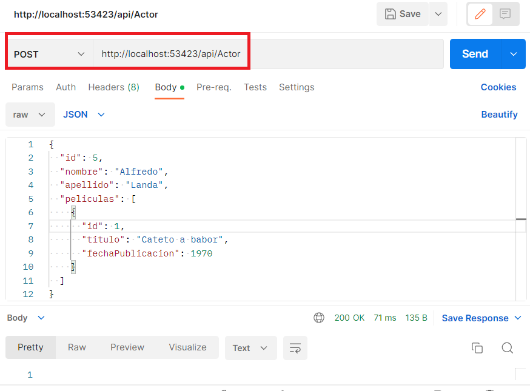

##### Actualizar un actor

Para actualizar un actor tenemos que usar el método ***PUT*** y añadimos el *id* del actor que queremos modificar.

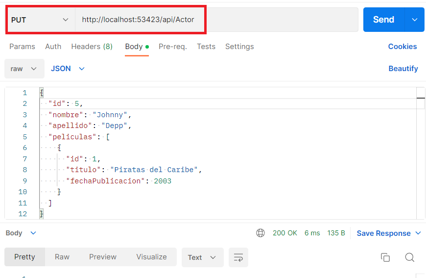

##### Borrar un actor

Para borrar un actor seleccionamos el método **DELETE** y añadimos el *id* del actor que queremos eliminar.


