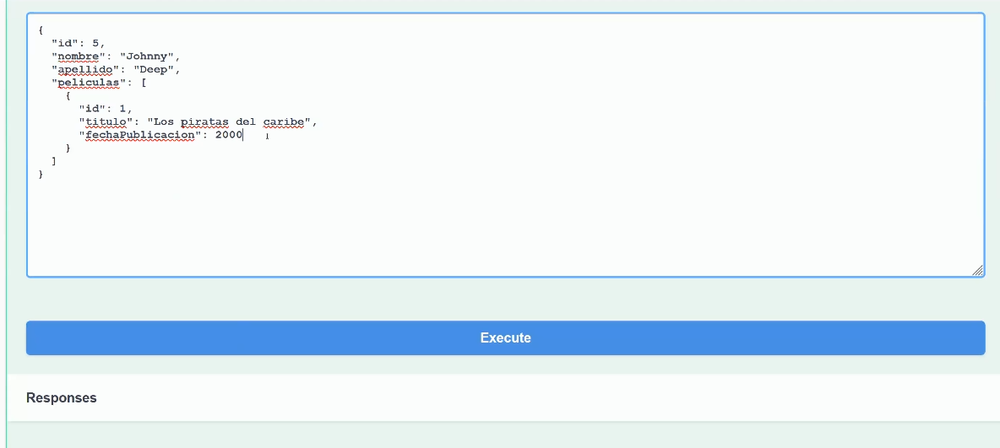
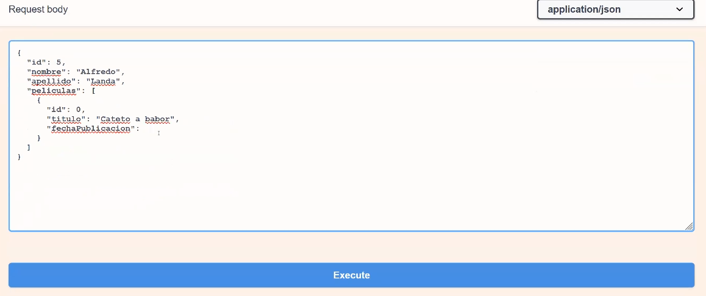

# Api Rest

## Pedir datos a servidor

Cuando realizamos peticiones a un servidor web las hacemos utilizando el protocolo HTTP.

Pasos:

- Se abre conexión y realiza la petición.
- Se manda la respuesta.
- Se cierra la conexión.
- Cada petición es independiente.


## Protocolo HTTP

## 

## HTTP status codes

Necesitamos informar a cliente de que ha pasado con su petición.

- 1xx: Respuestas informativas
- 2xx: Respuestas con éxito
  - 200: Todo ha ido bien.
  - 201: La petición  ha sido completada, creación nuevo recurso.
  - 204:  La petición se ha completado con éxito, pero respuesta ningún contenido.

- 3xx: Redireccionamiento. Suele usarse cuando queremos redireccionar algo de la aplicación
  - 301, 308: Redirección permanente. El recurso solicitado se encuentra en otro lugar y la redirección es permanente.
  - 307: Redirección temporal.
  - 304: Temas de Caché.

- 4xx: Error en la request del cliente.
  - 404: URL no encontrada.
  - 401: error autentificación.
  - 403: usuario está logrado pero no tiene permisos para ese recurso.

- 5xx: Error del servidor.
  - 500: internal server error.
  - 501: método no implementado.
  - 503: servicio caído y no responde.

## Responses

Además del status code.

- **Headers**. El servidor tendría esa cabecera, otras veces nosotros mandamos esas cabeceras.
- **Content**-Type Header: nos dice el formato de la respuesta. XML, JSon...
- **Payload**: Es opcional, es el contenido de la respuesta.

## Soap Vs Rest

Ambas caen dentro del cajón de "SOA": Service Oriented Architecture.

Es un tipo de arquitectura de software, la cual se basa en la integración de aplicaciones mediante servicios.

### SOAP

Simple Object Access Protocol: es un protocolo que nos permite realizar servicios web sin estado, a través de TCP (se puede montar encima HTTP, SMTP), y con un formato XML.

- Este protocolo se publicó en 1998, fue muy popular en la década del 2000 y principios 2010.
- Es un protocolo pesado, basado en XML.
- Podías encontrarte con problemas al consumir sopa desde C# y Java.
- Es un protocolo muy rico, útil para casos en los que se necesite seguridad avanzada, transacciones...
- Actualmente está en desuso, al menos para desarrollo web.

### REST API

El término REST (Representational State Transfer) lo acuñó Roy Fielding ( padre de la especificación HTTP) en el año 2000. Son un conjunto de restricciones que me permiten crear api's para consumir desde HTTP.

- Los datos normalmente viajan en formato JSON (fácil de consumir), nos da igual la tecnología de servidor y la de cliente.
- Define unos verbos básicos para realizar entre otras inserciones, actualizaciones y borrados (GET, PUT, POST, DELETE...).
- Establece una definición de URLs por recurso que hace fácil poder saltar de proyecto y entender como está organizada.
- No tiene estado, cada petición al servidor es independiente, al no tener sesión está preparado para escalar en horizontal.

#### Limitaciones REST API

El estándar de API tiene ya 20 años, fue una revolución en su día, pero ya va pidiendo un reemplazo.

- La estructura es rídgida y no siempre se adapta a lo que necesitas.
- Al final acabas creando métodos en lo que haces "trampas" para acceder a queries específicas.
- Muchas veces te hace falta mezaclar los resultados de varios endpoints, sin tener que hacer varios viajes a servidor o hacer un cherry pick de los campos a mostrar.
- GraphQL se está erigiendo como el nuevo estándar de facto para solucionar algunas limitaciones de REST API.

## .net Rest Api

### Estructura básica

La estructura básica de un proyecto.


## Creación de un proyecto Real

- Buscar la plantilla de ASP.NET Core Web API y creamos nuestro proyecto. Quitamos Configure por HTTPS.

- **ApiControler**: este atributo nos ayuda a habilitar algunas características por defecto.
  - Route: ruta de nuestro controlador va a ser siempre requerido para que todas la acciones sean accesibles. Me coge del nombre de mi clase por ejemplo WeatherForecastControler, navegaría como api/WeatherForecastControler y me monta la navegación de mi api.
  - Las respuestas http 400 van a se automáticas. Si el módelo no es válido manda 400.
  - También nos va a aplicar inferencias a los orígenes de datos según los parámetros que tengamos en la entrada. Cuando hagamos post o put hay que pasar por dato el objeto que queremos recibir de la petición. Antes había que poner unos atributos, ya no es necesario especificarlo excepto que sea string o un integer hay que indicarle que viene del body.

- **appsetttings.json**: diferentes settings para nuestros entornos. 

  Proyecto -> Properties -> Debug-> Environment variables de finida como Develpment, se coge las settings que le tengamos definidas.

- **Program.cs**: llama al método CreateHostBuilder, estamos cargando la configuración del host con la variable de entorno que tengo el prefijo dotnet, lo hace automáticamente, carga la configuración de las appsettings. Agrega los proveedores registro de consola, de depuración y me indica que cargue la configuración del startup.

Vamos a hacer una Api Sencilla Creamos un Json para nuestra base de datos.

Vamos a crear un Crud y hacer la implementación de la Interfaz.

Quitamos el ejemplo de microsoft:

- Borramos WeatherForecast.cs
- Borramos WeatherForecastController.cs

### Resources

Nos creamos una carpeta llamada Resources y vamos a Add -> JSON File la llamamos Actores.json.

./Resources/Actores.json

```json
[
  {
    "Id": 1,
    "Nombre": "Jack",
    "Apellido": "Nicholson",
    "Peliculas": [
      {
        "Id": 1,
        "Titulo": "El resplandor",
        "FechaPublicacion": 1980
      },
      {
        "Id": 2,
        "Titulo": "Mejor... imposible",
        "FechaPublicacion": 1997
      }
    ]
  },
  {
    "Id": 2,
    "Nombre": "Tom",
    "Apellido": "Hanks",
    "Peliculas": [
      {
        "Id": 1,
        "Titulo": "Forrest Gump",
        "FechaPublicacion": 1994
      }
    ]
  },
  {
    "Id": 3,
    "Nombre": "Anthony",
    "Apellido": "Hopkins",
    "Peliculas": [
      {
        "Id": 1,
        "Titulo": "El silencio de los corderos",
        "FechaPublicacion": 1991
      }
    ]
  },
  {
    "Id": 4,
    "Nombre": "Meryl",
    "Apellido": "Streep",
    "Peliculas": [
      {
        "Id": 1,
        "Titulo": "Memorias de Africa",
        "FechaPublicacion": 1985
      },
      {
        "Id": 1,
        "Titulo": "Los puentes de Madison",
        "FechaPublicacion": 1995
      }
    ]
  },
  {
    "Id": 0,
    "Nombre": "string",
    "Apellido": "string",
    "Peliculas": [
      {
        "Id": 0,
        "Titulo": "string",
        "FechaPublicacion": 0
      }
    ]
  }
]
```

### Modelos

Ahora vamos a crearnos nuestros **modelos** uno para Actor y otro para las películas

- Creamos una carpeta Models
- Añadimos una nueva clase _Pelicula.cs_ 

```c#
using System;
using System.Collections.Generic;
using System.Linq;
using System.Threading.Tasks;

namespace DemoRestApi.Models
{
    public class Pelicula
    {
        public int Id { get; set; }
        public string Titulo { get; set; }
        public int FechaPublicacion { get; set; }
    }
}
```

- Otra clase llamada Actor.cs

```c#
using System;
using System.Collections.Generic;
using System.Linq;
using System.Threading.Tasks;

namespace DemoRestApi.Models
{
    public class Actor
    {
        public int Id { get; set; }
        public string Nombre { get; set; }
        public string Apellido { get; set; }
        public List<Pelicula> Peliculas { get; set; }
    }
}

```

### Interfaz

Ahora creamos una carpeta para la interfaz que vamos a trabajar con este Crud, _Contracts_

- Añadimos una **interface**  que la vamos a llamar _IActorRepository.cs_
- Aquí introducimos los métodos que vamos a querer implementar en nuestra Api.

./Contracts/IActorReposiroty.cs

```c#
using DemoRestApi.Models;
using System;
using System.Collections.Generic;
using System.Linq;
using System.Threading.Tasks;

namespace DemoRestApi.Contracts
{
    public interface IActorRepository
    {
        List<Actor> GetActors();
        Actor GetActorById(int id);
        void AddActor(Actor actor);
        void UpdateActor(Actor actor);
        void DeleteActor(int id);
    }
}
```

### Implementacion

#### Repositorios

Vamos a hacer ahora la implementación de esta interface o contrato.

- Creamos una carpeta llamada **Repositories**
- Creamos una clase llamada _ActorRepository.cs_
- Al poner ActorRepository : IActorRepository al utilizar el CTRL + . implemento esa interfaz en mi nueva clase y me la trae a esta nueva clase.

```c#
using DemoRestApi.Contracts;
using DemoRestApi.Models;
using System;
using System.Collections.Generic;
using System.Linq;
using System.Threading.Tasks;

namespace DemoRestApi.Repositories
{
    public class prueba : IActorRepository
    {
        public void AddActor(Actor actor)
        {
            throw new NotImplementedException();
        }

        public void DeleteActor(int id)
        {
            throw new NotImplementedException();
        }

        public Actor GetActorById(int id)
        {
            throw new NotImplementedException();
        }

        public List<Actor> GetActors()
        {
            throw new NotImplementedException();
        }

        public void UpdateActor(Actor actor)
        {
            throw new NotImplementedException();
        }
    }
}
```

#### Controlador

Ahora volvemos al controller, boton derecho-> add Controller ->  API Controller - Empty, y lo llamamos _ActorController.cs_, aquí vamos a poner todas las rutas de la Api.

./Controllers/ActorController.cs

```c#
using Microsoft.AspNetCore.Http;
using Microsoft.AspNetCore.Mvc;
using System;
using System.Collections.Generic;
using System.Linq;
using System.Threading.Tasks;

namespace DemoRestApi.Controllers
{
    [Route("api/[controller]")]
    [ApiController]
    public class ValuesController : ControllerBase
    {
    }
}
```

- Primero creamos el contructor, escrimos _ctor_
- Le vamos a pasar la interface del IActorRepository dentro del ActorController.
- En el controlador creamos una variable global que la voy a poder usar en todo el proyecto
- Creamos un private reanonly IActorRepository _actorRespository. Con esto podemos usar los métodos de nuestra interfaz dentro del controlador.

./Controllers/ActorController.cs

```diff
using DemoRestApi.Contracts;
using Microsoft.AspNetCore.Http;
using Microsoft.AspNetCore.Mvc;
using System;
using System.Collections.Generic;
using System.Linq;
using System.Threading.Tasks;

namespace DemoRestApi.Controllers
{
    [Route("api/[controller]")]
    [ApiController]
    public class ActorController : ControllerBase
    {
+        private readonly IActorRepository _actorRepository;
+        public ActorController(IActorRepository actorRepository)
+        {
+            _actorRepository = actorRepository;
+        }
    }
}
```

#### Método llamar Json

Vamos a empezar a implementar el primer método que es obtener el listado de todos los actores que tenemos.

+ Cada vez que creamos un método dentro de nuestro controlador tenemos que poner el atributo de el tipo de la acción que vamos a hacer. En esta ocasión es un [HttpGet].

+ A continuación, creamos el método.

+ Es un public ActionResult que nos devuelva una lista de Actores y lo llamamos Get().

+ Es tan fácil que nos haga un return de _actorRepository.GetActors();

+ Con esto objenemos los actores, nos falta la implementación del repositorio pero ya lo tendríamos.

  

./Controllers/ActorController.cs

```diff
using DemoRestApi.Contracts;
using DemoRestApi.Models;
using Microsoft.AspNetCore.Http;
using Microsoft.AspNetCore.Mvc;
using System;
using System.Collections.Generic;
using System.Linq;
using System.Threading.Tasks;

namespace DemoRestApi.Controllers
{
    [Route("api/[controller]")]
    [ApiController]
    public class ActorController : ControllerBase
    {
        private readonly IActorRepository _actorRepository;
        public ActorController(IActorRepository actorRepository)
        {
            _actorRepository = actorRepository;
        }

+        [HttpGet]
+        public ActionResult<List<Actor>> Get()
+        {
+            return _actorRepository.GetActors();
+        }
    }
}
```

Ahora vamos a crear la implementación del método, nos vamos ahora a

./Repositories/ActorRepository.cs

- Primero creo un pequeño método para poder leer los actores, 
- Un método privado para que solo accedan los métodos de esta clase llamado GetActorsFromFile(), que nos devuelve una string.
-  Vamos a usar un método para leer ficheros,  creamos una variable llamad json y metemos un método llamado File, me traigo la librería System.IO. Y uso el método ReadAllText() y dentro tenemos que pasarle el Path entero, eso depende de donde tengamos el Path.
- Creo arriba una constante de tipo string llamada  JSON_PATH y le meto el path de mi fichero, me voy a Actores.json, botón derecho y copio el Full Path. Hay que ponerle delante @ para que no lee literalmente la string.
- Y dentro de ReadAllText le introducimos el JSON_PATH
- Y hacemos el return de ese json

```diff
using DemoRestApi.Models;
using System;
using System.Collections.Generic;
using System.IO;
using System.Linq;
using System.Threading.Tasks;

namespace DemoRestApi.Repositories
{
    public class prueba : IActorRepository
    {
+        const string JSON_PATH = @"<Full Path de Actores.json>";
........
+ 	private string GetActorsFromFile()
+        {
+            var json = File.ReadAllText(JSON_PATH);
+            return json;
+        }
    }
}
```

#### GetActors

Ahora en el GetActors creamos la implementación.

- Creamos un try - catch para que capture alguna excepción. No hace falta nombrar ninguna excepción.
- Creamos una variable _actoresFromFile_ y llamamos a nuestro método GetActorsFromFile();
- Temos que instalar un nugget boton derecho sobre el proyecto -> Manage NuGet Packages... e instalamos el Nuget Newtonsoft.Json.
- Esto lo queremos pasar a nuestro modelo de actores entonces me creo una variable actores que va a ser una lista de Actores 
- Utilizamos Newtonsoft para que me pase al modelo que nosotros queremos. 
- Usamos un JsonConvert y me lo deserialece con DeserializedObject 
- Nos devuelva una lista de Actores.

```diff
using DemoRestApi.Contracts;
using DemoRestApi.Models;
+ using Newtonsoft.Json;
using System;
using System.Collections.Generic;
using System.IO;
using System.Linq;
+ using System.Text.Json.Serialization;
using System.Threading.Tasks;
......
 public List<Actor> GetActors()
        {
+            try
+            {
+                var actoresFromFile = GetActorsFromFile();
+                List<Actor> actores = JsonConvert.DeserializeObject<List<Actor>>(actoresFromFile);
+                return actores;
+            }
+            catch (Exception)
+            {
+                throw;
+            }
+        }
........
```

Es hora de ejecutar la app, y ver nuestro swagger.


Nos da un error no se puede resolver el servicio para IActorRepository, y no nos devuelve el listardo, para solucionarlo hay que registrarlo. Nos vamos a Startup ya añadimos lo siguiente y resolvemos lo using.

./Startup.cs 

```diff
 -----
 public void ConfigureServices(IServiceCollection services)
        {

            services.AddControllers();
            services.AddSwaggerGen(c =>
            {
                c.SwaggerDoc("v1", new OpenApiInfo { Title = "demodia3", Version = "v1" });
            });
+            services.AddTransient<IActorRepository, ActorRepository>();
        }
....
```

#### GetActorById

Para continuar vamos a seguir con el siguiente método nos vamos primero al controlador, GetActorById(id).

- Usamos el HttpGet otra vez pero dentro le ponemos el parámetro que va a llevar la ruta en este caso "{id}".
- ahora le ponemos que nos devuelva un public ActionResult de un Actor
- Y el método se llama GetActor y le indicamos la ruta que le va a entrar por parámetro.
- creamos una variable acotr y le aplicamos el método GetActorById(id)
- Si el autor es nulo le devueves un NotFound()
- En el otro caso me devuelve el actor con un 200.

```diff
.....
        [HttpGet]
        public ActionResult<List<Actor>> Get()
        {
            return _actorRepository.GetActors();
        }
+        [HttpGet("{id}")]
+        public ActionResult<Actor> GetActor(int id)
+        {
+            var actor = _actorRepository.GetActorById(id);
+            if (actor == null)
+                return NotFound();
+            return actor;
+        }
    }
}

```

Tips:

- F12 vamos método de la interfaz.
- CTRL + F12 sobre el método GetActors vamos a la implementación.

Ahora vamos a configurar la implementación de GetActorById.

- Introducimos un try-catch.
- En el catch introducimos una Exception.
- En el try creamos una variable para obtener el listado de actores.
- usando LinQ creamos una variable actor nos traiga el primero donde coincidan las ids.
- Devolvemos el actor.

./Repositories/ActorRepository.cs

```diff
.....
+ public Actor GetActorById(int id)
+        {
+            try
+            {
+                var actores = GetActors();
+                var actor = actores.FirstOrDefault(a => a.Id == id);
+                return actor;
+            }
+            catch (Exception)
+            {
+                throw;
+            }
+        }
.....
```

Ahora lo probamos con swagger.


Si le pasamos una id que no existe nos devulve un 404, Not Found.

#### CreateActor

Volvemos a nuestro controlador

- Añadimos [HttpPost]

- Nos devuelva un ActionResult CreateActor.

- Añadimos un try-catch

- Capturamos la esception y que no devuelva el mensaje

- En el try _actorResository.AddActor(actor)

- que nos devuelva un Ok() que todo ha ido bien.

  

./Controllers/ActorController.cs

```diff
.....
 [HttpGet]
        public ActionResult<List<Actor>> Get()
        {
            return _actorRepository.GetActors();
        }
        [HttpGet("{id}")]
        public ActionResult<Actor> GetActor(int id)
        {
            var actor = _actorRepository.GetActorById(id);
            if (actor == null)
                return NotFound();
            return actor;
        }
+[HttpPost]
+        public ActionResult CreateActor(Actor actor)
+        {
+            try
+            {
+                _actorRepository.AddActor(actor);
+                return Ok();
+            }
+            catch (Exception ex)
+            {
+                return BadRequest(ex.Message);
+            }
+        }
	}
}
.....
```

Ahora nos vamos al ActorResository

- Nos creamos un método privado de escritura llamado UpdateActores.
- Para sobrescribir la lista completa de Actores.
- Ahora totalmente contrario a lo que hicimos anteriormente, tenemos que pasar de una lista de Actores a un formato Json.
- Añadimos un formatting para que el json nos lo indente.

./Repositories/ActorRepository.cs

```diff
...
 private string GetActorsFromFile()
        {
            var json = File.ReadAllText(JSON_PATH);
            return json;
        }
+        private void UpdateActores(List<Actor> actores)
+        {
+            var actoresJson = JsonConvert.SerializeObject(actores, Formatting.Indented);
+            File.WriteAllText(JSON_PATH, actoresJson);
+        }
	}
}
```

Ahora vamos a hacer el añadir el Actor

- Vamos a traernos todos los autores.
- Voy a comprobar si ese actor con ese id no existe. Utilizamos el método actores.Exists() devuelve un boolean si lo encuentra o no.
- Si existe el actor mándame un Excepción de que existe el actor.
- en caso contrario le decimos que añada un actor nuevo a nuestra colección
- Sino existe lo añado a esa Lista de Autores, guardo el fichero y lo machaco con ese nuevo registro, le decimos que añada esos autores.

./Repositories/ActorRepository.cs

```diff
.....
namespace DemoRestApi.Repositories
{
    public class prueba : IActorRepository
    {
.....
        public void AddActor(Actor actor)
        {
+            var actores = GetActors();
+            var existeActor = actores.Exists(a => a.Id == actor.Id);
+            if (existeActor)
+            {
+                throw new Exception("Ya existe un autor con ese id");
+            }
+            actores.Add(actor);
+            UpdateActores(actores);
        }
.....
```

Así introduciríamos el nuevo Autor en Swagger.



Si intentáramos añadir un nuevo Actor con esa Id nos devolvería


#### UpdateActor

Nos vamos de nuevo al ActorController.cs, vamos a crear ahora el update

- [HttpPut]
- public Action Result UpdateActor(Actor actor)
- try-catch, y capturamos la exception
- _actorRepository.UpdateActor(actor).
- Y devolvemos un Ok.

./Controllers/ActorController.cs

```diff
[HttpPost]
        public ActionResult CreateActor(Actor actor)
        {
            try
            {
                _actorRepository.AddActor(actor);
                return Ok();
            }
            catch (Exception ex)
            {
                return BadRequest(ex.Message);
            }
        }
+        [HttpPut]
+        public ActionResult UpdateActor(Actor actor)
+        {
+            try
+            {
+                _actorRepository.UpdateActor(actor);
+                return Ok();
+            }
+            catch (Exception ex)
+            {
+                return BadRequest(ex.Message);
+            }
+        }
    }
}
```

Y ahora nos vamos a nuestro ActorRepository.cs

Hacemos los mismo de antes

- Me traigo la lista de Actores
- Busco el actor, quiero buscar el índice con el método de LinQ actores.FinIndex y nos devuelve el índice de la colección que está.
- Si el índice es menor que cero es que no lo ha encontrado.
- Si lo encuentra, accedemos a la lista actores con ese índice que va a ser igual a un actotr nuevo.
- Y machacamos ese ficho con la lista de actores nueva.

```diff
.....
public List<Actor> GetActors()
        {
            try
            {
                var actoresFromFile = GetActorsFromFile();
                List<Actor> actores = JsonConvert.DeserializeObject<List<Actor>>(actoresFromFile);
                return actores;
            }
            catch (Exception)
            {
                throw;
            }
        }

        public void UpdateActor(Actor actor)
        {
+            var actores = GetActors();
+            var indiceActor = actores.FindIndex(a => a.Id == actor.Id);
+            if (indiceActor < 0)
+                throw new Exception("Actor no encontrado");
+            actores[indiceActor] = actor;
+            UpdateActores(actores);
        }
.....
```

Vamos a probarlo ahora en swagger



Si intento actualizar una que no existe me devolvería la excepción


#### DeleteActor

Nos vamos otra vez al ActorController.cs

- [HttpDelete("{id}")]
- try-catch
- capturamos la excepcion
- en el try _actorRepository.DeleteActor(id);
- y devolvemos un ok.

```diff
 [HttpPut]
        public ActionResult UpdateActor(Actor actor)
        {
            try
            {
                _actorRepository.UpdateActor(actor);
                return Ok();
            }
            catch (Exception ex)
            {

                return BadRequest(ex.Message);
            }
        }
+        [HttpDelete]
+        public ActionResult DeleteActor(int id)
+        {
+            try
+            {
+                _actorRepository.DeleteActor(id);
+                return Ok();
+            }
+            catch (Exception ex)
+            {
+                return NotFound(ex.Message);
+            }
+        }
    }
}

```

Ahora nos vamos a la implementación del método al ActorRepository.cs

- Cojo la lista autores.
- Buscar el actor que quiero borrar por id.
- Y si existe lo borro.

```diff
.....
 public void AddActor(Actor actor)
        {
            var actores = GetActors();
            var existeActor = actores.Exists(a => a.Id == actor.Id);
            if (existeActor)
            {
                throw new Exception("Ya existe un autor con ese id");
            }
            actores.Add(actor);
            UpdateActores(actores);
        }

        public void DeleteActor(int id)
        {
+            var actores = GetActors();
+            var indiceActor = actores.FindIndex(a => a.Id == id);
+           if (indiceActor < 0)
+                throw new Exception("Actor no existente");
+            actores.RemoveAt(indiceActor);
+            UpdateActores(actores);
        }
.....
```

Vamos a probarlo en Swagger


#### ActorController

Así nos quedaría nuestro ficho de ActorController

./Controllers/ActorController.cs

```c#
using DemoRestApi.Contracts;
using DemoRestApi.Models;
using Microsoft.AspNetCore.Http;
using Microsoft.AspNetCore.Mvc;
using System;
using System.Collections.Generic;
using System.Linq;
using System.Threading.Tasks;

namespace DemoRestApi.Controllers
{
    [Route("api/[controller]")]
    [ApiController]
    public class ActorController : ControllerBase
    {
        private readonly IActorRepository _actorRepository;
        public ActorController(IActorRepository actorRepository)
        {
            _actorRepository = actorRepository;
        }

        [HttpGet]
        public ActionResult<List<Actor>> Get()
        {
            return _actorRepository.GetActors();
        }
        [HttpGet("{id}")]
        public ActionResult<Actor> GetActor(int id)
        {
            var actor = _actorRepository.GetActorById(id);
            if (actor == null)
                return NotFound();
            return actor;
        }
        [HttpPost]
        public ActionResult CreateActor(Actor actor)
        {
            try
            {
                _actorRepository.AddActor(actor);
                return Ok();
            }
            catch (Exception ex)
            {
                return BadRequest(ex.Message);
            }
        }
        [HttpPut]
        public ActionResult UpdateActor(Actor actor)
        {
            try
            {
                _actorRepository.UpdateActor(actor);
                return Ok();
            }
            catch (Exception ex)
            {

                return BadRequest(ex.Message);
            }
        }
        [HttpDelete]
        public ActionResult DeleteActor(int id)
        {
            try
            {
                _actorRepository.DeleteActor(id);
                return Ok();
            }
            catch (Exception ex)
            {
                return NotFound(ex.Message);
            }
        }
    }
}

```


#### ActorRepository

Así nos quedaría nuestro ActorRepository.cs

```c#
using DemoRestApi.Contracts;
using DemoRestApi.Models;
using Newtonsoft.Json;
using System;
using System.Collections.Generic;
using System.IO;
using System.Linq;
using System.Text.Json.Serialization;
using System.Threading.Tasks;

namespace DemoRestApi.Repositories
{
    public class prueba : IActorRepository
    {
        const string JSON_PATH = @"<Path>";
        public void AddActor(Actor actor)
        {
            var actores = GetActors();
            var existeActor = actores.Exists(a => a.Id == actor.Id);
            if (existeActor)
            {
                throw new Exception("Ya existe un autor con ese id");
            }
            actores.Add(actor);
            UpdateActores(actores);
        }

        public void DeleteActor(int id)
        {
            var actores = GetActors();
            var indiceActor = actores.FindIndex(a => a.Id == id);
            if (indiceActor < 0)
                throw new Exception("Actor no existente");
            actores.RemoveAt(indiceActor);
            UpdateActores(actores);
        }

        public Actor GetActorById(int id)
        {
            try
            {
                var actores = GetActors();
                var actor = actores.FirstOrDefault(a => a.Id == id);
                return actor;
            }
            catch (Exception)
            {
                throw;
            }
        }

        public List<Actor> GetActors()
        {
            try
            {
                var actoresFromFile = GetActorsFromFile();
                List<Actor> actores = JsonConvert.DeserializeObject<List<Actor>>(actoresFromFile);
                return actores;
            }
            catch (Exception)
            {
                throw;
            }
        }

        public void UpdateActor(Actor actor)
        {
            var actores = GetActors();
            var indiceActor = actores.FindIndex(a => a.Id == actor.Id);
            if (indiceActor < 0)
                throw new Exception("Actor no encontrado");
            actores[indiceActor] = actor;
            UpdateActores(actores);
        }

        private string GetActorsFromFile()
        {
            var json = File.ReadAllText(JSON_PATH);
            return json;
        }
        private void UpdateActores(List<Actor> actores)
        {
            var actoresJson = JsonConvert.SerializeObject(actores, Formatting.Indented);
            File.WriteAllText(JSON_PATH, actoresJson);
        }
    }
}

```


