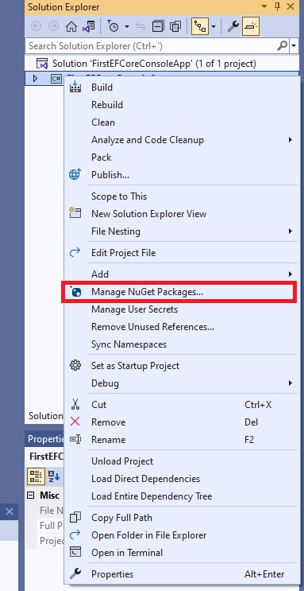
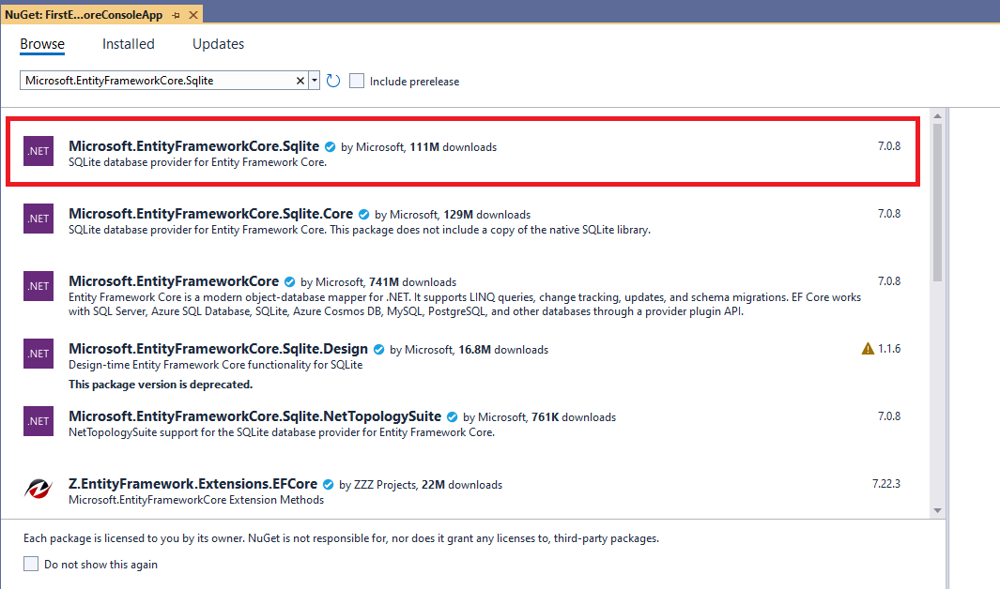
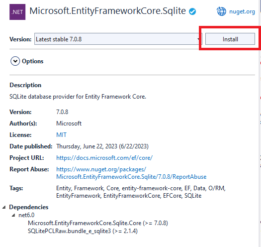
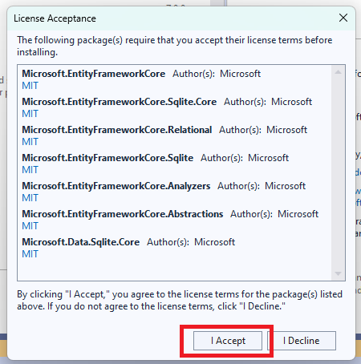
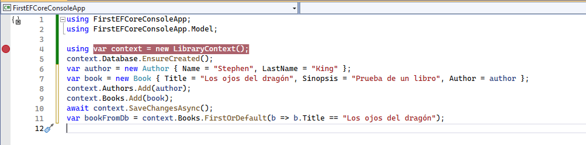
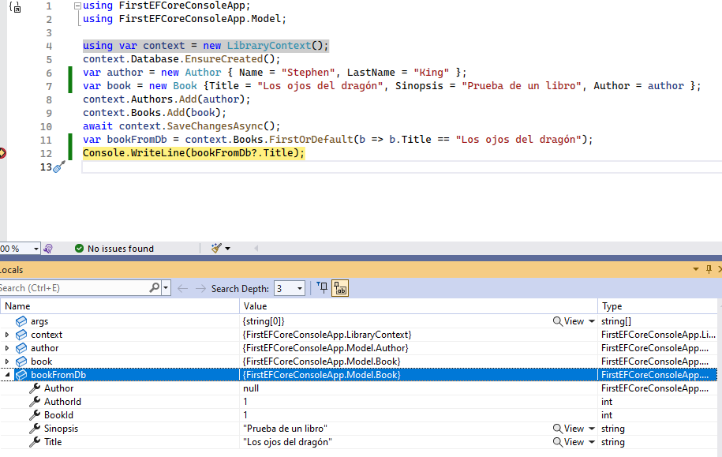

# Aplicación de consola para experimentar

Vamos a crear una aplicación de consola para ver cómo funciona todo esto de Entity Framework Core de forma más práctica.

Lo primero que vamos a hacer es crear nuestro proyecto. Vamos a hacerlo con la interfaz de línea de comandos de .Net, con  la herramienta _dotnet_.

Primero, creamos un directorio:

```console
md FirstEFCoreConsoleApp
```

Y entramos en la nueva carpeta creada:

```console
cd FirstEFCoreConsoleApp
```

Y ahora creamos nuestro proyecto. ¿cómo lo hacemos? Vamos a ejecutar el siguiente comando:

```console
dotnet new console -f net8.0 -n FirstEFCoreConsoleApp
```

Le hemos indicado con el parámetro _f_ la versión de .net que queremos usar y con el parámetro _n_ el nombre del proyecto (hemos utilizado el mismo que para la carpeta)

Tras crear el proyecto, vamos a crear una solución:

```console
dotnet new sln -n FirstEFCoreConsoleApp
```

Ahora, añadimos nuestro proyecto a la solución:

```console
dotnet sln add FirstEFCoreConsoleApp
```

Bueno, vamos a abrir la solución con Visual Studio, para ello ejecutamos el siguiente comando:

```consola
start FirstEFCoreConsoleApp.sln
```

Como podéis ver, es una aplicación de consola vacía. Vamos a instalar el paquete del proveedor de base de datos que necesitamos, en nuestro caso vamos a utilizar _SQLite_. Pulsamos el botón derecho sobre el proyecto y seleccionamos la opción de _Manage Nuget Packages_.



Seleccionamos la pestaña de _browse_ y en la caja de búsqueda introducimos el paquete que queremos instalar: Microsoft.EntityFrameworkCore.Sqlite



Pulsamos en _install_, aceptamos la licencia y ya lo tenemos instalado.





Bien, ahora vamos a empezar a crear nuestro modelo. Para acceder a una base de datos utilizando EntityFrameworkCore necesitamos un modelo. Este modelo está compuesto por clases de entidades donde tenemos lo que es el modelado de la base de datos y un contexto. El contexto es como la sesión con nuestra base de datos y desde el cual vamos a hacer todas las operaciones con ella.

Manos a la obra, vamos a crear una carpeta en nuestro proyecto que se va a llamar _Model_. Dentro crearemos las siguientes clases:

***./Model/Author.cs***

```csharp
namespace FirstEFCoreConsoleApp.Model
{
    public class Author
    {
        public int AuthorId { get; set; }
        public required string Name { get; set; }
        public required string LastName { get; set; }
    }
}
```

***./Model/Book.cs***

```csharp
namespace FirstEFCoreConsoleApp.Model
{
    public class Book
    {
        public int BookId { get; set; }
        public required string Title { get; set; }
        public string? Sinopsis { get; set; }
    }
}
```

Y ahora que ya tenemos las clases creadas vamos a relacionarlas. Empezamos con la clase _Author_, cada autor tendrá una lista de libros asignados, vamos a representarlo en nuestra clase:

***./Model/Author.cs***

```diff
namespace FirstEFCoreConsoleApp.Model
{
    public class Author
    {
        public int AuthorId { get; set; }
        public required string Name { get; set; }
        public required string LastName { get; set; }
+       public List<Book> Books { get; set; } = [];        
    }
}
```

Y para el caso de los libros, solo vamos a permitir que tenga un autor asignado.

***./Model/Book.cs***

```diff
namespace FirstEFCoreConsoleApp.Model
{
    public class Book
    {
        public int BookId { get; set; }
+       public int AuthorId { get; set; }
+       public required Author Author { get; set; }        
        public string Title { get; set; }
        public string Sinopsis { get; set; }
    }
}
```

Como habéis visto, hemos utilizado la palabra clave _required_ a la hora de crear algunas de nuestras propiedades. Esto lo hacemos para evitar advertencias del compilador con respecto a campos nullables, pues nos indica que algunos campos podrían ser null, y por tanto, deberíamos añadirle el operador de nulabilidad *?*. En nuestro caso, como estas propiedades son obligatorias, las marcamos como _required_, lo que obligará a que dichas propiedades estén rellenas cuando se instancie un objeto de nuestras clases.

Bien, y ahora vamos al contexto. Vamos a crear una nueva clase en la carpeta raíz, a la que llamaremos _LibraryContext_.

***./LibraryContext.cs***

```csharp
using FirstEFCoreConsoleApp.Model;
using Microsoft.EntityFrameworkCore;
using System.Reflection;

namespace FirstEFCoreConsoleApp
{
    public class LibraryContext: DbContext
    {
        public DbSet<Author> Authors { get; set; }
        public DbSet<Book> Books { get; set; }

        protected override void OnConfiguring(DbContextOptionsBuilder optionsBuilder) =>
            optionsBuilder.UseSqlite($"Data Source={Path.Combine(AppContext.BaseDirectory, "library.db")}");
    }
}
```

Este contexto que es la sesión con la base de datos hereda de _DBContext_. Y tenemos unas propiedades de tipo _DbSet_, que son genéricas y apuntan al tipo que vamos a añadir, es decir, _Author_ para el caso de autores y _Book_ para el caso de los libros. Por último, tenemos una sobrecarga del método _OnConfiguring_ donde estamos pasando directamente la cadena de conexión. Esto nunca se debería hacer así, lo estamos haciendo en esta aplicación por simplicidad.

Bien, ya lo tenemos y ahora también tenemos que cambiar _Program.cs_, vamos a remplazar el código por el siguiente:

***./Program.cs***

```diff
- // See https://aka.ms/new-console-template for more information
- Console.WriteLine("Hello, World!");
+ using FirstEFCoreConsoleApp;
+ using FirstEFCoreConsoleApp.Model;

+ using var context = new LibraryContext();
+ context.Database.EnsureCreated();
+ var author = new Author { Name = "Stephen", LastName = "King" };
+ var book = new Book { Title = "Los ojos del dragón", Sinopsis = "Prueba de un libro", Author = author };
+ context.Authors.Add(author);
+ context.Books.Add(book);
+ await context.SaveChangesAsync();
+ var bookFromDb = context.Books.FirstOrDefault(b => b.Title == "Los ojos del dragón");
+ Console.WriteLine(bookFromDb?.Title);
```

Vamos a analizarlo. Aquí tenemos nuestro punto de entrada, lo primero que hacemos es crear un contexto, hay que destacar que no le pasamos la cadena de conexión en el constructor porque se está haciendo en la sobreescritura del _OnConfiguring_. En la siguiente línea _context.Database.EnsureCreated_ le estamos diciendo, asegúrate de que la base de datos está creada en función del modelo. Realmente esto es por simplicidad también, aquí deberíamos utilizar migraciones, que ya las veremos más adelante. El siguiente paso es crear un autor y un libro, para luego añadirlos a nuestro contexto. A continuación hacemos un _await_ de _context.SaveChangesAsync_, es decir, guarda el contexto en base de datos (persiste los cambios en la base de datos).

Y para hacer una prueba, obtenemos de la base de datos el libro cuyo título es igual a "los ojos del dragón". Fíjate que aquí estamos utilizando una consulta con Linq.

Bien, vamos a ver si esto funciona al ejecutarlo. Ponemos un punto de parada en la primera línea y pulsamos _F5_. 



Cuando vamos ejecutando paso a paso con _F10_, vamos observando como se va creando el contexto, se crea las entidades de autor y libro, etc... Pero vamos a pararnos después de obtener _bookFromDb_.



Vemos en el visor de variables locales que se ha obtenido de forma correcta el libro.
