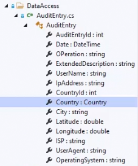

# Incluyendo o excluyendo entidades en nuestro modelo

A la hora de añadir nuestras entidades al modelo de datos, tenemos tres opciones:

- La primera es utilizar un DbSet dentro de nuestro contexto.
- La segunda es utilizar una relación directa con una entidad ya añadida.
- Y la tercera es utilizando la sobrescritura del método OnModelCreating dentro de nuestro contexto.

Vamos a ver esto con un ejemplo. Estamos aquí en el proyecto LibraryManagerWeb. Dentro de DataAccess, hemos creado bastantes entidades nuevas:

- AuditEntry, que nos va a servir para añadir auditoría en el sitio de todas las operaciones que se hagan en la web.
- BookFile, puesto que un libro puede tener distintos ficheros con distintos formatos, por ejemplo, un fichero de Word, un fichero de EPUB, RTF, etc.
- BookFormat, que es el nombre del formato de BookFile.
- Country, que tiene una relación directa con AuditEntry para extraer el país del usuario que realiza una operación.
- PhisicalLibrary, que por ejemplo, nos podría servir para crear una funcionalidad en la que, al buscar un libro, nos diga en qué librería física podemos comprarlo en papel.
- Publisher, que representa a una editorial. Un libro puede tener una editorial y una editorial puede estar asociada a muchos libros.

Bien, si ahora hiciéramos una migración, por ejemplo, usando el comando _donet ef migrations add NewEntities_, veríamos que esa migración está vacía. ¿Por qué? Pues, básicamente, porque no hemos añadido ninguna de estas nuevas entidades utilizando alguna de las opciones que hemos visto anteriormente. Así que vamos a comenzar a añadirlas.

Por ejemplo, vamos a comenzar añadiendo _AuditEntry_ y _BookFile_ utilizando DbSet dentro del contexto.

***./DataAccess/LibraryContext.cs***

```diff
using Microsoft.EntityFrameworkCore;

using System;
using System.Collections.Generic;
using System.Linq;
using System.Threading.Tasks;

namespace LibraryManagerWeb.DataAccess
{
 public class LibraryContext : DbContext
 {
+  public DbSet<BookFile> BookFiles { get; set; }
+  public DbSet<AuditEntry> AuditEntries { get; set; }

   public DbSet<Author> Authors { get; set; }
   public DbSet<Book> Books { get; set; }

   protected override void OnModelCreating(ModelBuilder modelBuilder)
   {
      base.OnModelCreating(modelBuilder);
   }

   public LibraryContext(DbContextOptions<LibraryContext> options): base(options)
   {
   }
 }
}
```

Hemos añadido dos entidades utilizando _DbSet_, pero en realidad estamos añadiendo más entidades, puesto que también se añadirán las entidades que tengan relación directa con estas dos entidades añadidas. Vamos a ver _AuditEntry_.



Pues fíjate, tenemos una relación con Country, por lo cual Country también se va a añadir. Y en BookFile, ¿qué tenemos?


Pues tenemos _BookFormat_. Así que BookFormat también se añadiría.

Ahora bien, vamos a añadir también una relación directa entre Book y Publisher, que no está aún añadida. 

***./DataAccess/Book.cs***

```diff
namespace LibraryManagerWeb.DataAccess
{
  public class Book
  {

    public int BookId { get; set; }

    public int AuthorId { get; set; }

    public Author Author { get; set; }

    public string Title { get; set; }

    public string Sinopsis { get; set; }

+   public required Publisher Publisher { get; set; }
  }
}
```

Y por último vamos a añadir la tabla PhisicalLibraries utilizando la última opción que hemos comentado, que es la de OnModelCreating.

***./DataAccess/LibraryContext.cs***

```diff
using Microsoft.EntityFrameworkCore;

using System;
using System.Collections.Generic;
using System.Linq;
using System.Threading.Tasks;

namespace LibraryManagerWeb.DataAccess
{
 public class LibraryContext : DbContext
 {
   public DbSet<BookFile> BookFiles { get; set; }
   public DbSet<AuditEntry> AuditEntries { get; set; }

   public DbSet<Author> Authors { get; set; }
   public DbSet<Book> Books { get; set; }

   protected override void OnModelCreating(ModelBuilder modelBuilder)
   {
+     modelBuilder.Entity<PhisicalLibrary>();

      base.OnModelCreating(modelBuilder); 
   }

   public LibraryContext(DbContextOptions<LibraryContext> options): base(options)
   {
   }
 }
}
```

Nada más que con esta llamada el _modelBuilder_ es consciente de esta nueva entidad y la va a añadir al modelo. Esto, normalmente, viene acompañado de una configuración, por ejemplo, podríamos hacer un _HasKey_ o un _.properties_ para configurar una propiedad, etc. En teoría, solo con esto, estamos haciendo que la entidad sea parte de nuestro modelo.

Bien, vamos a intentar compilar, y ahora vamos a crear la migración. Nos vamos a la consola y al directorio donde está nuestro _CSPROJ_, por lo cual podemos ejecutar directamente:

```console
 dotnet ef migrations add NewEntities
```

Y ya ha creado la migración. Vamos a verla en Visual Studio. Abrimos el archivo que se a creado con la migración:


Y si hacemos una búsqueda de _CreateTable_, vamos a ver qué tablas ha creado: _BookFormat_, _Country_, _Publisher_, _BookFiles_, _AuditEntries_ y _PhisicalLibraries_.


Como ves, ha añadido todas las entidades que queríamos añadir, pero utilizando las tres opciones que hemos visto al principio.

Ahora, para añadir todas las entidades a nuestra base de datos ejecutamos el comando:

```console
dotnet ef database update
```
