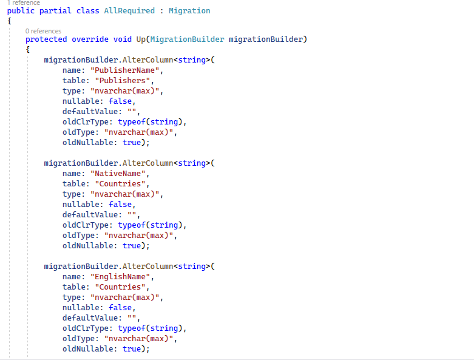

# Propiedades opcionales con Null Reference Types (NRT)

Desde la versión 8.0 de C#, existe una nueva característica muy interesante llamada NRT, o _null reference type_. Cuando activemos esta característica en nuestro proyecto, cualquier tipo por referencia que normalmente admitiría null, va a dejar de admitirlo si no se lo ponemos de forma explícita. Vamos a verlo con un ejemplo.

Estamos en el proyecto _LibraryManagerWeb_. Vamos a pulsar un doble clic sobre el proyecto y se nos abre los _ProperyGroup_.

 

Vamos a crear un _PropertyGroup_ para activar esta característica.

```diff
<Project Sdk="Microsoft.NET.Sdk.Web">

  <PropertyGroup>
    <TargetFramework>net5.0</TargetFramework>
  </PropertyGroup>

  <ItemGroup>
    <PackageReference Include="AutoMapper" Version="10.1.1" />
    <PackageReference Include="AutoMapper.Extensions.Microsoft.DependencyInjection" Version="8.1.1" />
    <PackageReference Include="Microsoft.EntityFrameworkCore.Design" Version="5.0.7">
      <PrivateAssets>all</PrivateAssets>
      <IncludeAssets>runtime; build; native; contentfiles; analyzers; buildtransitive</IncludeAssets>
    </PackageReference>
    <PackageReference Include="Microsoft.EntityFrameworkCore.SqlServer" Version="5.0.7" />
  </ItemGroup>

+ <PropertyGroup>
+    <Nullable>enable</Nullable>
+ </PropertyGroup>
</Project>
```

Compilamos y ya tenemos la _null reference type_ activada.

Vamos a ver que pasa en _AuditEntry_, anteriormente dijimos que un _string_ admite nulos en la base de datos, se traducirá en una columna de tipo _nullable_, pero una vez que hemos activado esta característica la cosa cambia. Por defecto no se permitirán _null_ en los tipos por referencias.

Vamos a vre un caso concreto, _ExtendedDescription_ es un tipo string, pero ahora al estar esta característica activada, si realmente queremos que este string admita nulos, tendríamos que indicarlo de forma explícita.

```diff

namespace LibraryManagerWeb.DataAccess
{
 public class AuditEntry
 {

  public int AuditEntryId { get; set; }

  public DateTime Date { get; set; }

  [Required]
  public string OPeration { get; set; }

  public decimal TimeSpent { get; set; }

- public string ExtendedDescription { get; set; }
+ public string? ExtendedDescription { get; set; }
  
  public string UserName { get; set; }

  public string IpAddress { get; set; }

  public int CountryId { get; set; }

  public Country Country { get; set; }

  public string City { get; set; }

  public double Latitude { get; set; }

  public double Longitude { get; set; }

  public string ISP { get; set; }

  public string UserAgent { get; set; }

  public string OperatingSystem { get; set; }
 }
}

```

Ahora el comportamiento sería como al anterior, este string sí que admitiría nulos, pero, si lo quitamos, esta propiedad ahora es obligatoria. De hecho, ahora todas las propiedades de la base de datos son obligatorias porque no hemos marcado ninguna como _nullable_.

Ahora, vamos a compilar el proyecto, y vamos a generar la migración. Vamos a la consola: 

```shell
dotnet ef migrations add AllRequired. 
```

Vamos a Visual Studio, _Migrations_ y abrimos la migración _AllRequired_. Vamos a ver el método _Up_. Vemos que un montón de campos que antes no eran obligatorios y al activar NRT se han convertido en obligatorios. Así que si usas la característica de NRT _null reference type_, asegúrate de que las propiedades están como realmente quieres que estén.

 