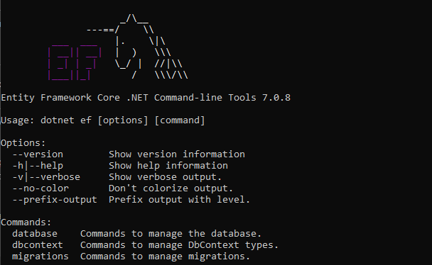

# Herramienta de consola para trabajar con Entity Framework

A lo largo de este curso utilizaremos dos herramientas principales para trabajar con Entity Framework Core, por ejemplo, para crear migraciones, eliminarlas o aplicarlas en una base de datos. Estas dos herramientas son:

- La herramienta que funciona con la CLI de .Net, dotnet ef.
- La consola de paquetes de Visual Studio.

Es preferible la herramienta de consola, puesto que es multiplataforma y no necesitamos depender de Visual Studio para ejecutarla.

Lo primero que tenemos que hacer es instalarla. Para ello ejecutamos el subcomando tool de la CLI de .NET

```console
dotnet tool install -g dotnet-ef
```

Con este comando instalaremos las herramientas de forma global para poder utilizarla en cualquier proyecto.

Para comprobar que la hemos instalado correctamente podemos usar el siguiente comando:

```console
dotnet-ef -v
```

Con este comando obtenemos la versión que tenemos instalada.



Si pasados unos meses queremos actualizar la versión de las herramientas sólo tenemos que ejecutar el siguiente comando:

```console
dotnet tool update -g dotnet-ef
```

Si queremos utilizar esta herramienta en un proyecto, tenemos que instalar en dicho proyecto un paquete adicional: Microsoft.EntityFrameworkCode.Design. Vamos a hacerlo también desde la línea de comandos. En la carpeta del proyecto donde queramos añadir el paquete ejecutamos el siguiente comando:

```console
dotnet add package Microsoft.EntityFrameworkCore.Design
```

A partir de este momento, si en este proyecto configuramos un contexto y una cadena de conexión podremos utilizar la herramienta para manejar las migraciones y las actualizaciones.