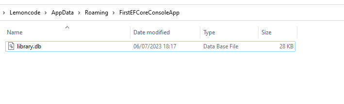
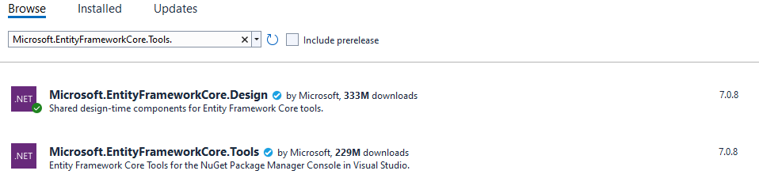
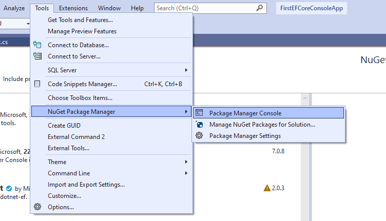

# Migraciones: creando la base de datos a partir del modelado

Cuando comenzamos a trabajar con Entity Framework Core, debemos decidir cual de los enfoques es el más adecuado para nuestra aplicación. Entity Framework Core nos proporcioan dos enfoques principales:

- Ingeniería inversa o scaffolding
- Migraciones

El enfoque a elegir dependerá de nuestra aplicación y del origen de nuestros datos. Por ejemplo, si queremos obtener nuestra base de datos a partir del modelado de un aplicación en .Net, utilizaremos el enfoque de migraciones. Sin embargo, si ya tenemos nuestra base de datos creada, podríamos obtener nuestro modelo utilizando ingeniería inversa o scaffolding.

En el ejemplo anterior vimos el primer enfoque, es decir, creamos nuestra base de datos a partir del modelo creado en .Net. Vamos a modificar el ejemplo para no crear la base de datos cuando ejecutamos la aplicación, tendremos que crear la base de datos nosotros.

***./Program.cs***

```diff
 using FirstEFCoreConsoleApp;
 using FirstEFCoreConsoleApp.Model;

 using var context = new LibraryContext();
- context.Database.EnsureCreated();
+ // context.Database.EnsureCreated();
 var author = new Author { Name = "Stephen", LastName = "King" };
 var book = new Book { Title = "Los ojos del dragón", Sinopsis = "Prueba de un libro", Author = author };
 context.Authors.Add(author);
 context.Books.Add(book);
 await context.SaveChangesAsync();
 var bookFromDb = context.Books.FirstOrDefault(b => b.Title == "Los ojos del dragón");
 Console.WriteLine(bookFromDb?.Title);
```

Vamos a cambiar también la ubicación donde se creará nuestra base de datos. Para ello, modificamos nuestro contexto:

***./LibraryContext.cs***

```diff
using FirstEFCoreConsoleApp.Model;
using Microsoft.EntityFrameworkCore;
using System.Reflection;

namespace FirstEFCoreConsoleApp
{
    public class LibraryContext: DbContext
    {
        public DbSet<Author> Authors { get; set; }
        public DbSet<Book> Books { get; set; }

-       protected override void OnConfiguring(DbContextOptionsBuilder optionsBuilder) =>
-           optionsBuilder.UseSqlite($"Data Source={Path.Combine(Path.GetDirectoryName(Assembly.GetEntryAssembly().Location), "library.db")}");
+       protected override void OnConfiguring(DbContextOptionsBuilder optionsBuilder)
+       {
+           var dbPath = Path.Combine(Environment.GetFolderPath(Environment.SpecialFolder.ApplicationData), "FirstEFCoreConsoleApp", "library.db");
+           var dbDir = Path.GetDirectoryName(dbPath);
+           if (!Directory.Exists(dbDir))
+           {
+               Directory.CreateDirectory(dbDir);
+           }
+           optionsBuilder.UseSqlite($"Data Source={dbPath}");
+       }
    }
}
```

Normalmente, esto no se hace así, sino que tenemos la cadena de conexión a la base de datos en un fichero de configuración _AppSettings.json_, pero en este ejemplo eso funcionará correctamente. Antes de seguir vamos a hacer una _build_ del proyecto para asegurarnos que no tenemos ningún error, pulsamos _Ctrl + b_.

¿Cómo vamos a crear la base de datos? Pues mediante migraciones. Para crear las migraciones podemos utilizar tanto la CLI de .net como la consola de paquetes de _Nuget_ en Visual Studio. Ahora vamos a utilizar la CLI de .Net. Vamos al símbolo del sistema y para poder utilizar la herramienta tendremos que instalar el paquete Microsoft.EntityFrameworkCore.Design. Lo hacemos desde la consola. En la carpeta del proyecto ejecutamos

```console
dotnet add package Microsoft.EntityFrameworkCore.Design
```

Ya lo ha agregado, ahora utilizaremos la herramienta para crear nuestra migración inicial. Pero... ¿Qué es una migración? Una migración es un conjunto de cambios que se guardan en un fichero cs, que define las diferencia que existen en el modelo desde una etapa anterior hasta la etapa actual. Es decir, ahora mismo no tenemos una migración creada anterior, por lo que nuestra migración inicial va a contener todo el modelo de nuestra base de datos. Es decir, la tabla _Authors_ y la tabla _Books_. Vamos a crearla con el siguiente comando:

```console
dotnet ef migrations add InitialMigration
```

Este comando creará la migración y le pondrá el nombre especificado (InitialMigration). En este caso nos encontramos en la carpeta donde se encuentra el _csproj_, por tanto, no tendríamos que especificar ningún parámetro para indicar donde se encuentra el proyecto de inicio y el proyecto con el contexto (en el caso de que sean proyectos diferente).

Ahora si volvemos a nuestra solución, vemos que se ha creado una carpeta llamada _Migrations_ y dentro está nuestra migración, que contiene todos los comandos que se traducirán a _Sqlite_ para crear todas las tablas, relaciones e índices.


Vamos a analizar el fichero de migración que hemos creado. Tiene dos métodos: _Up_ y _Down_. El método _Up_ es el que se ejecutará cuando se inicie la migración, como puedes ver se está creando la dos tablas, con sus columnas, sus _constrains_ o restricciones, las relaciones, por ejemplo entre _Books_ y _Authors_ con la _foreing key_, y también se crean los índices. Y en el método _Down_ se hace lo contrario, es decir, deshacer la migración. Las migraciones nos permiten volver a una versión anterior, revirtiendo los cambios en la base de datos.

Ahora vamos a aplicar la migración para crear la base de datos, basándose en nuestro modelo de .Net. Para ello ejecutamos el siguiente comando en la consola:

```console
dotnet ef database update
```

Ya tenemos aplicada nuestra migración de forma satisfactoria, y podemos ver como se ha creado nuestra base de datos (directorio %appdata%\FirstEFCoreConsoleApp). El fichero _library.db_ tiene un tamaño de 28KB, lo que nos indica que la base de datos tiene contenido, nuestras tablas creadas.



Ahora, volvamos a ejecutar la aplicación para comprobar si todo ha ido bien. Vamos a ejecutar paso a paso para ver que el valor de _bookFromDb_ es el correcto.


Perfecto, ahora imagina que nuestro modelo evoluciona y añadimos un campo nuevo a _Author_ o a _Book_, para actualizar la base de datos con ese cambio tendríamos que crear una migración nueva que reflejase la diferencia entre lo que ahora existe en la base de datos y el nuevo modelo, es decir, el nuevo campo que hemos creado. Luego tendríamos que aplicar la migración en la base de datos para que refleje los últimos cambios del modelo.

Vamos a realizar una actualización del modelo. Modificamos la entidad _Author_:

***./Model/Author.cs***
```diff
using System.ComponentModel.DataAnnotations;

namespace FirstEFCoreConsoleApp.Model
{
    public class Author
    {
        public int AuthorId { get; set; }
        public required string Name { get; set; }
        public required string LastName { get; set; }
+       public string? Biography { get; set; }        
        public List<Book> Books { get; set; } = new List<Book>();
    }
}
```

Bien, ya tenemos el campo nuevo... ¿cómo añadimos este campo a la base de datos para poder utilizarlo? Pues creando una nueva migración. Vamos a hacerlo de forma diferente, en esta ocasión vamos a utilizar la consola de paquetes de _Nuget_. Lo primero que necesitamos es instalar un paquete en el proyecto, _Microsoft.EntityFrameworkCore.Tools_. Vamos al proyecto y pulsamos botón derecho para seleccionar _Manage Nuget Packages_.


Vamos a _Browse_ y ponemos el nombre del paquete _Microsoft.EntityFrameworkCore.Tools_.



Lo seleccionamos, pulsamos instalar y aceptamos la licencia. Ahora vamos a ir a la consola de administración de paquetes. En la barra de menú, vamos a _Tools_, _Nuget Package Manager_ y _Package Manager Console_



Y aquí vamos a utilizar el siguiente comando para crear una nueva migración.

```console
Add-Migration AddAuthorBiography
```

Una ventaja que tenemos con esta consola es que el autocompletado de _powershell_ nos permitirá explorar todos los parámetros disponibles en este comando. Una de las pegas de esta consola es que no es muy accesible para lectores de pantalla. Vamos a comprobar si se ha creado la migración de forma correcta, vamos a la carpeta _Migrations_ y vemos que tenemos un nuevo fichero de migración.


Vamos a actualizar la base de datos, vamos nuevamente a la consola de paquetes de _nuget_ y ejecutamos el siguiente comando:

```console
Update-Database
```

Y vemos que se aplica de forma correcta la modificación.

Ahora vamos a ver como se eliminaría una migración, revirtiendo los cambios en la base de datos. Vamos de nuevo a la consola de _Nuget_ y ejecutamos:

```console
Remove-Migration -Force
```

El parámetro _-Force_ se utiliza para revertir los datos en la base de datos. En este caso es importante, ya que si no lo ponemos nos dará un error, porque ya se han aplicado los cambios en la base de datos y no nos dejará borrar la migración hasta que no se revierta los cambios.

Ahora tenemos la base de datos tal y como estaba antes de aplicar la migración
