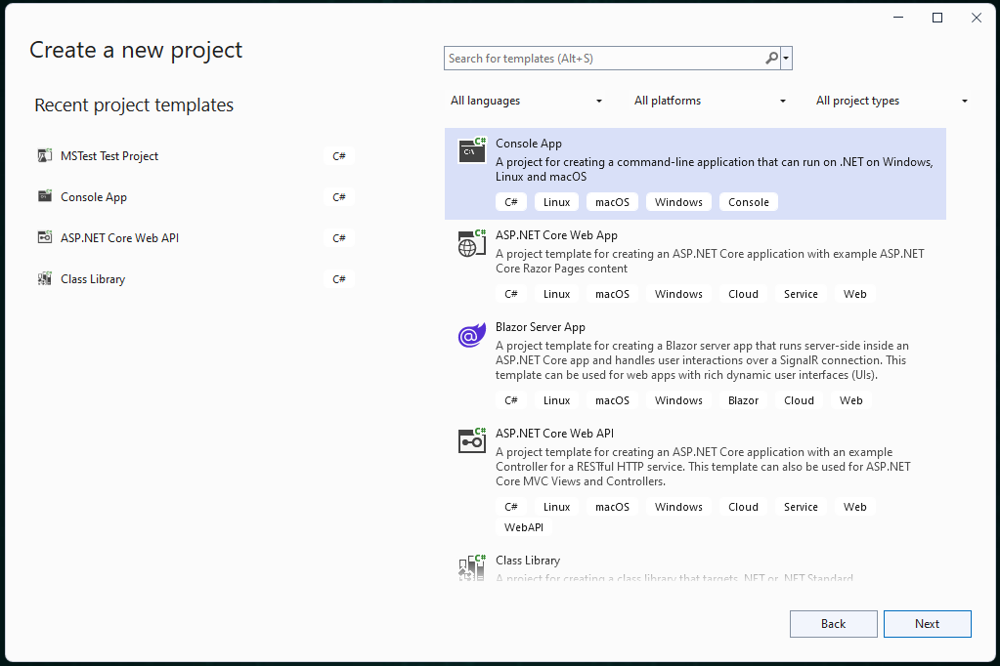
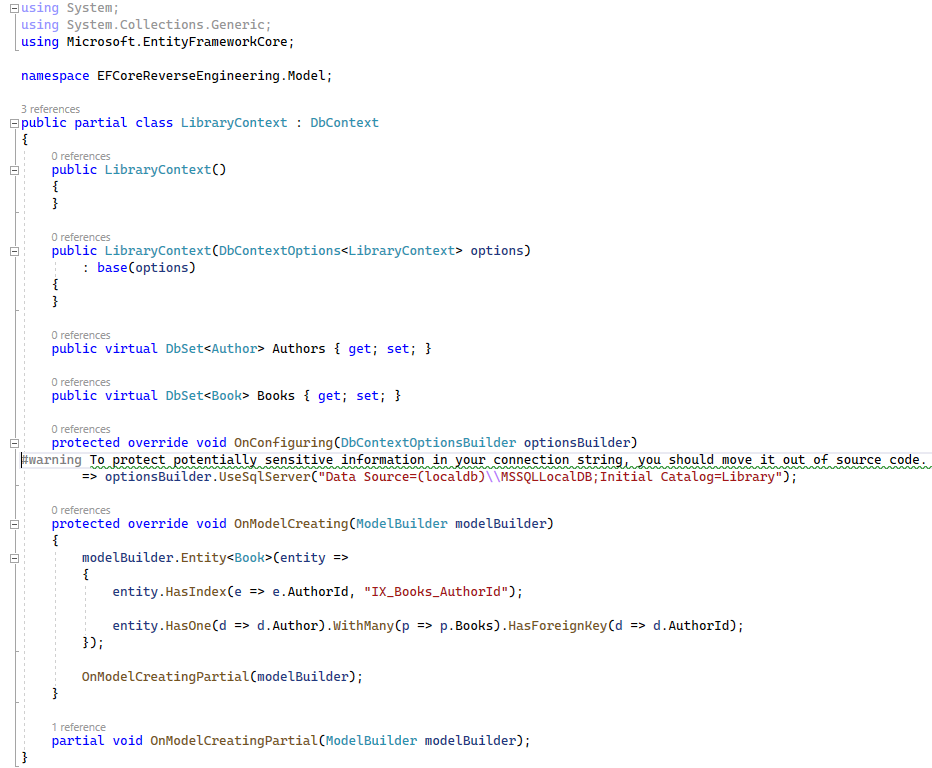
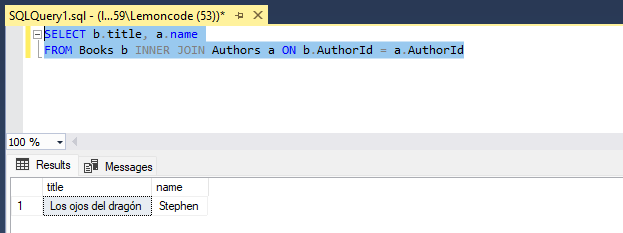

# Ingeniería inversa

Ahora vamos a ver un ejemplo del enfoque de ingeniería inversa, es decir, partimos de una base de datos y queremos obtener el modelo de datos (En el repositorio tenéis un script para crear la base de datos).

Vamos a abrir una instancia de SQL Management Studio, y tenemos una base de datos llamada _Library_. Dentro de _Library_ tenemos nuestras tablas _Authors_ y _Books_ y si expandimos las columnas de ambas tablas podemos ver sus columnas.

Vamos a crear un nuevo proyecto de consola desde Visual Studio que se llame _EFCoreReverseEngineering_.




Como ya hemos aprendido en el ejemplo anterior, vamos a instalar dos paquetes _Nuget_:

- Microsoft.EntityFrameworkCore.Design
- Microsoft.EntityFrameworkCore.SqlServer

Vamos a hacer un _build_ para ver que todo es correcto _Ctrl + b_.

En este ejemplo, vamos a usar el proveedor para base de datos SQL Server, ya que nuestra base de datos es de tipo SQL Server.

Ahora, nuestro siguiente paso es utilizar ingeniería inversa para obtener nuestro contexto y nuestras clases, que representan el modelo que utilizaremos en nuestra aplicación a partir de la base de datos. Para ello, abrimos en una consola la carpeta del proyecto _EFCoreReverseEngineering_ y ejecutamos el siguiente comando:

```console
dotnet ef dbcontext scaffold --output-dir Model "Data Source=(localdb)\MSSQLLocalDB;Initial Catalog=Library" Microsoft.EntityFrameworkCore.SqlServer
```

Vamos a analizar el comando. Con el parámetro _--output-dir Model_ indicamos la carpeta donde se crearán las clases con el modelo, a continuación, le indicamos entre comillas la cadena de conexión a la base de datos, y por último el proveedor de base de datos que vamos a utilizar.

Después de ejecutar el comando, volvemos a Visual Studio. Vamos a la solución y podemos ver que nos ha creado la carpeta _Model_ y dentro las clases _Author_, _Book_ y _LibraryContext_.


Vamos a ver por ejemplo la clase _Author_.


Podemos ver que ha respetado el _namespace_ del proyecto, aunque también se podría especificar como argumento en el comando _dotnet ef_. Se puede ver también en la clase _Author_ que se ha creado un constructor, las propiedades para especificar el autor y la referencia al listado de _Books_.



Y en nuestro contexto _LibraryContext_ podemos ver que se esta configurando mediante _Fuent API_ todas las restricciones que tenía nuestra base de datos. Por ejemplo, en _Author_ se está diciendo que tiene un _index_ y que la propiedad _Name_ es requerida y que tiene un tamaño máximo de 50 caracteres.

Ahora vamos a probar si todo esto funciona correctamente y podemos insertar datos en las tablas, dentro de la base de datos. Vamos a _Program_, eliminamos el código generado de forma automática y escribimos el siguiente código.

***./Program.cs***
```csharp
using EFCoreReverseEngineering.Model;

using var context = new LibraryContext();
var author = new Author { Name = "Stephen", LastName = "King" };
var book = new Book { Title = "Los ojos del dragón", Author = author, Sinopsis = "Esta es la sonopsis del libro." };
context.Authors.Add(author);
context.Books.Add(book);
await context.SaveChangesAsync();
var bookFromDb = context.Books.FirstOrDefault(b => b.Title == "Los ojos del dragón");
if (bookFromDb != null)
{
    context.Books.Remove(bookFromDb);
}
var authorFromDb = context.Authors.FirstOrDefault(a => a.Name == "Stephen");
if (authorFromDb != null)
{
    context.Authors.Remove(authorFromDb);
}
await context.SaveChangesAsync();
```

Vamos a crear un autor y un libro en nuestra base de datos, tal y como hicimos en el ejemplo anterior. Pero en un paso posterior vamos a recuperar el libro cuyo título coincide con "Los ojos del dragón" y lo eliminamos de la base de datos, repitiendo esta operación para el autor cuyo nombre sea "Stephen".

Bien, vamos a depurar este código. Ponemos un punto de parada en la primera línea, y pulsamos _f5_. Vamos ejecutando línea a línea pulsando _f10_, hasta llegar a la línea donde persistimos los cambios (el primer _SaveChangesAsync_). Quedémonos un momento aquí, y vamos a la base de datos para comprobar si se han creado los datos. Para ello, vamos a ejecutar una sentencia simple:

```sql
SELECT b.title, a.name
FROM Books b INNER JOIN Authors a ON b.AuthorId = a.AuthorId
```

Y vemos como tenemos el libro y el autor creados en nuestra base de datos:



Bien, sigamos depurando. Vamos a obtener el libro, y como el libro existe, lo eliminamos del contexto. Igualmente pase con el autor. Finalmente hacemos el _commit_ de la transacción haciendo un _SaveChangesAsync_.

Si ahora ejecutamos de nuevo la consulta en la base de datos, veremos que ya no hay ningún valor dentro de la tabla.


Como has visto, es muy sencillo crear todo nuestro modelo en .Net a partir de una base de datos existente utilizando ingeniería inversa. Si en un futuro nuestra base de datos evoluciona, podemos mantener el modelo actualizado simplemente volviendo a ejecutar el _scaffolding_. Pero ¿Qué ocurre si por cualquier motivo hemos tocado la clase de nuestro modelo? Pues, como esto es código autogenerado, al rehacer el _scaffolding_, nuestros cambios se perderán. Pero no te preocupes, el modelo ya está marcado como _partial_ por lo cual podrías crear clases _partial_ adicionales, para añadir los cambios que necesites, y así al rehacer el _scaffolding_, tus cambios se salvaguardarán.
