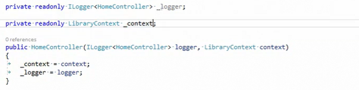

# Contexto en ASP.NET Core

El tiempo de vida del contexto en una aplicación de ASP.NET Core MVC o Web API es el mismo que la petición HTTP que va a ejecutar las operaciones del contexto. Eso suele ser óptimo, puesto que, en una sola petición HTTP, se ejecuta toda la unidad de trabajo. En nuestro ejemplo, se van a ejecutar todas las operaciones de añadir un autor, editar un autor... esto se hace normalmente en una sola petición HTTP, por ejemplo, en un método POST de un controlador.

Para conseguir que nuestro contexto dure lo que dura la petición HTTP, vamos a utilizar el inyector de dependencia que viene embebido con ASP.NET Core.

Vamos a ir a la clase Startup, en el método ConfigureServices, donde configuramos nuestro inyector de dependencias; aquí estamos añadiendo todas las clases que luego, desde otros sitios, podremos pedir en nuestros constructores.

Lo primero que hacemos es añadir los contadores y las vistas y, a continuación, estamos usando la extensión AddDbContext, que es un método de extensión genérico que recibe, como parámetro genérico, el contexto, en este caso, LibraryContext, que es nuestro contexto de base de datos. Lo que vamos a recibir un parámetro que llamaremos _option_. Dicho párametro es un action de tipo DbContextOptionsBuilder que vamos a utilizar para configurar nuestro contexto mediante una expresión lambda. Por ejemplo, podemos decir que vamos a usar _options.UseSqlServer_, es decir, vamos a utilizar el proveedor de SQL Server. Como parámetro, en lugar de poner la cadena de conexión directamente, lo que hacemos es usar el método _Configuration.GetConnectionString_ pasándole como parámetro _DefaultConnection_. ¿Dónde está esta configuración? Pues en ASP.NET Core todo se guarda a nivel de configuración en appsettings.json o en los appsettings del entorno en el que estemos ejecutando la aplicación. en este caso lo vamos a almacenar en appsettings.json. Aquí vemos que tenemos la sección ConnectionStrings con este DefaultConnection.

También activamos el modo login con el método _options.EnableSensitiveLogging_ a _true_, para que cuando Entity Framework Core envíe registros, también envíe el contenido de los parámetros de las consultas, lo cual en producción no es muy adecuado, así que sólo debería estar activado en modo de desarrollo.

Cuando ejecutamos este AddDbContext, automáticamente se está añadiendo el contexto en el inyector de dependencias con un _lifetime scope_, es decir, con un _lifetime_ de la petición HTTP asociada.

Ahora vamos a ver cómo se construye nuestro LibraryContext.

Anteriormente hemos visto que nuestro LibraryContext se construía utilizando el onConfigure y teníamos un constructor sin parámetros. Ahora en LibraryContext  ya no tenemos el método Configure, aquí tenemos un constructor que recibe DbContextOptions de tipo genérico de nuestro LibraryContext, y con estas opciones se las pasamos al constructor base, al constructor del DbContext. Como has visto, esta opción se rellena en Startup, por lo cual el contexto se construye sin problema.

¿Y qué ocurre con las migraciones? ¿Cómo sabe la herramienta de migración cómo construir nuestro contexto? Pues la herramienta de migración, cuando la ejecutamos, por ejemplo, para añadir una migración, lo que hace es ejecutar la función _CreateHostBuilder_ automáticamente que se encuentra dentro de _Program.cs_.

Con _CreateHostBuilder_ obtiene este _IHostBuilder_ y desde aquí saca los servicios, y desde los servicios obtiene el contexto que luego utiliza para crear las migraciones. Sin embargo, en otro tipo de aplicación, como por ejemplo, en aplicaciones de consola, si la herramienta no es capaz de crear el contexto, tenemos que utilizar otra aproximación.

Vamos a ver un _Controller_ por ejemplo el _HomeController_. En el método _index_ podemos ver que se obtienen todos todos los libros de nuestro contexto. Y este contexto, ¿de dónde sale? Pues como hemos utilizado el inyector de dependencias, lo tenemos definido como una propiedad readonly y lo esamos inyectando desde el constructor de nuestro controlador.

En el controlador tenemos tanto el contexto como el sistema de logging. Automáticamente el inyector de dependencias es capaz de construir el controlador, satisfaciendo sus dependencias, en este caso, el logging y el contexto de base de datos.

Bueno, vamos a ejecutar nuestra aplicación pulsando _F5_ y vamos a mirar los logs. Como ves en la consola, vemos que cuando acaba la petición HTTP, lo último que ocurre es que el contexto se elimina, cierra la conexión con la base de datos y, finalmente, la petición finaliza.