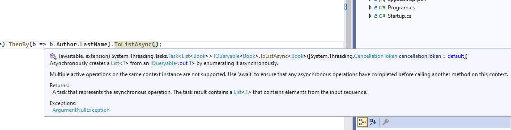

# Operaciones asíncronas en nuestro contexto

Los contextos de base de datos de Entity Framework Core nos proporcionan dos tipos de métodos para gestionar la base de datos: métodos síncronos y métodos asíncronos. Vamos a verlo con un ejemplo.

Abrimos la solución _LibraryManagerWeb_, y vamos al HomeController en el método _Index_.


Este método _Index_ devuelve un IActionResult, una interfaz. Y aquí, por ejemplo, estamos obteniendo todos los libros de la base de datos utilizando el método _ToList_ del _DbContext_. Bueno, aquí estamos haciendo un montón de operaciones, _OrderBy_, _ThenBy_, _ThenB_y, y al final estamos haciendo un _ToList_.

Ese _ToList_ lo que va a hacer es materializar el _IEnumaerable_, que hay subyacente al _IQueryable_. Bueno, en este caso un _IOrderQueryable_ porque estamos haciendo _OrderBy_. Este _ToList_ realmente es el que inyecta en memoria todos los libros de la base de datos, una vez que lo ejecutemos ya no estamos trabajando contra la base de datos, sino con un objeto en memoria. Pues bien, este método _toList_ es síncrono.

Bien, pues tenemos otra variante que es igual _ToList_, pero con el sufijo Async. Es decir, estamos convirtiendo esta operación en asíncrona. Vamos a fijarnos en lo que devuelve:



Ahora es _Task_, del tipo genérico _List_ y subtipo genérico que _TSource_. Bien, casi todos los métodos síncronos tienen su contrapartida en métodos asíncronos. Digo casi todos, porque hay algunos que no, por ejemplo, el _Remove_.

Ahora vamos a convertir todas estas operaciones en operaciones asíncronas. Con la clausua await indicamos que debemos esperar a que la ejecución asincrona termine.

```diff
    public IActionResult Index()
    {
-       var books = _context.Books.OrderBy(b => b.Title).ThenBy(b => b.Author.Name).ThenBy(b => b.Author.LastName).ToList();
+       var books = await _context.Books.OrderBy(b => b.Title).ThenBy(b => b.Author.Name).ThenBy(b => b.Author.LastName).ToListAsync();
        foreach (var b in books)
        {
            b.Title += " (modified)";
        }
        _context.SaveChanges();

        return View();
    }
```

¿Y ahí qué hacemos con el _SaveChanges_?. igual que el _ToList_, también tenemos la contrapartida asíncrona.

```diff
    public IActionResult Index()
    {
        var books = await _context.Books.OrderBy(b => b.Title).ThenBy(b => b.Author.Name).ThenBy(b => b.Author.LastName).ToListAsync();
        foreach (var b in books)
        {
            b.Title += " (modified)";
        }
-       _context.SaveChanges();
+       await _context.SaveChangesAsync();

        return View();
    }
```

Pero falta algo. Tenemos que modificar la firma del método. En lugar de _IActionResult_ tenemos que poner _Task<IActionResult>_, para que este método pueda ejecutar operaciones asíncronas.

```diff
-   public IActionResult Index()
+	public async Task<IActionResult> Index()
    {
        var books = await _context.Books.OrderBy(b => b.Title).ThenBy(b => b.Author.Name).ThenBy(b => b.Author.LastName).ToListAsync();
        foreach (var b in books)
        {
            b.Title += " (modified)";
        }
        await _context.SaveChangesAsync();

        return View();
    }
```

Comprobamos si compila y vemos que no tenemos ningún error y ahora la pregunta del millón. ¿Es realmente más óptima esta forma de hacerlo que utilizar los métodos síncronos? Pues, normalmente en una aplicación web yo diría que sí y te explico por qué. Imagínate, por ejemplo, que nuestra base de datos está en un clúster de _Azure_, y nosotros estamos trabajando desde fuera del clúster, o en otra región. Bueno, básicamente, que por alguna razón la latencia de red sea grande. Cuando obtenemos datos de una base de datos, la latencia de red puede hacer que las operaciones de entrada y salida lleven bastante tiempo.

Cuando hacemos el _ToListAsync_, lo que estamos haciendo es materializando la consulta en un hilo aparte del hilo principal, que es el que está gestionando la petición HTTP. El hilo principal no se queda esperando,como está libre mientras se hace la operación asíncrona, puede gestionar otras peticiones. Así que realmente lo que va a tardar la consulta va a ser, básicamente, igual pero mientras está trabajando en esa consulta el hilo principal puede hacer otras cosas, por lo cual va a poder atender otras peticiones. Si fuera el método asíncrono, el hilo se quedaría aquí parado sin hacer nada, y eso no sería óptimo. Vamos a conseguir exprimir más el poder de nuestro servidor.
