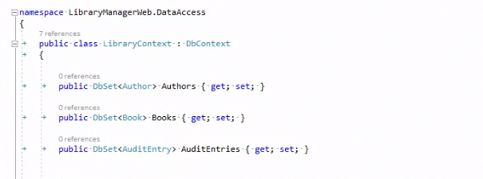

# Convenciones de tablas

Cuando añadimos entidades a nuestro modelo, el nombre de las tablas en la base de datos se obtiene de diferentes formas.

- Si estamos usando un _DbSet_ el nombre será igual al nombre de la propiedad de ese _DbSet_.
- Si estamos añadiendo esa entidad por relación directa con otra entidad añadida, el nombre de la tabla será igual al nombre de la clase.
- Igual ocurre si lo hacemos usando el OnModelCreating, sin añadir explícitamente el nombre de la tabla. En este caso, también cogerán el nombre de la clase.

Vamos a verlo con un ejemplo. Estamos aquí en el proyecto LibraryManagerWeb. Tenemos nuestro modelo dentro de DataAccess. Abrimos el _LibraryContext_ en el que hemos añadido varias entidades usando los _DbSets_.



Para estos _DbSets_ las tablas que se crearán se llamarán _Authors_, _Books_ y _AuditEntries_. ¿Qué ocurrirá con el resto de tablas? Pues que tendrán el nombre de sus clases. Para comprobarlo, vamos a la consola y a aplicar la migración inicial a la base de datos:

```console
dotnet ef database update
```

Perfecto, ya la ha creado. Y ahora vamos abrir _SQL Management Studio_ para ver los nombres de las tablas.


Y aquí en las tablas, comprobamos que _Authors_, _Books_ y _AuditEntries_ se han creado en plural porque se usó el _DbSet_ para crearlas. Pero fíjate, _BookFile_ no está en plural, ¿por qué? Porque se utiliza el nombre de la clase. Lo mismo ocurre con _BookFormat_, _Country_ y _Publisher_. ¿Cómo podemos poner los nombres correctos? Pues lo podemos solucionar de tres formas:

- Usando DbSet
- Usando OnModelCreating,
- Usando DataAnnotations dentro de la propia entidad.

Vamos a comenzar con la DataAnnotations. Vamos a modificarlo para la entidad _BookFormat_,

***./DataAccess/BookFormat.cs***

```diff
+ using System.ComponentModel.DataAnnotations.Schema;

namespace LibraryManagerWeb.DataAccess
{
+ [Table("BookFormats")]
  public class BookFormat
  {

    public int BookformatId { get; set; }

    public required string Name { get; set; }
  }
}
```

Ahora esta Tabla tendrá el nombre correcto gracias a las DataAnnotations.

Vamos a añadir un par de entidades más dentro de nuestros DbSets. 

***./DataAccess/LibraryContext.cs***

```diff
using Microsoft.EntityFrameworkCore;

using System;
using System.Collections.Generic;
using System.Linq;
using System.Threading.Tasks;

namespace LibraryManagerWeb.DataAccess
{
 public class LibraryContext : DbContext
 {
   public DbSet<BookFile> BookFiles { get; set; }
   public DbSet<AuditEntry> AuditEntries { get; set; }

   public DbSet<Author> Authors { get; set; }
   public DbSet<Book> Books { get; set; }

+  public DbSet <BookFile> BookFiles { get; set; } 
+  public DbSet<Publisher> Publishers { get; set; }

   protected override void OnModelCreating(ModelBuilder modelBuilder)
   {
      modelBuilder.Entity<PhisicalLibrary>();

      base.OnModelCreating(modelBuilder); 
   }

   public LibraryContext(DbContextOptions<LibraryContext> options): base(options)
   {
   }
 }
}
```

Y por último, vamos a añadir el nombre de la tabla de _Country_, utilizando la sobreescritura de un OnModelCreating.

***./DataAccess/LibraryContext.cs***

```diff
using Microsoft.EntityFrameworkCore;

using System;
using System.Collections.Generic;
using System.Linq;
using System.Threading.Tasks;

namespace LibraryManagerWeb.DataAccess
{
 public class LibraryContext : DbContext
 {
   public DbSet<BookFile> BookFiles { get; set; }
   public DbSet<AuditEntry> AuditEntries { get; set; }

   public DbSet<Author> Authors { get; set; }
   public DbSet<Book> Books { get; set; }

   public DbSet <BookFile> BookFiles { get; set; } 
   public DbSet<Publisher> Publishers { get; set; }

   protected override void OnModelCreating(ModelBuilder modelBuilder)
   {
      modelBuilder.Entity<PhisicalLibrary>();

+     modelBuilder.Entity<Country>()
+          .toTable("Countries");

      base.OnModelCreating(modelBuilder); 
   }

   public LibraryContext(DbContextOptions<LibraryContext> options): base(options)
   {
   }
 }
}
```

Ya lo tendríamos, compilamos, y vamos a crear la migración.

```console
dotnet ef migrations add RenameTables.
```

Ya la tenemos y ahora la aplicamos a la base de datos:

```console
dotnet ef database update. 
```

Abrimos ahora la base de datos. Refrescamos las tablas con _F5_. Y ya ahora fíjate en los nombres que se han creado:


Tenemos todas las tablas con los nombres correctos. Un último apunte, aquí estamos haciendo mezclas, y las mezclas, como ya sabes, no suelen ser buenas. Estamos utilizando Data Annotations y también Fluent API en OnModelCreating. Cuando estás trabajando en un proyecto real utiliza uno u otro enfoque, pero no mezcles, puesto que puedes crear un código bastante ilegible y caótico.
