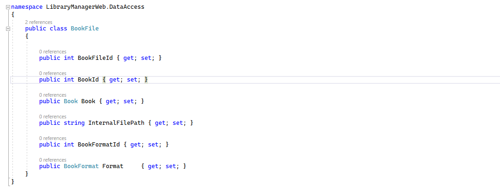

# Nombres de columna

En bases de datos relacionales, el nombre de las columnas de una tabla corresponderá al nombre de esas propiedades dentro de una clase de entidad de .NET. Por ejemplo, aquí estamos en el proyecto _LibraryManagerWeb_ y estamos en la clase _BookFile_. 



La propiedad _BookId_ va a dar como resultado una columna llamada _BookId_ y así sucesivamente con todas las propiedades públicas. Sin embargo, ese comportamiento se puede sobrescribir. Por ejemplo, imagínate que queremos cambiar el nombre de _InternalFilePath_ para que, en base de datos, se llame de otra forma. Por ejemplo, llamémoslo simplemente FilePath. Y aquí, como casi siempre en Entity Framework Core, podemos hacerlo de dos formas: con _Data Annotations_ o con _Fluent API_.

Vamos a comenzar con Data Annotations. ¿Con qué decoramos este campo para cambiarle el nombre? Pues con el atributo _Column_.

```diff
+using System.ComponentModel.DataAnnotations.Schema;

namespace LibraryManagerWeb.DataAccess
{
    public class BookFile
    {

        public int BookFileId { get; set; }

        public int BookId { get; set; }

        public required Book Book { get; set; }

+       [Column("FilePath")]
        public required string InternalFilePath { get; set; }

        public int BookFormatId { get; set; }

        public required BookFormat Format  { get; set; }
    }
}

```

Y ahora, vamos a hacer lo mismo con otra entidad y otro campo utilizando la API fluida. Por ejemplo, en _Publisher_. Pues esta columna, queremos que en base de datos se llame _PublisherName_. Así que ahora nos vamos al contexto _LibraryContext_ y en _OnModelCreating_.

```diff
-  modelBuilder.Entity<Publisher>()
-   .HasComment("Editoriales")
-   .HasData(new[]
+  var publisherEntity = modelBuilder.Entity<Publisher>();
+  publisherEntity.Property(p => p.Name).HasColumnName("PublisherName");

+  publisherEntity.HasData(new[]
   {
    new Publisher { PublisherId = 1, Name = "Entre letras" }
   });
```

Compilamos, y ahora vamos a intentar hacer una migración a ver qué cambios nos muestra. Para ello, nos vamos a la consola y eejecutamos.

```shell
dotnet ef migrations add RenamedColumns
```

Y ahora, vamos a Visual Studio a revisar la migración que nos ha creado. En el método _Up_ está renombrando la columna _Name_ dentro de Publishers por _PublisherName_. Y además, está renombrando _InternalFilePath_, dentro de _BookFiles_, por _FilePath_. Hemos hecho lo mismo, utilizando _Data Annotations_ y _Fluent API_, pero el resultado es exactamente el mismo, utilicemos el enfoque que utilicemos.


