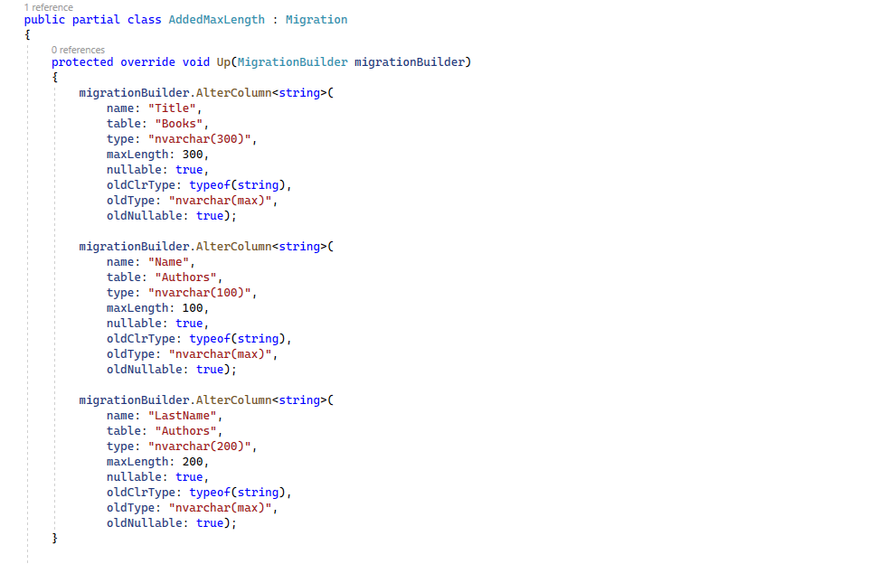

# Tamaño máximo de columnas

En este apartado vamos a ver cómo añadir restricciones de tamaño máximo a las propiedades de nuestro modelo. Esto hará que en nuestra base de datos el tipo de valor de las columnas también cambie, esto es aplicable a matrices y a cadenas, por ejemplo, donde la restricción de tamaño máximo dará que el tipo de valor, por ejemplo, en SQL Server, deje de ser _nvarchar(max)_ y se convierta en _nvarchar_ del tamaño máximo del campo. Vamos a ver esto con un ejemplo.

Abrimos el proyecto _LibraryManagerWeb_. Con respecto a la forma de hacerlo, como siempre, podemos hacerlo con _Data Annotations_ o con _Fluent API_. Comencemos con _Data Annotations_.

Vamos a la clase _Author_ y analizamos la propiedad _Name_.

```csharp
using Microsoft.EntityFrameworkCore;

using System;
using System.Collections.Generic;
using System.ComponentModel.DataAnnotations.Schema;
using System.Linq;
using System.Text;
using System.Threading.Tasks;

namespace LibraryManagerWeb.DataAccess
{
 [Comment("Tabla para almacenar los autores que tienen libros en la biblioteca.")]
 public class Author
 {

  public int AuthorId { get; set; }

  [Column(TypeName = "nvarchar(200")]
  public string Name { get; set; }

  public string LastName { get; set; }

  public List<Book> Books { get; set; } = new List<Book>();

  [NotMapped]
  public DateTime LoadedDate { get; set; }

 }
}
```

Aquí ya tenemos TypeName nvarchar de 200, pero esto no es muy ortodoxo, solo queremos darle una restricción y que sea el proveedor de base de datos el que se encargue en hacer la traducción a tipo de columna. ¿Cómo lo hacemos? Pues con el atributo _MaxLength_.

```diff
using Microsoft.EntityFrameworkCore;

using System;
using System.Collections.Generic;
using System.ComponentModel.DataAnnotations.Schema;
using System.Linq;
using System.Text;
using System.Threading.Tasks;

namespace LibraryManagerWeb.DataAccess
{
 [Comment("Tabla para almacenar los autores que tienen libros en la biblioteca.")]
 public class Author
 {

  public int AuthorId { get; set; }

- [Column(TypeName = "nvarchar(200")]
+ [MaxLength(100)]
  public string Name { get; set; }

  public string LastName { get; set; }

  public List<Book> Books { get; set; } = new List<Book>();

  [NotMapped]
  public DateTime LoadedDate { get; set; }

 }
}
```

Podemos hacer lo mismo con _LastName_, en este caso, de 200.

```diff
using Microsoft.EntityFrameworkCore;

using System;
using System.Collections.Generic;
using System.ComponentModel.DataAnnotations.Schema;
using System.Linq;
using System.Text;
using System.Threading.Tasks;

namespace LibraryManagerWeb.DataAccess
{
 [Comment("Tabla para almacenar los autores que tienen libros en la biblioteca.")]
 public class Author
 {

  public int AuthorId { get; set; }

  [MaxLength(100)]
  public string Name { get; set; }

+ [MaxLength(200)]
  public string LastName { get; set; }

  public List<Book> Books { get; set; } = new List<Book>();

  [NotMapped]
  public DateTime LoadedDate { get; set; }

 }
}
```

Ahora vamos a añadir esta restricción a _Title_ dentro de la tabla de _Books_, pero aquí, en lugar de por _Data Annotations_, hagámoslo con _Fluent API_. Donde siempre, _LibraryContext_ y el método _OnModelCreating_

```diff
-  modelBuilder.Entity<Book>()
-   .Ignore(p => p.LoadedDate)
-   .HasData(new[]
+  var bookEntity = modelBuilder.Entity<Book>();
+  bookEntity.Ignore(p => p.LoadedDate)
+    .Property(p => p.Title).HasMaxLength(300);
+  bookEntity.HasData(new[]
   {
    new Book { BookId = 1, AuthorId = 1, Title = "Los ojos del dragón", Sinopsis = "El libro \"Los ojos del dragón\".", PublisherId = 1 },
    new Book { BookId = 2, AuthorId = 1, Title = "La torre oscura I", Sinopsis = "Es el libro \"La torre oscura I\"." , PublisherId = 1 },
    new Book { BookId = 3, AuthorId = 2, Title = "Yo, robot", Sinopsis = "Es el libro \"Yo, robot\".\"." , PublisherId = 1 }
    });
```

Compilamos. Y ahora, como siempre, vamos a consola para generar la migración. Abrimos una consola en el directorio donde está nuestro _CSPROJ_, y  ejecutamos

```shell
dotnet ef migrations add AddedMaxLength
```

 Vamos a ver el resultado en _Migrations_ y _AddedMaxLength_. ¿Qué tenemos en Up? Pues fíjate, _AlterColumn_, _Title_ de la tabla _Books_ de tipo _nvarchar(300)_. Y lo siguiente es _Name_ de _Authors_, de tipo _nvarchar(100). Y lo mismo con _LastName_ de _Author_. Ya tenemos restricciones de tamaño máximo, que se han traducido en restricciones también de tamaño máximo en las columnas de la base de datos.

 