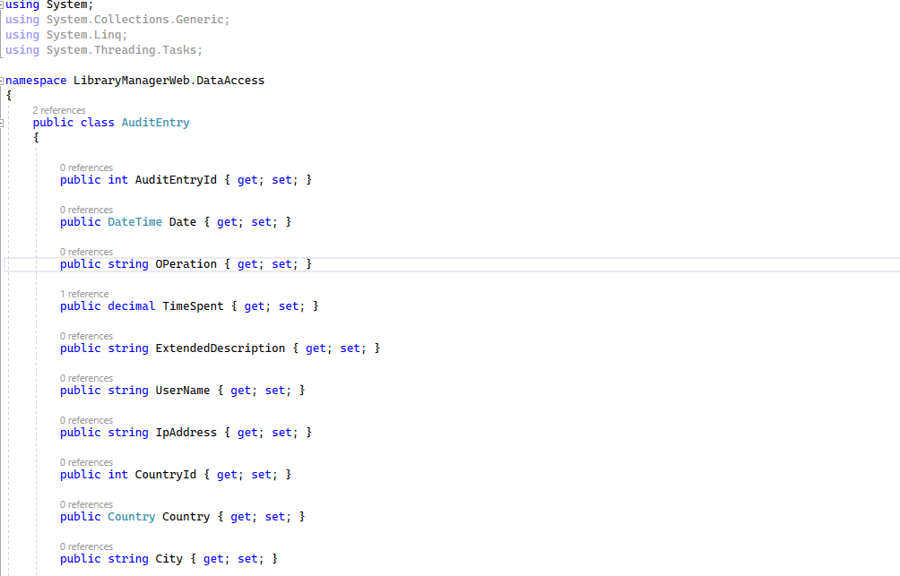

# Propiedades obligatorias y opcionales

Al crear una entidad nueva en Entity Framework Core, todas sus propiedades serán opcionales o no dependiendo del tipo en .NET, es decir, de si acepta o no acepta nulos, siempre recordando que por defecto en los proyectos está activado _NRT_. Vamos a verlo con un ejemplo.

Estamos aquí en el proyecto _LibraryManagerWeb_ y en la clase identidad, AuditEntry.

 

Aquí tenemos, por ejemplo, _AuditEntryId_, que es de tipo int, por lo cual esta columna no va a ser opcional, ya que un _int_ no acepta nulos. Igual ocurre con _DateTime_. ¿Pero y con _OPeration_? Es un tipo _string_ y, por tanto, acepta nulos. Sin embargo, al tener _NTR_ activado por defecto, esta propiedad tampoco aceptará nulos. Para que acepte nulos, deberemos poner el operador de nulabilidad (_?). Esto significa que, cuando se haga la traducción a base de datos, esta columna no va a aceptar valores nulos. ¿Cómo podríamos sobrescribir este comportamiento por convención? Pues utilizando o Data Annotations o Fluent API.

Comencemos con Data Annotations, como siempre. Simplemente tendremos que decorar la propiedad con el atributo _Required_.

```diff
using System;
using System.Collections.Generic;
+using System.ComponentModel.DataAnnotations;
using System.Linq;
using System.Threading.Tasks;

namespace LibraryManagerWeb.DataAccess
{
 public class AuditEntry
 {

  public int AuditEntryId { get; set; }

  public DateTime Date { get; set; }

+ [Required]
  public string? OPeration { get; set; }

  public decimal TimeSpent { get; set; }

  public string ExtendedDescription { get; set; }
  
  public string UserName { get; set; }

  public string IpAddress { get; set; }

  public int CountryId { get; set; }

  public Country Country { get; set; }

  public string City { get; set; }

  public double Latitude { get; set; }

  public double Longitude { get; set; }

  public string ISP { get; set; }

  public string UserAgent { get; set; }

  public string OperatingSystem { get; set; }
 }
}
```

Esta propiedad ahora no es opcional, a pesar de que en .NET sí que admite nulos ya que hemos añadido el operador de nulabilidad.

Ahora, vamos a hacer lo mismo pero con Fluent API. Vamos a _LibraryContext_ y al método _OnModelCreating_. 

```diff
-  modelBuilder.Entity<AuditEntry>()
-   .Property(p => p.TimeSpent)
-   .HasPrecision(20);
+  var auditEntryEntity = modelBuilder.Entity<AuditEntry>();

+  auditEntryEntity.Property(p => p.TimeSpent)
+    .HasPrecision(20);

+  auditEntryEntity.Property(p => p.IpAddress).IsRequired();

   base.OnModelCreating(modelBuilder);
  }
```

En este caso hemos indicado que la propiedad _IpAddress_ no es opcional. En el método _.IsRequired_ podríamos pasarle un _True_ o un _False_, pero si no le ponemos nada, por defecto es _True_.

Guardamos (Control+Shift+S) y compilamos. Y ahora sí vamos a ver qué ocurre cuando hacemos la migración. 

```shell
dotnet ef migrations add AddedMandatoryFields
```

Vamos a Visual Studio _Migrations_ y seleccionamos la migración _AddedMandatoryFields_. Y analizamos el método _Up_, estamos cambiando OPeration a _not null_ y también estamos cambiando IpAddress a _not null_.

 
