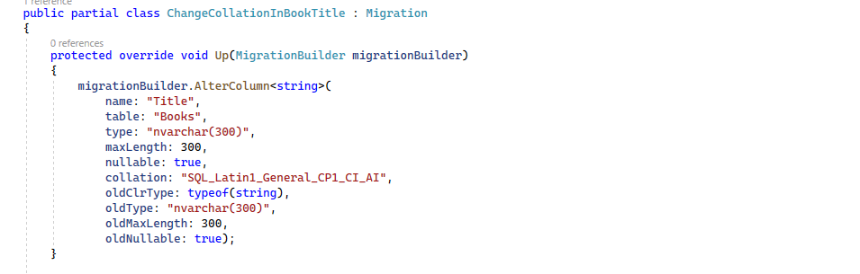

# Cotejos de columna

En bases de datos existe un concepto llamado «collation». Este concepto define cómo una columna se ordena o se compara, por ejemplo, a la hora de hacer una consulta. Cuando creamos una base de datos en SQL Server, por defecto, el _collation_ o cotejo se define como _Latin CI AS_, es decir, _Case Insensitive_ y _Accent Sensitive_, insensible a mayúsculas pero sensible a acentos.

Bien, vamos a cambiar este comportamiento forzando un _collation_ de _accent insensitive_ en la columna _Title_ de nuestra entidad de _Book_. Esto es otra de esas cosas que aún no se puede hacer con _Data Annotations_, así que hay que hacerlo con _Fluent API_. Vamos aquí a nuestro contexto _LibraryContext_, y al método _OnModelCreating_. Vamos añadir la siguiente linea de código:

```diff
   var bookEntity = modelBuilder.Entity<Book>();
   bookEntity.Ignore(p => p.LoadedDate)
    .Property(p => p.Title).HasMaxLength(300);

+  bookEntity.Property(p => p.Title)
+   .UseCollation("SQL_Latin1_General_CP1_CI_AI");

   bookEntity.HasData(new[]
   {
    new Book { BookId = 1, AuthorId = 1, Title = "Los ojos del dragón", Sinopsis = "El libro \"Los ojos del dragón\".", PublisherId = 1 },
    new Book { BookId = 2, AuthorId = 1, Title = "La torre oscura I", Sinopsis = "Es el libro \"La torre oscura I\"." , PublisherId = 1 },
    new Book { BookId = 3, AuthorId = 2, Title = "Yo, robot", Sinopsis = "Es el libro \"Yo, robot\".\"." , PublisherId = 1 }
   });
```

Es decir, ahora hemos convertido este _collation_ en _accent insensitive_ también.

Bien, compilamos y vamos a generar la migración. Vamos a la consola:

```shell
dotnet ef migrations add ChangeCollationInBookTitle
```

Ha generado la migración y vamos a ver la migracion.



Ya podríamos buscar con y sin acentos porque hemos cambiado el cotejo de esa columna. También con Entity Framework Core podemos cambiar el collation directamente a nivel de base de datos, utilizando el UseCollation directamente desde ModelBuilder.
