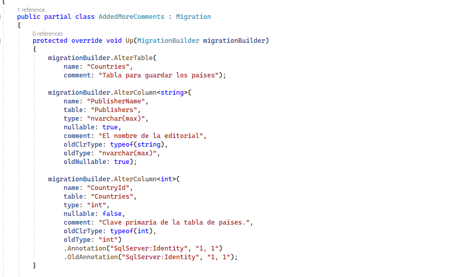

# Comentarios en columnas

Anteriormente, hemos visto cómo introducir comentarios en nuestras entidades, que se traducen en comentarios en los esquemas de base de datos. Ahora vamos a ver cómo introducir esos comentarios también a nivel de propiedad o columna. Por ejemplo, abrimos el proyecto _LibraryManagerWeb_, y  vamos a _Country_. Añadimos un comentario a nivel de esquema:

```diff
+using Microsoft.EntityFrameworkCore;

using System;
using System.Collections.Generic;
using System.Linq;
using System.Threading.Tasks;

namespace LibraryManagerWeb.DataAccess
{
+   [Comment("Tabla para guardar los países")]
    public class Country
    {

        public int CountryId { get; set; }

        public string NativeName { get; set; }

        public string EnglishName { get; set; }
    }
}
```

¿Pero y si queremos hacerlo a nivel de columna? Pues es exactamente igual. Simplemente aplicamos el atributo a la columna.  

```diff
using Microsoft.EntityFrameworkCore;

using System;
using System.Collections.Generic;
using System.Linq;
using System.Threading.Tasks;

namespace LibraryManagerWeb.DataAccess
{
   [Comment("Tabla para guardar los países")]
    public class Country
    {
+       [Comment("Clave primaria de la tabla de países.")]
        public int CountryId { get; set; }

        public string NativeName { get; set; }

        public string EnglishName { get; set; }
    }
}
```

¿Y cómo haríamos esto con API fluida? Pues exactamente igual que lo hacíamos a nivel de tabla, solo que aplicándolo a una propiedad. Vamos a _LibraryContext_ y en _OnModelCreating_ vamos a poner un comentario a una propiedad de _PublisherEntity_, por ejemplo.

```diff
   var publisherEntity = modelBuilder.Entity<Publisher>();
   publisherEntity.Property(p => p.Name).HasColumnName("PublisherName");
+  publisherEntity.Property(p => p.Name).HasComment("El nombre de la editorial");
```

Guardamos y compilamos, y a continuación generar la migración. En consola:

```shell
dotnet ef migrations add AddedMoreComments
```

Ya lo ha añadido y ahora podemos ver aquí en _Migrations_ que, efectivamente, tenemos aquí nuestras dos columnas con los comentarios.

