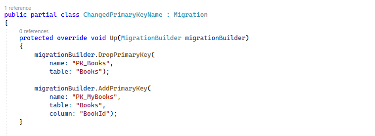

# Claves primarias

Vamos a ver cómo configurar las claves en nuestras entidades o tablas en base de datos. Una clave sirve como identificador único de una instancia de entidad o de una fila dentro de una tabla de base de datos, por ejemplo, en el caso de nuestros libros tendremos seguro un Book ID, que será único por cada uno de ellos.

Bien, vamos a ver cómo configurar las claves primarias en Entity Framework Core. Abrimos nuestro proyecto _LibraryManagerWeb_. Estamos en la entidad _Author_ y aquí tenemos un campo llamado _AuthorId_.


En Entity Framework Core tenemos dos formas de definir nuestras claves primarias, de forma explícita o de forma implícita. De forma implícita se hace por convención y Entity Framework Core tiene dos convenciones para detectar claves primarias:

- La propiedad se tiene que llamar Id
- La propiedad se tiene que llamar **Type**Id

En este caso, _Type_ es Author, por tanto, buscará propiedades que se llamen o AuthorId, o directamente, Id. Al encontrar AuthorId, la selecciona como candidata para ser clave primaria.

Además, es de tipo _int_, por lo cual, en SQL Server será de tipo _identity_, autogenerando el valor al añadirla. Pero ¿qué ocurre si queremos definir de forma explícita nuestra clave primaria? Pues nada más sencillo que decorar la propiedad utilizando el atributo _Key_, así nos aseguramos de que Entity Framework entiende cuál es la clave primaria de nuestra entidad, aunque por convención no sea capaz de detectarla.

***./DataAccess/Author.cs***

```diff
using Microsoft.EntityFrameworkCore;

using System;
using System.Collections.Generic;
using System.ComponentModel.DataAnnotations;
using System.ComponentModel.DataAnnotations.Schema;
using System.Linq;
using System.Text;
using System.Threading.Tasks;

namespace LibraryManagerWeb.DataAccess
{
 [Comment("Tabla para almacenar los autores que tienen libros en la biblioteca.")]
 public class Author
 {

+   [Key]
    public int AuthorId { get; set; }

    [MaxLength(100)]
    public string Name { get; set; }

    [MaxLength(200)]
    public string LastName { get; set; }

    public List<Book> Books { get; set; } = new List<Book>();

    [NotMapped]
    public DateTime LoadedDate { get; set; }

    }
}
```

¿Cómo lo haríamos con API fluida? Pues vamos a _LibraryContext_ al método, _OnModelCreating_. Y por ejemplo, vamos a hacerlo en la entidad _Book_. Incluso podríamos cambiarle el nombre que se le asigna por defecto a la relación usando el método _.HasName_.

***./DataAccess/LibraryContext.cs***

```diff
    var bookEntity = modelBuilder.Entity<Book>();
+   bookEntity.HasKey(p => p.BookId)
+       .HasName("PK_MyBooks");
```

Pero ¿qué ocurre si de repente se nos ocurre que este BookId no nos gusta y que queremos crear una clave primaria compuesta? ¿Qué significa esto? Pues nuestra clave va a estar compuesta por varios campos. Por ejemplo, podemos decir que nuestra clave primaria dentro de Books puede ser el AuthorId y el Title del Book, puesto que un autor se supone que nunca va a escribir dos novelas con exactamente el mismo título, así que, ¿cómo lo haríamos? Pues aquí, en lugar de utilizar directamente la lambda para devolver la propiedad, creamos un objeto anónimo, que va a contener las dos propiedades.

***./DataAccess/LibraryContext.cs***

```diff
    var bookEntity = modelBuilder.Entity<Book>();
-   bookEntity.HasKey(p => p.BookId)
+   bookEntity.HasKey(p => new {p.AuthorId, p.Title} )
       .HasName("PK_MyBooks");
```

Y así ya tendríamos creada nuestra clave compuesta en lugar de utilizar el BookId, pero como para crear relaciones con esto después puede ser un poco infierno, vamos a deshacer este cambio.

***./DataAccess/LibraryContext.cs***

```diff
    var bookEntity = modelBuilder.Entity<Book>();
+   bookEntity.HasKey(p => p.BookId)
-   bookEntity.HasKey(p => new {p.AuthorId, p.Title} )
       .HasName("PK_MyBooks");
```

Bien, ahora vamos a crear la migración. Vamos a la consola:

```shell
dotnet ef migrations add ChangedPrimaryKeyName
```

Solo va a cambiar el nombre, puesto que los dos campos en los que de forma explícita le hemos dicho qué es la clave primaria, ya estaban siéndolo por convención. Vamos a ver si esto funciona. Abrimos la migración en Visual Studio. La migración elimina la clave primaria antigua de Books y la vuelve a crear, esta vez, con un nombre explícito.


