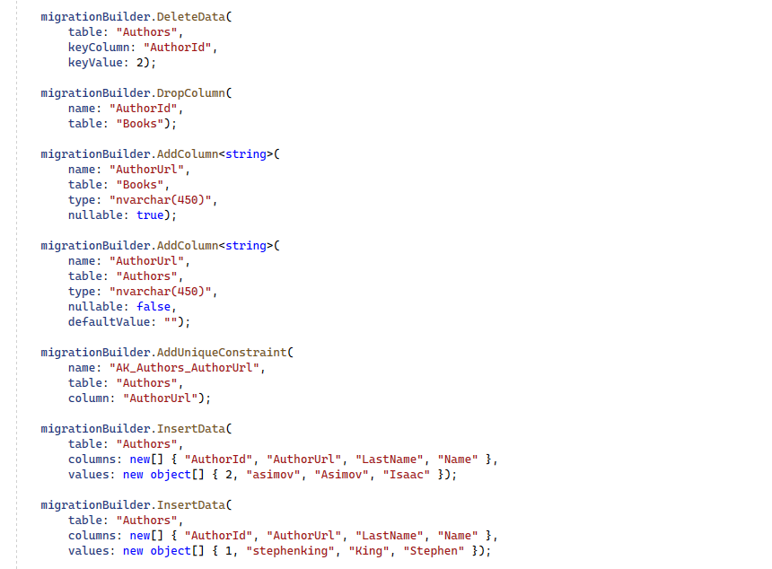

# Claves alternativas

Además de las claves primarias, en Entity Framework Core, también podemos definir columnas como claves alternativas, que también sirven como identificadores únicos para cada instancia de una entidad o para cada fila dentro de una tabla. Esto es interesante, por ejemplo, cuando en una relación entre dos tablas, en uno de los dos lados, no se está usando la clave primaria de la otra tabla. Por tanto, habrá que definir también una clave alternativa que sea única para poder establecer esa relación.

Vamos a verlo con un ejemplo. Abrimos el proyecto _LibraryManagerWeb_. Nosotros tenemos una relación entre autor y libros. Un autor puede tener n libros y un libro puede tener un autor. Anteriormente, por convención, la relación se estaba realizando utilizando la clave primaria de _Authors_, _Authorld_, pero ahora vamos a cambiar un poco esto.

Creamos una propiedad nueva llamada _AuthorUrl_, una URL que utilizaremos para almacenar la página personal del autor dentro de nuestra biblioteca.

***./DataAccess/Author.cs***

```diff
using Microsoft.EntityFrameworkCore;

using System;
using System.Collections.Generic;
using System.ComponentModel.DataAnnotations;
using System.ComponentModel.DataAnnotations.Schema;
using System.Linq;
using System.Text;
using System.Threading.Tasks;

namespace LibraryManagerWeb.DataAccess
{
 [Comment("Tabla para almacenar los autores que tienen libros en la biblioteca.")]
 public class Author
 {

  [Key]
  public int AuthorId { get; set; }

  [MaxLength(100)]
  public string Name { get; set; }

  [MaxLength(200)]
  public string LastName { get; set; }

+ public string AuthorUrl { get; set; }

  public List<Book> Books { get; set; } = new List<Book>();

  [NotMapped]
  public DateTime LoadedDate { get; set; }

 }
}
```

Imagina que nuestro autor se puede dar de alta y poner una URL personalizada y esa URL tiene que ser única. Esto a lo mejor no tiene mucho sentido, pero como ejemplo nos vale. Ahora vamos a cambiar la relación para que en lugar de utilizar _Authorld_ dentro de _Books_ utilicemos _AuthorUrl_.

***./DataAccess/Book.cs***

```diff
using Microsoft.EntityFrameworkCore;

using System;
using System.Collections.Generic;
using System.Linq;
using System.Text;
using System.Threading.Tasks;

namespace LibraryManagerWeb.DataAccess
{
 [Comment("Tabla para almacenar los libros existentes en esta biblioteca.")]
 public class Book
 {

  public int BookId { get; set; }

- public int AuthorId { get; set; }
+ public string AuthorUrl { get; set; }

  public Author Author { get; set; }

  public string Title { get; set; }

  public string Sinopsis { get; set; }

  public DateTime LoadedDate { get; set; }

  public List<BookFile> BookFiles { get; set; }

  public int PublisherId { get; set; }

  public Publisher Publisher { get; set; }

  public List<BookRating> Ratings { get; set; }

 }
}

```

En lugar de _Authorld_ de tipo _int_, hemos cambiado esto por _AuthorUrl_ de tipo _string_, que será igual que el _AuthorUrl_ del autor al que estamos relacionando esta entidad. ¿Cómo definimos esta relación? Aunque lo veremos más adelante, vamos a verlo en el contexto de nuestra base de datos.

***./DataAccess/LibraryContext.cs***

```diff
-  modelBuilder.Entity<Author>()
-   .HasData(new[]
+  var authorEntity = modelBuilder.Entity<Author>();
+  authorEntity.HasMany(p => p.Books)
+   .WithOne(b => b.Author)
+   .HasForeignKey(p => p.AuthorUrl)
+   .HasPrincipalKey(p => p.AuthorUrl);
+  authorEntity.HasData(new[]
   {
    new Author { AuthorId = 1, Name = "Stephen", LastName = "King", AuthorUrl = "stephenking" },
    new Author { AuthorId = 2, Name = "Isaac", LastName = "Asimov", AuthorUrl = "asimov" }
    });
```

Por convención, Entity Framework Core nos creará una clave alternativa, que en realidad se traduce en base de datos a un índice único para poder manejar esta relación. Igualmente, si queremos crear una clave alternativa sin tener que crear una relación, también podemos hacerlo:

***./DataAccess/LibraryContext.cs***

```diff
   var authorEntity = modelBuilder.Entity<Author>();
   authorEntity.HasMany(p => p.Books)
    .WithOne(b => b.Author)
    .HasForeignKey(p => p.AuthorUrl)
    .HasPrincipalKey(p => p.AuthorUrl);
+  authorEntity.HasAlternateKey(p => p.AuthorUrl);
   authorEntity.HasData(new[]
   {
    new Author { AuthorId = 1, Name = "Stephen", LastName = "King", AuthorUrl = "stephenking" },
    new Author { AuthorId = 2, Name = "Isaac", LastName = "Asimov", AuthorUrl = "asimov" }
    });
```

En este caso, no hace falta, porque ya la he creado por convención al utilizar esta propiedad como parte de la relación, pero si no tuviéramos relación, podríamos hacerlo así. Vamos a eliminarla por dejar el código mas simple.

***./DataAccess/LibraryContext.cs***

```diff
   var authorEntity = modelBuilder.Entity<Author>();
   authorEntity.HasMany(p => p.Books)
    .WithOne(b => b.Author)
    .HasForeignKey(p => p.AuthorUrl)
    .HasPrincipalKey(p => p.AuthorUrl);
-  authorEntity.HasAlternateKey(p => p.AuthorUrl);
   authorEntity.HasData(new[]
   {
    new Author { AuthorId = 1, Name = "Stephen", LastName = "King", AuthorUrl = "stephenking" },
    new Author { AuthorId = 2, Name = "Isaac", LastName = "Asimov", AuthorUrl = "asimov" }
    });
```

Vamos a generar la migración. Guardamos y compilamos. Ejecutamos en una consola el siguiente comando:

```shell
dotnet ef migrations add AddedAlternateKey
```

Vamos a ver la migración. Fíjate, ha hecho un montón de cosas porque hemos hecho un montón de cambios. Está borrando _foreign keys_ y los índices. Vamos a buscar el índice que ha creado, que por convención se llama _AK_Authors_AuthorUrl_, en la tabla _Authors_, en la columna AuthorUrl.


