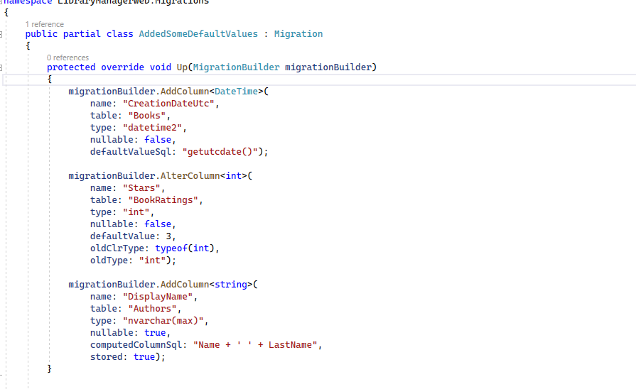

# Valores generados

Cuando insertamos una entidad en nuestra base de datos, es posible que queramos insertar algunas columnas con valores por defecto. Vamos a ver qué patrones nos ofrece Entity Framework Core para hacer estas operaciones.

Abrimos el proyecto de ejemplo _LibraryManagerWeb_. Vamos a hacer algunos cambios en nuestro contexto. Por ejemplo, en la tabla _BookRating_ vamos a poner un valor por defecto en la columna _Stars_.

***./DataAccess/LibraryContext.cs***

```diff

   var bookRatingEntity = modelBuilder.Entity<BookRating>();
+  bookRatingEntity.Property(p => p.Stars).HasDefaultValue(3);
   bookRatingEntity.HasData(new[]
   {
    new BookRating { BookRatingId = 1, BookId = 1, Username = "juanjo", Stars = 5 },
    new BookRating { BookRatingId = 2, BookId = 1, Username = "Lola", Stars = 3 },
    new BookRating { BookRatingId = 3, BookId = 1, Username = "Silvia", Stars = 4 },
    new BookRating { BookRatingId = 4, BookId = 1, Username = "Diego", Stars = 2 },
    new BookRating { BookRatingId = 5, BookId = 2, Username = "juanjo", Stars = 4 },
    new BookRating { BookRatingId = 6, BookId = 2, Username = "Lola", Stars = 2 },
    new BookRating { BookRatingId = 7, BookId = 2, Username = "Silvia", Stars = 5 },
    new BookRating { BookRatingId = 8, BookId = 2, Username = "Diego", Stars = 5 }
    });
```

Ahora, cuando se inserte una fila en esta tabla, si no se le pone un valor a esta columna, automáticamente por defecto, con el método _HasDefaultValue_ dentro de la propiedad, le estamos diciendo que el valor por defecto va a ser 3.

Pero imagínate que nuestro campo no tiene que tener un valor estático, queremos calcular el valor por defecto en la inserción. Pues también podemos indicar una sentencia SQL en el valor por defecto, vamos a hacerlo en la entidad de Libros.

***./DataAccess/LibraryContext.cs***

```diff
   var bookEntity = modelBuilder.Entity<Book>();
   bookEntity.HasKey(p => p.BookId);

+  bookEntity.Property(p => p.CreationDateUtc).HasDefaultValueSql("getutcdate()");
   bookEntity.Ignore(p => p.LoadedDate)
   .Property(p => p.Title).HasMaxLength(300);

   bookEntity.Property(p => p.Title)
    .UseCollation("SQL_Latin1_General_CP1_CI_AI");

   bookEntity.HasData(new[]
   {
    new Book { BookId = 1, AuthorUrl = "stephenking", Title = "Los ojos del dragón", Sinopsis = "El libro \"Los ojos del dragón\".", PublisherId = 1 },
    new Book { BookId = 2, AuthorUrl= "stephenking", Title = "La torre oscura I", Sinopsis = "Es el libro \"La torre oscura I\"." , PublisherId = 1 },
    new Book { BookId = 3, AuthorUrl= "asimov", Title = "Yo, robot", Sinopsis = "Es el libro \"Yo, robot\".\"." , PublisherId = 1 }
    });

```

Cuando insertemos una fila, si no se proporciona un valor al campo CreationDateUtc, se calculará el valor por defecto llamando a esta sentencia SQL.

También podemos tener los denominados campos calculados. Son columnas que se calculan, normalmente, en tiempo de inserción o incluso en tiempo de consulta. Vamos a verlo en _Author_, vamos a crear una nueva propiedad que es DisplayName, que es la unión del nombre y los apellidos.

***./DataAccess/LibraryContext.cs***

```diff
   var authorEntity = modelBuilder.Entity<Author>();
   authorEntity.HasMany(p => p.Books)
    .WithOne(b => b.Author)
    .HasForeignKey(p => p.AuthorUrl)
    .HasPrincipalKey(p => p.AuthorUrl);
+  authorEntity.Property(p => p.DisplayName).HasComputedColumnSql("Name + ' ' + LastName", stored: true);
   authorEntity.HasData(new[]
   {
    new Author { AuthorId = 1, Name = "Stephen", LastName = "King", AuthorUrl = "stephenking" },
    new Author { AuthorId = 2, Name = "Isaac", LastName = "Asimov", AuthorUrl = "asimov" }
    });
```

Además, podemos indicar si queremos que esta columna computada se guarde o no, es decir, si no se guarda se calculará en tiempo de consulta, y si sí que se guarda, es una columna persistente aunque no se puede modificar. Se guarda cuando se inserta y se mantendrá así hasta que no haya una actualización en los campos que se han usado para calcular la columna. Este _stored_ se puede poner a _true_ si queremos persistir la columna, y a _false_ si queremos que se autocalcule.

Y ya por último vamos a ver cómo generar valores, por ejemplo, en una clave primaria. Aquí en nuestra entidad _AuditEntry_ tenemos nuestro campo _AuditEntryId_.

***./DataAccess/AuditEntry.cs***

```diff
using System;
using System.Collections.Generic;
using System.ComponentModel.DataAnnotations;
using System.ComponentModel.DataAnnotations.Schema;
using System.Linq;
using System.Threading.Tasks;

namespace LibraryManagerWeb.DataAccess
{
 public class AuditEntry
 {

+ [DatabaseGenerated(DatabaseGeneratedOption.Identity)]
  public int AuditEntryId { get; set; }

  public DateTime Date { get; set; }

  [Required]
  public string OPeration { get; set; }

  public decimal TimeSpent { get; set; }

  public string ExtendedDescription { get; set; }
  
  public string UserName { get; set; }

  public string IpAddress { get; set; }

  public int CountryId { get; set; }

  public Country Country { get; set; }

  public string City { get; set; }

  public double Latitude { get; set; }

  public double Longitude { get; set; }

  public string ISP { get; set; }

  public string UserAgent { get; set; }

  public string OperatingSystem { get; set; }
 }
}
```

Esto es una clave primaria por convención, y además, al ser de tipo _Id_, automáticamente se va a aplicar la generación de una entity en SQL Server, por lo cual este valor va a ser autoincremental, así que esto que hemos puesto va a ser totalmente innecesario puesto que ya lo está haciendo por convención, pero aquí te lo enseño.

Para hacer lo mismo con Fluent API, volvemos a _LibraryContext_, y dentro de _Author_, vamos a la propiedad _AuthorId_.

***./DataAccess/LibraryContext.cs***

```diff
   var authorEntity = modelBuilder.Entity<Author>();
   authorEntity.HasMany(p => p.Books)
    .WithOne(b => b.Author)
    .HasForeignKey(p => p.AuthorUrl)
    .HasPrincipalKey(p => p.AuthorUrl);
+  authorEntity.Property(p => p.AuthorId).ValueGeneratedOnAdd();
   authorEntity.Property(p => p.DisplayName).HasComputedColumnSql("Name + ' ' + LastName", stored: true);
   authorEntity.HasData(new[]
   {
    new Author { AuthorId = 1, Name = "Stephen", LastName = "King", AuthorUrl = "stephenking" },
    new Author { AuthorId = 2, Name = "Isaac", LastName = "Asimov", AuthorUrl = "asimov" }
    });
```

Esta propiedad es también primaria y no haría falta poner esto porque por defecto ya lo hace. Estamos indicando que cuando se añade una fila, este valor se va a generar automáticamente. En este caso, al ser un Id le pondrá un autoincremental.

Vamos a generar la migración. Guardamos y compilamos. Ejecutamos en una consola el siguiente comando:

```shell
dotnet ef migrations add AddedSomeDefaultValues
```

Vamos a ver la migración.


