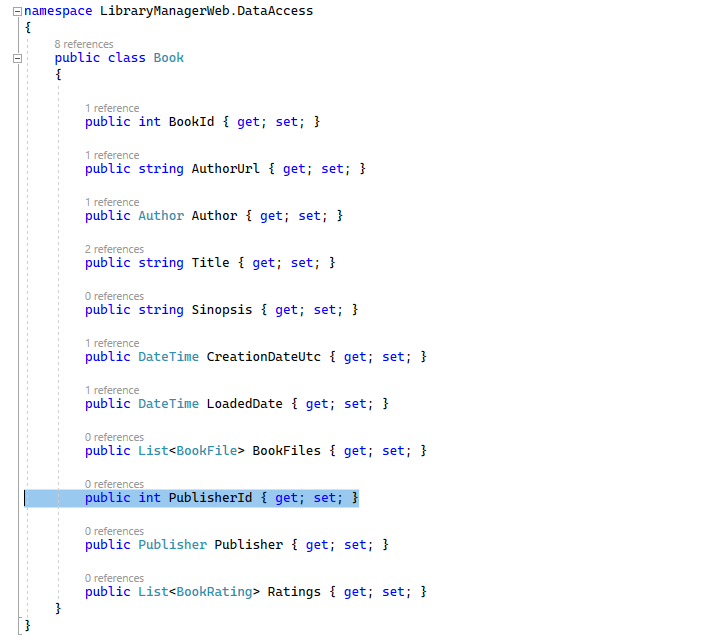
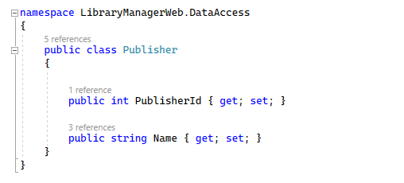
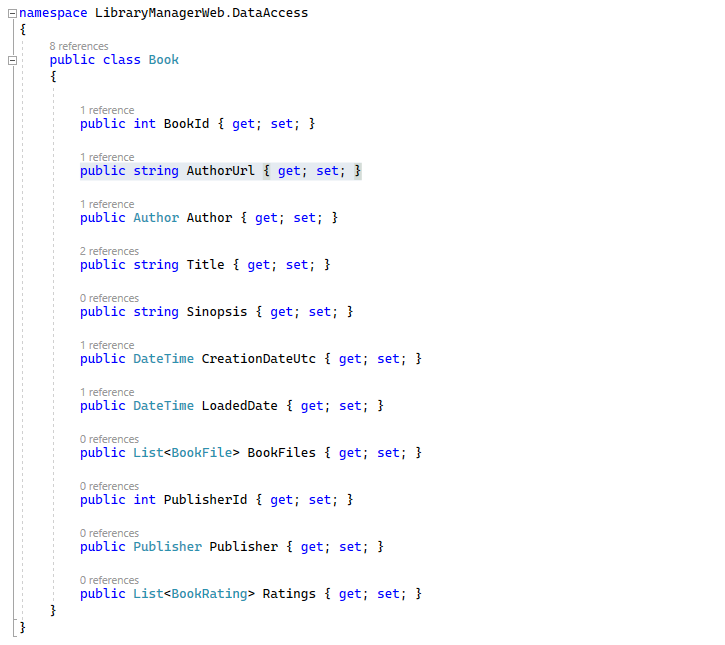
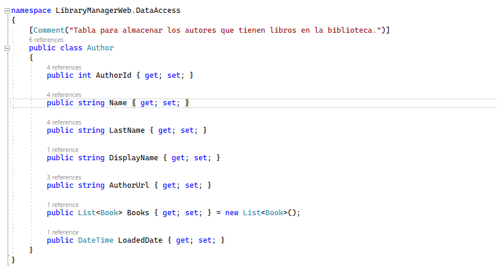
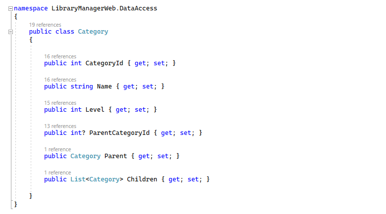

# Conceptos fundamentales para entender las relaciones

Al hablar de relaciones, tenemos que tener claros algunos conceptos fundamentales. Para verlos, vamos a utilizar nuestro proyecto de ejemplo _LibraryManagerWeb_.

Aquí estamos dentro de _DataAccess_, donde están todas nuestras entidades. Vamos a abrir la entidad _Book_.

La entidad _Book_, como podemos ver aquí, tiene una relación con la tabla _Publisher_; un libro tiene una editorial. En esta relación, tenemos dos extremos y, en este caso, _Books_ es una entidad dependiente de _Publisher_. ¿Por qué es una entidad dependiente? Porque la entidad dependiente es la que posee la clave foránea, la clave externa hacia la entidad principal.

En este caso, puesto que estamos asociando un libro con una editorial, es el libro el que contiene la clave que apunta hacia esa editorial. En este caso, la clave es _Publisherld_. Por convención, esta propiedad, al trasladarse a la base de datos, se convertirá en una clave externa que va a apuntar a esta entidad, a Publisher. ¿Y a dónde apuntará exactamente? Pues apuntará a _Publisherld_, que también por convención, dentro de esta entidad, es una clave primaria.

Hemos dicho que en esta relación entre Libros y Editoriales, Libros es la entidad dependiente. ¿Qué es _Publisher_ entonces? Pues, en esta relación, es la entidad principal, puesto que no tiene una clave externa que apunte a Libros.

Pero para que haya una relación, no necesariamente la clave externa tiene que apuntar a una clave primaria. Recordemos qué pasaba entre Libros y Autores.

Fíjate, aquí tenemos otra relación entre Libro y Autor, pero, en este caso, estamos usando _AuthorUrl_ como clave externa. En Autor, _Authorld_ es la clave primaria, _AuthorUrl_ es una clave alternativa.

¿Dónde definimos esa clave alternativa? Pues en nuestro contexto, que ahora se ha ido a la configuración por clases. Es decir, en _AuthorConfig_, dentro de _EntityConfigs_, tenemos aquí la definición de la relación. Y en esta definición de la relación estamos diciendo que la _foreign key_ dentro de _Books_ es _AuthorUrl_ y la clave principal dentro de _Author_ es _AuthorUrl_. Así que Entity Framework genera esa clave alternativa en AuthorUrl.

Y en la entidad _Author_ tenemos una lista de libros. Esa es la otra parte de la relación, es decir, en Libros tenemos la propiedad de navegación, que va hacia Autor. Y en Autor, la entidad principal, tenemos nuestra colección de Libros. Esta propiedad se llama propiedad de navegación de colección puesto que tiene más de una entidad. Además, a esta propiedad también se la denomina propiedad de navegación inversa, puesto que vuelve desde _Author_ a _Book_.

Y, por último, vamos a ver un tipo de relación que es muy curiosa, la relación de referencia propia. En nuestras entidades, hemos creado una tabla nueva. Se llama _Category_.

¿Qué tenemos en _Category_? Tenemos el identificador, la clave principal, un nombre, un nivel y una propiedad _ParentCategoryld_. A continuación, una propiedad de navegación que apunta hacia la propia entidad de Category. Esto se traduce en que tenemos una tabla _Category_ que tiene una relación con ella misma, por eso se denomina relación de referencia propia. ¿Por qué hemos hecho esto? Básicamente, con este tipo de tablas podremos crear un árbol de categorías. Una categoría tiene una categoría padre, la categoría padre tendrá ene categorías hijas. Así, por ejemplo, podemos crear, dentro de la categoría Literatura, varias subcategorías. Y eso solo con una única tabla, ya que los campos son exactamente iguales.